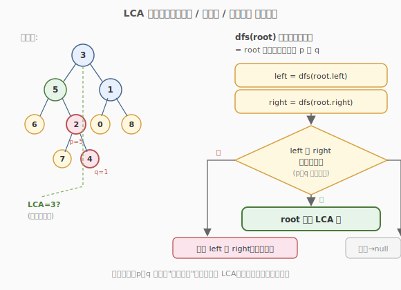
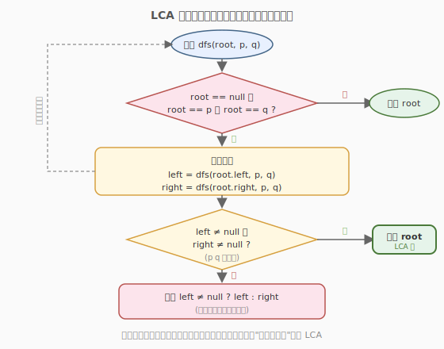

# 二叉树的最近公共祖先

- **题目名称**：二叉树的最近公共祖先
- **链接**：[236. 二叉树的最近公共祖先](https://leetcode.cn/problems/lowest-common-ancestor-of-a-binary-tree/)
- **难度**：中等
- **标签**：树、二叉树、深度优先搜索

## 1. 题目概述

给定一个二叉树，找到该树中两个指定节点的**最近公共祖先**（Lowest Common Ancestor, LCA）。

**公共祖先**的定义：若节点 `p` 在节点 `root` 的子树中，或节点 `q` 在节点 `root` 的子树中（含 `root` 自身），则 `root` 是 `p` 和 `q` 的公共祖先。**最近**公共祖先指深度最大的那个公共祖先。

**示例 1**：

```text
输入：root = [3,5,1,6,2,0,8,null,null,7,4], p = 5, q = 1
输出：3
解释：节点 5 和 1 的最近公共祖先是 3。
```

**示例 2**：

```text
输入：root = [3,5,1,6,2,0,8,null,null,7,4], p = 5, q = 4
输出：5
解释：节点 5 是 4 的祖先（4 在 5 的子树里），所以 5 本身就是最近公共祖先。
```

**示例 3**：

```text
输入：root = [1,2], p = 1, q = 2
输出：1
```

**约束条件**：

- 树中节点数目范围 `[2, 10^5]`
- `-10^9 <= Node.val <= 10^9`
- 所有 `Node.val` **互不相同**
- `p != q`，且 `p`、`q` 都存在于给定的二叉树中

---

## 2. 解题思路

### 2.1 暴力思路：存路径找交点

一种直观做法是：

1. 从根出发，分别找到 `root → p` 和 `root → q` 的两条路径（用 DFS + 回溯记录）。
2. 把两条路径看作两个链表，找它们**最后一个相同节点**（类似两条链表的交点）。

这种方法可行，但需要 `O(n)` 额外空间存路径，且要写两遍 DFS + 一次遍历比较，代码较长。面试中可作为引出最优解的对比。

### 2.2 核心观察：后序 DFS 三路决策



关键直觉：**`p`、`q` 第一次"分居两侧"的节点就是 LCA**。用一次后序 DFS 即可解决，定义递归函数 `dfs(root)` 的返回值含义为：

> `root` 子树中是否包含 `p` 或 `q`；若包含，返回该节点；都不含则返回 `null`。

对每个节点 `root`，只需考察三路信息：

1. **`root` 自身**：如果 `root` 就是 `p` 或 `q`（或为空），直接返回 `root`。
2. **左子树结果 `left`**：`dfs(root.left)` 的返回值。
3. **右子树结果 `right`**：`dfs(root.right)` 的返回值。

决策规则：

- 若 `left` 和 `right` **都非空** → `p`、`q` 分居两侧，`root` 就是 LCA。
- 若只有一侧非空 → `p`、`q` 都在那侧，把非空结果向上传递。
- 若都为空 → 当前子树既不含 `p` 也不含 `q`，返回 `null`。

> 💡 **为什么"分居两侧"就是 LCA？** 因为后序遍历是自底向上的，第一个让 `left`、`right` 同时非空的节点，必定是 `p` 和 `q` 从深处向上汇聚的**最近交点**。比它更深的节点只能在一侧看到 `p`/`q`，比它更高的节点虽然也是公共祖先，但不是"最近"的。

### 2.3 算法流程图



整体是标准的后序遍历结构：先递归左、右子树拿到结果，再在当前节点做决策。递归终止条件是 `root` 为空，或 `root` 等于 `p`/`q`（命中即返回自身）。

### 2.4 示例演算

![逐步演算 root=[3,5,1,6,2,0,8,7,4], p=5, q=1](images/lca_walkthrough.svg)

以示例 1（`p=5, q=1`）为例，后序遍历的返回值自底向上汇聚：

- `dfs(6)`、`dfs(7)`、`dfs(4)`、`dfs(2)`、`dfs(0)`、`dfs(8)` → 这些节点都不是 `p`/`q`，且子树也不含，返回 `null`。
- `dfs(5)` → `root` 等于 `p`，命中，**返回 5**。
- `dfs(1)` → `root` 等于 `q`，命中，**返回 1**。
- `dfs(3)` → `left=5`（非空）、`right=1`（非空），两侧都命中 → **3 是 LCA** ⭐。

整个过程只遍历一次树，每个节点访问一次。

---

## 3. 参考代码

### C++

```cpp
/**
 * Definition for a binary tree node.
 * struct TreeNode {
 *     int val;
 *     TreeNode *left;
 *     TreeNode *right;
 *     TreeNode(int x) : val(x), left(nullptr), right(nullptr) {}
 * };
 */
class Solution {
public:
    TreeNode* lowestCommonAncestor(TreeNode* root, TreeNode* p, TreeNode* q) {
        // 递归终止：空节点，或命中 p/q
        if (root == nullptr || root == p || root == q) {
            return root;
        }
        // 后序：先递归左右子树
        TreeNode* left = lowestCommonAncestor(root->left, p, q);
        TreeNode* right = lowestCommonAncestor(root->right, p, q);
        // 决策
        if (left != nullptr && right != nullptr) {
            return root;            // p、q 分居两侧 → root 是 LCA
        }
        return left != nullptr ? left : right; // 否则向上传递非空那一侧
    }
};
```

### Python

```python
class Solution:
    def lowestCommonAncestor(self, root: 'TreeNode', p: 'TreeNode', q: 'TreeNode') -> 'TreeNode':
        # 递归终止：空节点，或命中 p/q
        if root is None or root is p or root is q:
            return root
        # 后序：先递归左右子树
        left = self.lowestCommonAncestor(root.left, p, q)
        right = self.lowestCommonAncestor(root.right, p, q)
        # 决策
        if left and right:
            return root            # p、q 分居两侧 → root 是 LCA
        return left if left else right  # 否则向上传递非空那一侧
```

> ⚠️ **注意**：题目保证 `p`、`q` 都存在于树中且 `p != q`，所以无需额外判断"只命中一个"的情况——若某子树返回非空，要么是命中了 `p`/`q`，要么是已经找到 LCA，向上传递即可。

---

## 4. 复杂度分析

| 维度 | 复杂度 | 说明 |
|------|--------|------|
| 时间复杂度 | O(n) | 每个节点至多访问一次，后序遍历整棵树 |
| 空间复杂度 | O(h) | 递归调用栈深度 = 树高 `h`；最坏（链状树）O(n)，平衡树 O(log n) |

---

## 5. 扩展：BST 的最近公共祖先（LeetCode 235）

若树是**二叉搜索树**（BST），可利用"左小右大"的性质把复杂度优化到 `O(h)` 时间、`O(1)` 空间（迭代法）：

```cpp
class Solution {
public:
    TreeNode* lowestCommonAncestor(TreeNode* root, TreeNode* p, TreeNode* q) {
        while (root != nullptr) {
            if (p->val < root->val && q->val < root->val) {
                root = root->left;          // p、q 都在左子树
            } else if (p->val > root->val && q->val > root->val) {
                root = root->right;         // p、q 都在右子树
            } else {
                return root;                // 分居两侧（或其一等于 root）→ LCA
            }
        }
        return nullptr;
    }
};
```

**区别**：普通二叉树无法利用大小关系剪枝，必须遍历整棵树；BST 可以根据 `p`、`q` 与 `root` 的值比较，直接走向正确的一侧，无需回溯。

---

## 6. 面试要点

1. **递归函数的返回值含义是什么？为什么这样设计？**

   - 返回值 = `root` 子树中找到的 `p` 或 `q`（或 LCA）；都不在则返回 `null`。这样设计让父节点只需看左右子树的返回值就能决策，无需额外记录路径或标记数组，把空间从 `O(n)` 降到 `O(h)`。

2. **为什么 `left`、`right` 都非空时 `root` 一定是 LCA？**

   - 后序遍历自底向上，`left` 非空说明 `p`/`q` 在左子树，`right` 非空说明另一个在右子树。`root` 是它们的汇聚点，且因为是"自底向上"第一次出现两侧都命中，所以是最深的汇聚点，即最近公共祖先。

3. **如果 `p` 是 `q` 的祖先（如示例 2，p=5, q=4），算法还成立吗？**

   - 成立。递归到 `p=5` 时直接返回 5（命中终止条件），其子树中的 `q=4` 不会被单独传递上来。最终 `dfs(3)` 的 `left=5`、`right=null`，返回 5，正是 LCA。题目保证 `p`、`q` 都存在，所以这种情况天然正确。

4. **空间复杂度为什么是 O(h) 而不是 O(n)？**

   - 递归调用栈的深度等于树高 `h`。平衡树 `h = O(log n)`，最坏情况（退化为链表）`h = O(n)`。没有用额外数组存路径，所以空间是调用栈深度而非节点总数。

5. **能否改成迭代法？**

   - 可以。一种做法是用栈模拟后序遍历，同时用哈希表记录每个节点的父指针；先从 `p` 沿父指针向上收集所有祖先到集合，再从 `q` 向上走，第一个出现在集合中的节点就是 LCA。代码更复杂，但能避免递归栈溢出，适用于极深的树。

6. **本题和 BST-LCA（235）的区别是什么？**

   - 235 利用 BST 的有序性可 `O(h)` 时间、`O(1)` 空间迭代求解；236 是普通二叉树，无法剪枝，必须 `O(n)` 时间遍历整棵树。面试时若题目给的是 BST，先问清楚能否利用大小关系，再选对应解法。
