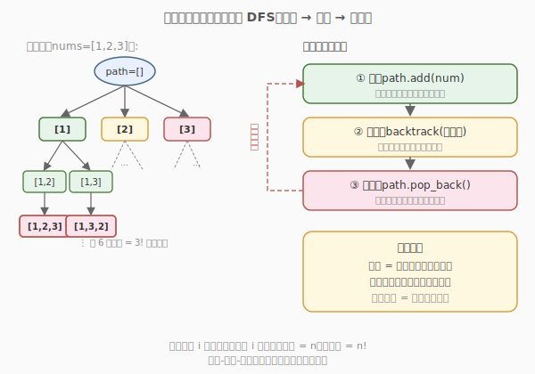
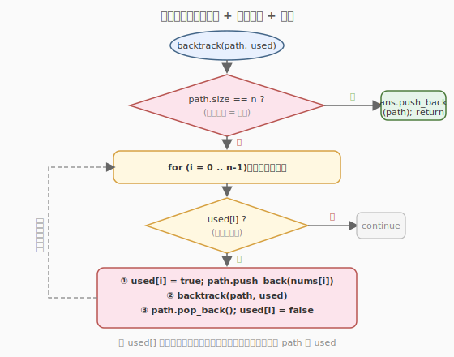

# 全排列

- **题目名称**：全排列
- **链接**：[46. 全排列](https://leetcode.cn/problems/permutations/)
- **难度**：中等
- **标签**：数组、回溯

## 1. 题目概述

给定一个**不含重复数字**的整数数组 `nums`，返回其所有可能的全排列。可以按任意顺序返回答案。

**示例 1**：

```text
输入：nums = [1,2,3]
输出：[[1,2,3],[1,3,2],[2,1,3],[2,3,1],[3,1,2],[3,2,1]]
```

**示例 2**：

```text
输入：nums = [0,1]
输出：[[0,1],[1,0]]
```

**示例 3**：

```text
输入：nums = [1]
输出：[[1]]
```

**约束条件**：

- `1 <= nums.length <= 6`
- `-10 <= nums[i] <= 10`
- `nums` 中的所有整数**互不相同**

---

## 2. 解题思路

### 2.1 暴力思路：多重循环嵌套

最直观的想法是用 `n` 层循环，每层枚举一个位置。但 `n` 不固定（1 到 6），无法在代码里写死循环层数。而且每层都要跳过已选过的元素，逻辑繁琐。

这种"决策步数不固定、每步从候选集合里选"的问题，正是**回溯法**的典型场景——用递归代替可变层数的循环。

### 2.2 核心观察：在决策树上 DFS



关键直觉：把"构造一个排列"看作在**决策树**上走一条从根到叶子的路径：

- 树的第 `i` 层决定排列的第 `i` 个位置放哪个数。
- 每个节点的子节点 = 当前还未被选过的候选元素。
- 从根到叶子的路径 = 一个完整排列；叶子总数 = `n!`。

回溯法在这棵树上做 DFS，核心是**三步模板**：

1. **选**：把某个候选加入当前路径 `path`。
2. **递归**：带着这个选择继续往下一层探索。
3. **撤销**：把刚才的选择从 `path` 中移除，回到分叉点换下一个候选。

> 💡 **为什么需要"撤销"？** 因为递归返回后，我们要让 `path` 恢复到选之前的状态，才能干净地尝试下一个分支。如果不撤销，上一个分支选过的元素会"污染"后续分支，导致结果错误。这就是"回溯"二字的含义——**回退一步，换条路走**。

### 2.3 算法流程图



用 `used` 布尔数组标记哪些元素已经被选入 `path`，避免重复使用。每层的循环遍历所有候选，跳过 `used[i] == true` 的，对剩余的执行"选-递归-撤销"。终止条件是 `path.size() == n`，此时收集一个完整排列。

### 2.4 示例演算

![逐步演算 nums=[1,2,3]](images/permutations_walkthrough.svg)

以 `nums=[1,2,3]` 为例，追踪 `path` 和 `used` 的变化：

- **选 1 → 选 2 → 选 3**：`path=[1,2,3]`，路径已满，收集第一个结果 `[1,2,3]` ⭐。
- **撤销 3 → 撤销 2**：回到 `path=[1]`，`used=[T,F,F]`，此时 2 的分支已穷尽。
- **选 3 → 选 2**：`path=[1,3,2]`，路径已满，收集第二个结果 `[1,3,2]` ⭐。
- ……回溯到根，换选 2 / 选 3 作为首元素，同理得到剩余 4 个排列。

最终共 `3! = 6` 个全排列。每条根到叶子的路径对应一个排列，`used` 数组保证每个数在一条路径里只用一次。

---

## 3. 参考代码

### C++（used 数组法）

```cpp
class Solution {
  public:
    vector<vector<int>> permute(vector<int>& nums) {
        vector<vector<int>> ans;
        vector<int> path;
        vector<bool> used(nums.size(), false);
        backtrack(nums, path, used, ans);
        return ans;
    }

  private:
    void backtrack(vector<int>& nums, vector<int>& path, vector<bool>& used, vector<vector<int>>& ans) {
        // 终止：路径已满，收集一个完整排列
        if (path.size() == nums.size()) {
            ans.push_back(path);
            return;
        }
        // 遍历每个候选
        for (int i = 0; i < nums.size(); i++) {
            if (used[i])
                continue; // 已选过，跳过
            // ① 选
            used[i] = true;
            path.push_back(nums[i]);
            // ② 递归
            backtrack(nums, path, used, ans);
            // ③ 撤销
            path.pop_back();
            used[i] = false;
        }
    }
};
```

### Python

```python
class Solution:
    def permute(self, nums: List[int]) -> List[List[int]]:
        ans = []
        used = [False] * len(nums)

        def backtrack(path: List[int]) -> None:
            if len(path) == len(nums):
                ans.append(path[:])   # 注意拷贝，否则后续 pop 会改坏
                return
            for i in range(len(nums)):
                if used[i]:
                    continue
                # ① 选
                used[i] = True
                path.append(nums[i])
                # ② 递归
                backtrack(path)
                # ③ 撤销
                path.pop()
                used[i] = False

        backtrack([])
        return ans
```

> ⚠️ **注意 Python 版的** `ans.append(path[:])`：必须传入 `path` 的拷贝。若直接 `ans.append(path)`，存进去的是引用，后续 `path.pop()` 会把已存入的结果也改掉，最终 `ans` 里全是空列表。C++ 的 `ans.push_back(path)` 会自动拷贝 `vector`，无需额外处理。

---

## 4. 复杂度分析

| 维度 | 复杂度 | 说明 |
|------|--------|------|
| 时间复杂度 | O(n · n!) | 共 `n!` 个排列，每个排列构造需 `O(n)`（递归 n 层 + 拷贝） |
| 空间复杂度 | O(n) | 递归调用栈深度 `n` + `path` / `used` 各 `O(n)`（不计结果数组） |

---

## 5. 扩展：交换法（无需 used 数组）

除了"选-撤销 path"的写法，还有一种**原地把待选元素交换到当前位置**的做法，省去 `used` 数组：

```cpp
class Solution {
  public:
    vector<vector<int>> permute(vector<int>& nums) {
        vector<vector<int>> ans;
        backtrack(nums, 0, ans);
        return ans;
    }

  private:
    void backtrack(vector<int>& nums, int start, vector<vector<int>>& ans) {
        if (start == nums.size()) {
            ans.push_back(nums); // start 走到末尾，当前 nums 就是一个排列
            return;
        }
        for (int i = start; i < nums.size(); i++) {
            swap(nums[start], nums[i]);      // 把 nums[i] 放到第 start 位
            backtrack(nums, start + 1, ans); // 递归处理后面的位置
            swap(nums[start], nums[i]);      // 换回来，恢复原状
        }
    }
};
```

**思路**：`[0, start)` 是已固定的前缀，`[start, end)` 是待选区间。每次从待选区间挑一个交换到 `start` 位置，递归处理 `start+1`。这样 `used` 数组被隐含在"区间划分"里了，空间更省（`O(1)` 额外空间，不计结果）。

> 💡 **两种写法对比**：`used` 数组法直观、易推广到子集/组合等题；交换法更紧凑、空间更优，但会修改原数组顺序，且不适用于含重复元素的题（需额外去重）。面试中两种都会写最佳。

---

## 6. 面试要点

1. **回溯法的三步模板是什么？为什么撤销必须在递归之后？**

   - 三步：① 选（加入 path、标记 used）② 递归（进入下一层）③ 撤销（移出 path、取消标记）。撤销必须在递归之后，因为递归返回时表示"这条分支探索完了"，此时要恢复状态才能干净地尝试下一个候选。撤销和选择必须严格对称，否则状态会污染。

2. **为什么时间复杂度是 O(n · n!) 而不是 O(n!)?**

   - 共有 `n!` 个叶子（完整排列），但构造每个排列要递归 `n` 层，每层做 `O(1)` 的选择/撤销，加上最后收集结果时拷贝 `path` 需 `O(n)`。所以总时间是 `O(n · n!)`。

3. **Python 中** `ans.append(path)` **和** `ans.append(path[:])` **有什么区别？**

   - `path` 是引用，直接 append 存的是引用副本，后续 `path.pop()` 会改掉已存入的结果。`path[:]` 创建了当前快照的拷贝，存入的是独立副本，不受后续修改影响。回溯题里收集结果时**必须拷贝**。

4. **used 数组法和交换法各自的优劣？**

   - `used` 法：直观、通用，能推广到子集(78)、组合(39)、组合总和等题；缺点是需 `O(n)` 额外空间。交换法：空间 `O(1)`、代码紧凑；但会改变原数组顺序，且对含重复元素的题（如 47 全排列 II）去重不便，需要先排序 + 额外剪枝。

5. **如果 nums 含重复元素（LeetCode 47 全排列 II）怎么去重？**

   - 先排序，然后在同一层循环里跳过"与前一个相同且前一个未在本层使用过"的候选：`if (i > 0 && nums[i] == nums[i-1] && !used[i-1]) continue;`。关键是"同一层不选重复值"，避免产生相同的排列。这是回溯去重的经典剪枝套路。

6. **回溯法和普通 DFS 是什么关系？**

   - 回溯法是 DFS 的一种应用场景：DFS 是"遍历所有状态"的通用搜索方式，回溯法特指"在决策树上 DFS + 状态撤销"。可以说所有回溯都是 DFS，但 DFS 不一定回溯（如遍历图的连通分量时无需撤销访问标记）。回溯的核心特征是**探索完一条路要恢复状态去探索另一条**。

---

## 7. 同类练习题
- [47. 全排列 II](https://leetcode.cn/problems/permutations-ii/)：含重复元素的全排列
- [39. 组合总和](https://leetcode.cn/problems/combination-sum/)：回溯 + 剪枝
- [78. 子集](https://leetcode.cn/problems/subsets/)：回溯枚举子集
