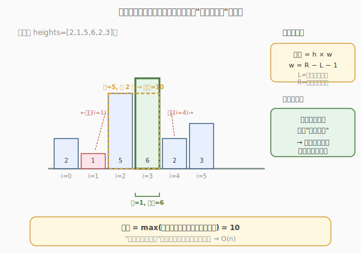
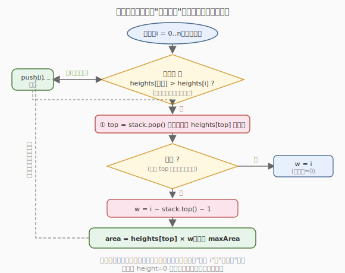

# 柱状图中最大的矩形

- **题目名称**：柱状图中最大的矩形
- **链接**：[84. 柱状图中最大的矩形](https://leetcode.cn/problems/largest-rectangle-in-histogram/)
- **难度**：困难
- **标签**：栈、数组、单调栈

## 1. 题目概述

给定 `n` 个非负整数，用来表示柱状图中各个柱子的高度。每个柱子彼此相邻，且宽度为 `1`。求在该柱状图中，能够勾勒出来的**矩形的最大面积**。

**示例 1**：

```text
输入：heights = [2,1,5,6,2,3]
输出：10
解释：最大的矩形为图中红色区域，面积为 5 × 2 = 10（高 5 跨柱子 i=2,3）。
```

**示例 2**：

```text
输入：heights = [2,4]
输出：4
```

**约束条件**：

- `1 <= heights.length <= 10^5`
- `0 <= heights[i] <= 10^4`

---

## 2. 解题思路

### 2.1 暴力思路：枚举每根柱子作为高

对每根柱子 `i`，以 `heights[i]` 作为矩形的高，向左右两边扩展，直到遇到比它矮的柱子为止，得到最大宽度 `w`，面积 = `heights[i] × w`。枚举所有 `i` 取最大值。

找左右边界需要 `O(n)`，共 `n` 根柱子，总时间 `O(n^2)`，对 `10^5` 规模会超时。需要把"找左右第一个更矮"优化到 `O(1)`，这就是**单调栈**的用武之地。

### 2.2 核心观察：固定每根柱子，找左右"第一个更矮"



关键直觉：**最大的矩形一定是以某根柱子的高度为高的**（否则可以向上抬升获得更大面积）。所以问题转化为：对每根柱子 `i`，求它往左/往右第一个比它矮的位置 `L` / `R`，则宽度 `w = R - L - 1`，面积 `= heights[i] × w`。

> 💡 **为什么是"第一个更矮"而不是"第一个更高"？** 因为矩形以 `heights[i]` 为高时，遇到更矮的柱子就挡住了，无法继续扩展。矮柱子是矩形宽度的"天然边界"。

### 2.3 算法流程图：单调栈一次遍历



用一个**高度递增**的栈，一次遍历即可在出栈时计算每根柱子的面积：

- 遍历每根柱子 `i`（含末尾 `height=0` 哨兵）。
- 当 `heights[i]` 比栈顶柱子**矮**时，栈顶柱子的右边界就是 `i`（遇到更矮了）；左边界是出栈后的新栈顶（比它矮的第一个左边柱子）。此时结算栈顶面积。
- 当 `heights[i]` 比栈顶**高或相等**时，直接入栈（右边界还没出现）。

> ⚠️ **哨兵技巧**：在 `heights` 末尾追加一个 `height=0` 的虚拟柱子，强制在遍历结束时清空栈，避免遗漏未结算的柱子。否则需要在循环后额外处理栈中剩余元素。

### 2.4 示例演算

![逐步演算 heights=[2,1,5,6,2,3,0]](../../../images/largest_rect_walkthrough.svg)

以 `heights=[2,1,5,6,2,3]` 为例（末尾加哨兵 `0`），追踪栈的变化：

- `i=0(h=2)`：栈空，入栈 → `[0]`。
- `i=1(h=1)`：`2>1`，pop(0)，栈空 → `w=1`，面积 `2×1=2`，max=2。入栈 1 → `[1]`。
- `i=2(h=5)`：`1<5`，入栈 → `[1,2]`。
- `i=3(h=6)`：`5<6`，入栈 → `[1,2,3]`。
- `i=4(h=2)`：`6>2`，pop(3)，栈顶=2 → `w=4-2-1=1`，面积 `6×1=6`，max=6。继续 `5>2`，pop(2)，栈顶=1 → `w=4-1-1=2`，面积 `5×2=10` ⭐，max=10。`1<2`，入栈 4 → `[1,4]`。
- `i=5(h=3)`：`2<3`，入栈 → `[1,4,5]`。
- `i=6(h=0)` 哨兵：依次 pop(5)→面积 `3×1=3`，pop(4)→面积 `2×4=8`，pop(1)→面积 `1×6=6`，栈空。

最终答案 = **10**（高 5，跨柱子 i=2,3，宽 2）。每根柱子入栈、出栈各一次，总时间 `O(n)`。

---

## 3. 参考代码

### C++（单调栈 + 哨兵，一次遍历）

```cpp
class Solution {
  public:
    int largestRectangleArea(vector<int>& heights) {
        int n = heights.size();
        // 末尾加哨兵 0，强制清栈
        heights.push_back(0);

        stack<int> st; // 存下标，对应高度递增
        int maxArea = 0;

        for (int i = 0; i <= n; i++) {
            // 当前更矮，结算栈顶
            while (!st.empty() && heights[st.top()] > heights[i]) {
                int top = st.top();
                st.pop();
                int h = heights[top];
                // 栈空说明左边没有更矮的，左边界=0；否则左边界=新栈顶
                int w = st.empty() ? i : i - st.top() - 1;
                maxArea = max(maxArea, h * w);
            }
            st.push(i);
        }

        heights.pop_back(); // 恢复（可选）
        return maxArea;
    }
};
```

### Python

```python
class Solution:
    def largestRectangleArea(self, heights: List[int]) -> int:
        heights = heights + [0]     # 哨兵，不修改原数组
        stack = []                  # 存下标，高度递增
        max_area = 0

        for i, h in enumerate(heights):
            while stack and heights[stack[-1]] > h:
                top = stack.pop()
                height = heights[top]
                width = i if not stack else i - stack[-1] - 1
                max_area = max(max_area, height * width)
            stack.append(i)

        return max_area
```

> ⚠️ **注意**：比较用 `>` 而非 `>=`。用 `>` 时相等高度的柱子会入栈延后结算，宽度计算正确；若用 `>=` 会让等高柱子提前出栈，虽不影响最终最大值（等高柱子后续会被更靠右的同高柱子覆盖），但 `>` 的写法更直观，每个柱子结算时拿到的是"最宽的可扩展范围"。

---

## 4. 复杂度分析

| 维度 | 复杂度 | 说明 |
|------|--------|------|
| 时间复杂度 | O(n) | 每根柱子至多入栈、出栈各一次 |
| 空间复杂度 | O(n) | 栈最坏存放所有下标（高度递增时） |

---

## 5. 扩展：左右两次单调栈（无哨兵写法）

除了"一次遍历 + 哨兵"，也可分别预处理 `left[i]`（左边第一个更矮的下标）和 `right[i]`（右边第一个更矮的下标），再统一算面积。思路更清晰但代码略长：

```cpp
class Solution {
  public:
    int largestRectangleArea(vector<int>& heights) {
        int n = heights.size();
        vector<int> left(n), right(n);
        stack<int> st;

        // 求左边第一个更矮
        for (int i = 0; i < n; i++) {
            while (!st.empty() && heights[st.top()] >= heights[i]) {
                st.pop();
            }
            left[i] = st.empty() ? -1 : st.top();
            st.push(i);
        }

        while (!st.empty())
            st.pop();

        // 求右边第一个更矮
        for (int i = n - 1; i >= 0; i--) {
            while (!st.empty() && heights[st.top()] >= heights[i]) {
                st.pop();
            }
            right[i] = st.empty() ? n : st.top();
            st.push(i);
        }

        int maxArea = 0;
        for (int i = 0; i < n; i++) {
            maxArea = max(maxArea, heights[i] * (right[i] - left[i] - 1));
        }
        return maxArea;
    }
};
```

**对比**：哨兵法一次遍历、代码短；左右两遍法逻辑分层清晰、易调试，但遍历两次。面试中哨兵法更优，能体现对边界处理的驾驭。

> 💡 **单调栈的通用套路**：求"每个元素左边/右边第一个更大/更小"的问题，都可套用单调栈。本题是"第一个更小"，栈维护递增；接雨水（day1）的 DP 思路其实也可改成单调栈求"第一个更大"，栈维护递减。两者是对偶关系。

---

## 6. 面试要点

1. **单调栈维护的是"递增"还是"递减"？为什么？**

   - 维护**高度递增**的栈。因为每根柱子的右边界是"右边第一个更矮"的柱子，只有当遇到更矮元素时才触发结算。栈递增保证栈顶是当前已见最矮的，一旦新元素更矮，栈顶的右边界就被确定。若求"第一个更大"则改为递减栈。

2. **哨兵的作用是什么？不加哨兵会怎样？**

   - 哨兵 `height=0` 比所有柱子都矮，能在遍历结束时强制触发所有剩余柱子出栈结算。不加哨兵的话，遍历结束后栈中可能还有未结算的柱子（它们的右边界是数组末尾），需要额外写一段循环来清栈，容易遗漏。

3. **为什么宽度是 `i - st.top() - 1` 而不是 `i - top`？**

   - `top` 是刚出栈的柱子下标，它的左边界是**新栈顶**（出栈后栈顶是第一个比它矮的左边柱子），右边界是 `i`。所以宽度 = `i - st.top() - 1`（右边界减左边界再减 1）。若栈空，说明左边没有更矮的，左边界视为 `-1`，宽度 = `i`。

4. **相等高度的柱子怎么处理？用 `>` 还是 `>=`？**

   - 用 `>`（严格大于才出栈）。等高柱子入栈延后结算，这样它结算时能拿到最宽的右边界。若用 `>=` 提前出栈，等高柱子的宽度会偏小，虽然最终最大值仍正确（被更靠右的同高柱子覆盖），但 `>` 更直观、不易出错。

5. **本题和接雨水（42）的单调栈解法有什么异同？**

   - 两者都用单调栈找"边界"。接雨水找"左右第一个更高"（栈递减），柱子能接的水由两侧更高柱子的短板决定；本题找"左右第一个更矮"（栈递增），矩形宽度由两侧更矮柱子夹出。核心套路相同（单调栈 + 出栈时结算），只是栈方向和结算公式不同。

6. **如果柱子宽度不等（每根柱子有自己的 width）怎么做？**

   - 思路不变，但宽度计算时不能用下标差，而要用**前缀宽度**。结算时 `w = prefixWidth[i] - prefixWidth[st.top() + 1]`，其中 `prefixWidth` 是柱子宽度的前缀和。本题宽度恒为 1，所以直接用下标差即可。

---

## 7. 同类练习题
- [85. 最大矩形](https://leetcode.cn/problems/maximal-rectangle/)：2D 版柱状图最大矩形
- [42. 接雨水](https://leetcode.cn/problems/trapping-rain-water/)：单调栈求水位
- [496. 下一个更大元素](https://leetcode.cn/problems/next-greater-element-i/)：单调栈模板
