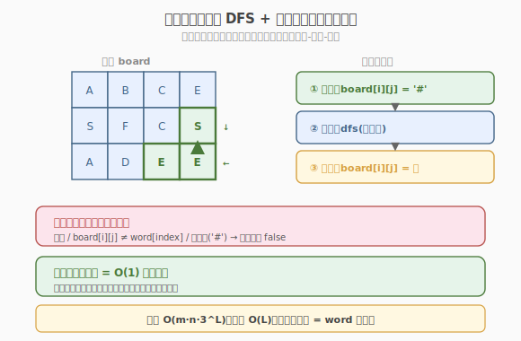
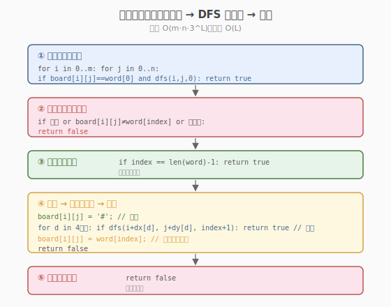
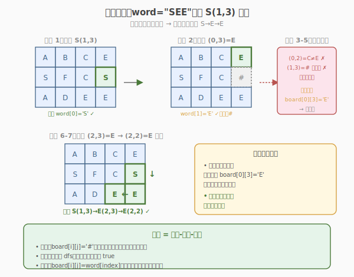

# 单词搜索

- **题目名称**：单词搜索
- **链接**：[79. 单词搜索](https://leetcode.cn/problems/word-search/)
- **难度**：中等
- **标签**：数组、回溯、深度优先搜索

## 1. 题目概述

给定一个 `m × n` 的二维字符网格 `board` 和一个字符串单词 `word`，判断 `word` 是否存在于网格中。

单词必须按照字母顺序，通过**相邻的单元格**内的字母构成，其中「相邻」单元格是那些水平相邻或垂直相邻的单元格。同一个单元格内的字母**不允许被重复使用**。

**示例 1**：

```text
输入：board = [
  ['A','B','C','E'],
  ['S','F','C','S'],
  ['A','D','E','E']
], word = "ABCCED"
输出：true
解释：路径 A(0,0)→B(0,1)→C(0,2)→C(1,2)→E(2,2)→D(2,1)，全部相邻且不重复。
```

**示例 2**：

```text
输入：board = [
  ['A','B','C','E'],
  ['S','F','C','S'],
  ['A','D','E','E']
], word = "SEE"
输出：true
解释：路径 S(1,3)→E(2,3)→E(2,2)。
```

**示例 3**：

```text
输入：board = [
  ['A','B','C','E'],
  ['S','F','C','S'],
  ['A','D','E','E']
], word = "ABCB"
输出：false
解释：A(0,0)→B(0,1)→C(0,2)→B? 最近的 B 在 (0,1) 已用过，或 (2,1) 不相邻。无合法路径。
```

**约束条件**：

- `m == board.length`
- `n == board[i].length`
- `1 <= m, n <= 6`
- `1 <= word.length <= 15`
- `board` 和 `word` 仅由大小写英文字母组成

> 💡 这是 **DFS + 回溯** 的招牌题。与 [46. 全排列](../../week1/day6/全排列.md) 的「枚举所有方案」不同，本题是在**二维网格上搜索路径**——每个位置可以向上下左右四个方向探索，且不能走重复格子。核心模板是「标记已访问 → 四方向递归 → 回溯撤销标记」，这个模板可迁移到岛屿数量、岛屿的最大面积等所有网格搜索题。

---

## 2. 解题思路

### 2.1 暴力思路：枚举所有路径

从每个格子出发，尝试所有可能的路径，检查是否匹配 `word`。但路径数量指数级爆炸（每个格子 4 个方向，长度 `L` 的路径有 `4^L` 种），且无剪枝会严重超时。

### 2.2 核心观察：DFS + 回溯剪枝



**关键思路**：遍历网格找到所有与 `word[0]` 匹配的格子作为**起点**，从每个起点出发做 DFS，逐字符匹配 `word` 的后续字符。

**剪枝条件**（在递归入口判断，不满足直接返回 `false`）：

1. **越界**：行或列超出网格范围
2. **字符不匹配**：`board[i][j] != word[index]`
3. **已访问**：当前格子已在当前路径中使用过

**访问标记**：用**原地修改** `board[i][j]` 为临时字符（如 `'#'`），递归结束后恢复。这样无需额外 `visited` 数组，空间 `O(1)`（不计递归栈）。

> 💡 **为什么原地标记比 visited 数组好？** 原地标记省去 `O(m×n)` 的额外空间，且修改+恢复只需两行代码。注意**恢复必须在递归返回后**（回溯的「回」），否则同层兄弟分支无法使用该格子。这是回溯的灵魂：**「选择-递归-撤销」三步走**。

### 2.3 算法流程图



**完整步骤**：

1. **遍历网格**：对每个 `(i, j)`，若 `board[i][j] == word[0]`，调用 `dfs(i, j, 0)`
2. **DFS 函数** `dfs(i, j, index)`：
   - **剪枝**：越界 / `board[i][j] != word[index]` / 已访问 → 返回 `false`
   - **终止（成功）**：`index == len(word) - 1`（全部匹配）→ 返回 `true`
   - **标记**：`board[i][j] = '#'`（原地标记已访问）
   - **四方向递归**：`dfs(i±1, j, index+1)` 或 `dfs(i, j±1, index+1)`，任一为 `true` 则返回 `true`
   - **回溯**：`board[i][j] = word[index]`（恢复）
   - 返回 `false`
3. 任一起点 DFS 返回 `true` 则整体 `true`；所有起点都失败则 `false`

> ⚠️ **终止条件的判断顺序**：必须先剪枝（字符不匹配等），再判断 `index == len-1`。否则当 `word` 最后一个字符不匹配时，会误判为成功。正确顺序：① 越界/不匹配/已访问 → `false`；② `index == len-1` → `true`（此时字符已匹配）；③ 标记+四方向递归。

### 2.4 示例演算

以 `board = [["A","B","C","E"],["S","F","C","S"],["A","D","E","E"]]`, `word = "SEE"` 为例。`S` 在 `(1,3)`，其相邻格子是 `(0,3)=E`、`(2,3)=E`、`(1,2)=C`。



DFS 按方向顺序 上→下→左→右 尝试。先试上方 `(0,3)=E` 匹配 `word[1]`，但后续无 E 可走而失败回溯；再试下方 `(2,3)=E` 成功：

| 步骤 | 位置 (i,j) | 字符 | index | 操作 | 结果 |
|------|-----------|------|-------|------|------|
| 1 | (1,3) | S | 0 | 匹配首字母 S，标记 `#`，探索四方向 | — |
| 2 | (0,3) | E | 1 | 上方，E==word[1]，匹配，标记 `#`，探索四方向 | — |
| 3 | (0,2) | C | 2 | 左方，C≠word[2]='E' → 剪枝 `false` | — |
| 4 | (1,3) | # | 2 | 下方，已访问 → 剪枝 `false` | — |
| 5 | — | — | — | 上方无其他方向，回溯恢复 `(0,3)='E'` | board[0][3]='E' |
| 6 | (2,3) | E | 1 | 下方，E==word[1]，匹配，标记 `#`，探索四方向 | — |
| 7 | (2,2) | E | 2 | 左方，E==word[2]，`index==len-1` → **返回 `true` ✓** | 找到！ |

最终路径 `S(1,3) → E(2,3) → E(2,2)`，全部相邻且不重复，返回 `true`。

> 💡 **回溯保证所有方向都被尝试**：步骤 2-5 展示了上方分支的失败与回溯，步骤 6-7 是下方分支的成功。若忘了回溯恢复 `(0,3)`，步骤 4 的「已访问」会把整个上方区域永久封死，不影响本题结果但会影响其他 case。回溯的核心：**「选择-递归-撤销」三步走**。

---

## 3. 参考代码

### C++

```cpp
// 单词搜索.cpp —— DFS + 回溯（原地标记）
// 编译: g++ -O2 -std=c++17 单词搜索.cpp -o wordsearch
class Solution {
    int m, n;
    string word;
    vector<vector<char>> board;
    int dx[4] = {-1, 1, 0, 0};
    int dy[4] = {0, 0, -1, 1};

public:
    bool exist(vector<vector<char>>& board, string word) {
        this->m = board.size();
        this->n = board[0].size();
        this->word = word;
        this->board = board;

        for (int i = 0; i < m; i++) {
            for (int j = 0; j < n; j++) {
                if (board[i][j] == word[0] && dfs(i, j, 0))
                    return true;
            }
        }
        return false;
    }

private:
    bool dfs(int i, int j, int index) {
        // 剪枝：越界 / 字符不匹配 / 已访问
        if (i < 0 || i >= m || j < 0 || j >= n || board[i][j] != word[index])
            return false;
        // 终止：全部字符匹配
        if (index == (int)word.size() - 1)
            return true;
        // 标记已访问
        board[i][j] = '#';
        // 四方向递归
        for (int d = 0; d < 4; d++) {
            if (dfs(i + dx[d], j + dy[d], index + 1))
                return true;
        }
        // 回溯：恢复
        board[i][j] = word[index];
        return false;
    }
};
```

### Python

```python
class Solution:
    def exist(self, board: List[List[str]], word: str) -> bool:
        m, n = len(board), len(board[0])
        dirs = [(-1, 0), (1, 0), (0, -1), (0, 1)]

        def dfs(i: int, j: int, index: int) -> bool:
            # 剪枝：越界 / 字符不匹配 / 已访问
            if i < 0 or i >= m or j < 0 or j >= n or board[i][j] != word[index]:
                return False
            # 终止：全部字符匹配
            if index == len(word) - 1:
                return True
            # 标记已访问
            board[i][j] = "#"
            # 四方向递归
            for di, dj in dirs:
                if dfs(i + di, j + dj, index + 1):
                    return True
            # 回溯：恢复
            board[i][j] = word[index]
            return False

        for i in range(m):
            for j in range(n):
                if board[i][j] == word[0] and dfs(i, j, 0):
                    return True
        return False
```

> 💡 **两处细节**：① 方向数组 `dx/dy` 或 `dirs` 把四方向写成循环，避免重复代码，且方便扩展为八方向。② `board[i][j] = word[index]` 恢复时用 `word[index]`（而非另存原值），因为进入函数时已确认 `board[i][j] == word[index]`，恢复值就是 `word[index]`。

---

## 4. 复杂度分析

| 维度 | 复杂度 | 说明 |
|------|--------|------|
| **时间** | $O(m \cdot n \cdot 3^L)$ | `m×n` 个起点，每个起点 DFS 最多 3 个有效方向（来路已标记），深度 `L = len(word)` |
| **空间** | $O(L)$ | 递归栈深度 = `word` 长度；原地标记无额外数组 |

> ⚠️ 时间复杂度 $O(m \cdot n \cdot 3^L)$：从每个起点出发，第一步有 4 个方向，之后每步最多 3 个方向（不能回头，因为来路格子已标记）。最坏情况遍历 $3^{L-1}$ 条路径。`m,n ≤ 6`，`L ≤ 15`，最坏约 $36 \cdot 3^{14} \approx 1.7 \times 10^8$，但剪枝（字符不匹配）大幅缩减实际运行时间。

---

## 5. 扩展：剪枝优化与变体

### 5.1 字符频次剪枝

如果 `word` 中某个字符在 `board` 中出现次数不足，直接返回 `false`。更进一步的优化：统计 `board` 和 `word` 的字符频次，若 `word` 的某字符频次 > `board` 中对应频次，直接返回 `false`。

```python
from collections import Counter
# 若 word 中某字符比 board 中少，提前返回 false
if Counter(word) - Counter(ch for row in board for ch in row):
    return False
```

### 5.2 反转 word 剪枝

如果 `word` 的首字母在 `board` 中出现次数**多于**末字母，可以反转 `word` 再搜索，减少 DFS 起点数。例如 `board` 中有很多 `A` 但很少 `Z`，搜 `word="AZBC"` 时反转成 `"CBZA"`，从 `C` 出发的起点更少。

> 💡 这个优化在 `board` 较大、首字母频繁时效果显著，面试时作为「如何优化」的回答能加分。

### 5.3 网格 DFS 模板的迁移

本题的「四方向 DFS + 原地标记 + 回溯」模板是所有网格搜索题的基础：

| 题目 | 变体 |
|------|------|
| 79 单词搜索（本题） | 匹配给定字符串路径 |
| [200. 岛屿数量](https://leetcode.cn/problems/number-of-islands/) | 连通区域计数，DFS 感染 |
| [695. 岛屿的最大面积](https://leetcode.cn/problems/max-area-of-island/) | 连通区域求最大面积 |
| [980. 不同路径 III](https://leetcode.cn/problems/unique-paths-iii/) | 遍历所有空格的路径计数 |

---

## 6. 面试要点

1. **为什么用原地标记而不是 visited 数组？**

   > 原地标记（`board[i][j] = '#'`）省去 `O(m×n)` 额外空间，代码更简洁。关键是**回溯时恢复** `board[i][j] = word[index]`，让兄弟分支能正常使用该格子。如果忘了恢复，网格会被「污染」，后续路径无法经过已访问格子，导致漏解。

2. **剪枝条件的判断顺序为什么重要？**

   > 必须**先剪枝再判终止**。若先判 `index == len-1` 再剪枝，当末字符不匹配时会误判成功。正确顺序：①越界/不匹配/已访问→`false`；②`index==len-1`→`true`（此时字符已匹配）；③标记+递归。因为剪枝已保证 `board[i][j] == word[index]`，所以到②时必匹配。

3. **方向数组 vs 硬编码四个 if？**

   > 方向数组 `dx/dy` 把四方向写成循环，更简洁、可扩展（如八方向只需加元素）。硬编码四个 `if` 可读性稍差但避免循环开销。面试中方向数组更优雅，是网格题的标准写法。

4. **时间复杂度为什么是 $3^L$ 而不是 $4^L$？**

   > 第一步有 4 个方向，但之后每步最多 3 个方向——因为来路的格子已被标记为 `#`，剪枝会跳过。所以分支因子从 4 降为 3，总路径数约 $4 \cdot 3^{L-1} \approx 3^L$。

5. **本题和「岛屿数量」（200）的 DFS 有什么区别？**

   > 岛屿数量是「连通区域计数」——DFS 把整个连通块标记为已访问，不回溯（每个格子只访问一次）。单词搜索是「路径搜索」——DFS 探索特定路径，**必须回溯**（同一格子可能出现在不同路径中）。前者是「染感染」语义，后者是「试错-撤销」语义。

> 💡 **一句话总结**：79 单词搜索是「网格 DFS + 回溯」的招牌——遍历找起点，四方向 DFS 逐字符匹配，原地标记防重复，回溯恢复让兄弟分支可用。时间 $O(m \cdot n \cdot 3^L)$，空间 $O(L)$。这个模板是所有网格搜索题的基础，迁移到岛屿数量、岛屿最大面积、不同路径 III 等题，是面试必会的核心套路。

---

## 7. 同类练习题

- [200. 岛屿数量](https://leetcode.cn/problems/number-of-islands/)：网格 DFS 连通块计数，不回溯（感染法）
- [695. 岛屿的最大面积](https://leetcode.cn/problems/max-area-of-island/)：网格 DFS 求最大连通块面积
- [212. 单词搜索 II](https://leetcode.cn/problems/word-search-ii/)：多单词搜索，用 Trie 优化剪枝（困难进阶）
- [980. 不同路径 III](https://leetcode.cn/problems/unique-paths-iii/)：网格 DFS 遍历所有空格的路径计数
