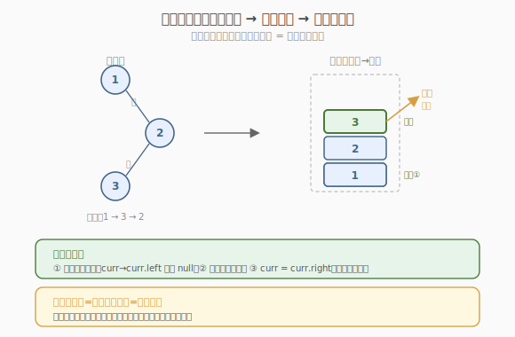
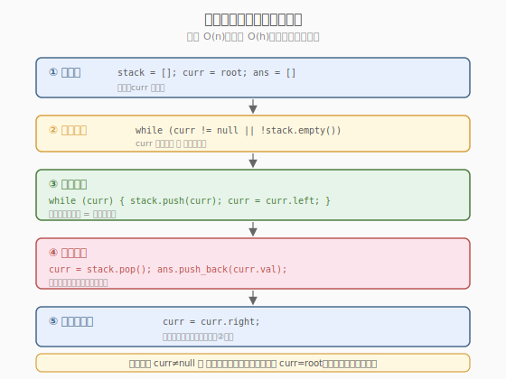

# 二叉树的中序遍历

- **题目名称**：二叉树的中序遍历
- **链接**：[94. 二叉树的中序遍历](https://leetcode.cn/problems/binary-tree-inorder-traversal/)
- **难度**：简单
- **标签**：树、二叉树、深度优先搜索、栈

## 1. 题目概述

给定一个二叉树的根节点 `root`，返回它的**中序遍历**结果。

**中序遍历**：按照「**左子树 → 根 → 右子树**」的顺序访问节点。对二叉搜索树（BST）而言，中序遍历得到的是**递增序列**。

**示例 1**：

```text
输入：root = [1,null,2,3]
输出：[1,3,2]

    1
     \
      2
     /
    3

访问顺序：1（无左，访问）→ 3（2的左，访问）→ 2（回到2，访问）
```

**示例 2**：

```text
输入：root = []
输出：[]
```

**示例 3**：

```text
输入：root = [1]
输出：[1]
```

**约束条件**：

- 树中节点数目范围 `[0, 100]`
- `-100 <= Node.val <= 100`
- **进阶**：递归算法很简单，你可以通过迭代算法完成吗？

> 💡 这是二叉树遍历的**基础招牌题**。中序遍历的递归写法人人都会，但面试官常追问「能否用迭代？能否 `O(1)` 空间？」。本题是展示**三种解法**——递归、栈迭代、Morris——的绝佳载体。掌握 Morris 遍历后，可迁移到 [114. 二叉树展开为链表](../../week9/day5/二叉树展开为链表.md) 的 `O(1)` 空间解法和 [98. 验证二叉搜索树](../../week3/day5/验证二叉搜索树.md) 的中序单调性判定。

---

## 2. 解题思路

### 2.1 解法一：递归

最直观的写法。中序遍历 = 「左 → 根 → 右」，直接翻译成递归：

```text
inorder(node):
    if node == null: return
    inorder(node.left)      # 左
    ans.append(node.val)    # 根
    inorder(node.right)     # 右
```

代码简洁，但隐含 `O(h)` 递归栈空间，且面试官通常会要求迭代版本。

### 2.2 解法二：栈迭代



**关键思路**：递归的本质是调用栈。用**显式栈**模拟：对每个节点，**一路向左**把沿途节点压栈，直到最左；然后弹出栈顶访问，并转向其右子树（右子树作为新的子问题重复「向左压栈」）。

**核心观察**：中序遍历的访问时机 = **节点从栈中弹出之时**。压栈代表「待访问」，弹栈代表「此刻访问」。向左压栈穷尽左链后，栈顶就是中序首节点。

> 💡 **为什么弹栈后转向右子树？** 中序顺序是「左→根→右」。节点弹出（根已访问）后，下一个该访问的是它的右子树。右子树内部仍按「左→根→右」，所以把 `curr = node.right` 后，循环会再次「一路向左压栈」，自然处理右子树。

### 2.3 算法流程图（栈迭代）



**完整步骤**：

1. **初始化**：`stack = []`，`curr = root`，`ans = []`
2. **循环** `while curr != null or stack 非空`：
   - **向左压栈**：`while curr != null`：`stack.push(curr)`，`curr = curr.left`
   - **弹出访问**：`curr = stack.pop()`，`ans.append(curr.val)`
   - **转向右子树**：`curr = curr.right`
3. 返回 `ans`

> ⚠️ **外层循环条件**是 `curr != null or stack 非空`：①`curr != null` 表示当前子树还有左链要压；②`stack 非空` 表示有待访问的节点。两者都为假时遍历完成。若只写 `while stack`，会在进入右子树为空但栈未空时正确，但首次进入（栈空、curr=root）会跳过。

### 2.4 示例演算

以 `root = [1,null,2,3]`（树形：`1` 右孩子 `2`，`2` 左孩子 `3`）为例：

![示例演算：栈迭代逐步执行，输出 [1,3,2]](images/inorder_example_walkthrough.svg)

| 步骤 | curr | 栈（底→顶） | 操作 | ans |
|------|------|------------|------|-----|
| 1 | 1 | [] | 向左压栈：1 无左，压 1，curr=null | [] |
| 2 | null | [1] | 弹出 1，访问，ans=[1]，curr=1.right=2 | [1] |
| 3 | 2 | [] | 向左压栈：2 有左，压 2，curr=2.left=3 | [1] |
| 4 | 3 | [2] | 向左压栈：3 无左，压 3，curr=null | [1] |
| 5 | null | [2,3] | 弹出 3，访问，ans=[1,3]，curr=3.right=null | [1,3] |
| 6 | null | [2] | 弹出 2，访问，ans=[1,3,2]，curr=2.right=null | [1,3,2] |
| 7 | null | [] | curr=null 且栈空，循环结束 | [1,3,2] ✓ |

最终输出 `[1,3,2]`。

> 💡 **观察步骤 2 和 5**：弹栈后 `curr` 指向右子树。若右子树非空（步骤 2→3），循环继续向左压栈处理右子树；若右子树为空（步骤 5→6），`curr=null` 跳过内层向左循环，直接弹栈顶继续。这正是「左→根→右」的迭代化表达。

---

## 3. 参考代码

### C++

```cpp
// 二叉树的中序遍历.cpp —— 递归 / 栈迭代 / Morris
// 编译: g++ -O2 -std=c++17 二叉树的中序遍历.cpp -o inorder
#include <vector>
#include <stack>
using namespace std;

struct TreeNode {
    int val;
    TreeNode* left;
    TreeNode* right;
    TreeNode(int x) : val(x), left(nullptr), right(nullptr) {}
};

// 方法一：递归
class Solution1 {
public:
    vector<int> inorderTraversal(TreeNode* root) {
        vector<int> ans;
        dfs(root, ans);
        return ans;
    }
private:
    void dfs(TreeNode* node, vector<int>& ans) {
        if (!node) return;
        dfs(node->left, ans);          // 左
        ans.push_back(node->val);      // 根
        dfs(node->right, ans);         // 右
    }
};

// 方法二：栈迭代
class Solution2 {
public:
    vector<int> inorderTraversal(TreeNode* root) {
        vector<int> ans;
        stack<TreeNode*> st;
        TreeNode* curr = root;
        while (curr || !st.empty()) {
            while (curr) {              // 一路向左压栈
                st.push(curr);
                curr = curr->left;
            }
            curr = st.top(); st.pop();  // 弹出访问
            ans.push_back(curr->val);
            curr = curr->right;         // 转向右子树
        }
        return ans;
    }
};

// 方法三：Morris 遍历（O(1) 空间）
class Solution3 {
public:
    vector<int> inorderTraversal(TreeNode* root) {
        vector<int> ans;
        TreeNode* curr = root;
        while (curr) {
            if (curr->left == nullptr) {
                ans.push_back(curr->val);   // 无左子树，直接访问
                curr = curr->right;
            } else {
                // 找左子树的最右节点 = curr 的中序前驱
                TreeNode* pred = curr->left;
                while (pred->right && pred->right != curr) {
                    pred = pred->right;
                }
                if (pred->right == nullptr) {
                    pred->right = curr;      // 建立线索，指向后继
                    curr = curr->left;       // 转向左子树
                } else {
                    pred->right = nullptr;   // 断开线索（已访问过）
                    ans.push_back(curr->val);// 访问当前节点
                    curr = curr->right;      // 转向右子树
                }
            }
        }
        return ans;
    }
};
```

### Python

```python
# 方法一：递归
class Solution:
    def inorderTraversal(self, root: Optional[TreeNode]) -> List[int]:
        ans = []
        def dfs(node: Optional[TreeNode]) -> None:
            if not node:
                return
            dfs(node.left)             # 左
            ans.append(node.val)       # 根
            dfs(node.right)            # 右
        dfs(root)
        return ans

# 方法二：栈迭代
class Solution:
    def inorderTraversal(self, root: Optional[TreeNode]) -> List[int]:
        ans = []
        stack = []
        curr = root
        while curr or stack:
            while curr:                # 一路向左压栈
                stack.append(curr)
                curr = curr.left
            curr = stack.pop()         # 弹出访问
            ans.append(curr.val)
            curr = curr.right          # 转向右子树
        return ans

# 方法三：Morris 遍历（O(1) 空间）
class Solution:
    def inorderTraversal(self, root: Optional[TreeNode]) -> List[int]:
        ans = []
        curr = root
        while curr:
            if not curr.left:
                ans.append(curr.val)       # 无左子树，直接访问
                curr = curr.right
            else:
                pred = curr.left           # 找中序前驱
                while pred.right and pred.right != curr:
                    pred = pred.right
                if not pred.right:
                    pred.right = curr      # 建立线索
                    curr = curr.left
                else:
                    pred.right = None      # 断开线索
                    ans.append(curr.val)   # 访问
                    curr = curr.right
        return ans
```

> 💡 **三种解法对比**：递归最简洁但隐含栈；栈迭代把递归栈显式化，便于控制；Morris 用「线索」临时修改树结构实现回溯，省去栈。面试策略：先写递归（展示基本功），再写栈迭代（满足「迭代」要求），最后提 Morris（展示 `O(1)` 空间的深度）。

---

## 4. 复杂度分析

| 维度 | 递归 | 栈迭代 | Morris |
|------|------|--------|--------|
| **时间** | `O(n)` | `O(n)` | `O(n)` |
| **空间** | `O(h)`（递归栈） | `O(h)`（显式栈） | `O(1)` |
| **修改树结构** | 否 | 否 | 是（临时建/断线索，遍历后恢复） |

> ⚠️ `h` 为树高：平衡树 `O(log n)`，退化为链表时 `O(n)`。Morris 的 `O(1)` 空间是核心优势，代价是代码复杂且遍历中临时修改树（虽恢复，但多线程场景需谨慎）。Morris 时间仍 `O(n)`：每条边最多被访问 3 次（找前驱、建立线索、断开线索），均摊 `O(1)` 每节点。

---

## 5. 扩展：Morris 遍历原理

Morris 遍历的核心是利用树中大量**空闲的 `right` 指针**（叶子及只有左孩子的节点的 `right` 为 `null`）作为「线索」，记录回溯路径，从而省去栈。

### 5.1 中序前驱与线索

对节点 `curr`，若它有左子树，则左子树的**最右节点** `pred` 就是 `curr` 的**中序前驱**（中序遍历中 `curr` 的前一个节点）。正常情况下 `pred.right == null`。Morris 把 `pred.right` 指向 `curr`，建立一条「线索」，这样遍历完左子树后能通过线索回到 `curr`。

### 5.2 两种状态

- **第一次遇到 `curr`**：`pred.right == null` → 建立线索 `pred.right = curr`，走向左子树 `curr = curr.left`
- **第二次遇到 `curr`**（沿线索回来）：`pred.right == curr` → 左子树已遍历完，断开线索 `pred.right = null`，**访问 `curr`**，走向右子树 `curr = curr.right`

> 💡 **Morris 的精妙**：每条边最多走 3 次（下行找前驱、沿线索回溯、断线索再下行），但总边数 `O(n)`，故总时间 `O(n)`。空间仅两个指针 `curr`/`pred`，真正做到 `O(1)`。这个「找前驱建线索」的机制也是 [114. 二叉树展开为链表](../../week9/day5/二叉树展开为链表.md) Morris 解法的核心。

### 5.3 前/中/后序的 Morris 变体

Morris 框架统一，只是**访问节点的时机**不同：

| 遍历 | 访问时机 |
|------|----------|
| **中序** | 第二次遇到 `curr`（断线索时）或无左子树时 |
| **前序** | 第一次遇到 `curr`（建线索时）+ 无左子树时（两次都访问） |
| **后序** | 中序基础上，每次断线索时逆序输出左子树右链（较复杂） |

---

## 6. 面试要点

1. **递归和栈迭代的关系是什么？**

   > 栈迭代是递归的「显式化」——用显式 `stack` 替代隐式调用栈。两者空间都是 `O(h)`，但栈迭代避免了递归深度限制（极深树可能栈溢出），且能中途中断/恢复（协程友好）。面试中先写递归展示直觉，再写迭代展示对调用栈的理解。

2. **栈迭代为什么「一路向左压栈」？**

   > 中序顺序是「左→根→右」。要访问一个节点，必须先访问其整棵左子树；而左子树的最左节点是中序首节点。「一路向左压栈」把从根到最左节点的路径压入栈，栈顶即中序首节点。弹出后访问，再处理右子树（右子树作为新子问题重复该过程）。

3. **Morris 遍历为什么是 `O(1)` 空间？**

   > 它利用树中空闲的 `right` 指针（叶子/单孩子节点的 `right=null`）作为线索记录回溯路径，无需额外栈或数组。仅用 `curr`/`pred` 两个指针。代价是临时修改树结构（建/断线索），虽遍历后恢复，但遍历过程中树处于「非正常」状态，多线程场景需加锁。

4. **Morris 怎么保证每节点只访问一次？怎么判断「第二次遇到」？**

   > 通过 `pred.right` 的状态：①`pred.right == null` → 第一次，建线索走向左子树；②`pred.right == curr` → 第二次（沿线索回来了），断线索并访问。找前驱时内层 `while pred.right && pred.right != curr` 的第二个条件就是识别「已建线索」，避免死循环。

5. **中序遍历和 BST 有什么关系？为什么验证 BST 常用中序？**

   > BST 的中序遍历得到**严格递增序列**（左<根<右）。所以 [98. 验证二叉搜索树](../../week3/day5/验证二叉搜索树.md) 可转化为「中序遍历是否单调递增」——用一个 `prev` 变量记录前驱值，检查 `curr.val > prev`。这比递归传 `(min, max)` 边界更直观，且能复用中序遍历的迭代/Morris 实现。

> 💡 **一句话总结**：94 是二叉树遍历的基础招牌——递归展示直觉，栈迭代展示对调用栈的理解，Morris 展示 `O(1)` 空间的深度。中序遍历的核心是「左→根→右」，访问时机在「左子树处理完之后」。Morris 用「找前驱建线索」省去栈，这个机制可迁移到 114（展开为链表）、98（验证 BST 中序单调性）等题，是面试进阶的核心套路。

---

## 7. 同类练习题

- [98. 验证二叉搜索树](https://leetcode.cn/problems/validate-binary-search-tree/)：中序遍历单调性判定的直接应用，`prev` 变量检查递增
- [144. 二叉树的前序遍历](https://leetcode.cn/problems/binary-tree-preorder-traversal/)：同套三种解法，访问时机改为「先根后左右」
- [145. 二叉树的后序遍历](https://leetcode.cn/problems/binary-tree-postorder-traversal/)：三种遍历中最难，Morris 后序需逆序输出右链
- [114. 二叉树展开为链表](https://leetcode.cn/problems/flatten-binary-tree-to-linked-list/)：Morris「找前驱建线索」机制的迁移，`O(1)` 空间展开
- [230. 二叉搜索树中第 K 小的元素](https://leetcode.cn/problems/kth-smallest-element-in-a-bst/)：BST 中序遍历到第 K 个即停，提前终止优化
