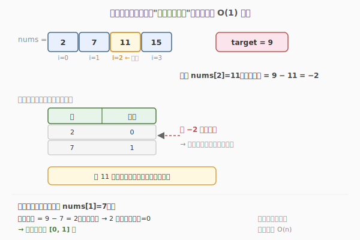
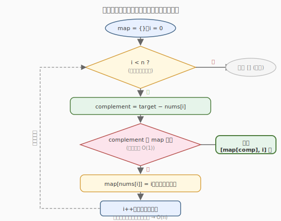

# 两数之和

- **题目名称**：两数之和
- **链接**：[1. 两数之和](https://leetcode.cn/problems/two-sum/)
- **难度**：简单
- **标签**：数组、哈希表

## 1. 题目概述

给定一个整数数组 `nums` 和一个整数目标值 `target`，请你在该数组中找出和为目标值 `target` 的那**两个**整数，并返回它们的数组下标。

你可以假设每种输入只会对应一个答案，并且你**不能使用两次相同的元素**。可以按任意顺序返回答案。

**示例 1**：

```text
输入：nums = [2,7,11,15], target = 9
输出：[0,1]
解释：因为 nums[0] + nums[1] == 9，返回 [0, 1]。
```

**示例 2**：

```text
输入：nums = [3,2,4], target = 6
输出：[1,2]
```

**示例 3**：

```text
输入：nums = [3,3], target = 6
输出：[0,1]
```

**约束条件**：

- `2 <= nums.length <= 10^4`
- `-10^9 <= nums[i] <= 10^9`
- `-10^9 <= target <= 10^9`
- **只会存在一个有效答案**

**进阶要求**：你能想出一个时间复杂度小于 `O(n^2)` 的算法吗？

---

## 2. 解题思路

### 2.1 暴力思路：两层循环枚举所有数对

最直观的做法是用两层循环，枚举所有 `(i, j)` 数对（`i < j`），判断 `nums[i] + nums[j] == target`。

```text
for i in 0..n-1:
    for j in i+1..n-1:
        if nums[i] + nums[j] == target: return [i, j]
```

时间复杂度 `O(n^2)`，对 `10^4` 规模约 `10^8` 次操作，勉强能过但很慢，且不满足进阶要求。问题在于：对每个 `nums[i]`，找 `target - nums[i]` 用了 `O(n)` 线性扫描——这正是哈希表能优化到 `O(1)` 的地方。

### 2.2 核心观察：查补数，用哈希表 O(1) 查找



关键直觉：要找的两个数 `a + b = target`，当我们遍历到 `a` 时，需要的"另一半" `b = target - a`（称为**补数**）是确定的。问题转化为：**`b` 是否在之前已经出现过？**

用哈希表记录"已经遍历过的元素值 → 下标"，每次遍历到新元素时，先查它的补数是否在表里：

- 在 → 找到答案，返回 `[补数的下标, 当前下标]`。
- 不在 → 把当前元素存入哈希表，继续遍历。

> 💡 **为什么是"查之前见过的"而不是"查整个数组"？** 因为 `a + b = target` 是对称的——当我们遍历到 `b` 时，`a` 一定已经先于 `b` 出现并存在表里了（反之亦然）。所以只需单向查"之前"，不必双向查，一次遍历即可。

### 2.3 算法流程图



整个流程是单层循环：算补数 → 查哈希 → 命中则返回、未命中则存入。每个元素只被查一次、存一次，总时间 `O(n)`。

### 2.4 示例演算

![逐步演算 nums=[2,7,11,15], target=9](images/two_sum_walkthrough.svg)

以 `nums=[2,7,11,15], target=9` 为例：

- **i=0, nums[0]=2**：补数 = 9 − 2 = 7。查哈希表（空）→ 不在。存入 `map[2]=0`。
- **i=1, nums[1]=7**：补数 = 9 − 7 = 2。查哈希表 → `map[2]=0` 命中！返回 `[0, 1]` ⭐。

注意"边查边存"的精妙之处：查的时候表里只有**当前元素之前**的元素，天然避免了"元素和自己配对"的问题（如 `nums=[3,3], target=6`，i=0 存 `{3:0}`，i=1 查补数 3 命中 `map[3]=0`，正确返回 `[0,1]`，不会返回 `[0,0]`）。

---

## 3. 参考代码

### C++（哈希表一次遍历）

```cpp
class Solution {
public:
    vector<int> twoSum(vector<int>& nums, int target) {
        unordered_map<int, int> map; // 值 -> 下标
        for (int i = 0; i < nums.size(); i++) {
            int complement = target - nums[i];
            if (map.count(complement)) {
                return {map[complement], i}; // 命中，返回 [补数下标, 当前下标]
            }
            map[nums[i]] = i; // 未命中，存入
        }
        return {}; // 题目保证有解，不会走到这里
    }
};
```

### Python

```python
class Solution:
    def twoSum(self, nums: List[int], target: int) -> List[int]:
        seen = {}  # 值 -> 下标
        for i, num in enumerate(nums):
            complement = target - num
            if complement in seen:
                return [seen[complement], i]
            seen[num] = i
        return []  # 题目保证有解
```

> ⚠️ **注意"先查后存"的顺序**：必须先查补数，再存当前元素。若先存后查，当 `nums[i]` 本身等于补数时（如 `target=6, nums[i]=3`），会查到自己刚存进去的下标，错误返回 `[i, i]`。先查后存保证查的时候表里只有"之前"的元素。

---

## 4. 复杂度分析

| 维度 | 复杂度 | 说明 |
|------|--------|------|
| 时间复杂度 | O(n) | 遍历一次数组，每次哈希表操作 O(1) |
| 空间复杂度 | O(n) | 最坏情况存入 n-1 个元素（答案在最后两个） |

---

## 5. 扩展：排序 + 双指针（适用于"返回值而非下标"）

如果题目改成"返回两个数本身"而非下标（如 [167. 两数之和 II - 输入有序数组] 或 [15. 三数之和] 的子问题），可以先用**排序 + 双指针**做到 `O(n log n)` 时间、`O(1)` 额外空间：

```cpp
vector<int> twoSumSorted(vector<int>& nums, int target) {
    sort(nums.begin(), nums.end());
    int left = 0, right = nums.size() - 1;
    while (left < right) {
        int sum = nums[left] + nums[right];
        if (sum == target) return {nums[left], nums[right]};
        else if (sum < target) left++;    // 和太小，左指针右移
        else right--;                      // 和太大，右指针左移
    }
    return {};
}
```

**两种解法对比**：

| 解法 | 时间 | 空间 | 适用场景 |
|------|------|------|----------|
| 哈希表 | O(n) | O(n) | 需返回下标、数组无序 |
| 排序+双指针 | O(n log n) | O(1) | 只需返回值、数组有序或可破坏原序 |

> 💡 **如何选择？** 本题要求返回下标，排序会打乱下标对应关系，所以哈希表是首选。若题目已给有序数组（如 167 题）或只问值（如 15 三数之和），双指针更省空间。这是"两数之和"家族的通用选型决策。

---

## 6. 面试要点

1. **为什么用哈希表？它把哪一步从 O(n) 降到了 O(1)？**

   - 暴力法对每个 `nums[i]`，在剩余元素里线性扫描找 `target - nums[i]`，这一步是 `O(n)`。哈希表把"查找补数"优化到 `O(1)` 平均时间，整体从 `O(n^2)` 降到 `O(n)`。

2. **为什么必须"先查后存"而不是"先存后查"？**

   - 先存后查时，若 `nums[i]` 本身等于补数（如 `target=6, nums[i]=3`），会查到自己刚存入的下标，返回 `[i, i]`，用了同一个元素两次，违反题意。先查后存保证查的时候表里只有当前元素**之前**的元素，避免自配。

3. **如果数组中有重复元素（如 [3,3]），算法还能正确工作吗？**

   - 能。i=0 存 `{3:0}`，i=1 查补数 3 → 命中 `map[3]=0`，返回 `[0,1]`。哈希表存的是"最新下标"，但因为我们是先查后存，查的时候表里是上一个 3 的下标，正好配对。题目保证只有一组答案，所以不会出错。

4. **哈希表解法和排序+双指针解法各自的优劣？**

   - 哈希表：`O(n)` 时间、`O(n)` 空间，不破坏原数组，适合返回下标。排序+双指针：`O(n log n)` 时间、`O(1)` 空间，但排序会打乱下标，适合只返回值或数组已有序。本题要求下标，选哈希表；167 题数组有序，选双指针。

5. **本题如何推广到"三数之和"(15) 和"四数之和"(18)？**

   - 三数之和 = 固定一个数 `nums[i]` + 在剩余部分做两数之和（target = `0 - nums[i]`）。但为了去重和避免 `O(n^2)` 空间，三数之和通常用**排序 + 双指针**而非哈希表：外层枚举第一个数，内层用左右双指针找另两个数。四数之和同理，再套一层循环。哈希表思路是基础，双指针是优化。

6. **如果题目不保证唯一解，要求返回所有不重复的数对，要注意什么？**

   - 需要额外去重。哈希表法要避免存入重复值导致结果重复，通常配合排序 + 跳过相邻相同元素。这种场景下排序+双指针更易去重，是更优选择（正是 15 三数之和、18 四数之和的标准解法）。
