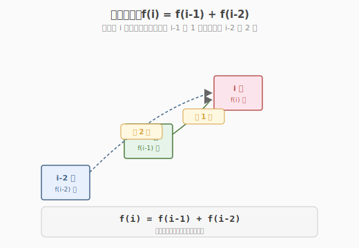
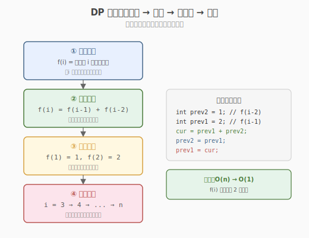
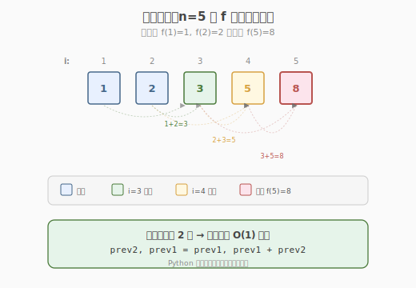

# 爬楼梯

- **题目名称**：爬楼梯
- **链接**：[70. 爬楼梯](https://leetcode.cn/problems/climbing-stairs/)
- **难度**：简单
- **标签**：动态规划、数学

## 1. 题目概述

假设你正在爬楼梯。需要 `n` 阶你才能到达楼顶。每次你可以爬 `1` 或 `2` 个台阶。你有多少种不同的方法可以爬到楼顶呢？

**示例 1**：

```text
输入：n = 2
输出：2
解释：有两种方法可以爬到楼顶。
  1 阶 + 1 阶
  2 阶
```

**示例 2**：

```text
输入：n = 3
输出：3
解释：有三种方法可以爬到楼顶。
  1 阶 + 1 阶 + 1 阶
  1 阶 + 2 阶
  2 阶 + 1 阶
```

**约束条件**：

- `1 <= n <= 45`

> 💡 这是**一维动态规划**的入门模板题。它的递推关系就是斐波那契数列 `f(n) = f(n-1) + f(n-2)`，是理解"状态定义 → 转移方程 → 初始化 → 计算顺序"四步法的最佳起点。掌握它，你就拿到了所有线性 DP（打家劫舍、解码方法、最小花费爬楼梯）的通用钥匙。

---

## 2. 解题思路

### 2.1 暴力思路：枚举所有走法

把爬楼梯看作一棵决策树：每个节点选择"爬 1 阶"或"爬 2 阶"，到达第 `n` 阶时计数 +1。用 DFS 递归枚举所有路径。

```text
climbStairs(0)  起点
├── climbStairs(1)   选 1 阶
│   ├── climbStairs(2)   选 1 阶
│   │   └── climbStairs(3) ✓ 到达（n=3）
│   └── climbStairs(3) ✓ 选 2 阶直接到达
└── climbStairs(2)   选 2 阶
    └── climbStairs(3) ✓ 选 1 阶到达
```

时间复杂度 `O(2^n)`（每步二叉，树高 `n`），`n=45` 时约 `3.5 × 10^13` 次调用，**严重超时**。

> ⚠️ 暴力法的问题在于**重复子问题**：`climbStairs(2)` 在不同路径中被反复计算。例如上图里 `climbStairs(2)` 出现了 2 次。`n` 越大，重复越严重。这正是动态规划出场的时候。

### 2.2 核心观察：状态转移方程

**关键定义**：设 `f(i)` = 爬到第 `i` 阶的方法数。

**核心思考**：到达第 `i` 阶，最后一步只有两种可能——

- 从第 `i-1` 阶爬 `1` 阶上来
- 从第 `i-2` 阶爬 `2` 阶上来

因为最后一步只有这两种选择，且这两种情况**互斥**（最后一步要么是 1 阶要么是 2 阶），所以：

$$f(i) = f(i-1) + f(i-2)$$



这就是**斐波那契递推**！与斐波那契数列唯一的差别是初值：斐波那契 `F(1)=1, F(2)=1`，爬楼梯 `f(1)=1, f(2)=2`。

> 💡 **为什么是加法？** 因为"最后一步走 1 阶"和"最后一步走 2 阶"是两类**不重叠**的方案，总方案数 = 两类方案数之和（加法原理）。这是组合计数的基本原理。

### 2.3 算法流程图

有了转移方程，剩下的就是"初始化 + 顺序计算"：



**四步法**（所有 DP 题通用）：

1. **状态定义**：`f(i)` = 爬到第 `i` 阶的方法数
2. **转移方程**：`f(i) = f(i-1) + f(i-2)`
3. **初始条件**：`f(1) = 1, f(2) = 2`（到第 1 阶只有"爬 1 阶"1 种；到第 2 阶有"1+1"和"2"两种）
4. **计算顺序**：从 `i=3` 到 `i=n`，**自底向上**（小问题先算，大问题复用）

### 2.4 示例演算

以 `n=5` 为例，看 `f` 数组如何从初值递推到答案：



| i | f(i-2) | f(i-1) | f(i) = f(i-1)+f(i-2) | 说明 |
|---|--------|--------|----------------------|------|
| 1 | — | — | 1 | 初值：只有 1 种（爬 1 阶） |
| 2 | — | — | 2 | 初值：2 种（1+1 或 2） |
| 3 | f(1)=1 | f(2)=2 | 1+2=**3** | 从 2 阶爬 1，或从 1 阶爬 2 |
| 4 | f(2)=2 | f(3)=3 | 2+3=**5** | 从 3 阶爬 1，或从 2 阶爬 2 |
| 5 | f(3)=3 | f(4)=5 | 3+5=**8** | 从 4 阶爬 1，或从 3 阶爬 2 |

最终 `f(5) = 8`。

> 💡 注意 `f(i)` 只依赖 `f(i-1)` 和 `f(i-2)`，**不需要存整个数组**——用两个变量滚动即可（见 3.1 滚动数组优化）。

---

## 3. 参考代码

### C++

```cpp
// 爬楼梯.cpp —— 一维 DP + 滚动数组
// 编译: g++ -O2 -std=c++17 爬楼梯.cpp -o climb
#include <vector>
using namespace std;

// 版本 1：标准一维 DP（O(n) 空间）
class Solution {
  public:
    int climbStairs(int n) {
        if (n <= 2)
            return n;
        vector<int> f(n + 1);
        f[1] = 1;
        f[2] = 2;
        for (int i = 3; i <= n; ++i)
            f[i] = f[i - 1] + f[i - 2];
        return f[n];
    }
};

// 版本 2：滚动数组优化（O(1) 空间，推荐）
class Solution2 {
  public:
    int climbStairs(int n) {
        if (n <= 2)
            return n;
        int prev2 = 1; // f(i-2)，初值 f(1)
        int prev1 = 2; // f(i-1)，初值 f(2)
        for (int i = 3; i <= n; ++i) {
            int cur = prev1 + prev2; // f(i) = f(i-1) + f(i-2)
            prev2 = prev1;           // 滚动：f(i-2) ← f(i-1)
            prev1 = cur;             // 滚动：f(i-1) ← f(i)
        }
        return prev1;
    }
};
```

### Python

```python
class Solution:
    def climbStairs(self, n: int) -> int:
        if n <= 2:
            return n
        prev2, prev1 = 1, 2   # f(1), f(2)
        for i in range(3, n + 1):
            prev2, prev1 = prev1, prev1 + prev2   # 滚动
        return prev1
```

> 💡 Python 的 `a, b = b, a + b` 是**同时赋值**，无需临时变量。这行代码就是斐波那契滚动的最简写法。

---

## 4. 复杂度分析

| 维度 | 复杂度 | 说明 |
|------|--------|------|
| **时间复杂度** | `O(n)` | 单层循环，`n-2` 次加法 |
| **空间复杂度（标准 DP）** | `O(n)` | `f` 数组长度 `n+1` |
| **空间复杂度（滚动数组）** | `O(1)` | 只用 2 个变量 `prev1/prev2` |
| **最优时间** | `O(log n)` | 矩阵快速幂（见扩展） |

---

## 5. 扩展：矩阵快速幂与通项公式

### 5.1 矩阵快速幂：`O(log n)` 解法

递推 `f(i) = f(i-1) + f(i-2)` 可写成矩阵形式：

$$\begin{pmatrix} f(i) \\ f(i-1) \end{pmatrix} = \begin{pmatrix} 1 & 1 \\ 1 & 0 \end{pmatrix} \begin{pmatrix} f(i-1) \\ f(i-2) \end{pmatrix}$$

迭代展开：$\begin{pmatrix} f(n) \\ f(n-1) \end{pmatrix} = \begin{pmatrix} 1 & 1 \\ 1 & 0 \end{pmatrix}^{n-2} \begin{pmatrix} f(2) \\ f(1) \end{pmatrix}$

矩阵幂用**快速幂**（平方加速）可在 `O(log n)` 内算出。`n=45` 时收益不明显，但 `n=10^9` 时这是唯一可行解法（如变体题"斐波那契模某个质数"）。

```cpp
// 矩阵快速幂（2x2 矩阵乘法 + 快速幂，略，模板见相关资料）
```

### 5.2 通项公式（Binet 公式）

斐波那契有闭式解：$f(n) = \frac{1}{\sqrt{5}}\left[\left(\frac{1+\sqrt{5}}{2}\right)^{n+1} - \left(\frac{1-\sqrt{5}}{2}\right)^{n+1}\right]$

理论 `O(1)`，但浮点精度问题在 `n>70` 时失效，面试不常用。

### 5.3 相关变体题

| 题目 | 转移方程 | 与本题关系 |
|------|---------|-----------|
| 746. 使用最小花费爬楼梯 | `f(i) = min(f(i-1), f(i-2)) + cost[i]` | 把"计数"改成"求最小花费" |
| 198. 打家劫舍 | `f(i) = max(f(i-1), f(i-2)+nums[i])` | 把"加法"改成"取 max" |
| 91. 解码方法 | `f(i)` 依赖 `s[i-1]` 和 `s[i-2:i]` 是否合法 | 增加合法性判断 |

> 💡 这些题的骨架**完全相同**——都是 `f(i)` 依赖前 1-2 个状态，只是转移方程的"运算"和"约束"不同。掌握爬楼梯的滚动数组写法，这三道题可秒杀。

---

## 6. 面试要点

1. **为什么这题是 DP 而不是贪心？**

   - DP 适用条件：**最优子结构** + **重叠子问题**。本题求"方案数"（计数），每个 `f(i)` 由 `f(i-1)` 和 `f(i-2)` 唯一确定，子问题重叠严重（暴力 `O(2^n)` 重复计算）。
   - 贪心要求"局部最优 → 全局最优"，本题是计数问题无"最优"概念，不适用。

2. **`f(1)=1, f(2)=2` 还是 `f(0)=1, f(1)=1`？两种初始化都对吗？**

   - 都对，只是状态定义不同：
     - 定义 `f(i)` = 到第 `i` 阶的方法数：`f(1)=1, f(2)=2`
     - 定义 `f(i)` = 从第 `i` 阶出发到顶的方法数，或令 `f(0)=1`（地面，1 种"不动"方案）：则 `f(1)=1, f(2)=f(1)+f(0)=2`
   - 关键是**转移方程与初值自洽**。面试时说清自己的定义即可。

3. **为什么滚动数组能省到 `O(1)` 空间？**

   - `f(i)` 只依赖 `f(i-1)` 和 `f(i-2)`，更早的状态（`f(i-3)` 及以前）**不再被任何后续状态引用**。
   - 用两个变量 `prev1`（存 `f(i-1)`）和 `prev2`（存 `f(i-2)`）滚动，每轮更新即可。这是"无后效性"的直接体现——未来只依赖最近的历史。

4. **`n=45` 时结果约 `1.8 × 10^9`，会溢出 `int` 吗？**

   - C++ `int`（32-bit）上限约 `2.1 × 10^9`，`f(45) = 1836311903` 刚好不溢出。
   - 但 `n=46` 时 `f(46) ≈ 2.97 × 10^9` **溢出**！LeetCode 本题约束 `n ≤ 45` 安全；若题目放宽 `n`，需用 `long long`。

5. **如果允许每次爬 1、2 或 3 阶，转移方程怎么改？**

   - `f(i) = f(i-1) + f(i-2) + f(i-3)`（三阶递推，即 Tribonacci 数列）。
   - 滚动数组需 3 个变量；时间仍 `O(n)`，空间仍 `O(1)`。
   - 推广：允许爬 `1..k` 阶 → `f(i) = Σ_{j=1}^{k} f(i-j)`，可用前缀和优化到 `O(n)` 时间。

> 💡 **一句话总结**：爬楼梯是 DP 入门的"Hello World"——它的递推 `f(n)=f(n-1)+f(n-2)` 就是斐波那契，四步法（状态定义 → 转移方程 → 初始化 → 计算顺序）在此题上最清晰地体现。掌握滚动数组的 `O(1)` 空间写法和"无后效性"直觉后，最小花费爬楼梯、打家劫舍、解码方法等同构题都能秒杀。

---

## 7. 同类练习题
- [746. 使用最小花费爬楼梯](https://leetcode.cn/problems/min-cost-climbing-stairs/)：打家劫舍式 DP
- [509. 斐波那契数](https://leetcode.cn/problems/fibonacci-number/)：递推基础
- [1137. 第 N 个泰波那契数](https://leetcode.cn/problems/n-th-tribonacci-number/)：三阶递推
