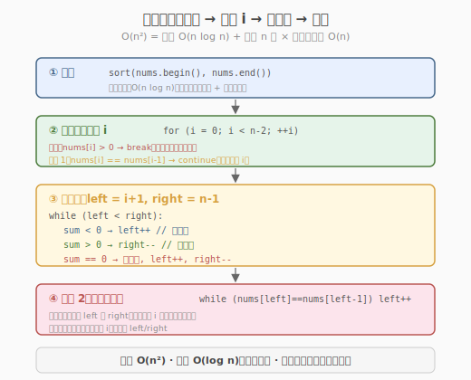

# 三数之和

- **题目名称**：三数之和
- **链接**：[15. 三数之和](https://leetcode.cn/problems/3sum/)
- **难度**：中等
- **标签**：数组、双指针、排序

## 1. 题目概述

给定一个整数数组 `nums`，判断是否存在三元组 `[nums[i], nums[j], nums[k]]` 满足 `i != j`、`i != k` 且 `j != k`，同时还满足 `nums[i] + nums[j] + nums[k] == 0`。请返回所有**和为 0 且不重复**的三元组。

**示例 1**：

```text
输入：nums = [-1,0,1,2,-1,-4]
输出：[[-1,-1,2],[-1,0,1]]
解释：
  nums[0] + nums[1] + nums[2] = (-1) + 0 + 1 = 0
  nums[1] + nums[2] + nums[4] = 0 + 1 + (-1) = 0
  nums[0] + nums[3] + nums[4] = (-1) + 2 + (-1) = 0
  去重后唯一的三元组是 [-1,0,1] 和 [-1,-1,2]
```

**示例 2**：

```text
输入：nums = [0,1,1]
输出：[]
解释：不存在和为 0 的三元组
```

**示例 3**：

```text
输入：nums = [0,0,0]
输出：[[0,0,0]]
解释：唯一可能的三元组和为 0
```

**约束条件**：

- `3 <= nums.length <= 3000`
- `-10^5 <= nums[i] <= 10^5`

> 💡 这是「双指针」的招牌题，与 [Day 1 两数之和](../day1/两数之和.md) 形成鲜明对照——同样是"找数对使和为定值"，两数之和用哈希表 `O(n)`，三数之和却用排序 + 双指针。差别在于：三数之和要求**去重**，哈希表去重繁琐且易错，排序后双指针让相同元素相邻，去重只需"跳过相邻重复"。掌握本题的"排序 + 固定一个 + 双指针扫剩余"模板，就能秒杀四数之和、最接近的三数之和等同构题。

---

## 2. 解题思路

### 2.1 暴力思路：三重循环枚举

最直接的做法：三重循环枚举所有 `(i, j, k)` 组合，判断 `nums[i]+nums[j]+nums[k]==0`，再用集合去重。

```text
for i in 0..n:
    for j in i+1..n:
        for k in j+1..n:
            if nums[i]+nums[j]+nums[k]==0: 加入结果
去重
```

时间复杂度 `O(n^3)`，`n=3000` 时约 `2.7 × 10^10` 次运算，**严重超时**。且去重需排序三元组后用集合，开销大。

> ⚠️ 暴力法有两个问题：① 三重循环 `O(n^3)` 太慢；② 去重逻辑复杂（`[-1,0,1]` 和 `[0,1,-1]` 是同一组）。破局思路：先排序，把"无序数组"变成"有序数组"，就能用双指针把内两层循环合并成 `O(n)`，且相同元素相邻便于去重。

### 2.2 核心观察：排序 + 双指针

**关键转换**：先对数组**升序排序**。排序后：

1. **双指针可行**：固定第一个数 `nums[i]`，在剩余区间 `[i+1, n-1]` 用左右双指针 `left`/`right` 找两数之和等于 `-nums[i]`。因为数组有序，可根据 `nums[left]+nums[right]` 与目标的大小关系单调移动指针。
2. **去重简单**：相同元素相邻，跳过相邻重复值即可避免重复三元组。

![双指针：固定 nums[i]，left/right 向中间夹逼](../../../images/three_sum_two_pointers.svg)

**双指针移动规则**（设 `target = -nums[i]`）：

- 若 `nums[left] + nums[right] < target`：和太小，`left++`（向右找更大的数）
- 若 `nums[left] + nums[right] > target`：和太大，`right--`（向左找更小的数）
- 若 `nums[left] + nums[right] == target`：找到一组，记录后 `left++` 且 `right--`，并跳过相邻重复值

> 💡 **为什么双指针不会漏解？** 因为数组有序，当 `nums[left]+nums[right] < target` 时，`right` 及以左的所有数与当前 `left` 配对都更小，不可能等于 `target`，所以 `left` 可以安全右移（`left` 之前的组合已全部排除）。这是"单调性"保证的双指针正确性。

### 2.3 算法流程图



**完整步骤**：

1. **排序**：`nums` 升序排序，`O(n log n)`
2. **枚举第一个数 `i`**：从 `0` 到 `n-3`，对每个 `nums[i]`
   - **剪枝 1**：若 `nums[i] > 0`，后续三数都 ≥ `nums[i] > 0`，和必为正，**break**
   - **去重 1**：若 `nums[i] == nums[i-1]`，跳过（避免 `i` 重复）
3. **双指针找两数之和 = `-nums[i]`**：`left = i+1`，`right = n-1`
   - 若和 < target：`left++`
   - 若和 > target：`right--`
   - 若和 == target：记录 `[nums[i], nums[left], nums[right]]`，然后 `left++`、`right--`，并**跳过相邻重复**的 `nums[left]` 和 `nums[right]`
4. 返回所有记录的三元组

### 2.4 示例演算

以 `nums = [-4,-1,-1,0,1,2]`（排序后）为例，看 `i=1`（`nums[i]=-1`）时双指针如何找到两组解：

![示例演算：i=1 时双指针找到 [-1,-1,2] 和 [-1,0,1]](../../../images/three_sum_example_walkthrough.svg)

| 步骤 | i | nums[i] | left | right | nums[l]+nums[r] | target=-nums[i] | 动作 | 结果 |
|------|---|---------|------|-------|-----------------|-----------------|------|------|
| 1 | 1 | -1 | 2 (-1) | 5 (2) | -1+2=1 | 1 | 相等！记录 `[-1,-1,2]`，l++, r-- | `[-1,-1,2]` |
| 2 | 1 | -1 | 3 (0) | 4 (1) | 0+1=1 | 1 | 相等！记录 `[-1,0,1]`，l++, r-- | `[-1,0,1]` |
| 3 | 1 | -1 | 4 (1) | 3 (0) | left > right，循环结束 | — | — | — |

`i=1` 这轮找到 2 组解。注意 `i=2` 时 `nums[2]=-1 == nums[1]`，**去重跳过**，避免再次找到 `[-1,0,1]`。

> 💡 去重是本题最易错的点。两层去重：① `i` 层去重（`nums[i]==nums[i-1]` 跳过）；② 找到一组解后 `left`/`right` 去重（跳过相邻相同值）。漏掉任何一层都会产生重复三元组。

---

## 3. 参考代码

### C++

```cpp
// 三数之和.cpp —— 排序 + 双指针 + 去重
// 编译: g++ -O2 -std=c++17 三数之和.cpp -o threesum
#include <vector>
#include <algorithm>
using namespace std;

class Solution {
  public:
    vector<vector<int>> threeSum(vector<int>& nums) {
        vector<vector<int>> result;
        int n = nums.size();
        sort(nums.begin(), nums.end()); // ① 排序

        for (int i = 0; i < n - 2; ++i) { // ② 枚举第一个数
            // 剪枝：最小的数已 > 0，三数之和必为正
            if (nums[i] > 0)
                break;

            // 去重 1：跳过相邻重复的 nums[i]
            if (i > 0 && nums[i] == nums[i - 1])
                continue;

            int left = i + 1, right = n - 1; // ③ 双指针
            while (left < right) {
                int sum = nums[i] + nums[left] + nums[right];
                if (sum < 0) {
                    ++left; // 和太小，左指针右移
                } else if (sum > 0) {
                    --right; // 和太大，右指针左移
                } else {
                    // 找到一组解
                    result.push_back({nums[i], nums[left], nums[right]});
                    ++left;
                    --right;
                    // 去重 2：跳过相邻重复的 left 和 right
                    while (left < right && nums[left] == nums[left - 1])
                        ++left;
                    while (left < right && nums[right] == nums[right + 1])
                        --right;
                }
            }
        }
        return result;
    }
};
```

### Python

```python
class Solution:
    def threeSum(self, nums: list[int]) -> list[list[int]]:
        nums.sort()                              # ① 排序
        result = []
        n = len(nums)

        for i in range(n - 2):                   # ② 枚举第一个数
            if nums[i] > 0:                      # 剪枝
                break
            if i > 0 and nums[i] == nums[i - 1]: # 去重 1
                continue

            left, right = i + 1, n - 1           # ③ 双指针
            while left < right:
                total = nums[i] + nums[left] + nums[right]
                if total < 0:
                    left += 1
                elif total > 0:
                    right -= 1
                else:
                    result.append([nums[i], nums[left], nums[right]])
                    left += 1
                    right -= 1
                    # 去重 2
                    while left < right and nums[left] == nums[left - 1]:
                        left += 1
                    while left < right and nums[right] == nums[right + 1]:
                        right -= 1
        return result
```

> 💡 注意去重 2 的判断条件：`nums[left] == nums[left-1]`（与**已处理过**的前一个比），不是 `nums[left] == nums[left+1]`。因为 `left` 已经 `++` 了，要跳过的是"和刚记录的解相同"的值。

---

## 4. 复杂度分析

| 维度 | 复杂度 | 说明 |
|------|--------|------|
| **时间复杂度** | `O(n^2)` | 排序 `O(n log n)` + 外层 `n` 轮 × 内层双指针 `O(n)` = `O(n^2)` |
| **空间复杂度** | `O(log n)` | 排序的栈空间（C++ `sort` 为快排变种）；返回结果不计入 |
| **最优时间** | `O(n^2)` | 双指针已是该问题最优解（无 `O(n log n)` 解法） |

> ⚠️ 为什么不用哈希表？两数之和用哈希 `O(n)`，三数之和用哈希需 `O(n^2)` 枚举两数 + 哈希查第三数，时间同为 `O(n^2)`，但**去重复杂**（三元组无序，需排序后入集合），实际常数更大。排序 + 双指针去重简洁且常数小，是标准解法。

---

## 5. 扩展：相关变体题

### 5.1 四数之和（18 题）

把"固定一个 + 双指针"扩展为"固定两个 + 双指针"：外层两重循环枚举前两个数，内层双指针找后两个。时间 `O(n^3)`，去重逻辑双层。

### 5.2 最接近的三数之和（16 题）

不要求等于 0，而是找三数之和最接近 `target`。双指针移动时记录差值最小的组合，无需去重。

### 5.3 三数之和的小于/大于目标数（LintCode 57/58）

统计有多少三元组之和 `< target`（或 `≤ target`）。双指针移动规则改为：当 `nums[l]+nums[r] < target` 时，`[l, r]` 区间内所有 `r'` 都满足，计数 `+= r - l`，然后 `left++`。

| 题目 | 与本题差异 | 核心改动 |
|------|-----------|---------|
| 18 四数之和 | 固定 1 个 → 固定 2 个 | 多一层外循环 + 多一层去重 |
| 16 最接近三数之和 | 等于 0 → 最接近 target | 记录最小差值，无需去重 |
| 57 三数之和小于目标 | 等于 → 小于 | 双指针移动时按区间计数 |

> 💡 这些题骨架完全相同——都是"排序 + 固定前若干个 + 双指针扫剩余"。掌握三数之和的双指针模板和去重逻辑，四数之和、最接近三数之和可秒杀。

---

## 6. 面试要点

1. **为什么三数之和不像两数之和那样用哈希表？**

   - 两数之和 `O(n)` 哈希是因为只需找一对、无去重要求（题目保证唯一解）。
   - 三数之和要求**返回所有不重复三元组**，哈希表去重需把三元组排序后入集合，常数大且易错；排序后双指针让相同元素相邻，去重只需 `nums[i]==nums[i-1]` 跳过，简洁高效。
   - 时间同为 `O(n^2)`，但双指针空间 `O(1)`（不含结果），哈希需 `O(n)` 表。

2. **去重的两层各是什么？漏掉会怎样？**

   - **外层去重**（`i` 层）：`if (i>0 && nums[i]==nums[i-1]) continue`。漏掉会重复枚举相同的第一个数，产生重复三元组。
   - **内层去重**（找到解后）：`while (nums[left]==nums[left-1]) left++`。漏掉会在同一 `i` 下用相同的 `left` 值再次匹配，产生重复。
   - 两层缺一不可。面试时常被追问"为什么去重要在排序后做"——排序保证相同元素相邻。

3. **剪枝 `if (nums[i] > 0) break` 的正确性？**

   - 排序后 `nums[i] ≤ nums[left] ≤ nums[right]`。若 `nums[i] > 0`，则三数之和 `≥ 3 × nums[i] > 0`，不可能等于 0。
   - 且后续 `i' > i` 的 `nums[i']` 更大，同样不满足，所以直接 `break` 而非 `continue`。这是重要常数优化。

4. **双指针为什么不会漏解？**

   - 当 `nums[left]+nums[right] < target` 时，对当前 `left`，任何 `right' < right` 都有 `nums[left]+nums[right'] ≤ nums[left]+nums[right] < target`，都不可能是解。所以 `left` 可以安全右移，不会漏掉以当前 `left` 开头的解。
   - 这依赖**数组有序**带来的单调性。无序数组双指针无此保证。

5. **`nums` 含重复元素时，去重为何不会漏掉合法解？**

   - 外层 `nums[i]==nums[i-1]` 跳过的是"与前一个 `i` 值相同"的情况，但前一个 `i` 已枚举了所有以其开头的合法解，所以跳过重复值不会漏解。
   - 内层同理：找到一组解后跳过相邻相同值，是因为相同值会配出相同的解。关键是**第一个出现的值会被完整处理**，后续重复才跳过。

> 💡 **一句话总结**：三数之和是双指针的招牌题——排序把"无序找数对"变成"有序双指针夹逼"，把 `O(n^3)` 降到 `O(n^2)`，同时让相同元素相邻使去重只需跳过相邻。它的"固定一个 + 双指针扫剩余 + 双层去重"模板可推广到四数之和、最接近三数之和等所有 k-sum 变体，是面试必会的核心套路。

---

## 7. 同类练习题
- [16. 最接近的三数之和](https://leetcode.cn/problems/3sum-closest/)：排序 + 双指针 + 最近值
- [18. 四数之和](https://leetcode.cn/problems/4sum/)：k-sum 通用模板
- [1. 两数之和](https://leetcode.cn/problems/two-sum/)：哈希一次遍历
