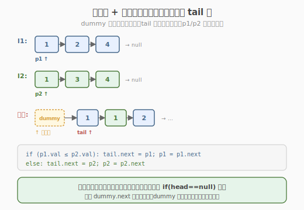
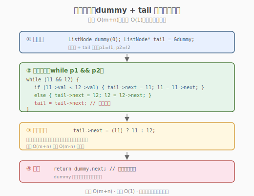
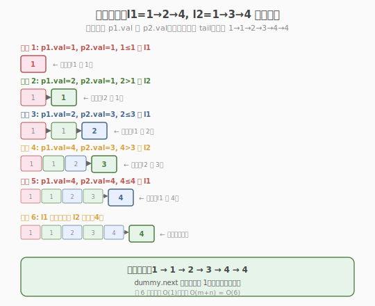

# 合并两个有序链表

- **题目名称**：合并两个有序链表
- **链接**：[21. 合并两个有序链表](https://leetcode.cn/problems/merge-two-sorted-lists/)
- **难度**：简单
- **标签**：链表、递归

## 1. 题目概述

将两个升序链表合并为一个新的**升序**链表并返回。新链表由拼接给定的两个链表的所有节点组成（不能新建节点，只能修改 `next` 指针）。

**示例 1**：

```text
输入：l1 = 1 → 2 → 4, l2 = 1 → 3 → 4
输出：1 → 1 → 2 → 3 → 4 → 4
```

**示例 2**：

```text
输入：l1 = [], l2 = []
输出：[]
```

**示例 3**：

```text
输入：l1 = [], l2 = [0]
输出：[0]
```

**约束条件**：

- 两个链表的节点数目范围是 `[0, 50]`
- `-100 <= Node.val <= 100`
- `l1` 和 `l2` 均按**非递减顺序**排列

> 💡 这是链表的入门模板题。它用最简单的结构引出链表题的两大核心技巧：**哑节点（dummy node）**——用一个虚拟头节点统一处理"头节点为空"的边界；**双指针逐个比较**——利用两个链表已有序的特性，每次取较小者接上。与 [Day 3 三数之和](../day3/三数之和.md) 的双指针不同，链表的双指针不是"左右夹逼"而是"两路归并"——这正是归并排序的合并步骤。

---

## 2. 解题思路

### 2.1 暴力思路：转数组排序再建链表

把两个链表的值全部读入数组，排序后重建链表。

```text
遍历 l1、l2 收集到数组 → sort → 用数组值新建链表
```

时间 `O((m+n) log(m+n))`，空间 `O(m+n)`。虽然能过，但完全没利用"两个链表已有序"的条件，且**新建节点**违反题意（要求拼接现有节点）。这是典型的"没抓住问题结构"的解法。

> ⚠️ 本题的关键性质：`l1` 和 `l2` **已经升序**。这意味着我们只需比较两个链表的当前头，较小者一定是全局最小，接到结果末尾即可——无需排序。这就是**归并**的思想。

### 2.2 核心观察：哑节点 + 双指针归并

**两个关键技巧**：

1. **哑节点（dummy node）**：在结果链表头部加一个虚拟节点 `dummy`，`next` 指向真正的头。这样"头节点"的处理与后续节点完全一致，避免 `if (head == nullptr) head = ...` 的特殊判断。
2. **双指针归并**：用 `p1`、`p2` 分别指向两个链表当前待比较节点，`tail` 指向结果链表末尾。每次比较 `p1.val` 和 `p2.val`，较小者接到 `tail` 后，对应指针前进一步。



**归并规则**：

- 若 `p1.val ≤ p2.val`：`tail.next = p1`，`p1 = p1.next`
- 否则：`tail.next = p2`，`p2 = p2.next`
- `tail = tail.next`（末尾前进）

当一个链表遍历完后，另一个链表剩余部分**整体**接到 `tail.next`（因为剩余部分已有序，无需再逐个比较）。

> 💡 **为什么剩余部分可以直接整体接上？** 因为两个链表都是升序的，当一个链表耗尽时，另一个链表的剩余节点都比已合并部分大，且自身有序，直接拼接即可。这是归并排序 `merge` 函数的标准做法。

### 2.3 算法流程图



**迭代法步骤**：

1. 创建 `dummy` 节点，`tail = dummy`
2. `while (p1 != nullptr && p2 != nullptr)`：
   - 比较 `p1.val` 和 `p2.val`，较小者接到 `tail.next`，对应指针前进一步
   - `tail = tail.next`
3. `tail.next = (p1 != nullptr) ? p1 : p2`（拼接剩余）
4. 返回 `dummy.next`（真正的头节点）

### 2.4 示例演算

以 `l1 = 1→2→4`，`l2 = 1→3→4` 为例：



| 步骤 | p1.val | p2.val | 接入 | tail 后 | p1 | p2 |
|------|--------|--------|------|---------|-----|-----|
| 1 | 1 | 1 | l1 的 1（≤） | dummy → 1 | 2→4 | 1→3→4 |
| 2 | 2 | 1 | l2 的 1 | →1→1 | 2→4 | 3→4 |
| 3 | 2 | 3 | l1 的 2 | →1→1→2 | 4 | 3→4 |
| 4 | 4 | 3 | l2 的 3 | →1→1→2→3 | 4 | 4 |
| 5 | 4 | 4 | l1 的 4（≤） | →1→1→2→3→4 | null | 4 |
| 6 | — | — | l2 耗尽？否，p1=null，接剩余 | →1→1→2→3→4→4 | — | — |

最终 `dummy.next = 1→1→2→3→4→4`。

> 💡 步骤 1 中 `p1.val == p2.val == 1`，取 `l1` 的（`≤` 时取 `p1`），不影响正确性——取哪个都行，只要稳定即可。

---

## 3. 参考代码

### C++

```cpp
// 合并两个有序链表.cpp —— 哑节点 + 迭代 + 递归两种写法
// 编译: g++ -O2 -std=c++17 合并两个有序链表.cpp -o merge
#include <iostream>
using namespace std;

struct ListNode {
    int val;
    ListNode* next;
    ListNode() : val(0), next(nullptr) {
    }
    ListNode(int x) : val(x), next(nullptr) {
    }
    ListNode(int x, ListNode* n) : val(x), next(n) {
    }
};

// 版本 1：迭代（哑节点 + 双指针，推荐）
class Solution {
  public:
    ListNode* mergeTwoLists(ListNode* l1, ListNode* l2) {
        ListNode dummy(0); // 哑节点，统一头节点处理
        ListNode* tail = &dummy;

        while (l1 && l2) {
            if (l1->val <= l2->val) {
                tail->next = l1;
                l1 = l1->next;
            } else {
                tail->next = l2;
                l2 = l2->next;
            }
            tail = tail->next;
        }
        // 拼接剩余部分（其中一个已为 null）
        tail->next = (l1 != nullptr) ? l1 : l2;
        return dummy.next; // 真正的头节点
    }
};

// 版本 2：递归（代码最简，但空间 O(m+n)）
class Solution2 {
  public:
    ListNode* mergeTwoLists(ListNode* l1, ListNode* l2) {
        if (l1 == nullptr)
            return l2; // base case：一个空了，返回另一个
        if (l2 == nullptr)
            return l1;
        if (l1->val <= l2->val) {
            l1->next = mergeTwoLists(l1->next, l2); // l1 较小，递归接 l1.next 和 l2
            return l1;
        } else {
            l2->next = mergeTwoLists(l1, l2->next); // l2 较小，递归接 l1 和 l2.next
            return l2;
        }
    }
};
```

### Python

```python
class ListNode:
    def __init__(self, val=0, next=None):
        self.val = val
        self.next = next

class Solution:
    def mergeTwoLists(self, l1: ListNode, l2: ListNode) -> ListNode:
        dummy = ListNode()              # 哑节点
        tail = dummy

        while l1 and l2:
            if l1.val <= l2.val:
                tail.next = l1
                l1 = l1.next
            else:
                tail.next = l2
                l2 = l2.next
            tail = tail.next

        tail.next = l1 if l1 else l2    # 拼接剩余
        return dummy.next
```

> 💡 Python 递归版可一行写出：`return l1 if not l2 else (l2 if not l1 else (setattr(l1, 'next', self.mergeTwoLists(l1.next, l2)) or l1) if l1.val <= l2.val else (setattr(l2, 'next', self.mergeTwoLists(l1, l2.next)) or l2))`——但可读性极差，面试别这么写。

---

## 4. 复杂度分析

| 维度 | 迭代 | 递归 | 说明 |
|------|------|------|------|
| **时间复杂度** | `O(m+n)` | `O(m+n)` | 每次比较接入 1 个节点，共 `m+n` 个 |
| **空间复杂度** | `O(1)` | `O(m+n)` | 迭代只用常数指针；递归栈深度 `m+n` |
| **推荐度** | ✅ 面试首选 | 代码简但栈深 | 链表长时递归可能栈溢出 |

> ⚠️ 递归虽然代码优雅，但 `m+n=100` 时栈深 100 层尚可，若链表长度到 `10^4`+（如变体题）会栈溢出。面试时先写迭代，提到递归作为备选即可。

---

## 5. 扩展：归并排序与相关变体

### 5.1 归并排序的合并步骤

本题就是**归并排序的 `merge` 函数**。归并排序的思路：把数组/链表对半切，递归排序两半，再用本题的 `merge` 合并。链表归并排序（148 题）直接复用本题的 `mergeTwoLists`：

```cpp
// 148. 排序链表（归并排序）
ListNode* sortList(ListNode* head) {
    if (!head || !head->next)
        return head; // base case
    // 快慢指针找中点，切成两半
    ListNode* mid = splitMid(head);
    // 递归排序两半
    head = sortList(head);
    mid = sortList(mid);
    // 合并（复用本题的 mergeTwoLists）
    return mergeTwoLists(head, mid);
}
```

### 5.2 合并 K 个有序链表（23 题）

把"合并 2 个"扩展为"合并 K 个"。两种解法：

- **顺序合并**：`result = merge(result, lists[i])`，逐个合并，时间 `O(k²·n)`
- **分治合并**：两两配对合并（类似锦标赛），时间 `O(k·n·log k)`，复用本题的 `mergeTwoLists`
- **最小堆**：把 K 个头节点入堆，每次弹出最小者接入，时间 `O(k·n·log k)`

| 题目 | 与本题关系 | 核心改动 |
|------|-----------|---------|
| 148 排序链表 | 本题是归并排序的 merge 步骤 | 加 splitMid + 递归 sortList |
| 23 合并 K 个链表 | 2 个 → K 个 | 分治两两合并或最小堆 |
| 88 合并两个有序数组 | 链表 → 数组 | 从后往前填充避免移动 |

> 💡 本题是"归并"思想的原子操作。掌握哑节点 + 双指针归并后，归并排序、合并 K 个链表、合并区间等问题都能复用。归并的本质是"利用已有序性，每次取全局最小"。

---

## 6. 面试要点

1. **为什么要用哑节点（dummy node）？**

   - 不用哑节点时，头节点的赋值需要特殊判断：`if (head == nullptr) head = ...`，且 `tail` 初始为 `nullptr` 时第一次 `tail->next` 会空指针。
   - 哑节点让"头节点"与"后续节点"的处理逻辑统一——`tail` 始终非空，`tail->next = ...` 永远安全。最后返回 `dummy.next` 即可。
   - 这是链表题的**通用技巧**：凡涉及"构建新链表"且头节点不确定的场景（合并、插入、 partition），都用哑节点。

2. **迭代和递归哪个更好？**

   - **迭代**：空间 `O(1)`，无栈溢出风险，面试首选。
   - **递归**：代码最简（4 行），思路清晰（"较小者.next = 递归合并剩余"），但空间 `O(m+n)` 栈深，长链表可能溢出。
   - 面试策略：先写迭代，口头提递归思路，说明空间权衡。

3. **当一个链表遍历完后，为什么可以直接拼接剩余部分？**

   - 两个链表都**升序**。当一个耗尽时，另一个的剩余节点都 ≥ 已合并部分的最后一个值，且自身有序。
   - 所以 `tail->next = 剩余` 一次操作即可，无需逐个比较。这是 `O(m+n)` 而非 `O(m·n)` 的关键。

4. **`l1.val == l2.val` 时取哪个？会影响结果吗？**

   - 取哪个都不影响正确性（值相同）。习惯上 `l1.val <= l2.val` 时取 `l1`（稳定排序）。
   - 若要求**稳定**（相同值的元素保持原相对顺序），需固定取某一边。本题无此要求。

5. **合并后的链表是否"原地"？有没有新建节点？**

   - 是的，**原地拼接**——只修改 `next` 指针，不新建 `ListNode`（`dummy` 是局部变量，不算结果节点）。
   - 这也是题意"由拼接给定的两个链表的所有节点组成"的要求。若新建节点会违反题意且浪费空间。

> 💡 **一句话总结**：合并两个有序链表是链表的入门模板——它用最简单的结构引出两大通用技巧：**哑节点**（统一头节点处理，链表题必备）和**双指针归并**（利用已有序性每次取最小，归并排序的原子操作）。迭代版 `O(1)` 空间是面试首选，递归版代码最简但栈深有风险。掌握它，你就拿到了归并排序、合并 K 个链表、合并区间等所有"归并类"问题的钥匙。

---

## 7. 同类练习题
- [23. 合并 K 个升序链表](https://leetcode.cn/problems/merge-k-sorted-lists/)：分治/堆合并
- [148. 排序链表](https://leetcode.cn/problems/sort-list/)：归并排序链表
- [21. 合并两个有序链表](https://leetcode.cn/problems/merge-two-sorted-lists/)：哑节点 + 双指针
