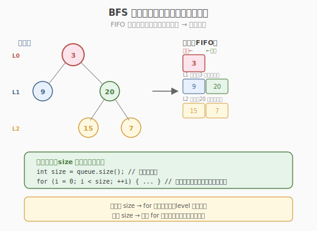
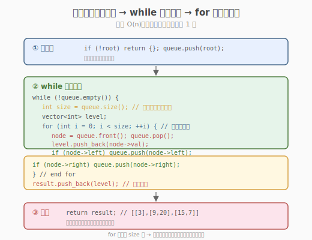
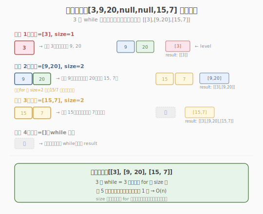

# 二叉树的层序遍历

- **题目名称**：二叉树的层序遍历
- **链接**：[102. 二叉树的层序遍历](https://leetcode.cn/problems/binary-tree-level-order-traversal/)
- **难度**：中等
- **标签**：树、二叉树、广度优先搜索（BFS）

## 1. 题目概述

给定二叉树的根节点 `root`，返回其节点值的**层序遍历**结果。即逐层地，从左到右访问所有节点，将同一层的节点值组成一个子列表。

**示例 1**：

```text
输入：root = [3,9,20,null,null,15,7]
          3
         / \
        9  20
          /  \
         15   7
输出：[[3],[9,20],[15,7]]
```

**示例 2**：

```text
输入：root = [1]
输出：[[1]]
```

**示例 3**：

```text
输入：root = []
输出：[]
```

**约束条件**：

- 树中节点数目在范围 `[0, 2000]` 内
- `-1000 <= Node.val <= 1000`

> 💡 这是 **BFS（广度优先搜索）** 的招牌题。与 [Day 4 合并链表](../day4/合并两个有序链表.md) 的"逐个处理"不同，BFS 用**队列**逐层推进——先访问离根最近的节点，再访问下一层。层序遍历是所有"按层/按距离"问题的模板：岛屿数量、腐烂橘子、最短路径都复用这套 BFS 队列骨架。掌握它，你就拿到了图论 BFS 的入场券。

---

## 2. 解题思路

### 2.1 暴力思路：DFS 记录层数

用 DFS 递归遍历，传入当前层数 `depth`，把节点值存入 `result[depth]`。

```text
dfs(node, depth):
    if node == null: return
    result[depth].append(node.val)   // 按层存
    dfs(node.left, depth+1)
    dfs(node.right, depth+1)
```

DFS 能得到正确结果，但有两个问题：① 需要额外维护 `depth` 参数；② DFS 天然是"深度优先"，同一层的节点访问顺序不连续（先走左子树到底，再回来走右子树），虽然结果正确但不符合"层序"的直觉。更自然的方式是用 **BFS 队列**。

> ⚠️ DFS 记录层数能过本题，但面试官通常期望你用 BFS——因为 BFS 天然按层处理，是层序遍历的"标准解法"，且能自然扩展到"最短步数"等问题（DFS 做最短路径很别扭）。

### 2.2 核心观察：BFS 队列 + 层分隔

**BFS 的核心结构**：用一个**先进先出（FIFO）队列**，每次从队头取节点处理，把它的子节点入队尾。这样节点按"距离根的远近"依次出队——距离 0 的根先出，距离 1 的子节点次之，以此类推。



**层分隔的关键技巧**：BFS 队列天然按层排列，但要从队列中"切分"出每一层，需要在每轮循环开始时**记录当前队列长度** `size`——这个 `size` 就是当前层的节点数。然后恰好处理 `size` 个节点（它们都是同一层），期间入队的子节点属于下一层。

```text
while queue 非空:
    size = queue.length        // 当前层节点数
    level = []
    for i in 0..size:          // 恰好处理一整层
        node = queue.pop_front()
        level.append(node.val)
        if node.left:  queue.push_back(node.left)
        if node.right: queue.push_back(node.right)
    result.append(level)
```

> 💡 **为什么要在 for 循环前记录 size？** 因为 for 循环体里会往队列 push 子节点，队列长度会变。如果不提前固定 `size`，for 循环会"跨层"处理，把下一层的节点也并入当前层。`size` 快照让"当前层"的边界被锁定。

### 2.3 算法流程图



**完整步骤**：

1. **特判**：`root == null` 返回空列表
2. **初始化**：队列 `queue = [root]`，结果 `result = []`
3. **while 队列非空**：
   - `size = queue.size()`（当前层节点数快照）
   - `level = []`
   - `for i in 0..size`：
     - `node = queue.pop_front()`
     - `level.append(node.val)`
     - 子节点入队：`if node.left: queue.push_back(node.left)`；`if node.right: queue.push_back(node.right)`
   - `result.append(level)`
4. 返回 `result`

### 2.4 示例演算

以示例 1 的树 `[3,9,20,null,null,15,7]` 为例：



| 轮次 | 队列初始 | size | 出队节点 | 入队子节点 | level | result |
|------|---------|------|---------|-----------|-------|--------|
| 1 | [3] | 1 | 3 | 9, 20 | [3] | [[3]] |
| 2 | [9, 20] | 2 | 9 → 20 | (9 无子) → 15, 7 | [9, 20] | [[3],[9,20]] |
| 3 | [15, 7] | 2 | 15 → 7 | (均无子) | [15, 7] | [[3],[9,20],[15,7]] |
| 4 | [] | — | 队列空，结束 | — | — | — |

最终 `result = [[3],[9,20],[15,7]]`。

> 💡 注意第 2 轮：队列里有 `[9, 20]`，`size=2`。先出 9（无子节点入队），再出 20（入队 15、7）。for 循环只跑 2 次（`size=2`），所以 15 和 7 不会被本轮处理——它们留到第 3 轮。这就是 `size` 快照的"层边界锁定"作用。

---

## 3. 参考代码

### C++

```cpp
// 二叉树的层序遍历.cpp —— BFS 队列 + 层分隔
// 编译: g++ -O2 -std=c++17 二叉树的层序遍历.cpp -o levelorder
#include <vector>
#include <queue>
using namespace std;

struct TreeNode {
    int val;
    TreeNode* left;
    TreeNode* right;
    TreeNode() : val(0), left(nullptr), right(nullptr) {
    }
    TreeNode(int x) : val(x), left(nullptr), right(nullptr) {
    }
    TreeNode(int x, TreeNode* l, TreeNode* r) : val(x), left(l), right(r) {
    }
};

class Solution {
  public:
    vector<vector<int>> levelOrder(TreeNode* root) {
        vector<vector<int>> result;
        if (root == nullptr)
            return result; // 特判空树

        queue<TreeNode*> q;
        q.push(root);

        while (!q.empty()) {
            int size = q.size(); // ① 当前层节点数快照
            vector<int> level;
            for (int i = 0; i < size; ++i) { // ② 恰好处理一整层
                TreeNode* node = q.front();
                q.pop();
                level.push_back(node->val);
                if (node->left)
                    q.push(node->left); // ③ 子节点入队（下一层）
                if (node->right)
                    q.push(node->right);
            }
            result.push_back(level); // ④ 收集本层结果
        }
        return result;
    }
};
```

### Python

```python
from collections import deque

class Solution:
    def levelOrder(self, root: TreeNode | None) -> list[list[int]]:
        result = []
        if not root:
            return result

        queue = deque([root])          # deque 比 list 做 queue 更高效

        while queue:
            size = len(queue)          # 当前层节点数
            level = []
            for _ in range(size):      # 恰好处理一整层
                node = queue.popleft() # O(1) 出队
                level.append(node.val)
                if node.left:
                    queue.append(node.left)
                if node.right:
                    queue.append(node.right)
            result.append(level)
        return result
```

> 💡 Python 用 `collections.deque` 而非 `list`——`deque.popleft()` 是 `O(1)`，`list.pop(0)` 是 `O(n)`（需移动所有元素）。这是 Python BFS 的性能关键。

---

## 4. 复杂度分析

| 维度 | 复杂度 | 说明 |
|------|--------|------|
| **时间复杂度** | `O(n)` | 每个节点恰好入队/出队 1 次 |
| **空间复杂度** | `O(n)` | 队列最多存一层的节点；满二叉树最后一层 `n/2` 个节点 |

> ⚠️ 空间复杂度的 `O(n)` 来自队列——满二叉树时最后一层有 `n/2` 个节点同时在队列里。这是 BFS 的固有开销（DFS 的栈空间是 `O(height)`，通常更小）。但 BFS 的"按层"语义是 DFS 无法替代的。

---

## 5. 扩展：BFS 模板的迁移

### 5.1 变种题

| 题目 | 与本题差异 | 改动点 |
|------|-----------|--------|
| 107 自底向上层序 | result 逆序 | 最后 `reverse(result)` 或每层 `insert` 到头部 |
| 199 二叉树右视图 | 只要每层最右节点 | 每层 for 循环最后记录的 `node.val` |
| 103 锯齿形层序 | 奇数层正序、偶数层逆序 | 偶数层 `reverse(level)` 或用双端队列 |
| 429 N 叉树层序 | 二叉树 → N 叉树 | 子节点入队改成 `for child in node.children` |

### 5.2 图论 BFS（核心迁移）

层序遍历的 `while + for(size)` 模板可直接迁移到图论 BFS：

| 图论题 | 与本题对应 | 关键改动 |
|--------|-----------|---------|
| 200 岛屿数量 | 节点 → 网格点，子节点 → 上下左右 | 加 `visited` 集合防重复访问 |
| 994 腐烂橘子 | 节点 → 橘子，子节点 → 相邻新鲜橘 | BFS 轮数 = 腐烂传播分钟数 |
| 207 课程表 | 节点 → 课程，子节点 → 后续课 | 改用拓扑排序（BFS 变体） |
| 1091 最短路径 | 节点 → 格子，子节点 → 8 方向 | BFS 首次到达即最短步数 |

> 💡 图论 BFS 与树 BFS 的唯一本质差别：图可能有**环**，需 `visited` 集合防止重复入队。树无环，无需 `visited`。掌握树的层序遍历，加个 `visited` 就是图 BFS。

```python
# 图 BFS 通用模板（以网格为例）
from collections import deque
def bfs(grid, start):
    visited = set([start])
    queue = deque([start])
    while queue:
        size = len(queue)
        for _ in range(size):
            node = queue.popleft()
            for neighbor in get_neighbors(node):   # 上下左右
                if neighbor not in visited:
                    visited.add(neighbor)
                    queue.append(neighbor)
```

---

## 6. 面试要点

1. **为什么 BFS 用队列而不是栈？**

   - 队列是 **FIFO**（先进先出）：先入队的节点先出队，保证"距离根近的节点先处理"——这就是"广度优先"。
   - 栈是 **LIFO**（后进先出）：后入队的子节点先处理，会一路钻到底——那就是 DFS。
   - 数据结构决定遍历顺序：队列 → BFS，栈 → DFS。

2. **`size = queue.size()` 这行为什么不能省？**

   - for 循环体里会 `push` 子节点，队列长度动态变化。若直接 `while(!q.empty())` 不分层，会把下一层节点混入当前层，`level` 列表就乱了。
   - `size` 是"当前层节点数快照"，锁定本层边界。for 循环跑 `size` 次后，队列里恰好只剩下一层节点。

3. **BFS 和 DFS 各适合什么场景？**

   - **BFS** 适合"最短/最少步数"问题（无权图最短路径）、"按层处理"问题（层序遍历、按距离扩散）。
   - **DFS** 适合"连通性/路径存在性"问题（岛屿数量也可用 DFS）、"所有方案枚举"（全排列、组合）、"深度依赖"问题（拓扑排序的递归版）。
   - 经验：求"最短"用 BFS，求"所有方案"用 DFS，求"是否连通"两者皆可。

4. **空间复杂度为什么是 O(n)？DFS 的空间是 O(height)，哪个更优？**

   - BFS 队列最多存一层节点，满二叉树最后一层 `n/2` 个 → `O(n)`。
   - DFS 递归栈深度 = 树高，平衡树 `O(log n)`，退化为链表 `O(n)`。
   - 不能简单说"谁更优"——它们解决不同问题。层序遍历必须 BFS；求深度/路径存在性 DFS 更省空间。面试时按问题选择。

5. **如何实现"自底向上"的层序遍历（107 题）？**

   - 两种方法：① BFS 正序收集后 `reverse(result)`；② 每层结果 `insert(result.begin(), level)` 放到头部。
   - 方法 ① 更直观，方法 ② 每次 insert 头部是 `O(n)` 但总复杂度仍是 `O(n)`（n 是总层数 × 每层节点）。

> 💡 **一句话总结**：二叉树的层序遍历是 BFS 的招牌题——它的 `while(队列非空) + for(当前层 size)` 骨架是所有"按层/按距离"问题的通用模板。核心技巧是 **size 快照锁定层边界**，让同一层节点被一次性处理。掌握这个模板，加个 `visited` 集合就能迁移到图论 BFS（岛屿数量、腐烂橘子、最短路径），是面试中"一模板打天下"的典型代表。

---

## 7. 同类练习题
- [103. 二叉树的锯齿形层序遍历](https://leetcode.cn/problems/binary-tree-zigzag-level-order-traversal/)：BFS + 方向交替
- [199. 二叉树的右视图](https://leetcode.cn/problems/binary-tree-right-side-view/)：BFS 取每层最右
- [107. 二叉树的层序遍历 II](https://leetcode.cn/problems/binary-tree-level-order-traversal-ii/)：自底向上 BFS
