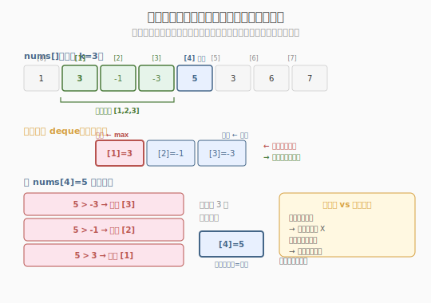
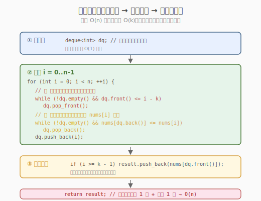
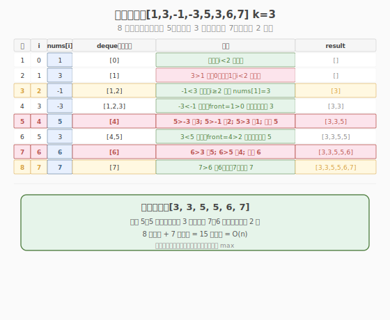

# 滑动窗口最大值

- **题目名称**：滑动窗口最大值
- **链接**：[239. 滑动窗口最大值](https://leetcode.cn/problems/sliding-window-maximum/)
- **难度**：困难
- **标签**：数组、队列、单调队列、滑动窗口

## 1. 题目概述

给定一个数组 `nums` 和一个滑动窗口大小 `k`，窗口从数组最左侧滑动到最右侧，每次滑动一位。返回每个窗口中的最大值。

**示例 1**：

```text
输入：nums = [1,3,-1,-3,5,3,6,7], k = 3

窗口位置                  最大值
─────────────────────    ─────
[1  3  -1] -3  5  3  6  7   → 3
 1 [3  -1  -3] 5  3  6  7   → 3
 1  3 [-1  -3  5] 3  6  7   → 5
 1  3  -1 [-3  5  3] 6  7   → 5
 1  3  -1  -3 [5  3  6] 7   → 6
 1  3  -1  -3  5 [3  6  7]  → 7

输出：[3,3,5,5,6,7]
```

**示例 2**：

```text
输入：nums = [1], k = 1
输出：[1]
```

**约束条件**：

- `1 <= nums.length <= 10^5`
- `-10^4 <= nums[i] <= 10^4`
- `1 <= k <= nums.length`

> 💡 这是 **单调队列（monotonic deque）** 的招牌题，也是 Week 2 的压轴困难题。它与 [Day 6 每日温度](../day6/每日温度.md) 的单调栈是一对——单调栈找"下一个更大"，单调队列维护"**当前窗口最大**"。核心思想相同：用单调性避免重复比较，把 `O(nk)` 暴力降到 `O(n)`。区别在于栈只能在一端操作（适合"找下一个"），而队列两端都能操作（适合"滑动窗口"——左端过期出队，右端维护单调）。

---

## 2. 解题思路

### 2.1 暴力思路：每个窗口扫一遍求 max

对每个窗口 `[i, i+k-1]`，遍历 `k` 个元素求最大值。

```text
for i in 0..n-k:
    answer[i] = max(nums[i : i+k])   // O(k) per window
```

时间复杂度 `O(nk)`，`n=10^5, k=50000` 时约 `5×10^9` 次运算，**超时**。

> ⚠️ 暴力法的问题：**相邻窗口的 `k-1` 个元素重叠**，但暴力每次重新求 max，完全没复用。例如窗口 `[3,-1,-3]` 和 `[-1,-3,5]` 共享 `-1,-3`，但暴力对两个窗口各扫一遍。需要一种结构**记住窗口内的候选最大值**，避免重复比较——这就是单调队列。

### 2.2 核心观察：单调递减队列

**关键定义**：用一个**双端队列（deque）**，存下标，对应值从队头到队尾**单调递减**。

**两个操作**：

1. **入队（右端）**：新元素 `nums[i]` 入队前，从队尾弹出所有比它**小或等**的元素（它们不可能再成为任何窗口的最大值——新来的更大且更靠后）。然后把 `i` 入队尾。
2. **出队（左端）**：如果队头下标 `≤ i - k`（已滑出窗口），从队头弹出。

**队头就是当前窗口最大值**——因为队列单调递减，队头对应的值最大，且尚未过期。



**为什么弹掉"小或等"的？** 因为新元素 `nums[i]` 更大且更靠后，窗口内那些比它小的元素**永远不可能成为最大值**——只要 `nums[i]` 还在窗口里，最大值要么是 `nums[i]` 本身，要么是比它更大的元素。所以这些小元素可以安全丢弃。

> 💡 **单调栈 vs 单调队列**：
> - **单调栈**（Day 6）：一端操作，栈顶是最迫切等结算的。适合"找下一个更 X"——遇到触发条件弹栈结算。
> - **单调队列**（本题）：两端操作，队头是当前最大，队尾维护单调。适合"滑动窗口最值"——左端过期出队，右端弹尾保单调。
> - 共同点：都用单调性避免重复比较，把 `O(n²)` 或 `O(nk)` 降到 `O(n)`。

### 2.3 算法流程图



**完整步骤**：

1. **初始化**：双端队列 `deque`（存下标），结果 `result`
2. **遍历 `i` 从 0 到 n-1**：
   - **过期出队**：`while deque 非空 且 deque.front() ≤ i - k`：`deque.pop_front()`
   - **入队弹尾**：`while deque 非空 且 nums[deque.back()] ≤ nums[i]`：`deque.pop_back()`
   - `deque.push_back(i)`
   - **收集结果**：`if i >= k - 1`（窗口已满）：`result.append(nums[deque.front()])`
3. 返回 `result`

> ⚠️ 先过期出队再入队弹尾——顺序不能反。如果先入队弹尾，可能把刚入队的元素又因过期弹出，逻辑混乱。正确顺序：先清理过期（左端），再维护单调（右端），最后队头即最大。

### 2.4 示例演算

以 `nums = [1,3,-1,-3,5,3,6,7], k = 3` 为例：



| 步骤 | i | nums[i] | deque（下标） | 对应值 | 动作 | result |
|------|---|---------|--------------|--------|------|--------|
| 1 | 0 | 1 | [0] | [1] | 入队，i<2 不收集 | [] |
| 2 | 1 | 3 | [1] | [3] | 3>1 弹尾0；入队1；i<2 不收集 | [] |
| 3 | 2 | -1 | [1,2] | [3,-1] | -1<3 入队；i≥2 收集 nums[1]=3 | [3] |
| 4 | 3 | -3 | [1,2,3] | [3,-1,-3] | -3<-1 入队；front=1>0 不过期；收集 3 | [3,3] |
| 5 | 4 | 5 | [4] | [5] | 5>-3 弹3；5>-1 弹2；5>3 弹1；入队4；收集 5 | [3,3,5] |
| 6 | 5 | 3 | [4,5] | [5,3] | 3<5 入队；front=4>2 不过期；收集 5 | [3,3,5,5] |
| 7 | 6 | 6 | [6] | [6] | 6>3 弹5；6>5 弹4；入队6；收集 6 | [3,3,5,5,6] |
| 8 | 7 | 7 | [7] | [7] | 7>6 弹6；入队7；收集 7 | [3,3,5,5,6,7] |

注意步骤 5 是关键：`5` 入队时连续弹掉 `-3、-1、3`（都比 5 小且更靠前），队列从 `[1,2,3]` 变成 `[4]`。这就是单调队列"一次弹多个"的威力。步骤 4 中队头下标 `1` 对应值 `3`，`1 > 3-3=0` 未过期，所以仍收集 `3`。

> 💡 每个元素入队 1 次、出队 1 次（要么被弹尾、要么过期出队），总操作 `O(n)`。与 Day 6 单调栈的均摊分析完全一致。

---

## 3. 参考代码

### C++

```cpp
// 滑动窗口最大值.cpp —— 单调递减队列
// 编译: g++ -O2 -std=c++17 滑动窗口最大值.cpp -o slidewin
#include <vector>
#include <deque>
using namespace std;

class Solution {
  public:
    vector<int> maxSlidingWindow(vector<int>& nums, int k) {
        vector<int> result;
        deque<int> dq; // 存下标，对应值单调递减

        for (int i = 0; i < (int)nums.size(); ++i) {
            // ① 过期出队：队头下标已滑出窗口
            while (!dq.empty() && dq.front() <= i - k) {
                dq.pop_front();
            }
            // ② 入队弹尾：弹出所有比 nums[i] 小或等的（它们不可能再成为最大）
            while (!dq.empty() && nums[dq.back()] <= nums[i]) {
                dq.pop_back();
            }
            dq.push_back(i);

            // ③ 窗口已满，队头即最大值
            if (i >= k - 1) {
                result.push_back(nums[dq.front()]);
            }
        }
        return result;
    }
};
```

### Python

```python
from collections import deque

class Solution:
    def maxSlidingWindow(self, nums: list[int], k: int) -> list[int]:
        result = []
        dq = deque()                   # 存下标，对应值单调递减

        for i, num in enumerate(nums):
            # ① 过期出队
            while dq and dq[0] <= i - k:
                dq.popleft()
            # ② 入队弹尾
            while dq and nums[dq[-1]] <= num:
                dq.pop()
            dq.append(i)

            # ③ 窗口已满，队头即最大值
            if i >= k - 1:
                result.append(nums[dq[0]])
        return result
```

> 💡 Python 用 `collections.deque`：`dq[0]` 看队头、`dq[-1]` 看队尾、`popleft()` 左端出队、`pop()` 右端出队、`append()` 右端入队。都是 `O(1)`。**不能用 `list`**——`list.pop(0)` 是 `O(n)`。

---

## 4. 复杂度分析

| 维度 | 复杂度 | 说明 |
|------|--------|------|
| **时间复杂度** | `O(n)` | 每个下标入队 1 次、出队 1 次（弹尾或过期），总操作 `2n` |
| **空间复杂度** | `O(k)` | 队列最多存 `k` 个下标（一个窗口内的元素） |

> ⚠️ 虽然有 `while` 嵌套在 `for` 里，但**均摊分析**：每个元素至多入队 1 次出队 1 次，`while` 的总弹出次数 ≤ `n`，所以总时间 `O(n)`。与 [Day 6 单调栈](../day6/每日温度.md) 的均摊分析完全一致——这是所有单调结构的共性。

---

## 5. 扩展：单调队列的通用模板与变体

### 5.1 通用模板

"滑动窗口最值"类问题的统一骨架：

```python
from collections import deque
dq = deque()
for i in range(n):
    # ① 过期出队（左端）
    while dq and dq[0] <= i - k:
        dq.popleft()
    # ② 入队弹尾（右端），保持单调
    while dq and 比较条件(arr[i], arr[dq[-1]]):
        dq.pop()
    dq.append(i)
    # ③ 队头是最值
    if i >= k - 1:
        result.append(arr[dq[0]])
```

**比较条件**决定单调性：

| 求什么 | 比较条件 | 队列单调性 |
|--------|---------|-----------|
| 窗口最大（本题） | `nums[dq[-1]] ≤ nums[i]` | 递减 |
| 窗口最小 | `nums[dq[-1]] ≥ nums[i]` | 递增 |

### 5.2 相关变体题

| 题目 | 与本题关系 | 核心改动 |
|------|-----------|---------|
| 剑指 Offer 59-I 滑动窗口最大值 | 同题 | — |
| 862 和至少为 K 的最短子数组 | 前缀和 + 单调队列 | 队列存前缀和下标，找满足条件的最短 |
| 1438 绝对差不超过限制的最长子数组 | 单调队列 + 滑窗 | 维护最大+最小两个队列 |
| 1499 满足不等式的最大值 | 单调队列优化 DP | 队列存斜率，维护凸包 |

> 💡 单调队列在**滑动窗口最值**场景无可替代。它还能优化 DP——当 DP 转移方程形如 `f(i) = max(f(j)) + c`（`j` 在某窗口内）时，用单调队列维护 `f(j)` 的最大值，把 `O(nk)` 降到 `O(n)`。这叫"单调队列优化 DP"（如多重背包问题）。

### 5.3 单调结构家族总结

| 结构 | 操作端 | 适用场景 | 本系列题 |
|------|--------|---------|---------|
| **单调栈** | 一端（栈顶） | 找下一个更 X | Day 6 每日温度、Week1/Day7 柱状图 |
| **单调队列** | 两端（队头+队尾） | 滑动窗口最值 | 本题 |
| **优先队列（堆）** | 一端入一端出 | 动态最值（需懒惰删除） | Top-K 类问题 |

> 💡 优先队列（大顶堆）也能求滑动窗口最大值，但堆不支持 `O(1)` 删除任意元素——需"懒惰删除"（标记过期，取顶时检查）。堆的每次操作 `O(log n)`，总 `O(n log n)`，比单调队列的 `O(n)` 慢。但堆更通用（不要求窗口连续），适合"动态集合最值"。

---

## 6. 面试要点

1. **为什么用单调队列而不是优先队列（堆）？**

   - 单调队列 `O(n)`，堆 `O(n log n)`——单调队列更快。
   - 单调队列利用了"窗口连续滑动"的特性：新元素入队时可以批量弹掉比它小的旧元素，因为那些旧元素既更小又更早过期，永远不可能再成为最大。
   - 堆不支持 `O(1)` 删除任意元素，过期元素只能"懒惰删除"（留在堆里，取顶时检查是否过期），导致堆可能积累大量过期元素，每次 `pop` 后可能要连续清理。
   - 堆更通用（不要求窗口连续），但本题窗口连续滑动，单调队列是更优选择。

2. **队列里存下标还是存值？为什么？**

   - 存**下标**。因为要判断"是否过期"（`dq.front() ≤ i - k`），必须知道下标。
   - 存值只能知道"当前窗口最大值是多少"，算不出"它何时过期"。
   - 与 [Day 6 单调栈](../day6/每日温度.md) 相同的技巧：**存下标而非值**，因为需要位置信息。

3. **为什么弹尾条件是 `≤` 而不是 `<`？**

   - 用 `≤`（弹掉"小或等"的）：相同值时只保留最新的一个。因为旧的那个先过期，留着它没意义——它过期后还得再查下一个，不如现在就弹掉。
   - 用 `<`（只弹"严格更小"的）：相同值都保留。队列里可能有多个相同值的下标，它们会依次过期出队，结果正确但队列更长。
   - 两种都能过，`≤` 更紧凑。面试时说清即可。

4. **时间复杂度为什么是 O(n)？**

   - 均摊分析：每个元素入队 1 次、出队 1 次（弹尾或过期），`while` 的总弹出次数 ≤ `n`。
   - `for` 跑 `n` 轮，每轮的 `while` 总共弹出 ≤ `n` 次（不是每轮都弹 `n` 次），所以总操作 `O(n) + O(n) = O(n)`。
   - 与 Day 6 单调栈的均摊分析完全一致——这是所有单调结构的共性。

5. **步骤顺序能换吗？先入队弹尾再过期出队？**

   - 不能。正确顺序：**先过期出队，再入队弹尾**。
   - 如果先入队弹尾：新元素 `i` 入队后，可能立刻因过期条件 `front ≤ i - k` 被错误弹出（虽然 `i` 刚入队不该过期，但若 `k=1` 则 `i ≤ i-1` 不成立所以安全；但逻辑上"先清理再维护"更清晰）。
   - 更重要的是：先过期出队保证队头是**当前窗口内**的最大值。若先入队弹尾，队头可能是刚被弹剩的旧元素，但它可能已过期——需额外检查。先过期出队避免了这个混乱。

> 💡 **一句话总结**：滑动窗口最大值是单调队列的招牌题——它用"双端队列两端操作"的灵活性，让队头始终是窗口最大值（左端过期出队），同时保持队尾单调递减（右端弹尾去冗余），把 `O(nk)` 暴力降到 `O(n)` 均摊。与 [Day 6 单调栈](../day6/每日温度.md)（找下一个更 X）组成单调结构的一对——栈一端操作适合"找下一个"，队列两端操作适合"滑动窗口最值"。掌握这两个模板，你就覆盖了所有"用单调性避免重复比较"的问题，是 Week 2 的完美收尾。

---

## 7. 同类练习题
- [239. 滑动窗口最大值](https://leetcode.cn/problems/sliding-window-maximum/)：单调队列经典
- [862. 和至少为 K 的最短子数组](https://leetcode.cn/problems/shortest-subarray-with-sum-at-least-k/)：单调队列 + 前缀和
- [1438. 绝对差不超过限制的最长连续子数组](https://leetcode.cn/problems/longest-continuous-subarray-with-absolute-diff-less-than-or-equal-to-limit/)：有序集合滑窗
