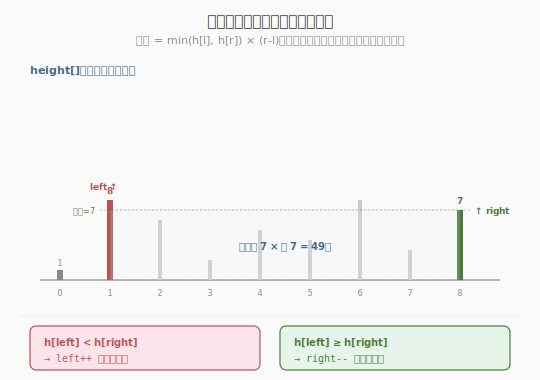
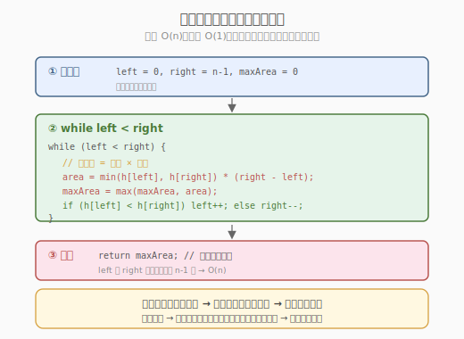
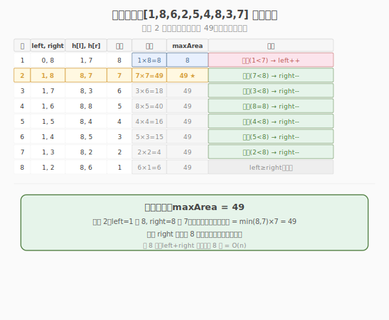

# 盛最多水的容器

- **题目名称**：盛最多水的容器
- **链接**：[11. 盛最多水的容器](https://leetcode.cn/problems/container-with-most-water/)
- **难度**：中等
- **标签**：数组、双指针、贪心

## 1. 题目概述

给定一个长度为 `n` 的整数数组 `height`，有 `n` 条垂线，第 `i` 条线的两个端点是 `(i, 0)` 和 `(i, height[i])`。找出其中的两条线，使得它们与 `x` 轴共同构成的容器可以容纳最多的水。返回容器可以储存的最大水量。

**容器水量** = 两条线之间的**距离** × 两条线中**较矮者**的高度：

$$\text{area} = \min(\text{height}[i], \text{height}[j]) \times (j - i)$$

**示例 1**：

```text
输入：height = [1,8,6,2,5,4,8,3,7]
输出：49
解释：选择第 1 条（高 8）和第 8 条（高 7），距离 7，面积 = min(8,7) × 7 = 49
```

**示例 2**：

```text
输入：height = [1,1]
输出：1
```

**约束条件**：

- `n == height.length`
- `2 <= n <= 10^5`
- `0 <= height[i] <= 10^4`

> 💡 这是 **左右夹逼双指针** 的招牌题。与 [Week2/Day3 三数之和](../../week2/day3/三数之和.md) 的"排序后双指针"不同，本题**无需排序**——双指针从数组两端向中间夹逼。核心贪心思想：每次移动**较矮**的一侧，因为面积由短板决定，移动高侧不可能让面积变大。掌握这个"夹逼 + 贪心"模板，就能秒杀分发糖果、接雨水的双指针解法等同构题。

---

## 2. 解题思路

### 2.1 暴力思路：枚举所有线对

双重循环枚举所有 `(i, j)` 组合，计算 `min(height[i], height[j]) × (j - i)`，取最大值。

```text
for i in 0..n:
    for j in i+1..n:
        area = min(height[i], height[j]) * (j - i)
        max_area = max(max_area, area)
```

时间复杂度 `O(n²)`，`n=10^5` 时约 `10^10` 次运算，**超时**。

> ⚠️ 暴力法的问题：枚举了大量"显然不是最优"的线对。例如 `height = [1, 8, 6, ...]`，左端 `1` 那么矮，它和任何右端配对面积都被 `1` 限制——枚举所有右端是浪费。需要一种方法**跳过不可能更优的组合**。

### 2.2 核心观察：双指针夹逼 + 贪心移动短板

**关键定义**：用 `left` 和 `right` 两个指针分别从数组两端出发，向中间夹逼。

**核心贪心**：每次移动**较矮**一侧的指针。



**为什么移动短板？** 这是本题最关键的问题，分两种情况：

- **移动矮侧**（`height[left] < height[right]`，左移 `left`）：面积由 `height[left]`（短板）决定。如果移动 `right`（高侧），距离变小、短板仍是 `height[left]`（没变），面积只会更小。移动 `left` 虽然距离也变小，但**可能遇到更高的线**使短板变高，面积可能增大。
- **移动高侧**（如果反着移）：距离变小，短板不变（仍是原来的矮侧），面积**必然变小**。所以移动高侧是严格劣解。

> 💡 **一句话证明**：面积 = min(h[l], h[r]) × (r - l)。若 h[l] < h[r]，则面积 = h[l] × (r-l)。固定 l 移动 r（r 减小），距离变小、h[l] 不变 → 面积变小。所以 l 必须移动才有可能让面积变大。这就是"移动短板"的贪心依据。

### 2.3 算法流程图



**完整步骤**：

1. **初始化**：`left = 0`，`right = n - 1`，`max_area = 0`
2. **while left < right**：
   - `area = min(height[left], height[right]) × (right - left)`
   - `max_area = max(max_area, area)`
   - **移动短板**：`if height[left] < height[right]: left++` else `right--`
3. 返回 `max_area`

### 2.4 示例演算

以 `height = [1,8,6,2,5,4,8,3,7]` 为例：



| 步骤 | left | right | h[l] | h[r] | 距离 | 面积 | max_area | 移动 |
|------|------|-------|------|------|------|------|----------|------|
| 1 | 0 (1) | 8 (7) | 1 | 7 | 8 | 1×8=8 | 8 | 左矮→left++ |
| 2 | 1 (8) | 8 (7) | 8 | 7 | 7 | 7×7=49 | 49 | 右矮→right-- |
| 3 | 1 (8) | 7 (3) | 8 | 3 | 6 | 3×6=18 | 49 | 右矮→right-- |
| 4 | 1 (8) | 6 (8) | 8 | 8 | 5 | 8×5=40 | 49 | 相等→right-- |
| 5 | 1 (8) | 5 (4) | 8 | 4 | 4 | 4×4=16 | 49 | 右矮→right-- |
| 6 | 1 (8) | 4 (5) | 8 | 5 | 3 | 5×3=15 | 49 | 右矮→right-- |
| 7 | 1 (8) | 3 (2) | 8 | 2 | 2 | 2×2=4 | 49 | 右矮→right-- |
| 8 | 1 (8) | 2 (6) | 8 | 6 | 1 | 6×1=6 | 49 | — |
| — | left ≥ right，结束 | — | — | — | — | — | 49 | — |

步骤 2 是关键：`left=1`（高 8）、`right=8`（高 7），面积 = `min(8,7)×7 = 49`，这是全局最大。之后 `right--`，虽然距离缩小，但右侧始终比 8 矮，面积只会更小。

> 💡 注意步骤 4：`h[l]==h[r]==8` 时移哪边都行（面积相同），习惯上 `right--`。相等时移动任一侧都不影响正确性——因为面积由短板决定，两侧等高时移任一侧，新短板都 ≤ 当前高度。

---

## 3. 参考代码

### C++

```cpp
// 盛最多水的容器.cpp —— 左右夹逼双指针
// 编译: g++ -O2 -std=c++17 盛最多水的容器.cpp -o container
#include <vector>
#include <algorithm>
using namespace std;

class Solution {
  public:
    int maxArea(vector<int>& height) {
        int left = 0, right = height.size() - 1;
        int maxArea = 0;

        while (left < right) {
            // 面积 = 短板 × 距离
            int area = min(height[left], height[right]) * (right - left);
            maxArea = max(maxArea, area);

            // 移动较矮一侧
            if (height[left] < height[right]) {
                ++left;
            } else {
                --right;
            }
        }
        return maxArea;
    }
};
```

### Python

```python
class Solution:
    def maxArea(self, height: list[int]) -> int:
        left, right = 0, len(height) - 1
        max_area = 0

        while left < right:
            area = min(height[left], height[right]) * (right - left)
            max_area = max(max_area, area)

            if height[left] < height[right]:
                left += 1
            else:
                right -= 1

        return max_area
```

> 💡 代码极简——核心就 5 行：算面积、更新最大、移动短板。双指针题的共同特点：逻辑都在指针移动规则上，代码量极少。

---

## 4. 复杂度分析

| 维度 | 复杂度 | 说明 |
|------|--------|------|
| **时间复杂度** | `O(n)` | `left` 和 `right` 合计最多移动 `n-1` 次 |
| **空间复杂度** | `O(1)` | 只用 3 个变量（left, right, max_area） |

> ⚠️ 双指针从两端向中间夹逼，每次移动 1 步，总共最多 `n-1` 步，所以 `O(n)`。与 [Week2/Day3 三数之和](../../week2/day3/三数之和.md) 的 `O(n²)` 不同——三数之和外层还有枚举 `i` 的 `n` 轮，本题没有外层循环。

---

## 5. 扩展：双指针的两大分支与变体

### 5.1 双指针家族

| 类型 | 指针方向 | 典型题 | 是否需排序 |
|------|---------|--------|-----------|
| **左右夹逼** | 两端→中间 | 本题、接雨水、三数之和 | 三数之和需排序，本题不需要 |
| **快慢指针** | 同向不同速 | 删除倒数第N节点、环形链表 | 否 |
| **滑动窗口** | 同向维护区间 | 无重复最长子串、最小覆盖子串 | 否 |

> 💡 本题的左右夹逼是"**无序数组上的双指针**"——不需要排序，因为面积公式 `min(h[l],h[r])×(r-l)` 的贪心性质与排序无关。而三数之和需要排序是因为要"去重 + 双指针找和"。两种夹逼的本质区别在于贪心依据：本题是"短板决定面积"，三数之和是"单调性决定指针移动"。

### 5.2 相关变体题

| 题目 | 与本题关系 | 核心改动 |
|------|-----------|---------|
| 42 接雨水 | 同为"容器"问题，双指针解法 | 维护 `left_max`/`right_max`，按短板侧累加 |
| 15 三数之和 | 同为双指针，但需排序+去重 | 外层枚举 i + 内层夹逼 |
| 31 下一个排列 | 双指针找第一个下降点 | 从右向左扫，找交换点 |
| 977 有序数组的平方 | 双指针从两端向中间 | 比较 abs 值，从后往前填结果 |

### 5.3 接雨水的双指针解法（对比）

[Week1/Day1 接雨水](../../week1/day1/接雨水.md) 也有双指针解法，与本题形似但神不同：

- **本题**：找两条线使"容器"面积最大 → 移动短板求**全局最大**
- **接雨水**：每个位置的接水量由左右最大值决定 → 移动短板侧**逐个累加**

```python
# 接雨水的双指针解法（对比）
left, right = 0, n - 1
left_max, right_max = 0, 0
water = 0
while left < right:
    if height[left] < height[right]:
        left_max = max(left_max, height[left])
        water += left_max - height[left]   # 逐个累加
        left += 1
    else:
        right_max = max(right_max, height[right])
        water += right_max - height[right]
        right -= 1
```

> 💡 两题都用"移动短板"的贪心，但本题求**最大面积**（取 max），接雨水求**总水量**（累加 sum）。骨架相同，结算逻辑不同。

---

## 6. 面试要点

1. **为什么移动较矮的一侧？能否移动较高的一侧？**

   - 面积 = min(h[l], h[r]) × (r-l)。若 h[l] < h[r]，面积 = h[l] × (r-l)。
   - 移动高侧（r--）：距离变小，短板 h[l] 不变 → 面积**必然变小**，是劣解。
   - 移动矮侧（l++）：距离变小，但可能遇到更高的线使短板变高 → 面积**可能变大**。
   - 所以必须移动矮侧才有可能找到更大面积。这是贪心的正确性保证。

2. **这个贪心为什么不会漏掉最优解？**

   - 假设最优解是 `(l*, r*)`。在夹逼过程中，`left` 和 `right` 一定会先到 `l*` 或 `r*` 之一。
   - 不妨设 `left` 先到 `l*`（即 `left == l*`，`right > r*`）。此时 `h[l*]` 与 `h[right]` 比较：
     - 若 `h[l*] < h[right]`：按规则移动 `left`（即 `l*`），但此时还没到 `r*`，会漏掉 `(l*, r*)`？
     - **不会**！因为 `h[l*] < h[right]` 且 `right > r*`，则面积 = `h[l*] × (right - l*) > h[l*] × (r* - l*)`（距离更大），且 `h[l*] ≤ h[r*]`（最优解的短板），所以 `h[l*] × (right-l*)` ≥ 最优面积——矛盾（最优面积应最大）。因此 `h[l*]` 必须 ≥ `h[right]`，此时移动 `right` 向 `r*` 靠拢，不会漏掉 `(l*, r*)`。
   - 这就是"移动短板不漏解"的严格证明。面试时说清"移动高侧必然劣，所以矮侧移动不会跳过最优"即可。

3. **双指针和暴力比，省在哪里？**

   - 暴力 `O(n²)` 枚举所有线对。双指针 `O(n)` 每步排除一侧。
   - 关键排除：当 `h[l] < h[r]` 时，`l` 与 `[l+1, r-1]` 中任何 `r'` 配对，面积都 ≤ `h[l] × (r-l)`（距离更小、短板不变）——所以 `l` 与这些 `r'` 的组合**全部排除**，一步排除 `r-l-1` 个组合。
   - 双指针的本质是"利用贪心性质批量排除劣解"。

4. **如果 h[l] == h[r]，移哪边？**

   - 移哪边都行，不影响正确性。面积 = `h[l] × (r-l)`，移任一侧后距离变小、新短板 ≤ 当前高度，面积只会更小或相等。
   - 习惯上 `else` 分支 `right--`（代码简洁），但 `left++` 也对。

5. **本题与接雨水的区别？**

   - **盛水容器**：两条线围成一个容器，求最大容量 → 找两条线使 `min(h[i],h[j])×(j-i)` 最大。面积是两条线"共同决定的"。
   - **接雨水**：所有线共同围成凹槽，求总接水量 → 每个位置的接水由其左右最大值决定。水量是"每个位置独立累加"的。
   - 都是双指针 + 移动短板，但一个取 max（最大面积），一个累加 sum（总水量）。

> 💡 **一句话总结**：盛最多水的容器是左右夹逼双指针的招牌题——它用"每次移动短板"的贪心，在 `O(n)` 时间内找到最大面积。核心直觉是"面积由短板决定，移动高侧必然劣，移动矮侧才可能遇到更高的线使面积增大"。与三数之和的"排序双指针"和接雨水的"双指针累加"组成双指针家族的三大范式，是面试必会的核心模板。

---

## 7. 同类练习题
- [11. 盛最多水的容器](https://leetcode.cn/problems/container-with-most-water/)：双指针经典
- [42. 接雨水](https://leetcode.cn/problems/trapping-rain-water/)：双指针/单调栈
- [15. 三数之和](https://leetcode.cn/problems/3sum/)：排序 + 双指针
