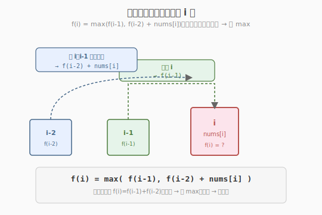
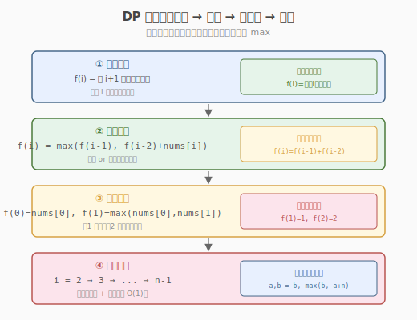
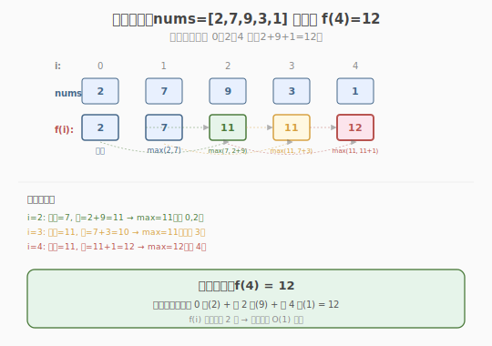

# 打家劫舍

- **题目名称**：打家劫舍
- **链接**：[198. 打家劫舍](https://leetcode.cn/problems/house-robber/)
- **难度**：中等
- **标签**：动态规划

## 1. 题目概述

你是一个专业的小偷，计划沿街偷窃房屋。每间房内都藏有一定的现金，影响你偷窃的唯一制约因素是**相邻的房屋装有相互连通的防盗系统**——如果两间相邻的房屋在同一晚上被小偷闯入，系统会自动报警。

给定一个代表每个房屋存放金额的非负整数数组 `nums`，计算**不触动警报装置**的情况下，一夜之内能够偷窃到的最高金额。

**示例 1**：

```text
输入：nums = [1,2,3,1]
输出：4
解释：偷第 0 家（1）+ 第 2 家（3）= 4，最高。
     偷第 0+1 家会报警（相邻），偷第 1+2 家也报警。
```

**示例 2**：

```text
输入：nums = [2,7,9,3,1]
输出：12
解释：偷第 0 家（2）+ 第 2 家（9）+ 第 4 家（1）= 12，最高。
```

**约束条件**：

- `1 <= nums.length <= 100`
- `0 <= nums[i] <= 400`

> 💡 这是 **一维 DP** 的进阶题，与 [Week2/Day2 爬楼梯](../../week2/day2/爬楼梯.md) 同骨架——都是 `f(i)` 依赖前 1-2 个状态。区别在于爬楼梯的转移是"加法"（计数），打家劫舍的转移是"**取 max**"（最优化）。掌握爬楼梯后，本题只需把转移方程从 `f(i)=f(i-1)+f(i-2)` 改成 `f(i)=max(f(i-1), f(i-2)+nums[i])`，是理解"DP 最优化"的过渡题。

---

## 2. 解题思路

### 2.1 暴力思路：枚举所有偷法

把每间房看作"偷/不偷"的决策，用 DFS 枚举所有合法组合（不相邻），取最大和。

```text
dfs(i, prev_robbed):
    if i == n: return 0
    # 不偷 i
    best = dfs(i+1, false)
    # 偷 i（前提：prev 没偷）
    if not prev_robbed:
        best = max(best, nums[i] + dfs(i+1, true))
    return best
```

时间复杂度 `O(2^n)`（每间房二选一），`n=100` 时约 `10^30`，**严重超时**。

> ⚠️ 暴力法的问题：**重复子问题**——`dfs(i, ...)` 在不同路径中被反复计算。例如 `dfs(3)` 可能从"偷0不偷1不偷2"和"不偷0偷1不偷2"两条路径都到达。`n` 越大重复越严重。这正是动态规划出场的时候。

### 2.2 核心观察：状态转移方程

**关键定义**：设 `f(i)` = 考虑前 `i+1` 间房（下标 `0..i`）能偷到的最高金额。

**核心思考**：对第 `i` 间房，只有两种选择——

- **不偷 `i`**：前 `i+1` 间房的最优 = 前 `i` 间房的最优，即 `f(i-1)`
- **偷 `i`**：则第 `i-1` 间不能偷（相邻报警），前 `i+1` 间房的最优 = 前 `i-1` 间房的最优 + `nums[i]`，即 `f(i-2) + nums[i]`

取两者较大值：

$$f(i) = \max\big(f(i-1),\ f(i-2) + \text{nums}[i]\big)$$



> 💡 **对比爬楼梯**：爬楼梯 `f(i)=f(i-1)+f(i-2)` 是**加法**（两种方案数相加）；打家劫舍 `f(i)=max(f(i-1), f(i-2)+nums[i])` 是**取 max**（两种选择取更优）。骨架完全相同，只是运算从"计数"变成"最优化"。这是从"计数 DP"到"最优化 DP"的关键一步。

### 2.3 算法流程图



**四步法**（所有 DP 题通用）：

1. **状态定义**：`f(i)` = 考虑前 `i+1` 间房能偷到的最高金额
2. **转移方程**：`f(i) = max(f(i-1), f(i-2) + nums[i])`
3. **初始条件**：`f(0) = nums[0]`（只有 1 间，必偷）；`f(1) = max(nums[0], nums[1])`（2 间偷较多者）
4. **计算顺序**：从 `i=2` 到 `i=n-1`，**自底向上**

### 2.4 示例演算

以 `nums = [2,7,9,3,1]` 为例：



| i | nums[i] | f(i-2) | f(i-1) | 不偷 i: f(i-1) | 偷 i: f(i-2)+nums[i] | f(i) = max | 说明 |
|---|---------|--------|--------|---------------|---------------------|------------|------|
| 0 | 2 | — | — | — | — | **2** | 初值：只有 1 间，偷 |
| 1 | 7 | — | — | — | — | **7** | 初值：max(2,7)=7 |
| 2 | 9 | f(0)=2 | f(1)=7 | 7 | 2+9=11 | **11** | 偷 0+2 = 11 > 不偷=7 |
| 3 | 3 | f(1)=7 | f(2)=11 | 11 | 7+3=10 | **11** | 不偷 3（11>10） |
| 4 | 1 | f(2)=11 | f(3)=11 | 11 | 11+1=12 | **12** | 偷 4（12>11） |

最终 `f(4) = 12`，对应偷第 0、2、4 家（2+9+1=12）。

> 💡 注意 `f(i)` 只依赖 `f(i-1)` 和 `f(i-2)`，**不需要存整个数组**——用两个变量滚动即可（见 3.1 滚动数组）。这与爬楼梯的优化完全一致。

---

## 3. 参考代码

### C++

```cpp
// 打家劫舍.cpp —— 一维 DP + 滚动数组
// 编译: g++ -O2 -std=c++17 打家劫舍.cpp -o rob
#include <vector>
#include <algorithm>
using namespace std;

// 版本 1：标准一维 DP（O(n) 空间）
class Solution {
  public:
    int rob(vector<int>& nums) {
        int n = nums.size();
        if (n == 1)
            return nums[0];
        vector<int> f(n);
        f[0] = nums[0];
        f[1] = max(nums[0], nums[1]);
        for (int i = 2; i < n; ++i)
            f[i] = max(f[i - 1], f[i - 2] + nums[i]);
        return f[n - 1];
    }
};

// 版本 2：滚动数组优化（O(1) 空间，推荐）
class Solution2 {
  public:
    int rob(vector<int>& nums) {
        int n = nums.size();
        if (n == 1)
            return nums[0];
        int prev2 = nums[0];               // f(i-2)，初值 f(0)
        int prev1 = max(nums[0], nums[1]); // f(i-1)，初值 f(1)
        for (int i = 2; i < n; ++i) {
            int cur = max(prev1, prev2 + nums[i]); // f(i) = max(f(i-1), f(i-2)+nums[i])
            prev2 = prev1;                         // 滚动
            prev1 = cur;
        }
        return prev1;
    }
};
```

### Python

```python
class Solution:
    def rob(self, nums: list[int]) -> int:
        n = len(nums)
        if n == 1:
            return nums[0]
        prev2, prev1 = nums[0], max(nums[0], nums[1])   # f(0), f(1)
        for i in range(2, n):
            prev2, prev1 = prev1, max(prev1, prev2 + nums[i])  # 滚动
        return prev1
```

> 💡 Python 的 `a, b = b, max(b, a+nums[i])` 是同时赋值，无需临时变量。与爬楼梯的 `a, b = b, a+b` 写法结构完全相同，只是 `a+b` 换成 `max(b, a+nums[i])`。

---

## 4. 复杂度分析

| 维度 | 复杂度 | 说明 |
|------|--------|------|
| **时间复杂度** | `O(n)` | 单层循环，`n-2` 次比较 |
| **空间复杂度（标准 DP）** | `O(n)` | `f` 数组长度 `n` |
| **空间复杂度（滚动数组）** | `O(1)` | 只用 2 个变量 `prev1/prev2` |

---

## 5. 扩展：打家劫舍变体与 DP 进阶

### 5.1 打家劫舍系列

| 题目 | 与本题差异 | 核心改动 |
|------|-----------|---------|
| 213 打家劫舍 II | 房屋排成**环形**（首尾相邻） | 分两次：偷[0..n-2] 和 偷[1..n-1]，取 max |
| 337 打家劫舍 III | 房屋排成**二叉树** | 树形 DP：后序遍历，返回 (偷, 不偷) 两值 |
| 2560 打家劫舍 IV | 限制最多偷 k 间 | 二分 + 贪心判定 |

### 5.2 213 环形打家劫舍（经典变体）

首尾相邻后，第 0 间和第 n-1 间不能同时偷。破局：**分两种情况**取 max：

- 情况 A：偷第 0 间 → 第 n-1 间不能偷 → 在 `[0, n-2]` 上做线性打家劫舍
- 情况 B：不偷第 0 间 → 在 `[1, n-1]` 上做线性打家劫舍

两种情况各自调用本题的 `rob` 函数，取 max。这是"**拆环为线**"的经典技巧。

### 5.3 337 树形打家劫舍（进阶）

房屋排成二叉树，相邻父子不能同时偷。用**后序 DFS**，每个节点返回 `(偷该节点的最大值, 不偷该节点的最大值)`：

```python
def dfs(node):
    if not node: return (0, 0)
    left = dfs(node.left)
    right = dfs(node.right)
    rob = node.val + left[1] + right[1]           # 偷本节点，子节点不能偷
    not_rob = max(left) + max(right)               # 不偷本节点，子节点随意
    return (rob, not_rob)
return max(dfs(root))
```

> 💡 树形 DP 的通用模式：后序遍历，每个节点返回"选/不选"两个状态，父节点根据子节点状态转移。本题是树形 DP 的入门模板。

### 5.4 与爬楼梯的骨架对比

| 维度 | 爬楼梯（70） | 打家劫舍（198） |
|------|------------|----------------|
| 状态定义 | f(i) = 到第 i 阶的方法数 | f(i) = 前 i+1 间房最高金额 |
| 转移方程 | f(i) = f(i-1) + f(i-2) | f(i) = max(f(i-1), f(i-2)+nums[i]) |
| 运算 | 加法（计数） | 取 max（最优化） |
| 初始条件 | f(1)=1, f(2)=2 | f(0)=nums[0], f(1)=max(nums[0],nums[1]) |
| 滚动数组 | prev2, prev1 = prev1, prev1+prev2 | prev2, prev1 = prev1, max(prev1, prev2+nums[i]) |
| 空间 | O(1) | O(1) |

> 💡 两题的**骨架完全相同**——都是 `f(i)` 依赖前 1-2 个状态，用两个变量滚动。差别只在转移方程的"运算"和"初始值"。这是线性 DP 的通用范式：**定义状态 → 写转移 → 定初值 → 滚动优化**。

---

## 6. 面试要点

1. **为什么这题是 DP 而不是贪心？**

   - 贪心要求"局部最优 → 全局最优"且无后效性。本题若用贪心（"每步偷能偷的最大"），可能在 `[2,1,1,2]` 上选 2+1=3 而非最优的 2+2=4——局部贪心会错过更优的全局解。
   - DP 适用条件：**最优子结构** + **重叠子问题**。`f(i)` 由 `f(i-1)` 和 `f(i-2)` 最优推出（最优子结构），且 `f(i)` 在不同路径被重复计算（重叠子问题）。
   - 本题的"选择"（偷/不偷）有后效性（偷了 i 则 i-1 不能偷），但通过状态定义 `f(i)`（前 i+1 间最优）巧妙消除了后效性——`f(i)` 只依赖前两个状态，不关心"i-1 是否被偷"的具体情况，而是把两种可能都编码进 `max(f(i-1), f(i-2)+nums[i])`。

2. **`f(0)=nums[0]` 还是 `f(0)=0`？两种定义都对吗？**

   - 两种定义都行，但转移方程和初值要自洽：
     - 定义 `f(i)` = 前 `i+1` 间最优：`f(0)=nums[0]`（必偷），`f(1)=max(nums[0],nums[1])`
     - 定义 `f(i)` = 前 `i` 间最优（i 从 0 表示"前 0 间"）：`f(0)=0`，`f(1)=nums[0]`，转移 `f(i)=max(f(i-1), f(i-2)+nums[i-1])`
   - 面试时说清自己的定义即可。本题用第一种更直观（下标与 nums 对齐）。

3. **为什么滚动数组能省到 O(1) 空间？**

   - `f(i)` 只依赖 `f(i-1)` 和 `f(i-2)`，更早的状态不再被引用。
   - 用 `prev1`（存 `f(i-1)`）和 `prev2`（存 `f(i-2)`）滚动，每轮更新。这是"无后效性"的直接体现——未来只依赖最近的历史。
   - 与爬楼梯的滚动优化原理完全相同。

4. **环形变体（213）怎么处理首尾相邻？**

   - 关键：第 0 间和第 n-1 间不能同时偷。拆成两种情况：
     - 偷 0 → 在 `[0, n-2]` 上做线性 DP（第 n-1 间排除）
     - 不偷 0 → 在 `[1, n-1]` 上做线性 DP（第 0 间排除）
   - 两种情况各调用一次 `rob`，取 max。这是"拆环为线"的标准技巧，也见于环形房屋、环形数组等问题。

5. **如果允许偷不相邻的 k 间（限制数量），怎么做？**

   - 退化为"至多偷 k 间的最高金额"——需二维 DP `f(i, j)` = 前 i 间偷 j 间的最高金额。转移 `f(i,j) = max(f(i-1,j), f(i-2,j-1)+nums[i])`。
   - 这是 2560 打家劫舍 IV 的思路（配合二分优化）。本题无数量限制，一维即可。

> 💡 **一句话总结**：打家劫舍是"最优化 DP"的入门题——它把爬楼梯的"加法计数"升级为"取 max 最优化"，骨架相同（`f(i)` 依赖前 1-2 个状态 + 滚动数组），只是转移方程从 `f(i-1)+f(i-2)` 变成 `max(f(i-1), f(i-2)+nums[i])`。掌握它，你就理解了所有"选/不选"类线性 DP（最小花费爬楼梯、解码方法等），并能自然迁移到环形（拆环为线）和树形（后序 DFS 返回两状态）变体。
