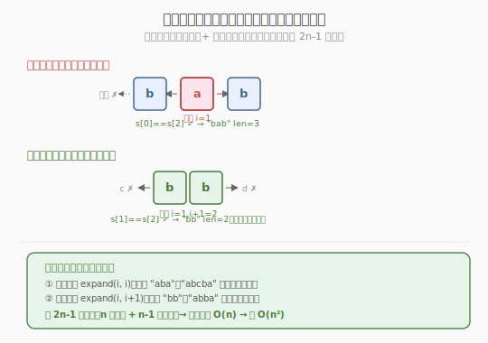
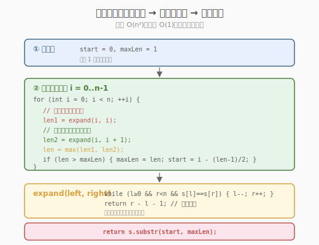
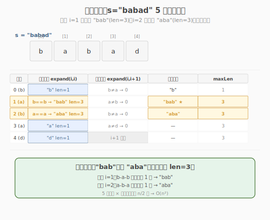

# 最长回文子串

- **题目名称**：最长回文子串
- **链接**：[5. 最长回文子串](https://leetcode.cn/problems/longest-palindromic-substring/)
- **难度**：中等
- **标签**：字符串、动态规划、中心扩展

## 1. 题目概述

给定一个字符串 `s`，找到 `s` 中最长的**回文子串**。回文串是正读和反读都相同的字符串。

**示例 1**：

```text
输入：s = "babad"
输出："bab"
解释："aba" 同样是有效答案（任选一个最长回文子串）。
```

**示例 2**：

```text
输入：s = "cbbd"
输出："bb"
解释：最长回文子串是 "bb"（偶数长度回文）。
```

**约束条件**：

- `1 <= s.length <= 1000`
- `s` 仅由数字和英文字母组成

> 💡 这是**中心扩展法**的招牌题。回文串的天然性质是"**从中心向两端对称**"——以每个位置（或相邻两位置）为中心向外扩展，就能找到所有回文。与 [Week1/Day3 无重复最长子串](../../week1/day3/无重复字符的最长子串.md) 的滑动窗口不同，回文问题的"对称性"决定了它适合中心扩展而非窗口。掌握"枚举中心 + 双指针扩展"的模板，就能秒杀回文计数、回文分割等同构题。

---

## 2. 解题思路

### 2.1 暴力思路：枚举所有子串判断回文

双重循环枚举所有子串 `s[i..j]`，逐个判断是否回文（反转后比较），取最长者。

```text
for i in 0..n:
    for j in i..n:
        if s[i..j] 是回文 and j-i+1 > max_len:
            更新最长
```

时间复杂度 `O(n³)`（`O(n²)` 个子串 × `O(n)` 判断回文），`n=1000` 时约 `10^9`，**超时**。

> ⚠️ 暴力法的问题：**重复判断**——`s[i..j]` 是回文的判断与 `s[i+1..j-1]` 高度相关（回文的子串也是回文），但暴力每次从头比较。需要利用回文的"对称性"避免重复。

### 2.2 核心观察：回文从中心对称扩展

**关键性质**：回文串以中心为轴对称。如果 `s[i+1..j-1]` 是回文且 `s[i] == s[j]`，则 `s[i..j]` 也是回文。

**中心扩展法**：枚举每个可能的"中心"，用双指针向两端扩展，直到不对称为止。



**两种中心**：

- **奇数长度回文**：中心是单个字符，如 `"aba"` 以 `b` 为中心
- **偶数长度回文**：中心是两个相邻字符之间，如 `"abba"` 以两个 `b` 之间为中心

字符串长度 `n`，共有 `2n-1` 个中心（`n` 个字符中心 + `n-1` 个间隙中心）。

> 💡 **为什么要考虑两种中心？** 如果只枚举字符中心，会漏掉所有偶数长度回文（如 `"cbbd"` 的 `"bb"`）。偶数回文的中心不在任何字符上，而在两个字符"之间"。把"间隙"也当作中心，`2n-1` 个中心就能覆盖所有回文。

### 2.3 算法流程图



**完整步骤**：

1. **初始化**：`start = 0, max_len = 1`（至少 1 个字符是回文）
2. **枚举中心 `i` 从 0 到 n-1**：
   - **奇数中心**：`left = i, right = i`，向两端扩展
   - **偶数中心**：`left = i, right = i+1`，向两端扩展
   - 扩展函数 `expand(left, right)`：`while left >= 0 且 right < n 且 s[left] == s[right]`：`left--, right++`。返回最长回文长度 `right - left - 1`
   - 若扩展长度 > `max_len`：更新 `max_len` 和 `start`
3. 返回 `s[start : start + max_len]`

### 2.4 示例演算

以 `s = "babad"` 为例：



| 中心 i | 奇数扩展 | 偶数扩展 | 最长回文 | max_len 更新 |
|--------|---------|---------|---------|-------------|
| 0 (b) | "b" (len=1) | "ba" 不对称 → 0 | "b" | 1（初始） |
| 1 (a) | b-a-b → "bab" (len=3) | a-b 不对称 → 0 | "bab" | 3 ★ |
| 2 (b) | a-b-a → "aba" (len=3) | b-a 不对称 → 0 | "aba" | 3（并列） |
| 3 (a) | "a" (len=1) | a-d 不对称 → 0 | — | 3 |
| 4 (d) | "d" (len=1) | —（i+1 越界） | — | 3 |

中心 `i=1`（字符 `a`）扩展出 `"bab"`（len=3），中心 `i=2`（字符 `b`）扩展出 `"aba"`（len=3），两者并列最长。最终返回 `"bab"`（先找到的）或 `"aba"`（任选一个）。

> 💡 注意中心 `i=1` 的奇数扩展过程：`left=right=1`（`a`），先 `s[0]==s[2]`（`b==b` ✓）扩展到 `"bab"`，再 `s[-1]` 越界停止。共扩展 1 步，回文长度 = `2×1+1 = 3`。

---

## 3. 参考代码

### C++

```cpp
// 最长回文子串.cpp —— 中心扩展法
// 编译: g++ -O2 -std=c++17 最长回文子串.cpp -o palindrome
#include <string>
using namespace std;

class Solution {
  public:
    string longestPalindrome(string s) {
        int n = s.size();
        if (n < 2)
            return s;

        int start = 0, maxLen = 1;

        // 中心扩展函数：返回以 (left, right) 为中心的最长回文长度
        auto expand = [&](int left, int right) -> int {
            while (left >= 0 && right < n && s[left] == s[right]) {
                --left;
                ++right;
            }
            // 循环结束时 s[left] != s[right] 或越界，回文长度 = right - left - 1
            return right - left - 1;
        };

        for (int i = 0; i < n; ++i) {
            // 奇数中心（单字符）
            int len1 = expand(i, i);
            // 偶数中心（双字符间隙）
            int len2 = expand(i, i + 1);
            int len = max(len1, len2);

            if (len > maxLen) {
                maxLen = len;
                // 由中心位置 i 和长度 len 反推起点
                start = i - (len - 1) / 2;
            }
        }
        return s.substr(start, maxLen);
    }
};
```

### Python

```python
class Solution:
    def longestPalindrome(self, s: str) -> str:
        n = len(s)
        if n < 2:
            return s

        start, max_len = 0, 1

        def expand(left: int, right: int) -> int:
            while left >= 0 and right < n and s[left] == s[right]:
                left -= 1
                right += 1
            return right - left - 1   # 回文长度

        for i in range(n):
            len1 = expand(i, i)        # 奇数中心
            len2 = expand(i, i + 1)    # 偶数中心
            length = max(len1, len2)

            if length > max_len:
                max_len = length
                start = i - (length - 1) // 2

        return s[start:start + max_len]
```

> 💡 **起点反推公式** `start = i - (len - 1) // 2`：回文以 `i` 为中心，长度 `len`。奇数时 `len=2k+1`，起点 `i-k = i - len//2`；偶数时 `len=2k`，中心在 `i` 和 `i+1` 之间，起点 `i-k+1 = i - (len-1)//2`。统一用 `(len-1)//2` 兼容两种情况。

---

## 4. 复杂度分析

| 维度 | 中心扩展 | 动态规划 | Manacher |
|------|---------|---------|----------|
| **时间复杂度** | `O(n²)` | `O(n²)` | `O(n)` |
| **空间复杂度** | `O(1)` | `O(n²)` | `O(n)` |
| **推荐度** | ✅ 面试首选 | 易理解但空间大 | 竞赛级，面试少考 |

> ⚠️ 中心扩展 `O(n²)`：共 `2n-1` 个中心，每个最多扩展 `n/2` 步，总 `O(n²)`。但空间 `O(1)`（只用几个变量），优于 DP 的 `O(n²)` 空间。面试首选中心扩展。

---

## 5. 扩展：Manacher 算法与变体

### 5.1 Manacher 算法（O(n) 进阶）

中心扩展的瓶颈：不同中心的扩展有**重复比较**。Manacher 算法利用回文的对称性，用已知的回文半径**跳过已覆盖区域**，把 `O(n²)` 降到 `O(n)`。

核心思想：维护当前最右回文 `R` 及其中心 `C`。若新中心 `i` 在 `R` 内，其回文半径至少等于对称点 `i' = 2C - i` 的半径（被 `R` 覆盖部分无需重新比较），只需从 `R` 之后继续扩展。

```text
# Manacher 核心骨架（省略预处理）
for i in 1..2n:
    if i < R:
        P[i] = min(P[i'], R - i)   # 利用对称性跳过
    while s[i - P[i] - 1] == s[i + P[i] + 1]:   # 继续扩展
        P[i] += 1
    if i + P[i] > R:               # 更新最右回文
        C, R = i, i + P[i]
```

> ⚠️ Manacher 是竞赛级算法，面试极少要求手写。但知道它的存在和 `O(n)` 复杂度是加分项。本题 `n ≤ 1000`，`O(n²)` 完全够用。

### 5.2 相关变体题

| 题目 | 与本题关系 | 核心改动 |
|------|-----------|---------|
| 647 回文子串 | 找最长 → 数回文总数 | 每次扩展成功时计数 +1 |
| 131 分割回文串 | 找最长 → 分割成全回文 | 回溯 + 中心扩展判断 |
| 214 最短回文串 | 找最长 → 前面补字符使整体回文 | KMP 或中心扩展找前缀回文 |
| 1216 有效回文串 III | 最长 → 最多删 k 个仍回文 | 区间 DP |

### 5.3 647 回文子串（计数变体）

把"取 max"改成"累加计数"——每次中心扩展成功一步就 +1：

```python
count = 0
for i in range(n):
    # 奇数中心：expand(i, i)，每扩展 1 步 count += 1
    # 偶数中心：expand(i, i+1)，同理
```

> 💡 647 和本题的骨架完全相同——都是枚举 `2n-1` 个中心向外扩展。区别只在结算：本题取 max（最长），647 累加 count（总数）。与 [Week1/Day1 接雨水](../../week1/day1/接雨水.md) vs [Day1 盛水容器](../day1/盛最多水的容器.md) 的"累加 vs 取 max"对照如出一辙。

---

## 6. 面试要点

1. **为什么用中心扩展而不是滑动窗口？**

   - 滑动窗口适合"满足某条件的连续区间"（如无重复字符）。回文串的"条件"是对称性——窗口收缩时无法判断"是否回文"（回文依赖两端比较，不是窗口内属性）。
   - 中心扩展天然利用回文的"从中心对称"性质：确定中心后只需向两端比较，逻辑清晰。
   - 回文问题也有 DP 解法（`dp[i][j]` 表示 `s[i..j]` 是否回文），但空间 `O(n²)`，且不如中心扩展直观。

2. **为什么要考虑偶数长度中心？漏掉会怎样？**

   - 只枚举字符中心（奇数）会漏掉所有偶数长度回文，如 `"cbbd"` 的 `"bb"`——`b` 和 `b` 之间没有字符，中心是"间隙"。
   - 把间隙也当中心（`expand(i, i+1)`），共 `2n-1` 个中心，覆盖所有回文。
   - 这是本题最易错的点。面试时常被追问"偶数回文怎么处理"。

3. **`start = i - (len-1)//2` 这个公式怎么来的？**

   - 回文以 `i` 为中心，长度 `len`。需反推起点。
   - 奇数 `len=2k+1`：起点 `i - k = i - len//2`（`len//2 = (len-1)//2`）。
   - 偶数 `len=2k`：中心在 `i` 和 `i+1` 之间，起点 `i - k + 1 = i - (len-2)/2 = i - (len-1)//2`（整数除法 `(len-1)//2 = k-1`）。
   - 统一公式 `i - (len-1)//2` 兼容两种。也可分别处理奇偶，但统一更简洁。

4. **中心扩展和 DP 哪个更好？**

   - **中心扩展**：时间 `O(n²)`，空间 `O(1)`，代码简洁。面试首选。
   - **DP**：`dp[i][j]` 表示 `s[i..j]` 是否回文，`dp[i][j] = dp[i+1][j-1] && s[i]==s[j]`。时间 `O(n²)`，空间 `O(n²)`。理解 DP 思路有助于面试讲解，但写代码选中心扩展。
   - **Manacher**：`O(n)`，但复杂度高，面试极少要求手写。知道 `O(n)` 存在即可。

5. **时间复杂度为什么是 O(n²)？**

   - 共 `2n-1` 个中心（`n` 个奇数 + `n-1` 个偶数）。
   - 每个中心最多扩展 `n/2` 步（到字符串两端）。
   - 总操作 `O(n × n) = O(n²)`。最坏情况如 `"aaaaa"`（全相同字符），每个中心都扩展到两端。
   - 但平均情况远好于 `O(n²)`——随机字符串的回文很短，扩展很快停止。

> 💡 **一句话总结**：最长回文子串是中心扩展法的招牌题——它利用回文"从中心对称"的性质，枚举 `2n-1` 个中心（含字符和间隙，覆盖奇偶两种回文），用双指针向外扩展找最长。时间 `O(n²)`、空间 `O(1)`，是面试首选解法。与滑动窗口（处理"区间条件"）和 DP（处理"子问题依赖"）形成对比——回文问题的"对称性"决定了它最适合中心扩展。掌握这个模板，就能迁移到回文计数（647）、回文分割（131）等所有回文类问题。
