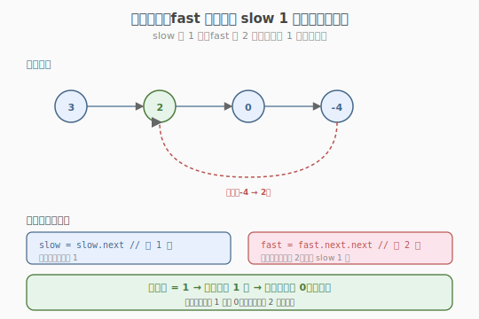
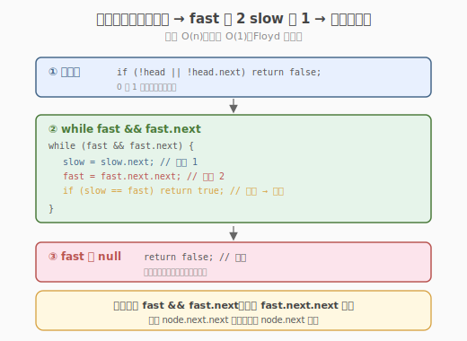
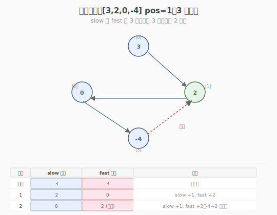

# 环形链表

- **题目名称**：环形链表
- **链接**：[141. 环形链表](https://leetcode.cn/problems/linked-list-cycle/)
- **难度**：简单
- **标签**：链表、双指针

## 1. 题目概述

给定一个链表的头节点 `head`，判断链表中是否有环。如果链表中存在环，则返回 `true`；否则返回 `false`。

**环的定义**：链表中某个节点的 `next` 指针通过再次跟踪，可以再次到达该节点。即链表尾部不会指向 `null`，而是指向链表中的某个节点。

**示例 1**：

```text
输入：head = [3,2,0,-4], pos = 1
输出：true
解释：链表中有一个环，其尾部连接到第二个节点（下标 1，节点值 2）。

  3 → 2 → 0 → -4
      ↑___________↓
```

**示例 2**：

```text
输入：head = [1,2], pos = 0
输出：true
解释：链表中有一个环，其尾部连接到第一个节点。

  1 → 2
  ↑___↓
```

**示例 3**：

```text
输入：head = [1], pos = -1
输出：false
解释：链表中没有环。

  1 → null
```

**约束条件**：

- 链表中节点数范围是 `[0, 10^4]`
- `-10^5 <= Node.val <= 10^5`
- `pos` 为 `-1` 或者链表中的一个有效下标（仅用于标识环的位置，不作为参数传入）
- **进阶**：你能用 `O(1)` 空间解决吗？

> 💡 这是 **快慢指针（Floyd 判圈法）** 的招牌题。与 [Week2/Day4 合并有序链表](../../week2/day4/合并两个有序链表.md) 的双指针"两路归并"不同，快慢指针是"**同一路径上不同速**"——慢指针走 1 步、快指针走 2 步，若有环快指针终会追上慢指针。这是"追及问题"在链表上的经典应用，也是 [142 环形链表 II](https://leetcode.cn/problems/linked-list-cycle-ii/)（找环入口）的前置题。

---

## 2. 解题思路

### 2.1 暴力思路：哈希表记录访问过的节点

遍历链表，用哈希集合记录每个访问过的节点。若某节点已在集合中 → 有环；若到达 `null` → 无环。

```text
visited = set()
while node:
    if node in visited: return true
    visited.add(node)
    node = node.next
return false
```

时间 `O(n)`，空间 `O(n)`（哈希集合存所有节点）。能过，但**不满足进阶的 `O(1)` 空间要求**。

> ⚠️ 哈希表法的瓶颈：需要 `O(n)` 额外空间。进阶要求 `O(1)` 空间，必须用**快慢指针**——无需记录历史，靠"追及"判断有环。

### 2.2 核心观察：快慢指针追及

**关键定义**：慢指针 `slow` 每次走 1 步，快指针 `fast` 每次走 2 步。两者从 `head` 同时出发。

**核心性质**：

- **无环**：`fast` 先到达 `null`（快指针走得快，先到尾部），返回 `false`。
- **有环**：`fast` 和 `slow` 都进入环后，由于速度差（每轮差距 1 步），`fast` **终会追上** `slow`（相遇），返回 `true`。



**为什么一定会相遇？** 这是本题最关键的问题：

- 假设 `slow` 已进入环，`fast` 也在环中。设某时刻两者距离为 `d`（沿环的前进方向）。
- 每走一轮：`slow` 前进 1，`fast` 前进 2，距离变为 `d + 1`（`fast` 多走 1 步）……但这是"相对距离"——实际上 `fast` 每轮**追近** `slow` 1 步（距离 `d` 每轮减 1）。
- 当 `d` 减到 0 时，两者相遇。因为环长度有限，`d` 必然在有限步内减到 0。

> 💡 **追近而非拉远**：关键在于 `fast` 比 `slow` 快，所以 `fast` 从后面追赶 `slow`。每轮距离减 1，无论环多大多小，`fast` 必在有限步内追上。这与"龟兔赛跑"同构——兔子（快）在环形跑道上终会追上乌龟（慢）。

### 2.3 算法流程图



**完整步骤**：

1. **特判**：`head == null` 或 `head.next == null` → 无环（0 或 1 个节点不可能有环）
2. **初始化**：`slow = head`，`fast = head`
3. **while fast && fast.next**（fast 能走 2 步）：
   - `slow = slow.next`（走 1 步）
   - `fast = fast.next.next`（走 2 步）
   - `if slow == fast`：**相遇 → 有环**，返回 `true`
4. **fast 到达 null**：无环，返回 `false`

> ⚠️ 循环条件是 `fast && fast.next`——因为 `fast` 每次走 2 步（`fast.next.next`），需保证 `fast` 和 `fast.next` 都非 null。若 `fast.next` 为 null，说明链表尾部是奇数个节点，`fast` 刚好到尾。

### 2.4 示例演算

以 `head = [3,2,0,-4]`（pos=1，`-4 → 2` 成环）为例：



| 步骤 | slow 位置 | fast 位置 | 说明 |
|------|----------|----------|------|
| 初始 | 3 | 3 | 同起点 |
| 1 | 2 | 0 | slow +1，fast +2 |
| 2 | 0 | 2（环回） | slow +1，fast +2（-4→2） |
| 3 | 2（环回） | 2 | slow +1（-4→2），fast +2（0→-4→2）→ **相遇！** |

步骤 3 时 `slow == fast == 2`，返回 `true`。

> 💡 注意步骤 2 和 3 的"环回"：`-4` 的 `next` 指向 `2`（pos=1）。fast 从 `0` 走 2 步：`0 → -4 → 2`（环回）。slow 从 `0` 走 1 步：`0 → -4`，再到 `2`。两者在节点 `2` 相遇。

---

## 3. 参考代码

### C++

```cpp
// 环形链表.cpp —— 快慢指针（Floyd 判圈法）
// 编译: g++ -O2 -std=c++17 环形链表.cpp -o cycle
struct ListNode {
    int val;
    ListNode* next;
    ListNode(int x) : val(x), next(nullptr) {
    }
};

class Solution {
  public:
    bool hasCycle(ListNode* head) {
        if (head == nullptr || head->next == nullptr)
            return false;

        ListNode* slow = head;
        ListNode* fast = head;

        while (fast != nullptr && fast->next != nullptr) {
            slow = slow->next;       // 慢指针走 1 步
            fast = fast->next->next; // 快指针走 2 步
            if (slow == fast) {
                return true; // 相遇 → 有环
            }
        }
        return false; // fast 到 null → 无环
    }
};
```

### Python

```python
class Solution:
    def hasCycle(self, head: ListNode | None) -> bool:
        if not head or not head.next:
            return False

        slow = fast = head
        while fast and fast.next:
            slow = slow.next           # 慢 1 步
            fast = fast.next.next      # 快 2 步
            if slow is fast:           # 注意用 is 判断节点身份（不是值）
                return True
        return False
```

> 💡 Python 用 `is` 而非 `==` 判断节点是否相同——`==` 默认比较值，`is` 比较对象身份（内存地址）。链表题判断"是否同一节点"必须用 `is`，否则两个值相同的不同节点会被误判为相等。

---

## 4. 复杂度分析

| 维度 | 快慢指针 | 哈希表 |
|------|---------|--------|
| **时间复杂度** | `O(n)` | `O(n)` |
| **空间复杂度** | **`O(1)`** | `O(n)` |
| **满足进阶** | ✅ | ✗ |

> ⚠️ 快慢指针时间 `O(n)` 的证明：无环时 `fast` 最多走 `n/2` 步到尾；有环时 `slow` 进入环后，`fast` 最多再走环长 `L` 步追上（每轮追近 1 步），总步数 `O(n)`。

---

## 5. 扩展：Floyd 判圈法的通用性

### 5.1 142 环形链表 II（找环入口）

[142 题](https://leetcode.cn/problems/linked-list-cycle-ii/) 在 141 基础上要求返回**环的入口节点**。Floyd 判圈法可扩展解决：

1. **第一阶段（同 141）**：快慢指针找到相遇点
2. **第二阶段**：将一个指针重置到 `head`，两指针都改为每次走 1 步，再次相遇点即**环入口**

**数学证明**：设头到入口距离 `a`，入口到相遇点 `b`，相遇点到入口 `c`（环长 `b+c`）。相遇时 `fast` 走了 `a + b + k(b+c)`，`slow` 走了 `a + b`。因 `fast` 是 `slow` 的 2 倍速：`2(a+b) = a + b + k(b+c)` → `a = (k-1)(b+c) + c`。即从 head 走 `a` 步 = 从相遇点走 `c + (k-1) 圈`，两者在入口相遇。

```python
# 142 题核心（在 141 相遇后追加）
slow = head               # 重置到头
while slow != fast:       # 都走 1 步
    slow = slow.next
    fast = fast.next
return slow               # 再次相遇 = 环入口
```

### 5.2 Floyd 判圈法的其他应用

Floyd 判圈法不仅用于链表，还适用于所有"**序列是否重复**"问题：

| 问题 | 序列 | 快慢指针 |
|------|------|---------|
| 141 环形链表 | 链表节点序列 | 链表 next 指针 |
| 202 快乐数 | 数位平方和序列 | `f(x)` 函数迭代 |
| 287 寻找重复数 | 数组下标序列 | `nums[i]` 当作 next |

### 5.3 287 寻找重复数（经典迁移）

数组 `nums` 长度 `n+1`，元素范围 `[1, n]`，有且仅有一个重复数。把 `nums[i]` 当作"next 指针"（`i → nums[i]`），数组变成一个"链表"，重复数导致**环**。用 Floyd 判圈法找环入口 = 重复数。

> 💡 这是 Floyd 判圈法最巧妙的迁移——把数组下标当成链表指针，"寻找重复数"变成"找环入口"。与 141/142 的链表快慢指针完全同构，只是"next"从 `node.next` 变成 `nums[i]`。

---

## 6. 面试要点

1. **为什么快慢指针一定会相遇？会不会跳过？**

   - 不会跳过。关键：`fast` 每轮追近 `slow` **恰好 1 步**（`fast +2, slow +1`，距离减 1）。
   - 若某轮 `fast` 在 `slow` 后面距离 1，下一轮 `fast` 追上（距离 0）→ 相遇。
   - 若距离 2，下一轮距离 1，再下一轮距离 0 → 相遇。
   - 因为每轮距离恰好减 1（不跳过 0），所以**必定在某轮精确相遇**，不会跳过。
   - 反例：若 `fast` 走 3 步、`slow` 走 1 步（距离每轮减 2），可能跳过（距离从 1 变 -1，即穿过）。所以**速度差必须是 1**。

2. **为什么用 `is`（Python）/指针比较（C++）而不是值比较？**

   - 链表可能有**值相同的不同节点**（如 `[1,1,1]` 无环但值都相同）。
   - 判断"是否同一节点"要比较**身份**（内存地址），而非值。
   - Python `==` 默认比较值（除非定义了 `__eq__`），`is` 比较身份。C++ 指针比较天然是地址比较。

3. **快慢指针和哈希表哪个更好？**

   - **快慢指针**：空间 `O(1)`，满足进阶要求。面试首选。
   - **哈希表**：空间 `O(n)`，但代码更直观，且能记录环的位置（哪些节点在环中）。
   - 面试策略：先写快慢指针，提到哈希表作为备选，说明空间权衡。

4. **循环条件 `while fast && fast.next` 为什么不能只写 `while fast`？**

   - `fast` 每次走 2 步（`fast.next.next`）。若只检查 `fast`，当 `fast.next` 为 null 时 `fast.next.next` 会**空指针解引用**。
   - 必须同时保证 `fast` 和 `fast.next` 非空，才能安全访问 `fast.next.next`。
   - 这是链表题的通用安全检查：访问 `node.next.next` 前必须确保 `node.next` 非空。

5. **142 题找环入口的数学证明核心是什么？**

   - 设头→入口 `a`，入口→相遇点 `b`，相遇点→入口 `c`（环长 `b+c`）。
   - 相遇时：`fast` 走 `a + k(b+c)`（`k` 圈 + `b`），`slow` 走 `a + b`。
   - `2(a+b) = a + b + k(b+c)` → `a = (k-1)(b+c) + c`。
   - 含义：从 head 走 `a` 步到入口 = 从相遇点走 `c` 步 + `(k-1)` 圈到入口。
   - 所以把一个指针重置到 head，两指针同速走 1，再次相遇即在入口。
   - 面试时画图说清 `a, b, c` 的关系即可，不必死记公式。

> 💡 **一句话总结**：环形链表是快慢指针（Floyd 判圈法）的招牌题——慢指针走 1、快指针走 2，有环则必相遇（速度差 1 保证不跳过），无环则快指针先到 null。空间 `O(1)` 满足进阶要求。这个"追及"模板可迁移到 142（找环入口，第二阶段同速走）、202（快乐数）、287（寻找重复数，数组当下标当链表）等所有"序列是否有环"问题，是面试必会的核心模板。
