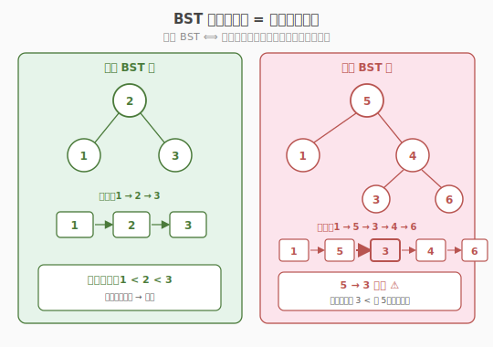
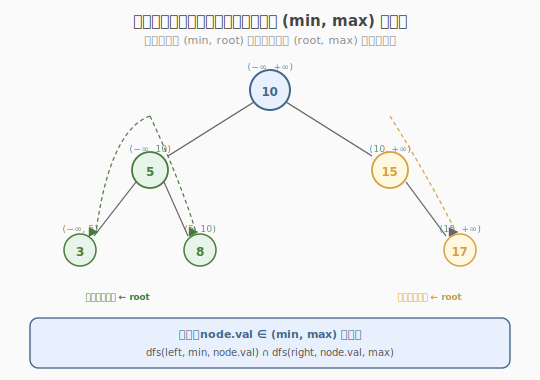
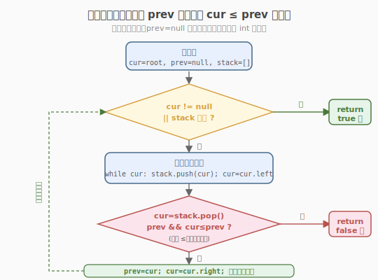
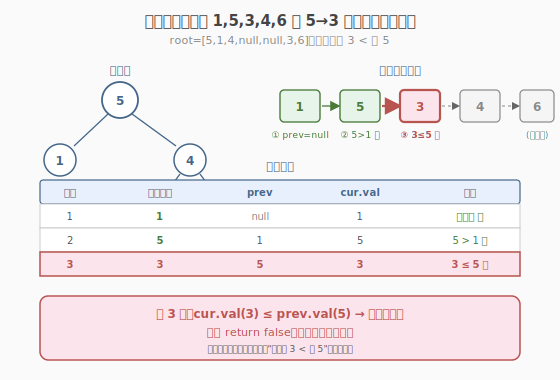

# 验证二叉搜索树

- **题目名称**：验证二叉搜索树
- **链接**：[98. 验证二叉搜索树](https://leetcode.cn/problems/validate-binary-search-tree/)
- **难度**：中等
- **标签**：树、二叉搜索树、深度优先搜索、中序遍历

## 1. 题目概述

给你一个二叉树的根节点 `root`，判断其是否是一个**有效的二叉搜索树（BST）**。

**有效 BST 的定义**：

- 节点的**左子树**只包含**严格小于**当前节点值的节点；
- 节点的**右子树**只包含**严格大于**当前节点值的节点；
- 左右子树**也必须**是二叉搜索树。

> ⚠️ 注意三点：①是**严格**大小（`<` / `>`，不能等于）；②约束作用于**整棵子树**而非仅直接孩子；③子树递归也要满足。

**示例 1**：

```text
输入：root = [2,1,3]
输出：true

      2
     / \
    1   3
```

**示例 2**：

```text
输入：root = [5,1,4,null,null,3,6]
输出：false
解释：根节点的值是 5 ，但是右子树里有值 4 ，4 < 5，违反 BST。

      5
     / \
    1   4
       / \
      3   6
```

**约束条件**：

- 树中节点数目范围 `[1, 10^4]`
- `-2^31 <= Node.val <= 2^31 - 1`（节点值可能取到 int 边界，比较时要注意）

> 💡 这是 **BST 性质**的招牌题。它的精髓在于：BST 不只是"左小右大"，而是"**中序遍历严格递增**"。一旦掌握这个等价性质，就能用一次中序遍历判定，无需复杂的上下界传递。与 [Week1/Day5 二叉树最近公共祖先](../../week1/day5/二叉树的最近公共祖先.md) 的"后序 DFS 三路决策"不同，本题是"**中序 DFS 单调性检查**"——同样是树形递归，但利用的是 BST 特有的有序性。

---

## 2. 解题思路

### 2.1 直觉陷阱：只比左右孩子

初学者最容易写出这样的**错误**代码：

```text
bool isValidBST(TreeNode* root) {
    if (!root) return true;
    if (root->left  && root->left->val  >= root->val) return false;
    if (root->right && root->right->val <= root->val) return false;
    return isValidBST(root->left) && isValidBST(root->right);
}
```

**为什么错？** 它只检查了"直接孩子"是否满足大小关系，没检查**整棵子树**。看示例 2：

```text
      5
     / \
    1   4
       / \
      3   6
```

- 直接看：`1 < 5` ✅，`4 > 5` ❌（4 不大于 5，已能发现）。
- 但即使把右孩子改成 `6`，更深处的 `3` 仍小于根 `5`——只比孩子会**漏判跨层违规**。

> ⚠️ **核心误区**：BST 的约束是"左子树**所有**节点 < 根 < 右子树**所有**节点"，不是"左孩子 < 根 < 右孩子"。任何只看直接孩子的判定都是错的。

### 2.2 核心观察：中序遍历严格递增

BST 有一个**等价性质**：

> **一棵二叉树是合法 BST ⟺ 它的中序遍历序列严格递增。**



为什么？因为中序遍历是「左 → 根 → 右」，而 BST 的定义恰好保证：左子树所有值 < 根 < 右子树所有值。所以中序访问到的值，必然从小到大排列。**严格**二字对应 BST 不允许相等。

于是问题转化为：**中序遍历，检查每个值是否严格大于前一个值。**

> 💡 这个等价性是 BST 一切技巧的基石：找第 K 小（230）、恢复 BST（99）、BST 转累加树（538/1038）都建立在中序有序上。记住一句话——**"BST 的中序遍历 = 排好序的数组"**。

#### 另一种等价视角：上下界递归

除了中序，还可以用**递归传递合法区间** `(min, max)`：根节点的值必须落在 `(min, max)` 开区间内，然后左子树的合法区间变成 `(min, root.val)`，右子树变成 `(root.val, max)`。



两种方法本质相同——中序的"前驱值"等价于上下界的"下界"。面试中两套写法都可以，**中序迭代版**最不容易踩 int 边界的坑，下面以它为主。

### 2.3 算法流程图



**中序迭代版完整步骤**（用栈模拟，避免递归栈溢出，且逻辑直观）：

1. **初始化**：空栈 `stack`，指针 `cur = root`，前驱 `prev = null`。
2. **一路向左压栈**：`while cur`：`stack.push(cur)`；`cur = cur.left`。
3. **弹栈访问**：`cur = stack.pop()`。
   - 若 `prev != null` 且 `cur.val <= prev.val` → **非严格递增，返回** `false`。
4. **更新前驱**：`prev = cur`。
5. **转向右子树**：`cur = cur.right`，回到第 2 步。
6. **栈空且 cur 为空**：遍历完，返回 `true`。

> ⚠️ **int 边界坑**：节点值范围是 `[-2^31, 2^31 - 1]`，正好是 `INT_MIN` 和 `INT_MAX`。如果用上下界法把初始区间设成 `(INT_MIN, INT_MAX)`，遇到值为 `INT_MIN` 或 `INT_MAX` 的单节点树会误判。**解决**：用 `long long`，或用指针/`None` 表示"无界"。中序迭代法用指针 `prev` 表示"无前驱"，天然规避此坑。

### 2.4 示例演算

以示例 2 `root = [5,1,4,null,null,3,6]` 为例，中序遍历依次得到：`1, 5, 3, 4, 6`。



| 步骤 | 弹栈节点 | prev | cur.val | 判断 | 结果 |
|------|---------|------|---------|------|------|
| 1 | 1 | null | 1 | 无前驱，跳过 | 继续 |
| 2 | 5 | 1 | 5 | 5 > 1 ✅ | 继续 |
| 3 | 3 | 5 | 3 | 3 ≤ 5 ❌ | **返回 false** ⭐ |
| — | — | — | — | — | — |

第 3 步发现 `3 < 5`，序列不再严格递增，立即返回 `false`。

> 💡 注意中序访问顺序不是"层序"。虽然 `3` 在 `4` 的左子树（`4 > 3` 局部合法），但中序里 `3` 排在 `5` 之后——`3 < 5` 暴露了"右子树里有值小于根"的跨层违规。这正是中序等价性的威力：**一次遍历就能抓住所有跨层违规**。

---

## 3. 参考代码

### C++

```cpp
// 验证二叉搜索树.cpp —— 中序迭代，检查严格递增
// 编译: g++ -O2 -std=c++17 验证二叉搜索树.cpp -o validbst
#include <stack>
using namespace std;

struct TreeNode {
    int val;
    TreeNode* left;
    TreeNode* right;
    TreeNode(int x) : val(x), left(nullptr), right(nullptr) {
    }
};

class Solution {
  public:
    bool isValidBST(TreeNode* root) {
        stack<TreeNode*> st;
        TreeNode* cur = root;
        TreeNode* prev = nullptr; // 中序前驱，nullptr 表示尚无前驱

        while (cur != nullptr || !st.empty()) {
            // 一路向左压栈
            while (cur != nullptr) {
                st.push(cur);
                cur = cur->left;
            }
            // 弹栈访问
            cur = st.top();
            st.pop();
            if (prev != nullptr && cur->val <= prev->val) {
                return false; // 非严格递增 → 非法 BST
            }
            prev = cur;       // 更新前驱
            cur = cur->right; // 转向右子树
        }
        return true;
    }
};
```

**上下界递归版（等价写法，面试常考）**：

```cpp
class Solution {
  public:
    bool isValidBST(TreeNode* root) {
        return dfs(root, nullptr, nullptr); // 用指针表示"无界"，避开 int 边界
    }

  private:
    // 节点值必须落在 (min, max) 开区间；min/max 为 nullptr 表示该侧无界
    bool dfs(TreeNode* node, TreeNode* minNode, TreeNode* maxNode) {
        if (node == nullptr)
            return true;
        if (minNode && node->val <= minNode->val)
            return false;
        if (maxNode && node->val >= maxNode->val)
            return false;
        return dfs(node->left, minNode, node)      // 左子树上界收紧为 node
               && dfs(node->right, node, maxNode); // 右子树下界收紧为 node
    }
};
```

### Python

```python
class Solution:
    def isValidBST(self, root: TreeNode | None) -> bool:
        stack: list[TreeNode] = []
        cur = root
        prev = None                     # None 表示无前驱，天然处理边界

        while cur or stack:
            while cur:                  # 一路向左压栈
                stack.append(cur)
                cur = cur.left
            cur = stack.pop()
            if prev is not None and cur.val <= prev.val:
                return False            # 非严格递增 → 非法
            prev = cur
            cur = cur.right
        return True
```

> 💡 Python 用 `prev is not None` 而非 `prev`——因为 `prev` 可能指向值为 `0` 或负数的节点对象，`prev` 本身始终是节点引用非空，但用 `None` 哨兵区分"无前驱"更清晰。注意判断的是 `prev` 这个引用是否为 `None`，不是节点值。

---

## 4. 复杂度分析

| 维度 | 中序迭代 | 上下界递归 |
|------|---------|-----------|
| **时间复杂度** | `O(n)` | `O(n)` |
| **空间复杂度** | `O(h)`（栈，h 为树高） | `O(h)`（递归栈） |
| **最坏空间** | `O(n)`（退化为链表） | `O(n)`（退化为链表） |
| **平衡时空间** | `O(log n)` | `O(log n)` |
| **int 边界** | ✅ 天然规避（用指针） | 需 `long long` 或指针 |

> ⚠️ 时间 `O(n)`：最坏情况需要遍历所有节点才能确认（如完全合法的 BST）。空间 `O(h)`：栈深度等于树高，链表化时退化为 `O(n)`，平衡树为 `O(log n)`。

---

## 5. 扩展：BST 中序性质的一组同构题

BST 的"中序有序"是把万能钥匙，下面一组题都是它的变体：

| 题号 | 题目 | 中序序列上的操作 |
|------|------|----------------|
| **98** | 验证二叉搜索树 | 检查是否**严格递增** |
| 230 | 二叉搜索树中第 K 小的元素 | 中序遍历到第 K 个停 |
| 99 | 恢复二叉搜索树 | 找中序序列中**逆序对**，交换两个错位节点 |
| 538 / 1038 | 把 BST 转成累加树 | **反序中序**（右→根→左），累加后回写 |
| 501 | BST 中的众数 | 中序遍历统计**连续相同值**的长度 |

### 5.1 99 恢复 BST（经典迁移）

两个节点被错 swap 后，中序序列出现**两处逆序**（或一处，若相邻）。找逆序对的首尾节点交换即可恢复。本题（98）是它的前置——先会"判定有序"，才会"找逆序修复"。

### 5.2 538/1038 累加树

把每个节点的值改成"**所有大于等于它的值之和**"。关键洞察：**反序中序**（右→根→左）正好按**降序**访问，边走边累加即可。中序的灵活性在于——**反过来走就是降序**。

> 💡 **一句话总结**：BST 的所有技巧都源自"中序 = 排好序的数组"。判定（98）、找第 K 小（230）、修复（99）、累加（538）——只是在这个有序数组上做不同的线性扫描。掌握这个等价性，BST 这一类题就通了。

---

## 6. 面试要点

1. **为什么只比较左右孩子是错的？给个反例。**

   - BST 约束作用于**整棵子树**，不是直接孩子。
   - 反例：`root=10`，`right=15`，`right.left=6`。直接看 `15 > 10` ✅，但 `6 < 10` 违反"右子树所有值 > 根"。
   - 正确做法必须传递上下界，或利用中序有序性一次扫完。

2. **中序遍历为什么等价于判定 BST？**

   - BST 定义：左子树所有值 < 根 < 右子树所有值，且递归成立。
   - 中序是「左→根→右」，由定义保证访问顺序天然从小到大。
   - 反过来，若中序严格递增，则每个节点的值都大于其左子树所有值（左子树中序在前）、小于右子树所有值（右子树中序在后）→ 满足 BST。两者等价。

3. **节点值范围是** `int` **边界，怎么避免比较出错？**

   - 上下界法若初值设 `(INT_MIN, INT_MAX)`，单节点值为 `INT_MIN`/`INT_MAX` 时会被误判（开区间排除端点）。
   - 三种解法：①用 `long long` 扩大范围；②用**指针**表示"无界"（`nullptr` 跳过该侧检查）；③用中序的 `prev` 指针（无前驱时跳过），天然规避。面试推荐指针法，显式表达"无界"语义。

4. **中序递归 vs 中序迭代，写哪个？**

   - 递归版简洁，但需要全局/引用变量维护 `prev`，面试时容易在传参上卡壳。
   - 迭代版用栈显式管理状态，`prev` 是局部变量，逻辑清晰且能提前 `return`。
   - 策略：先写递归版说清思路，再补迭代版展示功底；若面试官追问栈空间，顺势讲 `O(h)`。

5. **遇到** `=`**（相等）时返回 false 的原因？**

   - BST 要求**严格**大小（题目定义 `left < root < right`，不含等号）。
   - 中序检查用 `cur.val <= prev.val`（注意 `<=` 而非 `<`）——相等也算违规。
   - 这是常见 off-by-one 坑：写成 `<` 会漏判相等情况，导致 `[1,1]` 这种被误判为合法。

> 💡 **一句话总结**：验证 BST 的核心是抓住"中序严格递增"这个等价性质——一次中序遍历，维护前驱 `prev`，遇到 `cur <= prev` 即非法。空间 `O(h)`，规避 int 边界用指针而非哨兵值。这个"中序有序"模板可迁移到 230（第 K 小）、99（恢复 BST）、538（累加树）等所有 BST 题，是面试必会的核心套路。

---

## 7. 同类练习题
- [230. 二叉搜索树中第 K 小的元素](https://leetcode.cn/problems/kth-smallest-element-in-a-bst/)：中序遍历
- [98. 验证二叉搜索树](https://leetcode.cn/problems/validate-binary-search-tree/)：中序单调性
- [108. 将有序数组转换为二叉搜索树](https://leetcode.cn/problems/convert-sorted-array-to-binary-search-tree/)：分治构造
