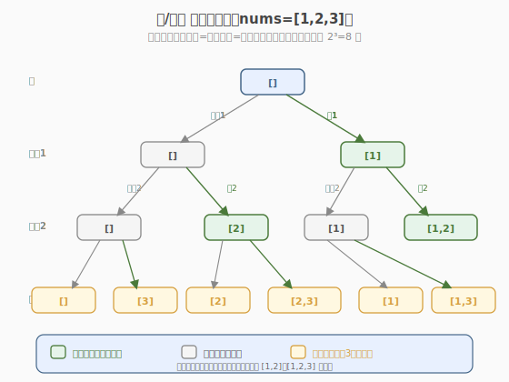
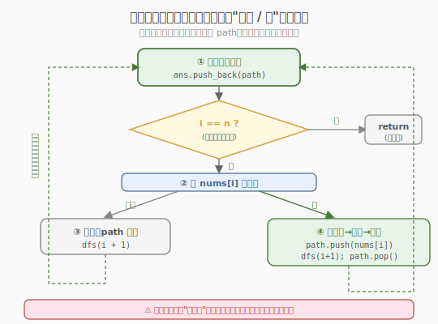
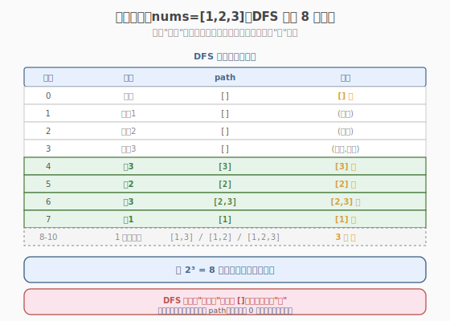

# 子集

- **题目名称**：子集
- **链接**：[78. 子集](https://leetcode.cn/problems/subsets/)
- **难度**：中等
- **标签**：位运算、数组、回溯

## 1. 题目概述

给你一个整数数组 `nums`，数组中的元素**互不相同**。返回该数组所有可能的子集（幂集）。解集**不能包含重复的子集**，可以按任意顺序返回。

**子集的定义**：原数组中任意一些元素的集合（包括空集和原数组自身）。`n` 个元素的数组共有 `2^n` 个子集。

**示例 1**：

```text
输入：nums = [1,2,3]
输出：[[],[1],[2],[1,2],[3],[1,3],[2,3],[1,2,3]]
```

**示例 2**：

```text
输入：nums = [0]
输出：[[],[0]]
```

**约束条件**：

- `1 <= nums.length <= 10`
- `-10 <= nums[i] <= 10`
- `nums` 中的所有元素**互不相同**

> 💡 这是 **回溯法"选/不选"模板**的招牌题。与 [Week1/Day6 全排列](../../week1/day6/全排列.md) 的"每个位置选哪个数"（**循环枚举候选**）不同，子集的视角是"**每个元素选或不选**"——这构成了一棵**二叉决策树**，每个元素对应一层、两个分支。掌握这个模板，组合(77)、组合总和(39)、子集 II(90) 都能套用。它还和**位运算**天然对应：`n` 个元素各自选/不选，正好编码为 `n` 位二进制数。

---

## 2. 解题思路

### 2.1 暴力思路：迭代枚举 / 位运算

最直观的非递归做法是**迭代扩张法**：从空集 `[]` 出发，每来一个新元素，把它"加到现有所有子集的末尾"生成一批新子集。

```text
初始   : [[]]
加入 1 : [[], [1]]              // 把 1 拼到 [] 后 → [1]
加入 2 : [[], [1], [2], [1,2]]  // 把 2 拼到 [] 和 [1] 后
加入 3 : [[], [1], [2], [1,2], [3], [1,3], [2,3], [1,2,3]]
```

能过，但**没有揭示子集的本质结构**。面试官常追问"能不能用回溯？"——这就引出二叉决策树。

> ⚠️ 迭代法的局限：它只产出结果，不展示"决策过程"。遇到需要剪枝的变体（如子集和等于 target、含重复元素去重）就力不从心。回溯法把"选/不选"显式化，是这类题的通用武器。

### 2.2 核心观察：选/不选二叉决策树

关键直觉：**把"构造一个子集"看作对每个元素做一次"选/不选"决策**。`n` 个元素 → `n` 层决策 → 每层 2 个分支 → 共 `2^n` 条根到叶子路径，每条路径对应一个子集。



与全排列的决策树对比：

| 维度 | 全排列 (46) | 子集 (78) |
|------|------------|-----------|
| 决策内容 | 每个位置放哪个数 | 每个元素选还是不选 |
| 分支数 | 递减（n, n-1, …, 1） | 恒为 2 |
| 收集时机 | **只在叶子**（path 满时） | **每个节点都收集**（包括内部节点） |
| 结果数 | `n!` | `2^n` |
| 剪枝关键 | `used` 防重复选 | 无需 used，靠 start 索引避免回头 |

> 💡 **子集与排列的根本区别**：排列关心"顺序"（`[1,2]` 和 `[2,1]` 不同），所以每层要枚举所有未选候选；子集不关心顺序（`{1,2}` 和 `{2,1}` 是同一个），所以只需"对每个元素做一次二选一决策"。这也解释了为什么子集用**二叉树**、排列用**多叉树**。

#### 等价的另一种视角：start 索引循环法

除了"选/不选"二叉树，还有等价的写法：**用 `start` 索引控制候选范围**，每层从 `start` 往后枚举"下一个要加入的元素"。两者产出的子集相同，只是树的形状不同（二叉树 vs 多叉树）。后者更易迁移到组合问题，下面参考代码两版都给。

### 2.3 算法流程图



**"选/不选"二叉树版完整步骤**：

1. **入节点即收集**：每进入一次 `dfs(i)`，先把当前 `path` 拷贝存入答案——因为每个节点（不管选没选）都对应一个合法子集。
2. **终止条件**：`i == n`（所有元素决策完毕），直接 `return`。
3. **左分支（不选 nums[i]）**：`dfs(i + 1)`，path 不变。
4. **右分支（选 nums[i]）**：`path.push(nums[i])` → `dfs(i + 1)` → `path.pop()` 撤销。

> ⚠️ **收集时机是子集题最大的坑**：排列只在叶子收集，子集在**每个节点**收集。如果照搬排列模板把收集放在终止条件里，只会得到 `2^n` 个"完整长度"的路径，漏掉所有中间子集。记住——**"入函数先收集"**是子集/组合题的标志。

### 2.4 示例演算

以 `nums = [1,2,3]` 为例，二叉决策树先走"不选"分支（左）、再走"选"分支（右），DFS 顺序如下：



| 步骤 | 决策 | path | 收集 | 说明 |
|------|------|------|------|------|
| 入根 | — | [] | [] ⭐ | 空集，第一个结果 |
| 1 | 不选 1 | [] | (已收) | 走左分支 |
| 2 | 不选 2 | [] | (已收) | 走左分支 |
| 3 | 不选 3 | [] | (已收) | 走左分支，到底 return |
| 4 | 选 3 | [3] | [3] ⭐ | 回溯走右分支 |
| 5 | 选 2 | [2] | [2] ⭐ | 回到 2 走右分支 |
| 6 | 不选 3 / 选 3 | [2] / [2,3] | [2,3] ⭐ | 2 的右子树 |
| 7 | 选 1 | [1] | [1] ⭐ | 回到根走右分支 |
| … | … | … | [1,3], [1,2], [1,2,3] | 1 的右子树 |

最终 8 个子集：`[], [3], [2], [2,3], [1], [1,3], [1,2], [1,2,3]`。

> 💡 注意 DFS 先深入"全不选"得到空集 `[]`，再逐层回溯尝试"选"。每个节点进入时都收集一次，共 `2^3 = 8` 个子集，无重复无遗漏。

---

## 3. 参考代码

### C++（选/不选二叉决策树版）

```cpp
// 子集.cpp —— 回溯：选/不选二叉决策树
// 编译: g++ -O2 -std=c++17 子集.cpp -o subsets
#include <vector>
using namespace std;

class Solution {
  public:
    vector<vector<int>> subsets(vector<int>& nums) {
        vector<vector<int>> ans;
        vector<int> path;
        dfs(nums, 0, path, ans);
        return ans;
    }

  private:
    // i: 当前决策到 nums[i]；path: 当前已选元素
    void dfs(vector<int>& nums, int i, vector<int>& path, vector<vector<int>>& ans) {
        // ① 入节点即收集：每个节点对应一个子集
        ans.push_back(path);
        // ② 终止：所有元素决策完
        if (i == (int)nums.size())
            return;
        // ③ 左分支：不选 nums[i]，直接下一层
        dfs(nums, i + 1, path, ans);
        // ④ 右分支：选 nums[i]，选→递归→撤销
        path.push_back(nums[i]);
        dfs(nums, i + 1, path, ans);
        path.pop_back();
    }
};
```

**start 索引循环版（等价，更易迁移到组合题）**：

```cpp
class Solution {
  public:
    vector<vector<int>> subsets(vector<int>& nums) {
        vector<vector<int>> ans;
        vector<int> path;
        backtrack(nums, 0, path, ans);
        return ans;
    }

  private:
    void backtrack(vector<int>& nums, int start, vector<int>& path, vector<vector<int>>& ans) {
        ans.push_back(path); // 每个节点都收集
        for (int i = start; i < (int)nums.size(); i++) {
            path.push_back(nums[i]);           // 选 nums[i]
            backtrack(nums, i + 1, path, ans); // 只往后选，避免重复组合
            path.pop_back();                   // 撤销
        }
    }
};
```

### Python

```python
class Solution:
    def subsets(self, nums: list[int]) -> list[list[int]]:
        ans: list[list[int]] = []
        path: list[int] = []

        def dfs(i: int) -> None:
            ans.append(path[:])                 # ① 入节点即收集（拷贝！）
            if i == len(nums):
                return                          # ② 终止
            dfs(i + 1)                          # ③ 不选 nums[i]
            path.append(nums[i])                # ④ 选 nums[i]
            dfs(i + 1)
            path.pop()                          # 撤销

        dfs(0)
        return ans
```

> ⚠️ **Python 必须 `ans.append(path[:])` 拷贝**：`path` 是同一个列表对象，回溯时 `pop()` 会改写它。若直接 `ans.append(path)`，最终 `ans` 里全是同一个引用（且被清空）。C++ 的 `ans.push_back(path)` 会自动拷贝 `vector`，无需额外处理。这与 [全排列](../../week1/day6/全排列.md) 的坑完全一致。

---

## 4. 复杂度分析

| 维度 | 回溯（两版） | 位运算 | 迭代扩张 |
|------|------------|--------|---------|
| **时间复杂度** | `O(n · 2^n)` | `O(n · 2^n)` | `O(n · 2^n)` |
| **空间复杂度** | `O(n)`（递归栈 + path，不计结果） | `O(n)`（构造临时子集） | `O(n)` |
| **结果数** | `2^n` | `2^n` | `2^n` |
| **代码量** | 中 | 短 | 短 |

> ⚠️ 时间 `O(n · 2^n)` 的来源：共 `2^n` 个子集，每个子集构造/拷贝需 `O(n)`。这是**幂集问题的理论下界**——因为答案本身就有 `2^n` 个、每个长度可达 `n`，无法更快。空间 `O(n)` 指递归深度（最大 `n` 层），结果数组 `O(n · 2^n)` 不计入。

---

## 5. 扩展：位运算法与含重复元素的子集 II

### 5.1 位运算法：二叉决策的编码

`n` 个元素"选/不选"恰好对应一个 `n` 位二进制数：第 `i` 位为 `1` 表示选 `nums[i]`，`0` 表示不选。枚举 `0` 到 `2^n - 1` 的每个整数，按位提取即可。

```python
class Solution:
    def subsets(self, nums: list[int]) -> list[list[int]]:
        n = len(nums)
        ans = []
        for mask in range(1 << n):          # 0 .. 2^n - 1
            subset = [nums[i] for i in range(n) if mask >> i & 1]
            ans.append(subset)
        return ans
```

> 💡 **位运算是二叉决策树的"扁平化"**：决策树每条根到叶子路径 ↔ 一个 `n` 位二进制数。`mask >> i & 1` 就是"在第 `i` 层走选还是不选分支"。这个映射揭示了子集问题的组合本质——`2^n` 个子集 = `2^n` 个二进制数。

### 5.2 90 子集 II（含重复元素去重）

若 `nums` 含重复元素（如 `[1,2,2]`），直接回溯会产生重复子集（两个 `2` 都选时 `[1,2]` 出现两次）。去重套路：**先排序**，然后在同一层循环里跳过"与前一个相同"的候选。

```cpp
void backtrack(vector<int>& nums, int start, vector<int>& path, vector<vector<int>>& ans) {
    ans.push_back(path);
    for (int i = start; i < (int)nums.size(); i++) {
        // 同层去重：当前和前一个相同，且不是本层第一个，跳过
        if (i > start && nums[i] == nums[i - 1])
            continue;
        path.push_back(nums[i]);
        backtrack(nums, i + 1, path, ans);
        path.pop_back();
    }
}
```

关键：`i > start` 保证只对**同一层**去重（不同层的相同值是合法的，如 `[1,2,2]` 里两个 2 在不同层可同时选）。这与 [全排列 II (47)](https://leetcode.cn/problems/permutations-ii/) 的 `used` 去重异曲同工，只是用 `start` 代替了 `used`。

### 5.3 模板迁移：组合题族

子集的"start 索引循环版"是组合题族的通用模板：

| 题号 | 题目 | 与 78 的差异 |
|------|------|-------------|
| 77 | 组合 | 加终止条件 `path.size() == k`，只收集长度为 k 的 |
| 39 | 组合总和 | 元素可重复选 → `backtrack(i)`（不是 `i+1`）+ 剪枝 |
| 216 | 组合总和 III | 固定 k 个数 + 和为 n |
| 40 | 组合总和 II | 含重复 + 每个数用一次 → 同层去重 |

> 💡 **一句话总结**：子集是"选/不选二叉决策树"的招牌题——每个元素一层、两个分支，**入节点即收集**（区别于排列的叶收集）。这个模板配合 `start` 索引可迁移到整个组合题族（77/39/216/40），配合位运算可扁平化为 `2^n` 枚举，是面试必会的核心回溯模板。

---

## 6. 面试要点

1. **子集和全排列的决策树有什么本质区别？**

   - 排列关心顺序，每层枚举"该位置放哪个未选元素"，分支数递减（`n, n-1, …, 1`），只在叶子收集，结果 `n!` 个。
   - 子集不关心顺序，每个元素做"选/不选"二选一，分支数恒为 2，**每个节点都收集**，结果 `2^n` 个。
   - 代码上：排列用 `used` 数组防重复选；子集用"start 索引只往后选"或"二叉决策"天然避免 `{1,2}` 和 `{2,1}` 重复。

2. **为什么子集要在"入节点"收集，而不是在叶子？**

   - 子集的定义是"任意一些元素的集合"，长度从 0 到 n 都有。如果只在叶子（决策完所有 n 个元素）收集，只会得到 `2^n` 个"完整决策路径"，但每条路径对应的子集不同——必须在每个节点（每做完若干个决策）就把当前 path 存下来。
   - 排列则要求"用满 n 个位置"，只有叶子是完整排列，内部节点是半成品，不能收集。

3. **两种回溯写法（二叉决策 vs start 循环）怎么选？**

   - 二叉决策版：直观体现"选/不选"语义，适合讲清思路、适合迁移到位运算。
   - start 循环版：更紧凑，**易迁移到组合题**（77/39/40 都是这个模板的变体）。
   - 面试策略：先讲二叉决策版说清本质，再写 start 循环版展示迁移能力。两者产出结果相同（顺序可能不同）。

4. **位运算法的时间复杂度也是 O(n·2^n)，和回溯比哪个好？**

   - 渐近复杂度相同（都是下界）。位运算版代码更短、无递归开销，但**无法剪枝**——遇到"子集和等于 target""去重"等变体就失效。
   - 回溯版可加剪枝（如和超过 target 提前 return），变体题几乎都用回溯。
   - 面试中：纯幂集问题两版都可；若面试官暗示变体，优先回溯。

5. **90 子集 II 的去重为什么用 `i > start` 而不是 `i > 0`？**

   - `i > start` 表示"当前元素不是本层第一个"——只对**同一层**的重复去重。不同层（递归更深处）允许相同值，因为那是"多选一个相同的 2"，合法。
   - 若写成 `i > 0`，会把不同层的合法相同值也跳过，漏掉 `[2,2]` 这种正确子集。
   - 本质：去重要区分"同层并列重复"（要去）和"递归纵深重复"（要留）。这与 47 全排列 II 的 `!used[i-1]` 同理——用"是否在同一层"区分。

> 💡 **一句话总结**：子集是"选/不选二叉决策树"的招牌——每个元素一层、每节点都收集（区别于排列的叶收集），结果 `2^n` 个。`start` 索引版可迁移到整个组合题族（77/39/216/40），位运算是二叉决策的扁平编码。空间 `O(n)`，时间是理论下界 `O(n·2^n)`。这是回溯必会的核心模板。
