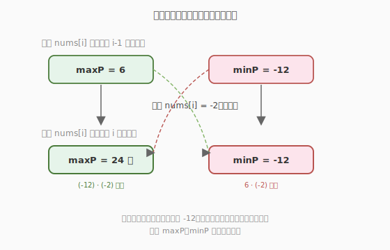
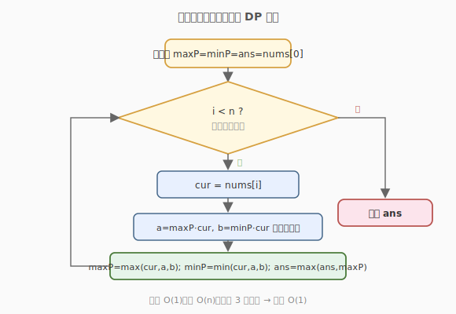

# 乘积最大子数组

- **题目名称**：乘积最大子数组
- **链接**：[152. 乘积最大子数组](https://leetcode.cn/problems/maximum-product-subarray/)
- **难度**：中等
- **标签**：数组、动态规划

## 1. 题目概述

给定一个整数数组 `nums`，请你找出**连续子数组**（包含至少一个元素）中乘积最大的那个，返回其乘积。

**示例 1**：

```text
输入：nums = [2,3,-2,4]
输出：6
解释：子数组 [2,3] 的乘积最大，等于 6。
```

**示例 2**：

```text
输入：nums = [-2,0,-1]
输出：0
解释：结果不能取 [−2,−1]=2，因为它们不是连续子数组（中间隔了 0）。
```

**约束条件**：

- `1 <= nums.length <= 2 * 10^4`
- `-10 <= nums[i] <= 10`
- 任意子数组的乘积**保证**是 32 位有符号整数范围内

---

## 2. 解题思路

### 2.1 暴力思路

枚举所有连续子数组 `nums[i..j]`，逐个累乘取最大值。时间复杂度 `O(n^2)`，在 `n = 2*10^4` 时会**超时**。

```text
ans = nums[0]
for i in range(n):
    prod = 1
    for j in range(i, n):
        prod *= nums[j]
        ans = max(ans, prod)
```

> ⚠️ 暴力法的瓶颈：对每个起点 `i` 都重新累乘一遍，没有利用「前一步乘积」的信息。

### 2.2 核心观察：负数让最大、最小互换



与「最大子数组和」不同，乘积有一个关键特性：**遇到负数时，最大的乘积会变成最小的，最小的会变成最大的**（负负得正）。

因此只维护「以 `i` 结尾的最大乘积」是不够的——一个很大的负数乘上当前最小值（也是负数），反而可能得到全局最大。必须**同时维护最大和最小**：

记 `maxP[i]`、`minP[i]` 分别为以 `i` 结尾的子数组的**最大乘积**与**最小乘积**，则：

$$
maxP[i] = \max(\,nums[i],\ \ maxP[i-1] \cdot nums[i],\ \ minP[i-1] \cdot nums[i]\,)
$$

$$
minP[i] = \min(\,nums[i],\ \ maxP[i-1] \cdot nums[i],\ \ minP[i-1] \cdot nums[i]\,)
$$

> 💡 **三个候选**的含义：要么从 `nums[i]` 重新开一段（掐断前面的乘积），要么把 `nums[i]` 接到上一段后面。接的时候既可能乘上之前的最大值（正数情况），也可能乘上之前的最小值（负数翻正情况）。

由于 `maxP[i]`、`minP[i]` 只依赖 `i-1`，可以用两个变量滚动，空间压到 `O(1)`。

### 2.3 算法流程图



### 2.4 示例演算

以 `nums = [2,3,-2,4]` 为例，下表跟踪 `maxP`、`minP` 的滚动过程：

| i | nums[i] | maxP | minP | ans | 说明 |
|---|---------|------|------|-----|------|
| 0 | 2       | 2    | 2    | 2   | 开段 [2] |
| 1 | 3       | 6    | 3    | 6   | 接上：6=2·3 |
| 2 | -2      | -2   | -12  | 6   | 负数翻转：maxP=-2，minP=6·(-2)=-12 |
| 3 | 4       | 4    | -48  | 6   | maxP=max(4, -2·4, -12·4)=4 |

最终答案 `ans = 6`（子数组 `[2,3]`）。

> 💡 注意 `i=2` 这一步：虽然 `maxP` 跌到 `-2`，但 `minP` 记下了 `-12`；如果后面再来一个负数，`-12` 乘负数就能翻身成大正数——这正是同时维护最大最小的意义。

---

## 3. 参考代码

### C++

```cpp
class Solution {
  public:
    int maxProduct(vector<int>& nums) {
        int ans = nums[0];
        int maxP = nums[0], minP = nums[0];
        for (int i = 1; i < (int)nums.size(); ++i) {
            int cur = nums[i];
            int a = maxP * cur, b = minP * cur;
            maxP = max({cur, a, b});
            minP = min({cur, a, b});
            ans = max(ans, maxP);
        }
        return ans;
    }
};
```

### Python

```python
class Solution:
    def maxProduct(self, nums: List[int]) -> int:
        ans = nums[0]
        maxP = minP = nums[0]
        for cur in nums[1:]:
            a, b = maxP * cur, minP * cur
            maxP = max(cur, a, b)
            minP = min(cur, a, b)
            ans = max(ans, maxP)
        return ans
```

> ⚠️ **易错点**：更新 `maxP` 和 `minP` 时必须**用上一轮的旧值**同时算 `a`、`b`，再一次性赋值。若先更新 `maxP` 再用它算 `minP`，会把新值当旧值用，导致错误。上面代码用 `a`、`b` 暂存乘积就是为了规避这个陷阱。

---

## 4. 复杂度分析

| 维度 | 复杂度 | 说明 |
|------|--------|------|
| 时间复杂度 | O(n) | 只遍历一次数组，每步 O(1) 的比较与乘法 |
| 空间复杂度 | O(1) | 仅用 `maxP`、`minP`、`ans` 三个滚动变量 |

---

## 5. 扩展：乘积为正的最长子数组（1567）

变体 [1567. 乘积为正的最长子数组长度](https://leetcode.cn/problems/maximum-length-of-subarray-with-positive-product/) 求**乘积为正**的最长子数组**长度**。思路类似，但状态改为「以 `i` 结尾乘积为正的最长长度」`pos` 与「为负的最长长度」`neg`：

- `nums[i] > 0`：`pos = pos + 1`，`neg = neg + 1`（若 `neg=0` 则保持 0）
- `nums[i] < 0`：正负互换，`pos, neg = neg + 1, pos + 1`（同样处理 0）
- `nums[i] == 0`：乘积归零，`pos = neg = 0` 重新开段

对比：152 求**最大值**，1567 求**最长长度**；两者都靠「同时维护正/负两个状态」处理负数翻转。

---

## 6. 面试要点

1. **为什么不能像「最大子数组和」那样只维护一个最大值？**
   - 加法中负数只会让和变小，不会翻正；但乘法中**负负得正**，一个极小的负数乘上另一个负数可能变成全局最大。所以必须同时维护最小值，才有机会在遇到负数时翻盘。

2. **三个候选** `cur`**、**`maxP·cur`**、**`minP·cur` **各代表什么？**
   - `cur`：从当前元素**新开一段**，掐断之前的乘积（当前元素为 0 或之前乘积为 0 时常用）。
   - `maxP·cur`：把当前元素**接在正乘积后面**。
   - `minP·cur`：当前元素为负时，乘上之前的最小（最负）值，**翻成大正数**。

3. **为什么更新时要用临时变量暂存？**
   - `maxP` 和 `minP` 互相依赖对方**上一轮**的值。若顺序赋值，先更新的会把旧值覆盖，后更新的就拿到错值。用 `a`、`b` 暂存乘积可保证两者基于同一轮旧值。

4. **数组里有 0 会怎样？**
   - 遇到 0 时 `maxP`、`minP` 都会变成 0，相当于自然「掐断」了子数组。后续元素从自身重新开段，符合「子数组不能跨越 0 求非零乘积」的语义。

5. **能否用前缀积 + 分类讨论？**
   - 可以。维护前缀积 `prefix`，遇到 0 就分段重置。段内按负数个数奇偶性，用哈希记录「第一个负数位置」来计算最大长度。但实现复杂、易错，滚动 DP 更简洁，面试推荐 DP 写法。

---

## 7. 同类练习题
- [53. 最大子数组和](https://leetcode.cn/problems/maximum-subarray/)：加法版，只维护一个最大值
- [1567. 乘积为正的最长子数组长度](https://leetcode.cn/problems/maximum-length-of-subarray-with-positive-product/)：求长度而非最大值
- [918. 环形子数组的最大和](https://leetcode.cn/problems/maximum-sum-circular-subarray/)：环形版最大和，思路迁移
