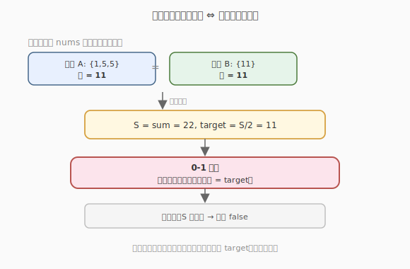
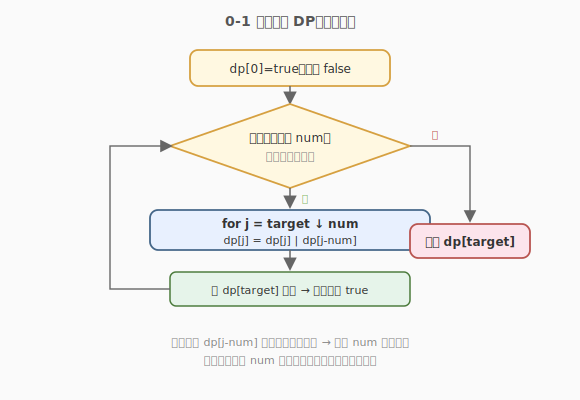

# 分割等和子集

- **题目名称**：分割等和子集
- **链接**：[416. 分割等和子集](https://leetcode.cn/problems/partition-equal-subset-sum/)
- **难度**：中等
- **标签**：数组、动态规划、背包

## 1. 题目概述

给定一个**只含正整数**的非空数组 `nums`，请你判断是否能将其**分割成两个子集**，使两个子集的元素之和相等。

**示例 1**：

```text
输入：nums = [1,5,11,5]
输出：true
解释：数组可以分割成 [1,5,5] 和 [11]，两者之和都是 11。
```

**示例 2**：

```text
输入：nums = [1,2,3,5]
输出：false
解释：数组不能分割成两个和相等的子集。
```

**约束条件**：

- `1 <= nums.length <= 200`
- `1 <= nums[i] <= 100`

---

## 2. 解题思路

### 2.1 暴力思路：枚举每个元素归属

对每个元素决定放进「子集 A」还是「子集 B」，共 `2^n` 种划分，判断是否两半相等。`n = 200` 时完全不可行。

### 2.2 核心观察：转化为 0-1 背包



关键转化：**两个子集和相等**，等价于「存在一个子集，其元素之和恰好等于总和的一半」。

设总和 `S = sum(nums)`：

1. 若 `S` 为奇数 → 直接 `false`（无法平分为两个整数和）。
2. 否则令 `target = S / 2`，问题变成：**能否从** `nums` **中选若干元素，使其和恰好为** `target`？这就是标准 **0-1 背包**（每个元素选或不选，恰好装满容量 `target`）。

> 💡 「恰好装满」的 0-1 背包用**布尔 DP**：`dp[j]` 表示「能否凑出和 `j`」。

### 2.3 算法流程图



状态转移（每个 `num` 只能用一次，所以 `j` 必须**倒序**更新）：

$$
dp[j] = dp[j]\ \lor\ dp[j - num]
$$

- `dp[j]`：不选当前 `num`，沿用旧值。
- `dp[j-num]`：选当前 `num`，看去掉它之后能否凑出 `j-num`。

**倒序的原因**：一维 DP 中 `j` 从大到小遍历，保证计算 `dp[j]` 时用到的 `dp[j-num]` 还是**上一轮**（未选当前 `num`）的值，避免同一个元素被重复选取。这正是 0-1 背包与完全背包的核心区别。

### 2.4 示例演算

以 `nums = [1,5,11,5]` 为例，`S = 22`，`target = 11`。`dp` 数组长度 `12`，初始 `dp[0]=true`，其余 `false`。

| 处理 num | dp[0] | dp[1] | dp[5] | dp[6] | dp[10] | dp[11] | 说明 |
|----------|-------|-------|-------|-------|--------|--------|------|
| 初始     | T     | F     | F     | F     | F      | F      | 只有空集凑出 0 |
| 1        | T     | T     | F     | F     | F      | F      | 凑出 {1} |
| 5        | T     | T     | T     | T     | F      | F      | 凑出 {5},{1,5} |
| 11       | T     | T     | T     | T     | F      | T      | 凑出 {11} → dp[11]=T ⭐ |
| 5        | T     | T     | T     | T     | T      | T      | 还能凑出 {5,5,1}=11 等 |

处理到 `11` 时 `dp[11]` 已经变 `true`，可直接返回 `true`。

---

## 3. 参考代码

### C++

```cpp
class Solution {
  public:
    bool canPartition(vector<int>& nums) {
        int s = accumulate(nums.begin(), nums.end(), 0);
        if (s & 1) return false;          // 奇数直接不可分
        int target = s / 2;
        vector<char> dp(target + 1, 0);
        dp[0] = 1;
        for (int num : nums) {
            for (int j = target; j >= num; --j) {   // 倒序，保证每个 num 用一次
                dp[j] = dp[j] | dp[j - num];
            }
            if (dp[target]) return true;            // 提前剪枝
        }
        return dp[target];
    }
};
```

### Python

```python
class Solution:
    def canPartition(self, nums: List[int]) -> bool:
        s = sum(nums)
        if s % 2:
            return False
        target = s // 2
        dp = [False] * (target + 1)
        dp[0] = True
        for num in nums:
            for j in range(target, num - 1, -1):   # 倒序
                dp[j] = dp[j] or dp[j - num]
            if dp[target]:
                return True
        return dp[target]
```

> ⚠️ **易错点**：内层循环必须 `j` 从 `target` 递减到 `num`。若写成升序，`dp[j-num]` 会用到本轮刚被当前 `num` 更新过的值，导致一个元素被「无限次」选取，变成完全背包。

---

## 4. 复杂度分析

| 维度 | 复杂度 | 说明 |
|------|--------|------|
| 时间复杂度 | O(n · target) | `n` 个元素，每个扫一遍 `target` 长度的 dp |
| 空间复杂度 | O(target) | 一维布尔 dp，长度 `target+1` |

> 💡 本题 `n ≤ 200`、`nums[i] ≤ 100`，故 `target ≤ 10000`，`n·target ≤ 2*10^6`，可接受。若数据范围更大需考虑bitset优化。

---

## 5. 扩展：0-1 背包的两种问法

0-1 背包有两大变体，DP 状态定义不同：

| 问法 | 状态 | 转移 | 初始化 |
|------|------|------|--------|
| **能否**装满（本题） | `dp[j]` = 布尔 | `dp[j] = dp[j] | dp[j-num]` | `dp[0]=true` |
| 装**最大价值** | `dp[j]` = 最大值 | `dp[j] = max(dp[j], dp[j-w]+v)` | `dp[0]=0` |

典型代表：[494. 目标和](https://leetcode.cn/problems/target-sum/)（转化为凑和的方案数，用计数 DP）、[1049. 最后一块石头的重量 II](https://leetcode.cn/problems/last-stone-weight-ii/)（转化为尽量装满一半的最优值）。

---

## 6. 面试要点

1. **为什么总和为奇数直接返回 false？**
   - 两个相等的整数和相加必为偶数。若 `S` 为奇数，不可能拆成两个相等的整数和，剪掉这一支可省去所有 DP 计算。

2. **为什么内层循环要倒序？**
   - 一维 DP 中 `dp[j]` 依赖 `dp[j-num]`。若升序遍历，先算出的 `dp[j-num]` 已被当前 `num`「污染」（即已经选过当前 `num`），再传给 `dp[j]` 就相当于这个 `num` 被选了两次，退化成完全背包。倒序保证每个 `num` 在一轮内只被使用一次。

3. **这和「子集和问题」是什么关系？**
   - 完全等价。子集和问题是 NP 完全的，但本题数据范围小（`target ≤ 10000`），用伪多项式 DP 可解。若 `target` 极大，则只能用回溯 + 剪枝或 meet-in-the-middle。

4. **如何优化？**
   - **bitset 优化**：把 `dp` 当作二进制位串，每次 `dp |= dp << num`，利用位运算一次处理 64 位，常数优化约 64 倍。
   - **提前剪枝**：每轮处理完若 `dp[target]` 已为真就立即返回；若某个 `num == target` 也可直接返回。

5. **如果要求返回具体的两个子集，而非只判断？**
   - 用二维 `dp` 记录转移来源（选/不选），回溯即可还原方案；或一维 dp 外加一个 `from[i][j]` 记录是否选了第 `i` 个元素。

---

## 7. 同类练习题
- [494. 目标和](https://leetcode.cn/problems/target-sum/)：转化为子集和的方案数
- [1049. 最后一块石头的重量 II](https://leetcode.cn/problems/last-stone-weight-ii/)：转化为尽量装满一半
- [322. 零钱兑换](https://leetcode.cn/problems/coin-change/)：完全背包版（物品可重复用）
- [474. 一和零](https://leetcode.cn/problems/ones-and-zeroes/)：二维费用 0-1 背包
