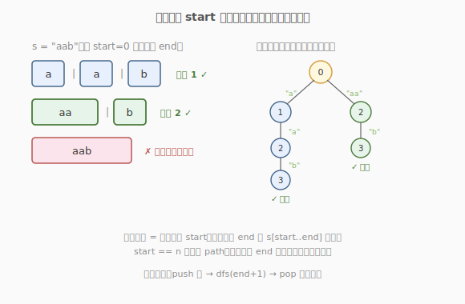
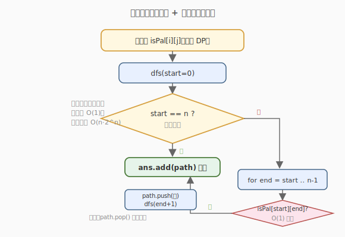

# 分割回文串

- **题目名称**：分割回文串
- **链接**：[131. 分割回文串](https://leetcode.cn/problems/palindrome-partitioning/)
- **难度**：中等
- **标签**：字符串、回溯、动态规划

## 1. 题目概述

给定一个字符串 `s`，请你将 `s` 分割成若干子串，使**每个子串都是回文串**。返回 `s` 所有可能的分割方案。

**示例 1**：

```text
输入：s = "aab"
输出：[["a","a","b"],["aa","b"]]
解释：两种分割都满足每段都是回文。
```

**示例 2**：

```text
输入：s = "a"
输出：[["a"]]
```

**约束条件**：

- `1 <= s.length <= 16`
- `s` 仅由小写英文字母组成

---

## 2. 解题思路

### 2.1 暴力思路：枚举所有切分位置

长度为 `n` 的字符串有 `n-1` 个「间隙」可切或不切，共 `2^(n-1)` 种分割。逐一验证每段是否回文。`n = 16` 时 `2^15 = 32768` 种，勉强可行，但每次验证回文 `O(n)`，总复杂度 `O(n · 2^n)`，且代码啰嗦。

### 2.2 核心观察：回溯 + 当前段回文判定



把分割看作「从左到右依次切出一段回文」的过程：站在位置 `start`，尝试所有可能的终点 `end`（`start ≤ end < n`），若 `s[start..end]` 是回文，就把这一段切下来，递归处理 `end+1` 之后的部分；若不是回文，跳过。

这是一棵典型的**决策树**：每层决定「下一段切多长」。当 `start == n` 时说明已切完整串，把累积的方案加入答案。

> 💡 **回溯三要素**：
> - **路径**：已切好的回文段列表 `path`。
> - **选择**：在当前 `start` 处，所有使 `s[start..end]` 为回文的 `end`。
> - **终止**：`start == n`，记录方案。

### 2.3 算法流程图



**回文判定优化**：每次在回溯里用双指针判回文是 `O(n)`，可先用**区间 DP** 预处理 `isPal[i][j]`（`s[i..j]` 是否回文），查询 `O(1)`：

$$
isPal[i][j] = (s[i] == s[j])\ \land\ (j - i < 2\ \lor\ isPal[i+1][j-1])
$$

按子串长度从小到大填表即可。

### 2.4 示例演算

以 `s = "aab"` 为例，回溯决策树：

```text
start=0
├─ end=0: "a"✓ → 递归 start=1
│   ├─ end=1: "a"✓ → 递归 start=2
│   │   └─ end=2: "b"✓ → start=3=n ✓ 记录 ["a","a","b"]
│   └─ end=2: "ab"✗ 跳过
├─ end=1: "aa"✓ → 递归 start=2
│   └─ end=2: "b"✓ → start=3=n ✓ 记录 ["aa","b"]
└─ end=2: "aab"✗ 跳过
```

共得到 2 种方案。

---

## 3. 参考代码

### C++

```cpp
class Solution {
  public:
    vector<vector<string>> partition(string s) {
        int n = s.size();
        // 预处理回文表
        vector<vector<char>> isPal(n, vector<char>(n, 0));
        for (int i = n - 1; i >= 0; --i) {
            for (int j = i; j < n; ++j) {
                isPal[i][j] = (s[i] == s[j]) && (j - i < 2 || isPal[i + 1][j - 1]);
            }
        }
        vector<vector<string>> ans;
        vector<string> path;
        dfs(s, 0, isPal, path, ans);
        return ans;
    }

  private:
    void dfs(const string& s, int start, const vector<vector<char>>& isPal,
             vector<string>& path, vector<vector<string>>& ans) {
        if (start == (int)s.size()) {
            ans.push_back(path);
            return;
        }
        for (int end = start; end < (int)s.size(); ++end) {
            if (isPal[start][end]) {
                path.push_back(s.substr(start, end - start + 1));
                dfs(s, end + 1, isPal, path, ans);
                path.pop_back();          // 回溯
            }
        }
    }
};
```

### Python

```python
class Solution:
    def partition(self, s: str) -> List[List[str]]:
        n = len(s)
        isPal = [[False] * n for _ in range(n)]
        for i in range(n - 1, -1, -1):
            for j in range(i, n):
                isPal[i][j] = (s[i] == s[j]) and (j - i < 2 or isPal[i + 1][j - 1])

        ans = []
        path = []

        def dfs(start: int):
            if start == n:
                ans.append(path[:])
                return
            for end in range(start, n):
                if isPal[start][end]:
                    path.append(s[start:end + 1])
                    dfs(end + 1)
                    path.pop()

        dfs(0)
        return ans
```

> 💡 **回溯模板**：`path.append(...)` → `dfs(下一层)` → `path.pop()`。这「选-递归-撤销」三步是所有回溯题的骨架，本题只是在「选」之前加了一个回文判定。

---

## 4. 复杂度分析

| 维度 | 复杂度 | 说明 |
|------|--------|------|
| 时间复杂度 | O(n · 2^n) | 最坏每段长度为 1，共 `2^(n-1)` 种分割；预处理与收集方案各 O(n) |
| 空间复杂度 | O(n^2) | 回文表 `isPal`；递归栈与路径 O(n) |

> 💡 `n ≤ 16` 是回溯题的典型规模暗示——指数级解法可接受。

---

## 5. 扩展：最少分割次数（132）

变体 [132. 分割回文串 II](https://leetcode.cn/problems/palindrome-partitioning-ii/) 求**最少切几刀**使每段都是回文。从「枚举方案」转为「求最优值」：

- `dp[i]` = 把 `s[0..i]` 分成全回文段的最少段数。
- `dp[i] = min(dp[j-1] + 1)`，对所有满足 `isPal[j][i]` 的 `j`。
- 答案为 `dp[n-1] - 1`（段数减 1 即刀数）。

对比：131 用回溯枚举所有方案，132 用 DP 求最优值；两者共用同一张回文预处理表。

---

## 6. 面试要点

1. **为什么用回溯而不是 DP？**
   - 本题要求**列出所有方案**，方案数本身可能是指数级，任何算法都至少 `O(2^n)`。回溯天然适合「枚举所有可行解」，DP 反而要额外记录前驱才能还原方案，更繁琐。

2. **回文预处理表为什么能 O(1) 查询？**
   - `isPal[i][j]` 依赖更短的子串 `isPal[i+1][j-1]`，按长度递增填表后，任意区间是否回文已存好，回溯时直接取用，省去每次双指针判定的 `O(n)`。

3. **剪枝能做什么？**
   - 主要靠「当前段不是回文就跳过」天然剪枝。进一步可用中心扩展在回溯中动态生成所有以 `start` 开头的回文串列表，避免遍历非回文的 `end`，常数优化。

4. `path` **为什么要在递归后 pop？**
   - `path` 是跨分支共享的列表。进入下一层前 `push` 当前段，返回后必须 `pop` 恢复现场，否则会影响兄弟分支的判断。这是回溯「撤销选择」的核心。

5. **和「单词拆分」（139）有什么区别？**
   - 139 是判定**能否**拆分（字典里的词），求布尔值，用 DP；131 是枚举**所有**回文拆分方案，用回溯。前者问可行性，后者问方案集合，算法范式不同。

---

## 7. 同类练习题
- [132. 分割回文串 II](https://leetcode.cn/problems/palindrome-partitioning-ii/)：求最少分割次数（DP）
- [93. 复原 IP 地址](https://leetcode.cn/problems/restore-ip-addresses/)：同样回溯切分字符串
- [139. 单词拆分](https://leetcode.cn/problems/word-break/)：判定能否拆分（DP 求可行性）
- [78. 子集](https://leetcode.cn/problems/subsets/)：回溯模板的另一典型应用
