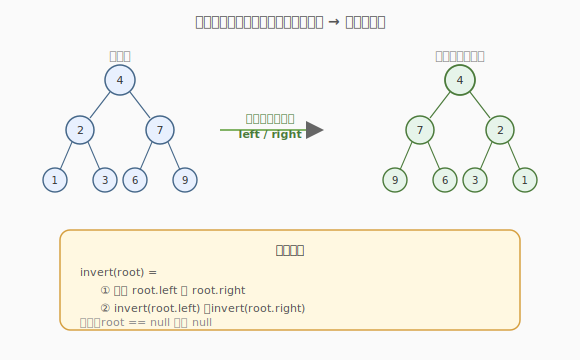
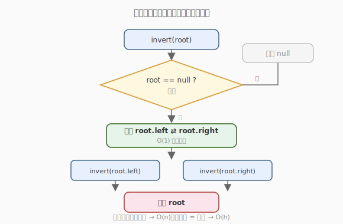

# 翻转二叉树

- **题目名称**：翻转二叉树
- **链接**：[226. 翻转二叉树](https://leetcode.cn/problems/invert-binary-tree/)
- **难度**：简单
- **标签**：树、二叉树、递归

## 1. 题目概述

给定一棵二叉树的根节点 `root`，翻转这棵树，使**每个节点的左右子树互换**，返回翻转后的根节点。

**示例 1**：

```text
输入：root = [4,2,7,1,3,6,9]
输出：[4,7,2,9,6,3,1]
解释：整棵树左右镜像翻转。
```

**示例 2**：

```text
输入：root = [2,1,3]
输出：[2,3,1]
```

**约束条件**：

- 树中节点数目范围 `[0, 100]`
- `-100 <= Node.val <= 100`

---

## 2. 解题思路

### 2.1 暴力思路：层序遍历逐层交换

用队列做层序遍历，每弹出一个节点就交换它的左右孩子。可行，但需要额外队列，代码略繁。其实**递归天然就是最好的解法**。

### 2.2 核心观察：每个节点都交换一次左右孩子



翻转二叉树 = 对**每个节点**执行「交换 `left` 与 `right`」。这是一句天然的递归描述：

> 翻转以 `root` 为根的树 = 交换 `root.left` 与 `root.right`，再分别翻转左右子树。

> 💡 这道题是**二叉树递归思维**的入门标杆：把「整棵树的问题」拆成「当前节点 + 两个子问题」。前序（先交换再递归）或后序（先递归再交换）都可以，因为交换操作与子树翻转互不影响。

### 2.3 算法流程图



### 2.4 示例演算

以 `root = [4,2,7,1,3,6,9]` 为例，递归自顶向下：

| 访问节点 | 操作 | 交换后 left / right |
|----------|------|---------------------|
| 4        | 交换左右 | 7 / 2 |
| 7        | 交换左右 | 9 / 6 |
| 2        | 交换左右 | 3 / 1 |
| 1,3,6,9  | 叶子，交换无变化 | null / null |

最终得到镜像树 `[4,7,2,9,6,3,1]`。

---

## 3. 参考代码

### C++

```cpp
class Solution {
  public:
    TreeNode* invertTree(TreeNode* root) {
        if (root == nullptr) return nullptr;
        TreeNode* tmp = root->left;
        root->left = root->right;
        root->right = tmp;
        invertTree(root->left);
        invertTree(root->right);
        return root;
    }
};
```

### Python

```python
class Solution:
    def invertTree(self, root: Optional[TreeNode]) -> Optional[TreeNode]:
        if not root:
            return None
        root.left, root.right = root.right, root.left
        self.invertTree(root.left)
        self.invertTree(root.right)
        return root
```

> 💡 Python 的 `a, b = b, a` 元组交换省去临时变量，一行搞定镜像。

---

## 4. 复杂度分析

| 维度 | 复杂度 | 说明 |
|------|--------|------|
| 时间复杂度 | O(n) | 每个节点访问一次，做 O(1) 交换 |
| 空间复杂度 | O(h) | 递归栈深度 = 树高 `h`；最坏链状 O(n)，平衡 O(log n) |

---

## 5. 扩展：迭代法（层序）

用队列模拟可避免递归栈溢出，适合极深的树：

```python
from collections import deque

class Solution:
    def invertTree(self, root: Optional[TreeNode]) -> Optional[TreeNode]:
        if not root:
            return None
        q = deque([root])
        while q:
            node = q.popleft()
            node.left, node.right = node.right, node.left
            if node.left:  q.append(node.left)
            if node.right: q.append(node.right)
        return root
```

> 💡 递归是「深度优先」地翻转，迭代是「广度优先」地翻转，两者等价。面试中递归版更简洁，迭代版展示对栈溢出的考虑。

---

## 6. 面试要点

1. **前序交换和后序交换有区别吗？**
   - 没有。交换当前节点的左右孩子，与翻转左右子树，是两个独立操作——无论先做哪个都不影响结果。前序（先交换后递归）写起来更直观，后序（先递归后交换）也可。

2. **为什么递归终止条件是** `root == null`**？**
   - 空树没有左右孩子可交换，直接返回 `null`。这是把「空子树」当作合法子问题处理，保证递归在叶子处自然收敛。

3. **空间复杂度为什么是 O(h)？**
   - 递归调用栈深度等于树高。平衡树 `h = O(log n)`，退化为链表时 `h = O(n)`。没有额外数组，所以空间就是栈深度。

4. **这题和「对称二叉树」（101）有什么关系？**
   - 翻转是「改造」树，对称是「判定」树是否镜像。有趣的是：一棵树对称 ⟺ 它等于自己翻转后的结果。所以 101 可借助翻转思路：翻转左子树后判断是否等于右子树。

5. **能否原地翻转？需要返回新树吗？**
   - 原地翻转，直接修改原节点的左右指针，不新建节点。返回的 `root` 仍是原根节点，只是子树结构变了。

---

## 7. 同类练习题
- [101. 对称二叉树](https://leetcode.cn/problems/symmetric-tree/)：判定是否镜像对称
- [104. 二叉树的最大深度](https://leetcode.cn/problems/maximum-depth-of-binary-tree/)：同样后序递归骨架
- [114. 二叉树展开为链表](https://leetcode.cn/problems/flatten-binary-tree-to-linked-list/)：另一种原地修改树结构
- [951. 翻转等价二叉树](https://leetcode.cn/problems/flip-equivalent-binary-trees/)：允许翻转的等价判定
