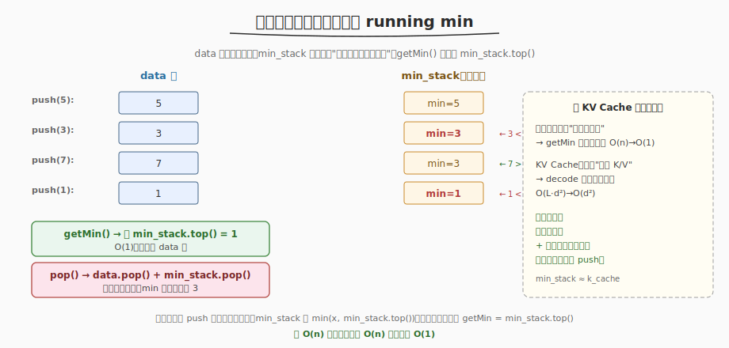
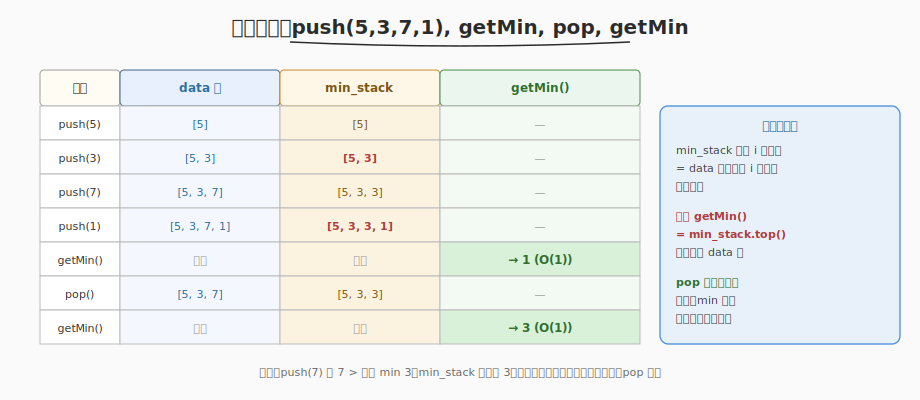

# 最小栈

- **题目名称**：最小栈
- **链接**：[155. 最小栈](https://leetcode.cn/problems/min-stack/)
- **难度**：中等
- **标签**：栈、设计

## 1. 题目概述

设计一个**最小栈**数据结构 `MinStack`，支持以下操作，且 **`getMin` 要在 O(1) 时间**完成：

- `push(x)`：将元素 x 压入栈顶
- `pop()`：弹出栈顶元素
- `top()`：获取栈顶元素
- `getMin()`：获取栈中最小元素

要求所有操作的时间复杂度均为 **O(1)**。

**示例**：

```text
输入：
  MinStack minStack = new MinStack();
  minStack.push(-2);
  minStack.push(0);
  minStack.push(-3);
  minStack.getMin();   → 返回 -3
  minStack.pop();
  minStack.top();      → 返回 0
  minStack.getMin();   → 返回 -2
```

**约束条件**：

- `-2^31 <= val <= 2^31 - 1`
- `pop`、`top`、`getMin` 操作总是在非空栈上调用
- `push`、`pop`、`top`、`getMin` 最多被调用 `3 × 10^4` 次

> 💡 难点在 `getMin` 要 O(1)。朴素做法是遍历栈求最小（O(n)），不满足要求。必须用**辅助栈**把"到当前位置为止的最小值"缓存下来。

---

## 2. 解题思路

### 2.1 暴力思路

`getMin` 时遍历整个栈求最小值。`push`/`pop`/`top` 都是 O(1)，但 `getMin` 是 **O(n)**——如果 `getMin` 被频繁调用，性能不可接受。

> ⚠️ 问题的本质：最小值是栈的**全局统计量**，每次 push/pop 后都可能变化。如果不缓存，每次查询都得重算。

### 2.2 核心观察：辅助栈同步维护 running min



关键洞察：**如果我们维护一个额外的 `min_stack`，每次 `push(x)` 时同步压入 `min(x, min_stack.top())`，那么 `min_stack` 的栈顶永远是"到当前位置为止的最小值"**，`getMin` 直接读 `min_stack.top()` 即可——O(1)。

这本质上是把"栈内最小值"这个**随 push/pop 动态变化的统计量**缓存到辅助栈，随主数据流增量维护，避免查询时从头重算。

> 💡 与 [Day 2 KV Cache](../../aiinfra/week5/day2/README.md) 的模式同构：KV Cache 把"历史 K/V"缓存到 `k_cache`，Decode 不必重算前缀（`O(L·d²)→O(d²)`）；最小栈把"栈内最小值"缓存到 `min_stack`，`getMin` 不必遍历栈（`O(n)→O(1)`）。两者都是**空间换时间 + 辅助状态随主数据增量维护**。

### 2.3 算法流程



```
push(x):
  data.push(x)
  min_stack.push(min(x, min_stack.top()))   // 同步压入当前最小

pop():
  data.pop()
  min_stack.pop()                            // 两栈同步弹出

top():
  return data.top()

getMin():
  return min_stack.top()                     // O(1)，不遍历 data
```

**关键不变量**：`min_stack` 的第 `i` 个元素 = `data` 栈底到第 `i` 个元素的最小值。因此 `getMin = min_stack.top()`，`pop` 时两栈同步弹出，min 自动回退。

### 2.4 示例演算

以 `push(5, 3, 7, 1), getMin, pop, getMin` 为例：

| 操作 | data 栈 | min_stack | getMin() |
|------|---------|-----------|----------|
| push(5) | [5] | [5] | — |
| push(3) | [5, 3] | [5, **3**] | — |
| push(7) | [5, 3, 7] | [5, 3, **3**] | — |
| push(1) | [5, 3, 7, 1] | [5, 3, 3, **1**] | — |
| getMin() | 不变 | 不变 | → **1** (O(1)) |
| pop() | [5, 3, 7] | [5, 3, 3] | — |
| getMin() | 不变 | 不变 | → **3** (O(1)) |

注意 `push(7)` 时 `7 > 3`（当前最小），`min_stack` 仍压入 `3`（复制当前最小），保证两栈等高、`pop` 同步。

---

## 3. 参考代码

### C++

```cpp
class MinStack {
    stack<int> data;
    stack<int> min_stack;

  public:
    MinStack() {
        min_stack.push(INT_MAX); // 哨兵，保证第一次 push 时 min_stack 非空
    }

    void push(int val) {
        data.push(val);
        min_stack.push(min(val, min_stack.top())); // 同步压入当前最小
    }

    void pop() {
        data.pop();
        min_stack.pop(); // 两栈同步弹出
    }

    int top() {
        return data.top();
    }

    int getMin() {
        return min_stack.top(); // O(1)
    }
};
```

### Python

```python
class MinStack:
    def __init__(self):
        self.data = []
        self.min_stack = [float('inf')]   # 哨兵

    def push(self, val: int) -> None:
        self.data.append(val)
        self.min_stack.append(min(val, self.min_stack[-1]))

    def pop(self) -> None:
        self.data.pop()
        self.min_stack.pop()

    def top(self) -> int:
        return self.data[-1]

    def getMin(self) -> int:
        return self.min_stack[-1]   # O(1)
```

> 💡 用哨兵（`INT_MAX` / `float('inf')`）初始化 `min_stack`，避免第一次 `push` 时 `min_stack` 为空的特判。也可不用哨兵，在 `push` 时判断 `min_stack` 是否为空。

---

## 4. 复杂度分析

| 维度 | 复杂度 | 说明 |
|------|--------|------|
| 时间复杂度 | O(1) | push/pop/top/getMin 均为栈顶操作，常数时间 |
| 空间复杂度 | O(n) | 多维护一个 `min_stack`，与 `data` 等高 |

> ⚠️ 空间换时间：用 O(n) 额外空间（min_stack），把 `getMin` 从 O(n) 压到 O(1)。

---

## 5. 扩展：差值法（O(1) 额外空间）

辅助栈法用 O(n) 额外空间。如果要求 **O(1) 额外空间**（不用 min_stack），可用**差值法**：`data` 栈不存原始值，而存 `x - current_min`，用符号位/大小关系编码当前最小值。

```python
class MinStack:
    def __init__(self):
        self.data = []
        self.min_val = 0

    def push(self, val: int) -> None:
        if not self.data:
            self.data.append(0)
            self.min_val = val
        else:
            diff = val - self.min_val
            self.data.append(diff)
            if diff < 0:            # val < min_val → 更新最小
                self.min_val = val

    def pop(self) -> None:
        diff = self.data.pop()
        if diff < 0:                # 弹出的是"曾经更新过最小"的元素
            self.min_val = self.min_val - diff   # 恢复上一个最小

    def top(self) -> int:
        diff = self.data[-1]
        if diff > 0:
            return self.min_val + diff
        else:
            return self.min_val     # diff < 0 时栈顶就是 min_val

    def getMin(self) -> int:
        return self.min_val
```

> ⚠️ 差值法用 `long` 防溢出（`val - min` 可能超出 int 范围）。面试时先讲辅助栈法（清晰易写），再提差值法作为"进阶 O(1) 空间"优化。

---

## 6. 面试要点

1. **为什么辅助栈的 `push` 要压入 `min(x, min_stack.top())` 而不是只在 x 更小时才压？**

   - 保证两栈**等高**、`pop` 同步。如果只在 `x < min` 时才压 min_stack，两栈高度不同，`pop` 时无法简单同步弹出，要判断"弹出的元素是否是当前最小"来决定 min_stack 是否也弹——逻辑复杂且易错。每次都压 `min(x, top)`，两栈永远等高，`pop` 时无脑同步弹即可。

2. **这题和 KV Cache 的设计模式有什么共同点？**

   - 都是"维护辅助状态以避免从头重算"。最小栈缓存"栈内最小值"到 `min_stack`，`getMin` 不必遍历栈（O(n)→O(1)）；KV Cache 缓存"历史 K/V"到 `k_cache`，Decode 不必重算前缀（O(L·d²)→O(d²)）。两者都是**空间换时间 + 辅助状态随主数据增量维护**——`min_stack` 随 `push/pop` 同步更新，`k_cache` 随 Decode 每步 `append`。这是缓存设计的通用范式。

3. **不用额外栈能做到 O(1) getMin 吗？**

   - 能，用**差值法**：`data` 栈存 `x - current_min` 而非原始值。`push` 时若差值为负（说明 x 是新最小），更新 `min_val`；`pop` 时若弹出差值为负，恢复上一个最小。额外空间 O(1)（只多存一个 `min_val` 变量），但要注意用 `long` 防溢出。面试先讲辅助栈（清晰），再提差值法作为进阶。

4. **如果栈里有重复元素，辅助栈法还正确吗？**

   - 正确。`min(x, top)` 对重复元素也成立——比如已有 min=3，再 push(3)，`min(3,3)=3`，min_stack 压 3。pop 时两栈同步弹，min 仍是 3（来自更早的 3）。重复元素不影响"min_stack 栈顶 = 当前最小"这一不变量。

5. **pop 时如果不弹 min_stack 会怎样？**

   - 不变量被破坏。比如 `push(5,3,1)` 后 min_stack=[5,3,1]，若 pop(1) 时不弹 min_stack，getMin 仍返回 1，但 data 栈里已经没有 1 了——结果错误。两栈必须同步弹，保证 min_stack 栈顶始终对应 data 栈当前状态的最小值。

---

## 7. 同类练习题
- [155. 最小栈](https://leetcode.cn/problems/min-stack/)：辅助栈
- [232. 用栈实现队列](https://leetcode.cn/problems/implement-queue-using-stacks/)：双栈倒换
- [225. 用队列实现栈](https://leetcode.cn/problems/implement-stack-using-queues/)：双队列倒换
