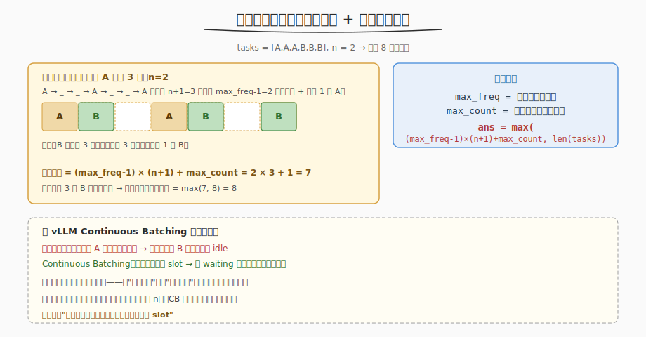
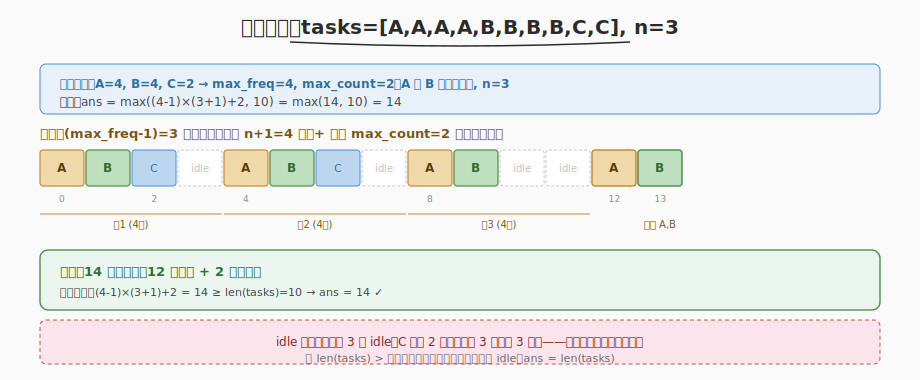

# 任务调度器

- **题目名称**：任务调度器
- **链接**：[621. 任务调度器](https://leetcode.cn/problems/task-schedule/)
- **难度**：中等
- **标签**：贪心、数组、计数

## 1. 题目概述

给定一个用字符数组 `tasks` 表示的 CPU 任务列表（每个字母代表一种任务），以及冷却时间 `n`。**同一类任务执行后必须间隔 `n` 个单位时间**才能再执行同类任务。每个单位时间可执行一个任务或待命（idle）。求完成所有任务的最少时间。

**示例 1**：

```text
输入：tasks = ["A","A","A","B","B","B"], n = 2
输出：8
解释：A → B → idle → A → B → idle → A → B
```

**示例 2**：

```text
输入：tasks = ["A","A","A","A","B","B","B","B","C","C"], n = 3
输出：14
```

**约束条件**：

- `1 <= tasks.length <= 10^4`
- `tasks[i]` 是大写英文字母
- `0 <= n <= 100`

> 💡 难点在于"如何安排任务顺序使总时间最短"。朴素模拟（每轮选可执行的最高频任务）可做但代码复杂。**贪心公式法**可直接 O(n) 算出答案。

---

## 2. 解题思路

### 2.1 暴力模拟思路

每一单位时间，从所有"冷却已结束"的任务里选剩余次数最多的执行；若都冷却中则 idle。用优先队列维护。时间 `O(time × log26)`，能过但代码长且不直观。

> ⚠️ 模拟法的瓶颈：要逐时间步推演，当 idle 多时效率低。能否直接算出答案？

### 2.2 核心观察：构造框架法



关键洞察：**最高频任务决定框架大小**。设最高频任务出现 `max_freq` 次，同类任务间隔至少 `n`，那么最高频任务本身就需要 `(max_freq - 1) × (n + 1) + 1` 个时间单位（前 `max_freq-1` 次每次后跟 `n` 个间隙，最后一次不跟）。

构造一个**框架**：

```
A _ _ ... _ | A _ _ ... _ | ... | A _ _ ... _ | A
└─ n+1 格 ──┘  └─ n+1 格 ──┘       └─ n+1 格 ──┘
   (max_freq-1 个完整组)                  末尾 1 个 A
```

- 框架大小 = `(max_freq - 1) × (n + 1) + 1`（只放最高频任务 A）
- 其他任务填入框架的空位（`_`）
- 如果有 `max_count` 个任务并列最高频（如 A 和 B 都出现 `max_freq` 次），末尾要放 `max_count` 个 → 框架大小 = `(max_freq - 1) × (n + 1) + max_count`

##### 两种情况

1. **框架够大**（低频任务填不满空位）：剩余空位用 idle 填 → `ans = (max_freq - 1) × (n + 1) + max_count`
2. **框架不够**（低频任务太多填不下，无 idle）：直接一轮一轮排都能塞下 → `ans = len(tasks)`

取两者最大值：

```
ans = max((max_freq - 1) × (n + 1) + max_count, len(tasks))
```

> 💡 为什么 `len(tasks)` 是下界？因为没有冷却约束时，最少就是任务总数。当低频任务多到能填满所有间隙（甚至溢出），就不需要 idle，总时间 = 任务数。

### 2.3 示例演算

以 `tasks = [A,A,A,A,B,B,B,B,C,C], n = 3` 为例：



| 步骤 | 计算 |
|------|------|
| 频次统计 | A=4, B=4, C=2 |
| max_freq | 4（A 和 B 并列） |
| max_count | 2（A 和 B 都是 4 次） |
| 框架大小 | (4-1)×(3+1)+2 = 14 |
| len(tasks) | 10 |
| ans | max(14, 10) = **14** |

构造：3 个完整组（每组 4 格：A B C _），末尾 A B。C 只有 2 个填不满 3 组的第 3 格 → 3 个 idle。

### 2.4 n=0 的退化

当 `n=0`（无冷却），框架公式 = `(max_freq-1)×1 + max_count = max_freq - 1 + max_count`。但 `len(tasks) ≥ max_freq`（至少有 max_freq 个最高频任务），所以 `ans = len(tasks)`——无冷却时直接顺序执行，符合直觉。

---

## 3. 参考代码

### C++

```cpp
class Solution {
  public:
    int leastInterval(vector<char>& tasks, int n) {
        int freq[26] = {0};
        for (char t : tasks)
            freq[t - 'A']++;

        int max_freq = 0, max_count = 0;
        for (int f : freq) {
            if (f > max_freq) {
                max_freq = f;
                max_count = 1;
            } else if (f == max_freq)
                max_count++;
        }

        int framework = (max_freq - 1) * (n + 1) + max_count;
        return max(framework, (int)tasks.size());
    }
};
```

### Python

```python
class Solution:
    def leastInterval(self, tasks: List[str], n: int) -> int:
        from collections import Counter
        freq = Counter(tasks)
        max_freq = max(freq.values())
        max_count = sum(1 for f in freq.values() if f == max_freq)

        framework = (max_freq - 1) * (n + 1) + max_count
        return max(framework, len(tasks))
```

> 💡 代码极简：统计频次 → 找最高频及其种类数 → 套公式。无需模拟时间线。

---

## 4. 复杂度分析

| 维度 | 复杂度 | 说明 |
|------|--------|------|
| 时间复杂度 | O(n) | 遍历 tasks 统计频次 + 遍历 26 字母找最高频 |
| 空间复杂度 | O(1) | 频次数组固定 26（大写字母） |

> ⚠️ 若任务种类不限字母（如任意整数），空间变为 O(k)，k 为种类数，但时间仍 O(n)。

---

## 5. 扩展：模拟法（优先队列）

面试官可能追问"如果不让用公式，怎么模拟"。用最大堆 + 冷却队列：

```python
import heapq
from collections import deque, Counter

class Solution:
    def leastInterval(self, tasks: List[str], n: int) -> int:
        freq = [-f for f in Counter(tasks).values()]   # 最大堆（Python 用负数）
        heapq.heapify(freq)
        cooldown = deque()   # (剩余次数, 可执行时间)
        time = 0
        while freq or cooldown:
            time += 1
            if freq:
                cnt = heapq.heappop(freq) + 1   # 取最高频（负数+1=减1）
                if cnt < 0:                      # 还有剩余，进冷却
                    cooldown.append((cnt, time + n))
            if cooldown and cooldown[0][1] == time:
                heapq.heappush(freq, cooldown.popleft()[0])
        return time
```

> 💡 模拟法直观（每轮选最高频、冷却中的进队列、到时间放回堆），但代码长、效率低。面试先讲公式法，再提模拟法作为"如果不能用数学公式"的备选。

---

## 6. 面试要点

1. **为什么最高频任务决定框架大小？**

   - 最高频任务 A 出现 `max_freq` 次，同类间隔至少 `n`，所以 A 本身至少需要 `(max_freq-1)×(n+1)+1` 个时间单位
   - 其他任务的出现次数 ≤ `max_freq`，都能填入 A 的间隙里（每组 `n` 个空位，最多放 `n` 种其他任务各 1 次）
   - 所以框架由最高频任务撑起，其他任务只是填充

2. **max_count 是什么？为什么末尾要加它？**

   - `max_count` 是"出现次数等于 max_freq 的任务种数"（如 A 和 B 都出现 4 次，max_count=2）
   - 框架末尾的最后一组只放最高频任务，但有 `max_count` 种并列最高 → 末尾放 `max_count` 个
   - 所以框架 = `(max_freq-1)×(n+1) + max_count`，不是 `+1`

3. **为什么取 max(framework, len(tasks))？**

   - `framework` 是"有 idle 时的最小时间"（间隙填不满）
   - `len(tasks)` 是"无 idle 时的最小时间"（低频任务太多，间隙溢出，直接顺序排无空等）
   - 实际答案取两者最大：如果任务总数 > 框架，说明无 idle，直接 = 任务数；否则用框架（含 idle）

4. **这题和 vLLM Continuous Batching 有什么共同模式？**

   - 都是"资源约束下的填充"：任务调度器用低频任务填高频任务的冷却间隙；Continuous Batching 用 waiting 新请求填 running 完成后的 slot
   - 本质都是"排满时间线、不浪费 slot"——任务调度器不浪费冷却间隙，CB 不浪费 GPU 的 decode slot
   - 差异：任务调度器的间隙来自冷却约束（同类间隔 n），CB 的间隙来自请求长度不齐（短请求先完成留空 slot）

5. **n=0 时公式还成立吗？**

   - 成立。n=0 时框架 = `(max_freq-1)×1 + max_count = max_freq - 1 + max_count`
   - 但 `len(tasks) ≥ max_freq ≥ max_freq - 1 + max_count`（当 max_count > 1 时可能相等，否则 len 更大）
   - 所以 `ans = len(tasks)`——无冷却直接顺序执行，符合直觉

---

## 7. 同类练习题
- [621. 任务调度器](https://leetcode.cn/problems/task-scheduler/)：贪心 + 桶思想
- [358. K 距离间隔重排字符串](https://leetcode.cn/problems/rearrange-string-k-distance-apart/)：贪心 + 堆
- [767. 重构字符串](https://leetcode.cn/problems/reorganize-string/)：贪心重排
