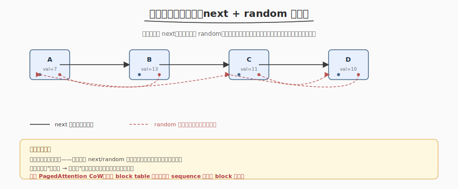
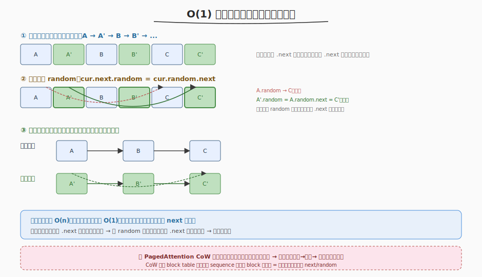

# 复制带随机指针的链表

- **题目名称**：复制带随机指针的链表
- **链接**：[138. 复制带随机指针的链表](https://leetcode.cn/problems/copy-list-with-random-pointer/)
- **难度**：中等
- **标签**：链表、哈希表

## 1. 题目概述

给定一个长度为 `n` 的链表，每个节点除了 `next` 指针外还有一个 `random` 指针，可指向链表中任意节点或 `null`。请**深拷贝**整个链表——构造一个全新链表，节点关系（next + random）与原链表完全一致，返回新链表的头节点。

**示例**：

```text
输入：head = [[7,null],[13,0],[11,4],[10,2],[1,0]]
      （每个 [val, random_index]，random_index 是 random 指向的节点下标，null 表示 random 为空）
输出：[[7,null],[13,0],[11,4],[10,2],[1,0]]
      （全新链表，结构与原链表一致）
```

**约束条件**：

- `0 <= n <= 1000`
- `-10^4 <= Node.val <= 10^4`
- `Node.random` 为 `null` 或指向链表中的节点

> 💡 难点在 `random` 指针：新节点的 random 必须指向新链表里的节点，而非原链表。不能简单复制指针值。

---

## 2. 解题思路

### 2.1 暴力思路

遍历原链表，对每个节点创建新节点，但设置 random 时发现"新节点要指向的新 random 节点可能还没创建"——需要先建完所有新节点，再回头设 random。这就需要一个"旧节点 → 新节点"的映射来查找。



> ⚠️ 暴力的瓶颈：没有映射就无法在 O(1) 找到"旧 random 对应的新节点"——要么 O(n²) 遍历查找，要么用哈希表存映射。

### 2.2 核心观察：建立"旧→新"映射

关键洞察：**深拷贝带复杂引用的结构，核心是建立"旧节点 → 新节点"的映射**，复制时据此修正所有引用。两种实现：

**方法一：哈希表**（两次遍历，O(n) 空间）

```
第一遍：遍历原链表，为每个旧节点创建新节点，存 map[old] = new
第二遍：遍历原链表，设 new.next = map[old.next], new.random = map[old.random]
```

**方法二：拼接拆分**（O(1) 空间，利用原链表的 next 指针做映射）



不用哈希表，把新节点**穿插**到原链表里，用"旧节点 .next = 新副本"充当映射：

```
① 插入副本：A → A' → B → B' → C → C' → ...
   每个旧节点 .next 指向其副本

② 设副本的 random：
   cur.next.random = cur.random.next
   （旧 random 指向的旧节点的 .next 就是新副本！）

③ 拆分奇偶链表：
   奇数位（A, B, C）恢复为原链表
   偶数位（A', B', C'）组成新链表
```

> 💡 方法二的精髓：**借用原链表的 next 指针充当"旧→新"映射**——旧节点 .next 指向新副本，所以"旧 random 指向的旧节点的 .next"就是对应的新副本。无需额外哈希表，空间 O(1)。

### 2.3 与 PagedAttention Copy-on-Write 的模式类比

这道题是 **CoW 机制的算法直觉**。PagedAttention 的 CoW 要"复制一个被多个 sequence 共享的 block table 结构"——本质就是"深拷贝带复杂引用的结构"：

| 维度 | 复制带随机指针的链表 | PagedAttention CoW |
|------|---------------------|-------------------|
| 复制对象 | 链表节点（含 next + random） | block table（逻辑→物理映射） |
| 引用修正 | next/random 指向新节点 | 各 sequence 对物理 block 的引用 |
| 核心难点 | 不能简单复制指针值 | 不能简单复制 block 号（共享 block 要 CoW） |
| 解决方案 | 建立"旧→新"映射再修正 | fork 复制 table + refcount，写入时复制 |

两者核心都是：**复制带共享引用的结构时，先建映射（旧→新）再修正所有指针**——链表用哈希表或穿插映射，CoW 用 refcount + 物理复制。

---

## 3. 参考代码

### 方法一：哈希表（C++，O(n) 空间）

```cpp
class Solution {
  public:
    Node* copyRandomList(Node* head) {
        if (!head)
            return nullptr;
        unordered_map<Node*, Node*> mp; // 旧 → 新

        // 第一遍：创建所有新节点
        for (Node* cur = head; cur; cur = cur->next)
            mp[cur] = new Node(cur->val);

        // 第二遍：设 next 和 random
        for (Node* cur = head; cur; cur = cur->next) {
            mp[cur]->next = mp[cur->next]; // nullptr 也能正确映射
            mp[cur]->random = mp[cur->random];
        }
        return mp[head];
    }
};
```

### 方法二：拼接拆分（C++，O(1) 空间）

```cpp
class Solution {
  public:
    Node* copyRandomList(Node* head) {
        if (!head)
            return nullptr;

        // ① 插入副本：A → A' → B → B' → ...
        for (Node* cur = head; cur; cur = cur->next->next) {
            Node* copy = new Node(cur->val);
            copy->next = cur->next;
            cur->next = copy;
        }

        // ② 设副本的 random：cur.next.random = cur.random.next
        for (Node* cur = head; cur; cur = cur->next->next) {
            if (cur->random)
                cur->next->random = cur->random->next;
        }

        // ③ 拆分奇偶链表
        Node* newHead = head->next;
        for (Node* cur = head; cur; cur = cur->next) {
            Node* copy = cur->next;
            cur->next = copy->next;                               // 恢复原链表
            copy->next = copy->next ? copy->next->next : nullptr; // 新链表
        }
        return newHead;
    }
};
```

### Python（哈希表法）

```python
class Solution:
    def copyRandomList(self, head: 'Optional[Node]') -> 'Optional[Node]':
        if not head:
            return None
        mp = {}

        # 第一遍：创建新节点
        cur = head
        while cur:
            mp[cur] = Node(cur.val)
            cur = cur.next

        # 第二遍：设 next 和 random
        cur = head
        while cur:
            mp[cur].next = mp.get(cur.next)
            mp[cur].random = mp.get(cur.random)
            cur = cur.next

        return mp[head]
```

> 💡 面试先讲哈希表法（清晰直观），再讲 O(1) 空间拼接法作为"进阶优化"。两种方法都体现了"建映射再修正"的核心思想。

---

## 4. 复杂度分析

| 方法 | 时间 | 空间 | 说明 |
|------|------|------|------|
| 哈希表 | O(n) | O(n) | 两次遍历，哈希表存 n 个映射 |
| 拼接拆分 | O(n) | O(1) | 三次遍历，借用原 next 指针做映射 |

> ⚠️ 拼接拆分法的"O(1) 空间"不含输出链表本身（题目要求返回新链表，新节点空间不算额外空间）。它省掉的是哈希表那 O(n) 的映射存储。

---

## 5. 扩展：图的深拷贝

带 random 指针的链表本质是一个**带任意引用的有向图**（next 是顺序边，random 是跳跃边）。更一般的问题是 [133. 克隆图](https://leetcode.cn/problems/clone-graph/)——给定无向连通图的邻接表，深拷贝整个图。解法同样是"哈希表存旧→新映射 + BFS/DFS 遍历建边"。掌握本题后，克隆图是直接推广。

---

## 6. 面试要点

1. **为什么不能直接复制指针值？**

   - 新节点的 next/random 必须指向**新链表里的节点**，而非原链表。直接复制 `old.next` 的指针值会让新节点指向旧节点——不是深拷贝，新旧链表纠缠，修改一个会影响另一个。
   - 必须建立"旧→新"映射，复制时把旧指针翻译成新指针。

2. **拼接拆分法为什么是 O(1) 空间？它不需要映射吗？**

   - 它也需要"旧→新"映射，但**借用原链表的 next 指针**充当映射——插入副本后，`old.next` 就是 `new`，所以"旧 random 指向的旧节点的 .next"就是对应新副本。
   - 不需要额外哈希表，省下 O(n) 空间。代价是三次遍历 + 修改原链表结构（最后拆分时恢复）。

3. **拼接拆分法第②步 `cur.next.random = cur.random.next` 怎么理解？**

   - `cur` 是旧节点，`cur.next` 是它的副本（新节点）
   - `cur.random` 是旧 random 指向的旧节点，`cur.random.next` 就是该旧节点对应的新副本
   - 所以 `cur.next.random = cur.random.next` 就是"新节点的 random = 旧 random 对应的新副本"——正是我们要的
   - 注意 `cur.random` 可能为 null，要判空

4. **这题和 PagedAttention 的 Copy-on-Write 有什么共同点？**

   - 都是"深拷贝带复杂引用的结构"。链表的 random 指针像 block table 的逻辑→物理映射，复制时不能简单复制指针值
   - 两者核心都是"先建映射（旧→新）再修正所有引用"——链表用哈希表或穿插映射，CoW 用 fork（复制 table + refcount+1）+ 写入时物理复制
   - CoW 的 fork 操作 = 链表的"创建所有新节点"；CoW 的写入触发复制 = 链表的"修正被共享节点的引用"

5. **哈希表法里 `mp[cur->next]` 当 cur->next 为 nullptr 时怎么办？**

   - C++ `unordered_map` 对不存在的 key 插入会值初始化（`Node*` → `nullptr`），所以 `mp[nullptr]` 返回 nullptr，正好是我们要的——新链表末尾的 next 也是 nullptr。
   - Python 用 `mp.get(cur.next)` 更显式，key 不存在返回 None。
   - 若不想依赖这个特性，可以先 `if (cur->next) mp[cur]->next = mp[cur->next];`，但通常直接取更简洁。

---

## 7. 同类练习题
- [133. 克隆图](https://leetcode.cn/problems/clone-graph/)：图的深拷贝
- [138. 复制带随机指针的链表](https://leetcode.cn/problems/copy-list-with-random-pointer/)：哈希映射
- [437. 路径总和 III](https://leetcode.cn/problems/path-sum-iii/)：前缀和 + DFS
