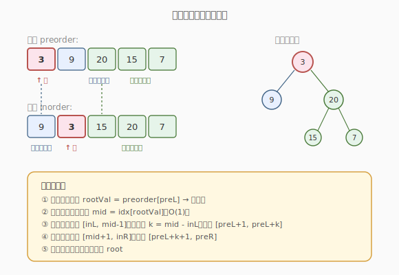
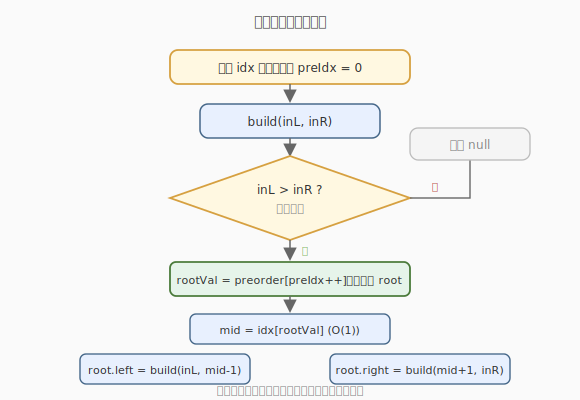

# 从前序与中序遍历序列构造二叉树

- **题目名称**：从前序与中序遍历序列构造二叉树
- **链接**：[105. 从前序与中序遍历序列构造二叉树](https://leetcode.cn/problems/construct-binary-tree-from-preorder-and-inorder-traversal/)
- **难度**：中等
- **标签**：树、二叉树、分治、哈希表

## 1. 题目概述

给定两个整数数组 `preorder` 和 `inorder`，分别表示同一棵二叉树的**前序遍历**与**中序遍历**，请构造并返回这棵二叉树。题目保证 `preorder` 与 `inorder` 元素互不相同。

**示例 1**：

```text
输入：preorder = [3,9,20,15,7], inorder = [9,3,15,20,7]
输出：[3,9,20,null,null,15,7]
```

**示例 2**：

```text
输入：preorder = [-1], inorder = [-1]
输出：[-1]
```

**约束条件**：

- `1 <= preorder.length <= 3000`
- `inorder.length == preorder.length`
- `-3000 <= preorder[i], inorder[i] <= 3000`
- `preorder` 和 `inorder` 互不相同
- 保证 `inorder` 是某棵树的中序遍历，`preorder` 是同一棵树的前序遍历

---

## 2. 解题思路

### 2.1 暴力思路：逐层猜测

前序第一个是根，但在 `inorder` 里线性扫描找根的位置是 `O(n)`，每层都找一遍，总复杂度 `O(n^2)`。可用**哈希表**把查找降到 `O(1)`。

### 2.2 核心观察：前序定根，中序分左右



两条遍历序列的合作方式：

1. **前序**的第一个元素 `preorder[preL]` 一定是当前子树的**根**。
2. 在 `inorder` 中找到这个根的位置 `idx`，则：
   - `inorder[inL .. idx-1]` 是**左子树**的中序（共 `k = idx - inL` 个元素）。
   - `inorder[idx+1 .. inR]` 是**右子树**的中序。
3. 由「左右子树节点数相同」对应回前序：
   - `preorder[preL+1 .. preL+k]` 是左子树的前序。
   - `preorder[preL+k+1 .. preR]` 是右子树的前序。
4. 对左右子树**递归**构造。

> 💡 用哈希表 `val -> idx` 预存 `inorder` 的下标，第 2 步找根从 `O(n)` 降到 `O(1)`，整体 `O(n)`。

### 2.3 算法流程图



### 2.4 示例演算

以 `preorder = [3,9,20,15,7]`，`inorder = [9,3,15,20,7]` 为例：

| 步骤 | 当前根 | inorder 区间 | 划分 | pre 左区间 | pre 右区间 |
|------|--------|--------------|------|------------|------------|
| 1    | 3      | [9,3,15,20,7] | 左=[9], 右=[15,20,7] | [9] | [20,15,7] |
| 2    | 9      | [9]          | 左=[], 右=[] | — | — |
| 3    | 20     | [15,20,7]    | 左=[15], 右=[7] | [15] | [7] |
| 4    | 15     | [15]         | 叶子 | — | — |
| 5    | 7      | [7]          | 叶子 | — | — |

最终树：`3` 的左孩子 `9`、右孩子 `20`；`20` 的左孩子 `15`、右孩子 `7`。

---

## 3. 参考代码

### C++

```cpp
class Solution {
  public:
    TreeNode* buildTree(vector<int>& preorder, vector<int>& inorder) {
        unordered_map<int, int> idx;
        for (int i = 0; i < (int)inorder.size(); ++i) idx[inorder[i]] = i;
        int preIdx = 0;                          // 全局指针，指向下一个待用的根
        return build(preorder, idx, preIdx, 0, (int)inorder.size() - 1);
    }

  private:
    TreeNode* build(vector<int>& preorder, unordered_map<int, int>& idx,
                    int& preIdx, int inL, int inR) {
        if (inL > inR) return nullptr;
        int rootVal = preorder[preIdx++];        // 前序下一个就是根
        TreeNode* root = new TreeNode(rootVal);
        int mid = idx[rootVal];                  // O(1) 定位中序中的根
        root->left  = build(preorder, idx, preIdx, inL, mid - 1);
        root->right = build(preorder, idx, preIdx, mid + 1, inR);
        return root;
    }
};
```

### Python

```python
class Solution:
    def buildTree(self, preorder: List[int], inorder: List[int]) -> Optional[TreeNode]:
        idx = {v: i for i, v in enumerate(inorder)}
        pre_iter = iter(preorder)

        def build(inL: int, inR: int) -> Optional[TreeNode]:
            if inL > inR:
                return None
            rootVal = next(pre_iter)             # 前序下一个就是根
            root = TreeNode(rootVal)
            mid = idx[rootVal]
            root.left = build(inL, mid - 1)
            root.right = build(mid + 1, inR)
            return root

        return build(0, len(inorder) - 1)
```

> 💡 用一个**全局前序指针** `preIdx`（或迭代器）按前序顺序取根，能省去显式传递 `preL`、`preR`：因为前序中根的顺序严格等价于「先当前、再整个左子树、再整个右子树」，与递归展开顺序完全一致。关键是**先递归左子树再递归右子树**。

---

## 4. 复杂度分析

| 维度 | 复杂度 | 说明 |
|------|--------|------|
| 时间复杂度 | O(n) | 每个节点构造一次；哈希表查根 O(1) |
| 空间复杂度 | O(n) | 哈希表 O(n)；递归栈最坏 O(n)（链状树） |

---

## 5. 扩展：从中序与后序构造（106）

[106. 从中序与后序遍历序列构造二叉树](https://leetcode.cn/problems/construct-binary-tree-from-inorder-and-postorder-traversal/) 思路几乎相同，只是根在后序的**末尾**，且递归顺序变成**先右后左**（若仍按后序指针从尾向头移动）：

- 后序最后一个元素是根。
- 中序同样按根划分左右。
- 关键：后序指针从右往左移动时，先构造的子树是右子树，所以递归顺序为先 `right` 再 `left`。

> 💡 记忆口诀：**前序配中序，根在首、先左后右；后序配中序，根在尾、先右后左。**

---

## 6. 面试要点

1. **为什么前序的第一个元素一定是根？**
   - 前序遍历顺序是「根-左-右」，所以任何一段前序子序列的首元素就是该子树的根。这是前序配合中序重构树的根本依据。

2. **哈希表存的是什么？为什么能 O(1) 定位根？**
   - 存 `inorder` 中值到下标的映射。知道根值后，一次哈希查询即可得到它在中序里的位置 `mid`，从而划分左右子树区间，免去线性扫描。

3. **为什么用全局前序指针，不用传 preL/preR？**
   - 前序中根的出现顺序与「当前根 → 整棵左子树 → 整棵右子树」的递归展开顺序一致。只要**严格先递归左、再递归右**，全局指针就会自动按正确顺序取到每个根，省去区间计算，代码更简洁。

4. **如果元素有重复怎么办？**
   - 哈希表映射会失效（一个值对应多个下标）。此时需改成「在前序取根后，于中序区间内线性找第一个匹配且未被占用位置」等策略，或改用带相同值处理约定。本题保证互不相同，故无需考虑。

5. **能否改成迭代法？**
   - 可以。利用前序与中序的「栈式匹配」：按前序顺序压栈，当栈顶等于 `inorder` 当前值时弹栈并移动 `inorder` 指针，构造右子树。思路精巧但难写，面试一般写递归版即可。

---

## 7. 同类练习题
- [106. 从中序与后序遍历序列构造二叉树](https://leetcode.cn/problems/construct-binary-tree-from-inorder-and-postorder-traversal/)：根在后序末尾
- [1008. 前序遍历构造二叉搜索树](https://leetcode.cn/problems/construct-binary-search-tree-from-preorder-traversal/)：仅前序 + BST 性质
- [889. 根据前序和后序遍历构造二叉树](https://leetcode.cn/problems/construct-binary-tree-from-preorder-and-postorder-traversal/)：解不唯一
- [297. 二叉树的序列化与反序列化](https://leetcode.cn/problems/serialize-and-deserialize-binary-tree/)：用遍历序列表示树
