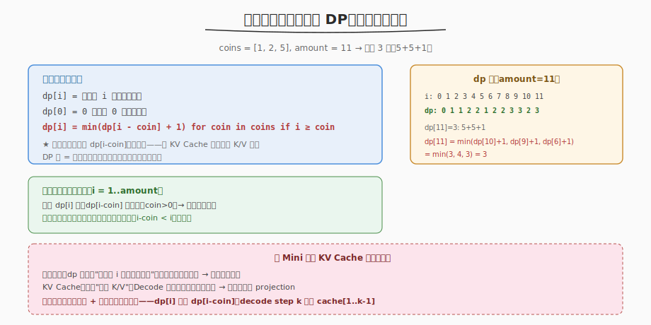
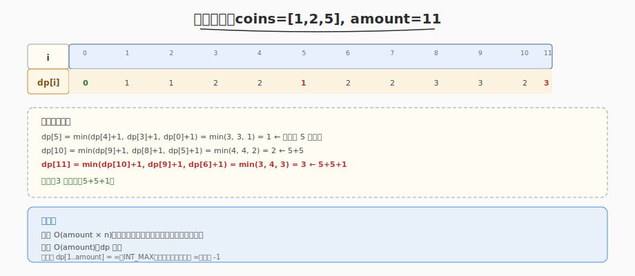

# 零钱兑换

- **题目名称**：零钱兑换
- **链接**：[322. 零钱兑换](https://leetcode.cn/problems/coin-change/)
- **难度**：中等
- **标签**：动态规划、完全背包

## 1. 题目概述

给定不同面额的硬币 `coins` 和一个总金额 `amount`，计算凑成总金额所需的**最少硬币数**。无法凑出返回 `-1`。**每种硬币数量不限**（完全背包）。

**示例 1**：

```text
输入：coins = [1, 2, 5], amount = 11
输出：3
解释：11 = 5 + 5 + 1，最少 3 枚
```

**示例 2**：

```text
输入：coins = [2], amount = 3
输出：-1
解释：只有面额 2 的硬币，凑不出奇数金额 3
```

**示例 3**：

```text
输入：coins = [1], amount = 0
输出：0
```

**约束条件**：

- `1 <= coins.length <= 12`
- `1 <= coins[i] <= 2^31 - 1`
- `0 <= amount <= 10^4`

> 💡 难点在"最少"和"无限数量"。贪心（每次取最大面额）不总是最优（如 `coins=[1,3,4], amount=6`：贪心取 4+1+1=3 枚，最优是 3+3=2 枚）。必须用 DP。

---

## 2. 解题思路

### 2.1 贪心思路（错误示范）

每次取 ≤ 剩余金额的最大面额硬币。反例：`coins=[1,3,4], amount=6` → 贪心 4+1+1（3 枚），最优 3+3（2 枚）。

> ⚠️ 贪心失败的根因：当前最大面额可能不是全局最优。需要枚举所有硬币选择，取最小——这就是 DP。

### 2.2 核心观察：完全背包 DP



关键洞察：**`dp[i]`（凑金额 i 的最少硬币数）依赖 `dp[i-coin]`（凑更小金额的最少硬币数）**——子问题已算好，直接查表复用，不重算。

```
dp[0] = 0                              （金额 0 不需硬币）
dp[i] = min(dp[i - coin] + 1)          for coin in coins if i >= coin
       ↑ 复用前面已算的 dp[i-coin]      （与 KV Cache 复用历史 K/V 同构）
无法凑出时 dp[i] = ∞
```

> 💡 与 [Day5 Mini 引擎 KV Cache](../../aiinfra/week5/day5/README.md) 的模式同构：DP 表缓存"凑金额 i 的最少硬币数"，后续金额查表复用；KV Cache 缓存"历史 K/V"，Decode 每步复用而非重算。两者都是**增量推进 + 复用缓存的状态机**——`dp[i]` 依赖 `dp[i-coin]`，decode step k 复用 cache[1..k-1]。

### 2.3 算法流程

1. 初始化 `dp[0..amount] = ∞`，`dp[0] = 0`
2. `for i = 1..amount`：`dp[i] = min(dp[i-coin] + 1)` 遍历所有 coin
3. `dp[amount] == ∞` 返回 `-1`，否则返回 `dp[amount]`

### 2.4 示例演算

以 `coins = [1, 2, 5], amount = 11` 为例：



| i | dp[i] 的计算 | dp[i] | 说明 |
|---|-------------|-------|------|
| 0 | — | 0 | 金额 0 |
| 1 | dp[0]+1 | 1 | 用 1 枚 1 分 |
| 2 | min(dp[1]+1, dp[0]+1) | 1 | 用 1 枚 2 分 |
| 3 | min(dp[2]+1, dp[1]+1) | 2 | 1+2 |
| 4 | min(dp[3]+1, dp[2]+1) | 2 | 2+2 |
| 5 | min(dp[4]+1, dp[3]+1, dp[0]+1) | 1 | 1 枚 5 分 |
| 6 | min(dp[5]+1, dp[4]+1, dp[1]+1) | 2 | 5+1 |
| ... | ... | ... | ... |
| 10 | min(dp[9]+1, dp[8]+1, dp[5]+1) | 2 | 5+5 |
| 11 | min(dp[10]+1, dp[9]+1, dp[6]+1) = min(3,4,3) | **3** | 5+5+1 |

答案：3 枚硬币（5+5+1）。

---

## 3. 参考代码

### C++

```cpp
class Solution {
  public:
    int coinChange(vector<int>& coins, int amount) {
        vector<int> dp(amount + 1, INT_MAX);
        dp[0] = 0;
        for (int i = 1; i <= amount; ++i) {
            for (int coin : coins) {
                if (coin <= i && dp[i - coin] != INT_MAX) {
                    dp[i] = min(dp[i], dp[i - coin] + 1);
                }
            }
        }
        return dp[amount] == INT_MAX ? -1 : dp[amount];
    }
};
```

### Python

```python
class Solution:
    def coinChange(self, coins: List[int], amount: int) -> int:
        dp = [float('inf')] * (amount + 1)
        dp[0] = 0
        for i in range(1, amount + 1):
            for coin in coins:
                if coin <= i:
                    dp[i] = min(dp[i], dp[i - coin] + 1)
        return dp[amount] if dp[amount] != float('inf') else -1
```

> 💡 注意 `dp[i-coin] != INT_MAX` 的判断：避免 `INT_MAX + 1` 溢出（C++）。Python 的 `float('inf') + 1 == inf` 无此问题。

---

## 4. 复杂度分析

| 维度 | 复杂度 | 说明 |
|------|--------|------|
| 时间复杂度 | O(amount × n) | 外层遍历金额，内层遍历 n 种硬币 |
| 空间复杂度 | O(amount) | dp 数组 |

> ⚠️ `amount ≤ 10^4`、`n ≤ 12`，最坏 `1.2×10^5` 次操作，远在时限内。

---

## 5. 扩展：完全背包的两种遍历顺序

零钱兑换是**完全背包**（每种硬币无限）求"装满背包的最少物品数"：

| 背包类型 | 外层 | 内层 | 说明 |
|---------|------|------|------|
| 0-1 背包（每物 1 件） | 物品 | 容量**逆序** | 逆序保证每物只取一次 |
| 完全背包（每物无限） | 物品 | 容量**正序** | 正序允许重复取 |

零钱兑换也可"外层物品、内层正序容量"：

```cpp
for (int coin : coins)
    for (int i = coin; i <= amount; ++i)
        dp[i] = min(dp[i], dp[i - coin] + 1);
```

两种写法等价（`dp[i]` 依赖 `dp[i-coin]`，正序保证 `dp[i-coin]` 已是"含当前 coin"的更新值，即允许重复取）。

> 💡 记忆：完全背包 = 外物内容正序；0-1 背包 = 外物内容逆序。区别只在容量遍历方向。

---

## 6. 面试要点

1. **为什么贪心不对？DP 怎么想到的？**

   - 贪心每次取最大面额，但当前最大可能不是全局最优（反例 `coins=[1,3,4], amount=6`：贪心 4+1+1=3 枚，最优 3+3=2 枚）
   - DP 的思路：`dp[i]` 依赖更小的 `dp[i-coin]`——子问题有最优子结构，且重叠（同一 `dp[i-coin]` 被多个 `dp[i]` 复用）。用 dp 表缓存子问题解，避免指数级重复计算

2. **dp 数组怎么初始化？为什么 dp[0]=0，其余=∞？**

   - `dp[0]=0`：金额 0 不需任何硬币，是 base case
   - 其余 `dp[1..amount]=∞`：表示"尚未找到凑法"，取 min 时不会被选中
   - 若最终 `dp[amount]` 仍为 ∞，说明无法凑出，返回 -1

3. **这题和 KV Cache 的复用模式有什么共同点？**

   - 都是"缓存子问题解，后续复用而非重算"。零钱兑换的 dp 表缓存"凑金额 i 的最少硬币数"；KV Cache 缓存"历史 K/V"
   - 两者都是增量推进 + 复用缓存：`dp[i]` 依赖已算的 `dp[i-coin]`，decode step k 复用 cache[1..k-1]
   - 本质都是"用空间换时间、避免重复计算"——DP 用 O(amount) 空间换掉指数级重算，KV Cache 用显存换掉 O(L·d²) 的重算

4. **完全背包和 0-1 背包的遍历顺序为什么不同？**

   - 完全背包（每物无限）：内层容量**正序**——`dp[i]` 用的是已更新（含当前物品）的 `dp[i-coin]`，允许重复取
   - 0-1 背包（每物 1 件）：内层容量**逆序**——`dp[i]` 用的是未更新（不含当前物品）的 `dp[i-coin]`，保证只取一次
   - 零钱兑换是完全背包（硬币无限），所以正序；若改成"每硬币只能用一次"，就变逆序

5. **如果 coins 里有 amount 的因数，DP 还是最优解吗？**

   - DP 一定正确，但未必最快。如果 coins 简单（如 `[1,2,5]`），数学/贪心可能有更优解
   - 但一般情况（coins 任意面额），DP 是标准解法，保证 O(amount×n) 正确
   - 面试就讲 DP；若面试官追问优化，可提"BFS"（把金额当图节点，硬币当边，求最短路径）作为另一思路

---

## 7. 同类练习题
- [518. 零钱兑换 II](https://leetcode.cn/problems/coin-change-ii/)：完全背包计数
- [377. 组合总和 IV](https://leetcode.cn/problems/combination-sum-iv/)：排列数 DP
- [416. 分割等和子集](https://leetcode.cn/problems/partition-equal-subset-sum/)：0-1 背包
