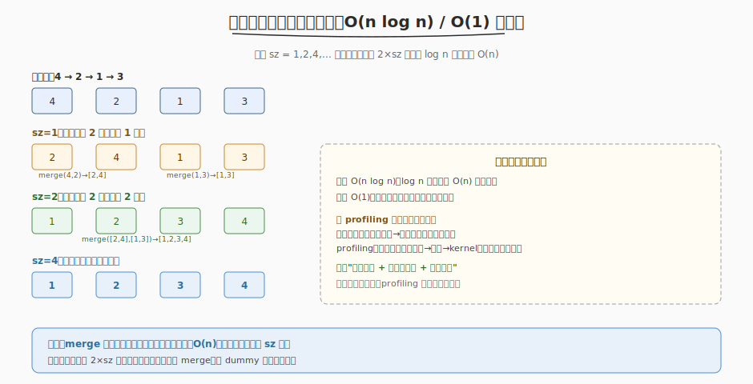

# 排序链表

- **题目名称**：排序链表
- **链接**：[148. 排序链表](https://leetcode.cn/problems/sort-list/)
- **难度**：中等
- **标签**：链表、归并排序、分治

## 1. 题目概述

给定单链表的头节点 `head`，将其按**升序排序**并返回排序后的链表。要求 **O(n log n) 时间**。

**示例 1**：

```text
输入：head = [4,2,1,3]
输出：[1,2,3,4]
```

**示例 2**：

```text
输入：head = [-1,5,3,4,0]
输出：[-1,0,3,4,5]
```

**约束条件**：

- 链表中节点数在范围 `[0, 5 × 10^4]` 内
- `-10^5 <= Node.val <= 10^5`

> 💡 难点在 O(n log n)。链表不能随机访问，快排/堆排的 partition/random access 不友好。**归并排序**是链表排序的最优解——它只需顺序遍历 + 合并，天然契合链表。

---

## 2. 解题思路

### 2.1 暴力思路

把链表转数组，排序后重建链表。时间 O(n log n)、空间 O(n)。能用但不满足"链表原地"的精神，且空间非 O(1)。

> ⚠️ 暴力的瓶颈：用了 O(n) 额外数组空间。能否纯链表操作 + O(1) 额外空间？

### 2.2 核心观察：归并排序（分治）



关键洞察：**归并排序只需顺序遍历 + 合并两个有序链表**，不依赖随机访问，完美适配链表。两种实现：

**方法一：递归归并**（自顶向下，O(log n) 栈空间）

```
sortList(head):
  1. 快慢指针找中点，断成两半
  2. sortList(左半) + sortList(右半)
  3. merge(左, 右)
```

**方法二：自底向上迭代**（O(1) 额外空间，本题最优）

```
sz = 1, 2, 4, ... 直到 sz >= n
  每趟：从头扫，每 2×sz 个节点切两段，merge 相邻两段
  共 log n 趟，每趟 O(n)
```

> 💡 自底向上的精髓：步长 `sz` 倍增（1→2→4→8...），每趟把所有"长度 sz 的有序段"两两合并成"长度 2sz 的有序段"。log n 趟后全链表有序。只用几个指针，空间 O(1)。

### 2.3 与 profiling 三层方法论的模式类比

这道题是 **profiling 三层拆解的算法直觉**。归并排序的"自底向上、每趟覆盖全部、逐步收敛"与 profiling 的"自顶向下分层、每层全覆盖、逐步收敛到瓶颈"同构：

| 维度 | 排序链表（归并） | profiling 三层方法论 |
|------|----------------|---------------------|
| 方向 | 自底向上（小段→大段） | 自顶向下（系统→阶段→kernel） |
| 每层 | 每趟覆盖全部节点 | 每层覆盖全部指标 |
| 收敛 | 趟数 log n 后全链表有序 | 逐层细化后定位到单 kernel |
| 基础操作 | merge 两个有序段 | 测一个阶段的 latency |

两者核心都是**分层处理 + 每层全覆盖 + 逐步收敛**——归并收敛到有序，profiling 收敛到瓶颈定位。

---

## 3. 参考代码

### 方法一：递归归并（C++，O(log n) 栈空间）

```cpp
class Solution {
public:
    ListNode* sortList(ListNode* head) {
        if (!head || !head->next) return head;
        // 快慢指针找中点
        ListNode *slow = head, *fast = head->next;
        while (fast && fast->next) { slow = slow->next; fast = fast->next->next; }
        ListNode* mid = slow->next;
        slow->next = nullptr;   // 断开
        return merge(sortList(head), sortList(mid));
    }

    ListNode* merge(ListNode* a, ListNode* b) {
        ListNode dummy(0), *tail = &dummy;
        while (a && b) {
            if (a->val <= b->val) { tail->next = a; a = a->next; }
            else { tail->next = b; b = b->next; }
            tail = tail->next;
        }
        tail->next = a ? a : b;
        return dummy.next;
    }
};
```

### 方法二：自底向上迭代（C++，O(1) 空间，最优）

```cpp
class Solution {
public:
    ListNode* sortList(ListNode* head) {
        if (!head || !head->next) return head;
        int n = 0;
        for (ListNode* p = head; p; p = p->next) n++;   // 链表长度

        ListNode dummy(0); dummy.next = head;
        for (int sz = 1; sz < n; sz <<= 1) {            // 步长倍增
            ListNode *tail = &dummy, *cur = dummy.next;
            while (cur) {
                ListNode *left = cur;
                ListNode *right = cut(left, sz);         // 切出 left（sz 个），right 是后半
                cur = cut(right, sz);                     // 切出 right（sz 个），cur 是剩余
                tail->next = merge(left, right);          // 合并 left, right
                while (tail->next) tail = tail->next;     // tail 走到合并结果末尾
            }
        }
        return dummy.next;
    }

    // 从 head 切 n 个，返回剩余部分的头
    ListNode* cut(ListNode* head, int n) {
        while (--n && head) head = head->next;
        if (!head) return nullptr;
        ListNode* next = head->next;
        head->next = nullptr;
        return next;
    }

    ListNode* merge(ListNode* a, ListNode* b) {
        ListNode dummy(0), *tail = &dummy;
        while (a && b) {
            if (a->val <= b->val) { tail->next = a; a = a->next; }
            else { tail->next = b; b = b->next; }
            tail = tail->next;
        }
        tail->next = a ? a : b;
        return dummy.next;
    }
};
```

### Python（递归归并）

```python
class Solution:
    def sortList(self, head: Optional[ListNode]) -> Optional[ListNode]:
        if not head or not head.next:
            return head
        slow, fast = head, head.next
        while fast and fast.next:
            slow, fast = slow.next, fast.next.next
        mid = slow.next
        slow.next = None
        return self.merge(self.sortList(head), self.sortList(mid))

    def merge(self, a, b):
        dummy = tail = ListNode(0)
        while a and b:
            if a.val <= b.val:
                tail.next, a = a, a.next
            else:
                tail.next, b = b, b.next
            tail = tail.next
        tail.next = a if a else b
        return dummy.next
```

> 💡 面试先讲递归归并（清晰易写），再讲自底向上迭代作为"O(1) 空间优化"。两者都建立在 `merge(两个有序链表)` 这个基础操作上。

---

## 4. 复杂度分析

| 方法 | 时间 | 空间 | 说明 |
|------|------|------|------|
| 递归归并 | O(n log n) | O(log n) | 递归栈深度 log n |
| 自底向上迭代 | O(n log n) | O(1) | 只用几个指针，无递归 |

> ⚠️ 自底向上的"O(1) 空间"不含输出链表本身（原地排序，复用原节点）。它省掉的是递归栈的 O(log n)。

---

## 5. 扩展：为什么链表用归并而不是快排

- **快排依赖 partition + 随机访问**：选 pivot 后要把元素分到左右，链表随机访问 O(n)，partition 效率低
- **归并只需顺序遍历 + 合并**：找中点（快慢指针）、切分、merge 都是顺序操作，天然契合链表
- **归并稳定**：相等元素不交换顺序，链表排序常需稳定
- **数组用快排**（随机访问快、partition 原地），链表用归并——数据结构决定最优算法

---

## 6. 面试要点

1. **为什么链表排序用归并而不是快排？**

   - 快排的 partition 依赖随机访问（双指针从两端扫描），链表随机访问 O(n)，partition 效率低
   - 归并只需顺序遍历（快慢指针找中点、顺序合并），天然契合链表
   - 归并稳定（相等元素不换序）、O(n log n) 保证；快排最坏 O(n²)
   - 数组用快排（随机访问快、原地 partition），链表用归并——数据结构决定最优算法

2. **自底向上迭代怎么实现 O(1) 空间？**

   - 步长 `sz` 从 1 倍增到 n，每趟从头扫，每 2×sz 节点切两段、merge 相邻段
   - 只用 `dummy`、`tail`、`cur`、`left`、`right` 几个指针，无递归栈
   - `cut(head, n)` 顺序走 n 步断开，`merge(a, b)` 双指针顺序合并——都是 O(1) 额外指针

3. **merge 两个有序链表的核心操作是什么？**

   - 双指针：`a` 和 `b` 各从表头走，每次取较小者接到 `tail` 后，对应指针前进
   - 用 `dummy` 节点简化表头处理（无需特判谁当头）
   - 一方走完后，另一方整体接到 `tail` 后（已有序）
   - O(n) 时间、O(1) 空间

4. **这题和 profiling 三层方法论有什么共同模式？**

   - 都是"分层处理 + 每层全覆盖 + 逐步收敛"
   - 归并：自底向上，每趟覆盖全部节点，log n 趟后收敛到有序
   - profiling：自顶向下，每层覆盖全部指标，逐层细化后收敛到单 kernel 瓶颈
   - 归并的 `merge` = profiling 的"测一个阶段"；归并的步长倍增 = profiling 的逐层下钻

5. **递归归并和迭代归并哪个更好？**

   - 时间都是 O(n log n)，递归空间 O(log n)（栈），迭代空间 O(1)
   - 面试先写递归（清晰、5 分钟能写完），再提迭代作为"O(1) 空间进阶"
   - 生产场景若链表极长（n=10^6），递归栈可能溢出，迭代更安全
   - 本题要求 O(1) 空间时必须用迭代；若只要求 O(n log n) 时间，递归更易写对
