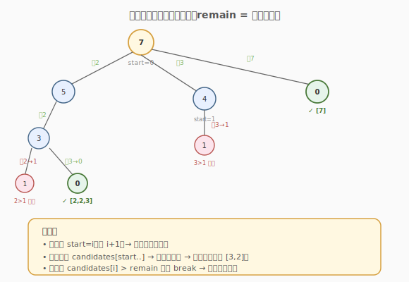
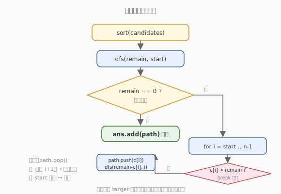

# 组合总和

- **题目名称**：组合总和
- **链接**：[39. 组合总和](https://leetcode.cn/problems/combination-sum/)
- **难度**：中等
- **标签**：数组、回溯、剪枝

## 1. 题目概述

给定一个**无重复元素**的正整数数组 `candidates` 和一个目标数 `target`，找出 `candidates` 中所有使数字之和为 `target` 的组合。`candidates` 中的数字可以**无限制重复选取**。结果不能包含重复组合。

**示例 1**：

```text
输入：candidates = [2,3,6,7], target = 7
输出：[[7],[2,2,3]]
解释：2+2+3=7，7=7，均为合法组合。
```

**示例 2**：

```text
输入：candidates = [2,3,5], target = 8
输出：[[2,2,2,2],[2,3,3],[3,5]]
```

**约束条件**：

- `1 <= candidates.length <= 30`
- `2 <= candidates[i] <= 40`
- `candidates` 元素互不相同
- `1 <= target <= 40`

---

## 2. 解题思路

### 2.1 暴力思路：枚举所有多重集

每个候选数取 `0..⌊target/c⌋` 次，笛卡尔积后验证和。组合数爆炸，且会产生大量重复组合（如 `[2,3]` 与 `[3,2]`）。

### 2.2 核心观察：回溯 + 固定顺序避免重复



关键约束：**同一数字可重复选，但后面的选择不能比前面小**。具体做法是给回溯函数传入「起始下标 `start`」，每一层只从 `candidates[start..]` 里选数。这样选出的组合天然**非递减**，杜绝了 `[2,3]` 与 `[3,2]` 这种排列级别的重复。

> 💡 **「可重复选」与「不重复组合」如何同时满足？**
> - 可重复选：递归下一层时 `start` 仍传 `i`（而非 `i+1`），表示当前数还能再选一次。
> - 不重复组合：`start` 只增不减，保证后续数 ≥ 当前数，组合非递减，自动去重。

### 2.3 算法流程图



**剪枝**：先把 `candidates` 排序。回溯时若 `candidates[i] > remain`，由于数组有序，后续更大，直接 `break` 而非 `continue`，能砍掉整棵子树。

### 2.4 示例演算

以 `candidates = [2,3,6,7]`（已排序），`target = 7` 为例，决策树（节点 = 当前剩余 `remain`）：

```text
remain=7, start=0
├─ 选 2 → remain=5, start=0
│   ├─ 选 2 → remain=3, start=0
│   │   ├─ 选 2 → remain=1, start=0
│   │   │   └─ 选 2 → remain=-1 ✗ 剪枝(2>1 直接 break)
│   │   ├─ 选 3 → remain=0 ✓ 记录 [2,2,3]
│   │   └─ (6,7 都 >3，break)
│   ├─ 选 3 → remain=2, start=1
│   │   └─ 选 3 → remain=-1 ✗
│   └─ (6,7 都 >5，break)
├─ 选 3 → remain=4, start=1
│   └─ 选 3 → remain=1, start=1 → 3>1 break
├─ 选 6 → remain=1, start=2 → 6>1 break
└─ 选 7 → remain=0 ✓ 记录 [7]
```

最终得到 `[[2,2,3],[7]]`。

---

## 3. 参考代码

### C++

```cpp
class Solution {
  public:
    vector<vector<int>> combinationSum(vector<int>& candidates, int target) {
        sort(candidates.begin(), candidates.end());   // 排序便于剪枝
        vector<vector<int>> ans;
        vector<int> path;
        dfs(candidates, target, 0, path, ans);
        return ans;
    }

  private:
    void dfs(vector<int>& candidates, int remain, int start,
             vector<int>& path, vector<vector<int>>& ans) {
        if (remain == 0) { ans.push_back(path); return; }
        for (int i = start; i < (int)candidates.size(); ++i) {
            if (candidates[i] > remain) break;        // 有序 → 后面更大，整枝剪掉
            path.push_back(candidates[i]);
            dfs(candidates, remain - candidates[i], i, path, ans);  // 传 i 不是 i+1 → 可重复选
            path.pop_back();
        }
    }
};
```

### Python

```python
class Solution:
    def combinationSum(self, candidates: List[int], target: int) -> List[List[int]]:
        candidates.sort()
        ans = []
        path = []

        def dfs(remain: int, start: int):
            if remain == 0:
                ans.append(path[:])
                return
            for i in range(start, len(candidates)):
                if candidates[i] > remain:
                    break
                path.append(candidates[i])
                dfs(remain - candidates[i], i)        # 传 i → 可重复选
                path.pop()

        dfs(target, 0)
        return ans
```

> 💡 两处细节决定了正确性：① 递归传 `i` 而非 `i+1`（允许重复选当前数）；② 外层循环从 `start` 开始（保证组合非递减，去重）。剪枝 `break` 是性能优化，去掉也能对，但会慢很多。

---

## 4. 复杂度分析

| 维度 | 复杂度 | 说明 |
|------|--------|------|
| 时间复杂度 | O(2^t · n) 最坏 | `t = target/最小候选`，决策树深度至多 `t`；实际由剪枝大幅缩减 |
| 空间复杂度 | O(t) | 递归栈与路径深度，最坏全选最小数 |

> 💡 组合总和类问题的复杂度与 `target` 大小强相关，而非仅与 `n` 相关——这是「可重复选取」带来的特点。

---

## 5. 扩展：组合总和系列对比

LeetCode 有一个完整的「组合总和」系列，差别在于**是否可重复选**与**候选集是否有重复元素**：

| 题号 | 题目 | 可重复选 | 候选有重复 | 去重手段 |
|------|------|----------|------------|----------|
| 39 | 组合总和（本题） | 是 | 否 | `start` 非递减 |
| 40 | 组合总和 II | 否 | 是 | 排序 + 同层跳过相同 |
| 216 | 组合总和 III | 否 | 否（1-9） | 固定 k 个数 |
| 377 | 组合总和 IV | 是 | 否 | 求排列数（DP） |

> 💡 **40 题的去重技巧**：排序后，若 `candidates[i] == candidates[i-1]` 且 `i > start`（同层），跳过。因为同一层里前一个相同值已经搜过，再搜会得到重复组合。

---

## 6. 面试要点

1. **为什么传** `i` **而不是** `i+1` **给下一层？**
   - 传 `i` 表示「下一层仍可从当前位置选」，于是同一个数可以被重复选取；若传 `i+1` 则每个数最多选一次，就变成了 [40. 组合总和 II] 的规则。

2. **如何避免** `[2,3]` **和** `[3,2]` **重复？**
   - 通过 `start` 控制选择顺序：每层只选 `≥ 上一次选的数`，组合天然非递减。这样 `[2,3]` 会生成而 `[3,2]` 不会，从源头杜绝排列级重复，无需用集合去重。

3. **剪枝为什么要先排序？为什么是** `break` **不是** `continue`**？**
   - 排序后数组递增，一旦 `candidates[i] > remain`，后面的数只会更大，必然也超，所以 `break` 直接砍掉整棵子树。若不排序，只能 `continue` 逐个试，剪枝失效。

4. **终止条件是** `remain == 0` **还是** `remain < 0`**？**
   - 用 `remain == 0` 记录答案；`remain < 0` 的情况由「选之前判断 `candidates[i] > remain` 就 break」提前拦截，无需进入递归，更高效。

5. **这题和「零钱兑换」有什么区别？**
   - 零钱兑换（322）求**最少硬币数**（最优值，DP）；组合总和（39）求**所有方案**（枚举，回溯）。前者问最优化，后者问方案集合，范式不同。

---

## 7. 同类练习题
- [40. 组合总和 II](https://leetcode.cn/problems/combination-sum-ii/)：每个数只用一次 + 候选有重复
- [216. 组合总和 III](https://leetcode.cn/problems/combination-sum-iii/)：限定 k 个数
- [77. 组合](https://leetcode.cn/problems/combinations/)：基础组合回溯
- [322. 零钱兑换](https://leetcode.cn/problems/coin-change/)：DP 版求最少硬币数
