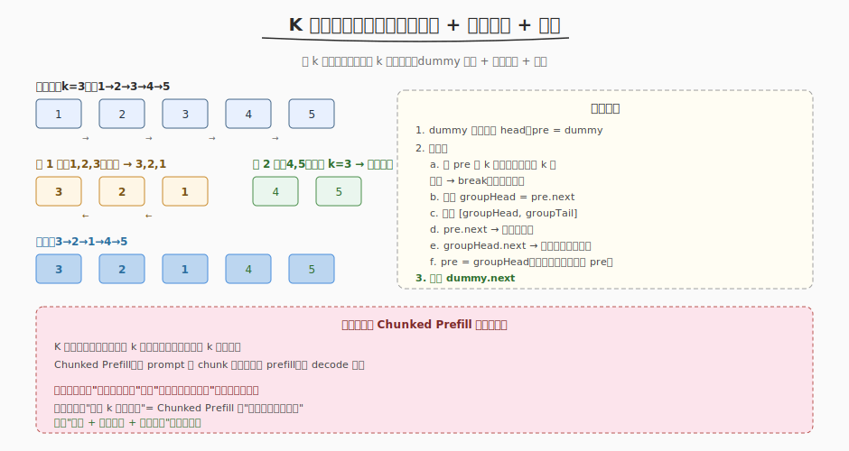

# K 个一组翻转链表

- **题目名称**：K 个一组翻转链表
- **链接**：[25. K 个一组翻转链表](https://leetcode.cn/problems/reverse-nodes-in-k-group/)
- **难度**：困难
- **标签**：链表、分段处理、翻转

## 1. 题目概述

给定链表的头节点 `head`，每 **k 个节点一组**进行翻转，返回修改后的链表。**不足 k 个的组保持原有顺序**。不能改节点内部的值，只能改指针。

**示例 1**：

```text
输入：head = [1,2,3,4,5], k = 2
输出：[2,1,4,3,5]
```

**示例 2**：

```text
输入：head = [1,2,3,4,5], k = 3
输出：[3,2,1,4,5]   （4,5 不足 3，保持原序）
```

**约束条件**：

- 链表节点数为 `n`
- `1 <= k <= n <= 5000`
- `0 <= Node.val <= 1000`

> 💡 难点在"分组边界判断 + 翻转后正确串接"。每组翻转后，原来的头变尾、尾变头，还要把上一组的新尾连到这一组的新头。

---

## 2. 解题思路

### 2.1 暴力思路

把链表转数组，每 k 个翻转，再重建链表。能用但空间 O(n)，且不符合"改指针不改值"的要求。

> ⚠️ 暴力的瓶颈：用了额外数组。能否纯指针操作 + O(1) 空间？

### 2.2 核心观察：dummy + 分组翻转 + 串接



关键洞察：**用 dummy 节点统一处理表头**，外层循环"每 k 个一组"，内层翻转这 k 个，翻转后把上一组的尾（`pre`）连到这一组的新头，原头（变尾）连到下一组。

```
dummy → 1 → 2 → 3 → 4 → 5,  k=3

第 1 组 [1,2,3] 翻转:
  pre=dummy, groupHead=1, groupTail=3
  翻转后: 3 → 2 → 1
  pre.next → 3（新头）, 1.next → 4（接续）
  pre = 1（原头变尾，作下一组 pre）

第 2 组 [4,5]: 从 pre(=1) 走 k=3 步，只有 2 个 → 不足，break
结果: dummy → 3 → 2 → 1 → 4 → 5
```

> 💡 与 [Day7 推理系统 Chunked Prefill](../../aiinfra/week5/day7/README.md) 的模式同构：都是"把大块连续处理拆成固定大小分段处理，尾段特殊处理"。翻转链表的"不足 k 保持原序" = Chunked Prefill 的"最后一块可能不满"。

### 2.3 算法流程

1. `dummy.next = head`，`pre = dummy`
2. 循环：
   - 从 `pre` 走 k 步，检查是否够 k 个；不够 → break
   - `groupHead = pre.next`，记录 `groupTail`
   - 翻转 `[groupHead, groupTail]`（返回新头新尾）
   - `pre.next` → 翻转后新头；`groupHead.next`（原头变尾）→ 下一组头
   - `pre = groupHead`（原头变尾，作下组 pre）
3. 返回 `dummy.next`

---

## 3. 参考代码

### C++

```cpp
class Solution {
  public:
    ListNode* reverseKGroup(ListNode* head, int k) {
        ListNode dummy(0);
        dummy.next = head;
        ListNode* pre = &dummy;

        while (true) {
            // 检查是否够 k 个
            ListNode* tail = pre;
            for (int i = 0; i < k; ++i) {
                tail = tail->next;
                if (!tail)
                    return dummy.next; // 不足 k，保持原序
            }
            ListNode* nextGroup = tail->next; // 下一组头
            ListNode* groupHead = pre->next;  // 本组头（翻转后变尾）

            // 翻转 [groupHead, tail]
            ListNode* prev = nextGroup;
            ListNode* cur = groupHead;
            while (cur != nextGroup) {
                ListNode* nxt = cur->next;
                cur->next = prev;
                prev = cur;
                cur = nxt;
            }

            // 串接：pre → 新头(tail)，groupHead(原头变尾) → 下一组
            pre->next = tail;
            pre = groupHead;
        }
        return dummy.next;
    }
};
```

### Python

```python
class Solution:
    def reverseKGroup(self, head: Optional[ListNode], k: int) -> Optional[ListNode]:
        dummy = ListNode(0, head)
        pre = dummy

        while True:
            # 检查够不够 k 个
            tail = pre
            for _ in range(k):
                tail = tail.next
                if not tail:
                    return dummy.next

            next_group = tail.next
            group_head = pre.next

            # 翻转 [group_head, tail]
            prev, cur = next_group, group_head
            while cur != next_group:
                nxt = cur.next
                cur.next = prev
                prev, cur = cur, nxt

            # 串接
            pre.next = tail
            pre = group_head

        return dummy.next
```

> 💡 关键技巧：翻转时 `prev` 初始化为 `nextGroup`（而非 `nullptr`），这样翻转后原头自动指向下一组，省去额外串接。`dummy` 节点统一处理表头，无需特判第一组。

---

## 4. 复杂度分析

| 维度 | 复杂度 | 说明 |
|------|--------|------|
| 时间复杂度 | O(n) | 每节点访问常数次（检查 + 翻转） |
| 空间复杂度 | O(1) | 只用几个指针 |

> ⚠️ 虽然有"检查 k 个"和"翻转 k 个"两趟，但每节点总共访问 O(1) 次，整体 O(n)。

---

## 5. 扩展：与普通翻转链表的差异

- [206 反转链表](../week1/day4/反转链表.md)：整个链表翻转，简单
- 本题：**分段翻转**，多了"分组边界判断 + 组间串接"
- 核心差异：普通翻转 `prev=nullptr`，分段翻转 `prev=nextGroup`（让翻转后尾自动接下一组）

---

## 6. 面试要点

1. **为什么用 dummy 节点？**

   - 第一组翻转后，表头从原来的 head 变成了 group 的尾（翻转后的头）。不用 dummy 要特判第一组更新 head，容易出错
   - dummy.next 一开始指向 head，翻转后 dummy.next 自动指向新表头，直接返回 `dummy.next` 即可

2. **翻转时 prev 为什么初始化为 nextGroup 而非 nullptr？**

   - 普通翻转链表 `prev=nullptr`，翻转后尾指向 null
   - 分段翻转：原头变尾后要指向"下一组的头"。把 `prev` 初始化为 `nextGroup`，翻转循环结束时原头.next 自动等于 nextGroup，省去额外串接
   - 这是分段翻转的关键技巧

3. **怎么判断不足 k 个？**

   - 从 `pre` 走 k 步，中途遇到 `nullptr` 说明不足 k 个 → `return dummy.next`（保持原序，已翻转的组已正确串接）

4. **这题和 Chunked Prefill 有什么共同模式？**

   - 都是"把大块连续处理拆成固定大小分段处理，尾段特殊处理"
   - 翻转链表：长链表按 k 分段翻转，不足 k 保持原序
   - Chunked Prefill：长 prompt 按 chunk 分段 prefill，最后一块可能不满
   - 两者都是"分段 + 逐段处理 + 尾段边界"的分治思路——这正是推理系统处理变长输入的通用范式

5. **时间复杂度为什么是 O(n) 而非 O(n·k)？**

   - 虽然每组有"检查 k 个"和"翻转 k 个"，看起来像 O(n/k × 2k) = O(2n)
   - 但每节点总共被访问常数次：检查时访问 1 次，翻转时访问 1 次 → O(n)
   - 不是嵌套循环（外层按组、内层按 k），而是顺序处理
