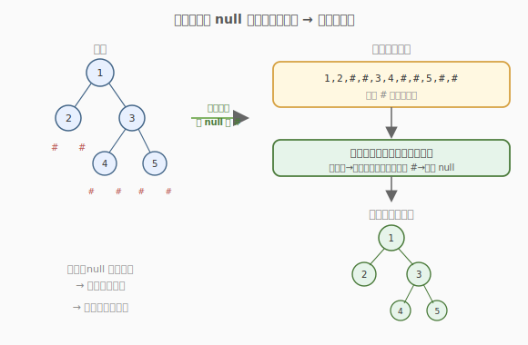
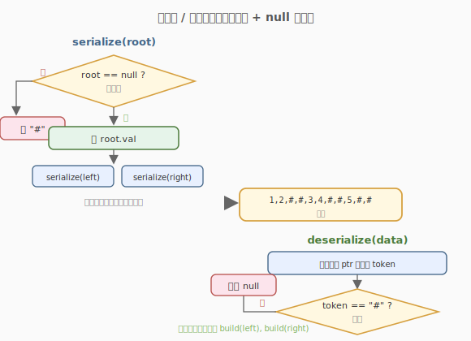

# 二叉树的序列化与反序列化

- **题目名称**：二叉树的序列化与反序列化
- **链接**：[297. 二叉树的序列化与反序列化](https://leetcode.cn/problems/serialize-and-deserialize-binary-tree/)
- **难度**：困难
- **标签**：树、二叉树、深度优先搜索、设计

## 1. 题目概述

设计一个算法来序列化与反序列化一棵二叉树。序列化是把一棵树转为**字符串**，反序列化是从该字符串**重建**出原来的树。不限制具体的序列化格式，但要求能无损往返。

**示例 1**：

```text
输入：root = [1,2,3,null,null,4,5]
输出：[1,2,3,null,null,4,5]
即序列化后再反序列化，应得到与原树相同的结构。
```

**示例 2**：

```text
输入：root = []
输出：[]
```

**约束条件**：

- 树中节点数目范围 `[0, 10^4]`
- `-1000 <= Node.val <= 1000`

---

## 2. 解题思路

### 2.1 暴力思路：只存值

如果序列化时只记录节点值（比如前序遍历的值序列），反序列化时无法确定 `null` 的位置——空子树的结构信息丢失了，重建会得到不同的树。

### 2.2 核心观察：显式记录 null



关键：**把空指针也当作一种"节点"写进序列**。常用一个特殊标记（如 `"#"` 或 `"null"`）表示 `null`，值之间用分隔符（如逗号）隔开。

这样得到的序列是**带空位的前序遍历**，它**唯一确定**一棵二叉树：

- **序列化**：前序遍历，遇到 `null` 就写 `#`，否则写值并递归左右。
- **反序列化**：按前序顺序消费序列，读到 `#` 返回 `null`，读到值就建节点并递归建左右子树。

> 💡 **为什么前序 + null 标记能唯一确定树？** 前序的「根-左-右」顺序告诉我们每个值的位置是「当前根」；而 `#` 明确标注了空子树的位置，从而左右子树的边界被完全锁定。反序列化时只需一个全局指针按序消费即可。

### 2.3 算法流程图



### 2.4 示例演算

以 `root = [1,2,3,null,null,4,5]` 为例：

```text
        1
       / \
      2   3
         / \
        4   5
```

**序列化**（前序，null 记 `#`）：

```text
访问顺序：1 → 2 → (#) → (#) → 3 → 4 → (#) → (#) → 5 → (#) → (#)
序列：1,2,#,#,3,4,#,#,5,#,#
```

**反序列化**：按序消费 `1,2,#,#,3,4,#,#,5,#,#`：

| 步骤 | 读到 | 动作 |
|------|------|------|
| 1 | 1 | 建节点 1，递归建左子树 |
| 2 | 2 | 建节点 2，作为 1 的左孩子，递归建其左子树 |
| 3 | # | 2 的左子树为 null |
| 4 | # | 2 的右子树为 null，2 完成 |
| 5 | 3 | 建节点 3，作为 1 的右孩子，递归建左子树 |
| 6 | 4 | 建节点 4，作为 3 的左孩子，递归建左子树 |
| 7-8 | # # | 4 的左右子树为 null |
| 9 | 5 | 建节点 5，作为 3 的右孩子 |
| 10-11 | # # | 5 的左右子树为 null |

重建出与原树完全相同的结构。

---

## 3. 参考代码

### C++

```cpp
class Codec {
  public:
    // 序列化：前序遍历，null 写 "#
    string serialize(TreeNode* root) {
        string out;
        serializeHelper(root, out);
        return out;
    }

    // 反序列化：按前序消费字符串
    TreeNode* deserialize(string data) {
        istringstream iss(data);
        return deserializeHelper(iss);
    }

  private:
    void serializeHelper(TreeNode* node, string& out) {
        if (!node) { out += "# "; return; }
        out += to_string(node->val) + " ";
        serializeHelper(node->left, out);
        serializeHelper(node->right, out);
    }

    TreeNode* deserializeHelper(istringstream& iss) {
        string token;
        if (!(iss >> token) || token == "#") return nullptr;
        TreeNode* node = new TreeNode(stoi(token));
        node->left  = deserializeHelper(iss);
        node->right = deserializeHelper(iss);
        return node;
    }
};
```

### Python

```python
class Codec:
    def serialize(self, root: Optional[TreeNode]) -> str:
        if root is None:
            return "#"
        return f"{root.val},{self.serialize(root.left)},{self.serialize(root.right)}"

    def deserialize(self, data: str) -> Optional[TreeNode]:
        it = iter(data.split(","))

        def build() -> Optional[TreeNode]:
            token = next(it)
            if token == "#":
                return None
            node = TreeNode(int(token))
            node.left = build()
            node.right = build()
            return node

        return build()
```

> 💡 Python 版用递归字符串拼接很简洁；C++ 用 `istringstream` 按空格切分 token，避免手动解析数字。两者本质相同：**一个全局读取指针 + 前序递归**。

---

## 4. 复杂度分析

| 维度 | 复杂度 | 说明 |
|------|--------|------|
| 时间复杂度 | O(n) | 序列化访问每个节点一次；反序列化消费每个 token 一次（含 `#`） |
| 空间复杂度 | O(n) | 序列化字符串长度 O(n)；递归栈 O(h)，最坏链状 O(n) |

> 💡 这里的 `n` 含空指针标记。一棵 `m` 个节点的树有 `m+1` 个空指针（二叉树性质），所以 token 总数约 `2m+1`，仍是 `O(n)`。

---

## 5. 扩展：层序序列化（BFS）

除了前序，**层序遍历**也常用于序列化（LeetCode 题目描述里的 `[1,2,3,null,null,4,5]` 就是层序格式）：

- 用队列做 BFS，每个出队节点把它的值（或 `null`）追加到序列。
- 反序列化时同样用队列：按层从左到右为每个非空节点挂左右孩子。

层序序列对人更直观（就是树的「从上到下、从左到右」展示），但代码比前序版稍长。前序版代码更短、递归更自然，面试推荐前序。

> 💡 **对比**：前序序列化是 DFS 顺序，层序序列化是 BFS 顺序；只要把 `null` 显式记录，任何遍历方式都能无损往返。

---

## 6. 面试要点

1. **为什么必须记录 null？**
   - 不记录 null 时，空子树的位置丢失，反序列化无法区分「左子树为空」还是「右子树为空」等情况。显式写 `#` 把树的结构（包括空位）完整编码进序列，才能无损重建。

2. **前序 + null 为什么能唯一确定树？**
   - 前序给出「根优先」的顺序，`#` 给出空子树的精确位置。两者结合，每个值的左右子树边界被完全确定，反序列化时只需一个全局指针按序消费即可重建，无需额外区间参数。

3. **反序列化为什么不用传区间？**
   - 因为序列本身就是「前序 + null 标记」，递归消费时：读到值就建节点并继续递归它的左、右子树；读到 `#` 就返回 null。子树的边界隐含在序列顺序里，由递归结构自动确定。

4. **序列化格式可以不是逗号分隔吗？**
   - 可以。任何能区分 token 的格式都行（空格、逗号、定长编码、二进制）。面试中字符串格式常见，也可讨论更紧凑的二进制编码（值用定长 int，null 用特殊 bit）。

5. **这题和「前序+中序构造树」的区别？**
   - 105 题用**两种遍历**（前序+中序）配合重建，且要求元素互不相同；297 只用**一种带 null 的遍历**就能重建，且不要求值唯一——因为 null 标记已把结构完全编码，无需第二种遍历辅助定位。

---

## 7. 同类练习题
- [105. 从前序与中序遍历序列构造二叉树](https://leetcode.cn/problems/construct-binary-tree-from-preorder-and-inorder-traversal/)：双遍历重建
- [106. 从中序与后序遍历序列构造二叉树](https://leetcode.cn/problems/construct-binary-tree-from-inorder-and-postorder-traversal/)：双遍历重建
- [449. 序列化和反序列化 BST](https://leetcode.cn/problems/serialize-and-deserialize-bst/)：利用 BST 性质可压缩空位
- [102. 二叉树的层序遍历](https://leetcode.cn/problems/binary-tree-level-order-traversal/)：层序序列化的基础
