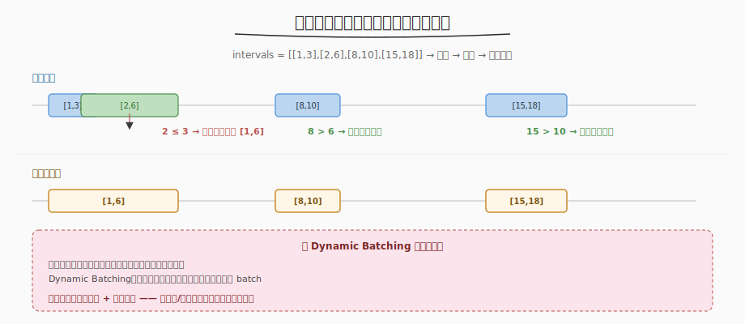

# 合并区间

- **题目名称**：合并区间
- **链接**：[56. 合并区间](https://leetcode.cn/problems/merge-intervals/)
- **难度**：中等
- **标签**：数组、排序、贪心

## 1. 题目概述

给定一组区间 `intervals[i] = [start_i, end_i]`，合并所有**重叠**的区间，返回不重叠的区间数组。

**示例 1**：

```text
输入：intervals = [[1,3],[2,6],[8,10],[15,18]]
输出：[[1,6],[8,10],[15,18]]
解释：[1,3] 和 [2,6] 重叠（2 ≤ 3），合并为 [1,6]
```

**示例 2**：

```text
输入：intervals = [[1,4],[4,5]]
输出：[[1,5]]
解释：[1,4] 和 [4,5] 重叠（4 ≤ 4，端点相邻也算重叠）
```

**约束条件**：

- `1 <= intervals.length <= 10^4`
- `intervals[i].length == 2`
- `0 <= start_i <= end_i <= 10^4`

---

## 2. 解题思路

### 2.1 暴力思路

对每对区间检查是否重叠，重叠则合并，重复直到没有重叠。时间 `O(n²)`，`n=10^4` 时勉强可过但效率低。

### 2.2 核心观察：排序 + 贪心合并



关键洞察：**按 start 排序后，重叠的区间一定相邻**。只需一次遍历，检查当前区间的 start 是否 ≤ 上一区间的 end，若是则合并（更新 end = max(end)）。

> 💡 与 [Day1 Dynamic Batching](../../aiinfra/week6/day1/README.md) 的模式同构：Dynamic Batcher 的 `_collect_batch` 在"时间窗口内收集到达的请求"，类似合并区间中"在重叠范围内合并"。两者都是**排序/有序遍历 + 贪心聚合**的模式。

### 2.3 算法流程

1. 按 `start` 升序排序
2. 初始化 `result = [intervals[0]]`
3. 遍历每个区间 `curr`：
   - 若 `curr[0] ≤ result[-1][1]`（重叠）→ 合并：`result[-1][1] = max(result[-1][1], curr[1])`
   - 否则（不重叠）→ `result.append(curr)`

### 2.4 示例演算

以 `intervals = [[1,3],[2,6],[8,10],[15,18]]` 为例：

| 步骤 | 当前区间 | result 末尾 | 重叠？ | 操作 | result |
|------|---------|------------|--------|------|--------|
| 0 | — | — | — | 初始化 | [[1,3]] |
| 1 | [2,6] | [1,3] | 2≤3 ✓ | 合并 end=max(3,6)=6 | [[1,6]] |
| 2 | [8,10] | [1,6] | 8≤6 ✗ | 追加 | [[1,6],[8,10]] |
| 3 | [15,18] | [8,10] | 15≤10 ✗ | 追加 | [[1,6],[8,10],[15,18]] |

---

## 3. 参考代码

### C++

```cpp
class Solution {
public:
    vector<vector<int>> merge(vector<vector<int>>& intervals) {
        sort(intervals.begin(), intervals.end());
        vector<vector<int>> result;
        for (auto& curr : intervals) {
            if (!result.empty() && curr[0] <= result.back()[1]) {
                result.back()[1] = max(result.back()[1], curr[1]);
            } else {
                result.push_back(curr);
            }
        }
        return result;
    }
};
```

### Python

```python
class Solution:
    def merge(self, intervals: List[List[int]]) -> List[List[int]]:
        intervals.sort()
        result = []
        for curr in intervals:
            if result and curr[0] <= result[-1][1]:
                result[-1][1] = max(result[-1][1], curr[1])
            else:
                result.append(curr)
        return result
```

---

## 4. 复杂度分析

| 维度 | 复杂度 | 说明 |
|------|--------|------|
| 时间复杂度 | O(n log n) | 排序 O(n log n) + 遍历 O(n) |
| 空间复杂度 | O(n) | result 数组（或 O(log n) 排序栈空间） |

---

## 5. 扩展：插入区间（57）

[57. 插入区间](https://leetcode.cn/problems/insert-interval/) 是变体：给定一个已排序的无重叠区间列表 + 一个新区间，合并后返回。思路相同，只是不需要排序（已有序），遍历时分"前段不重叠 / 重叠段合并 / 后段不重叠"三阶段处理。

---

## 6. 面试要点

1. **为什么要先排序？**

   - 排序后保证 `start` 单调递增，重叠的区间一定相邻。不排序的话需要 `O(n²)` 两两检查。

2. **合并时为什么取 max(end) 而不是直接用 curr[1]？**

   - 一个区间可能完全包含在另一个内部（如 [1,5] 和 [2,3]），合并后 end 应取较大值 `max(5, 3) = 5`，而非 `curr[1] = 3`。

3. **这题和 Dynamic Batching 有什么共同模式？**

   - 合并区间：排序后，时间上重叠的区间贪心合并为一个
   - Dynamic Batching：时间窗口内到达的请求贪心聚合为一个 batch
   - 两者都是"有序遍历 + 贪心聚合"——在重叠/窗口范围内合并，超出则新建

4. **端点相邻（[1,4] 和 [4,5]）算重叠吗？**

   - 本题算。`curr[0] <= result[-1][1]` 用 `≤` 而非 `<`，即 `4 ≤ 4` 为 true，合并为 [1,5]。不同题目定义可能不同，面试时确认。

5. **不排序能做吗？**

   - 能，但需要 `O(n²)` 两两检查 + 并查集合并。排序后 `O(n log n)` 是最优解，且代码极简。
