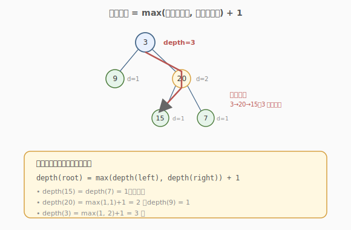
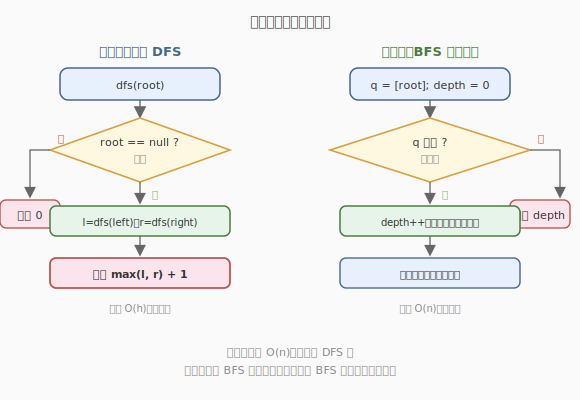

# 二叉树的最大深度

- **题目名称**：二叉树的最大深度
- **链接**：[104. 二叉树的最大深度](https://leetcode.cn/problems/maximum-depth-of-binary-tree/)
- **难度**：简单
- **标签**：树、二叉树、深度优先搜索、广度优先搜索

## 1. 题目概述

给定一棵二叉树的根节点 `root`，返回它的**最大深度**。二叉树的**最大深度**是指从根节点到**最远叶子节点**的最长路径上的节点数。

**示例 1**：

```text
输入：root = [3,9,20,null,null,15,7]
输出：3
解释：最长路径 3 → 20 → 15（或 7），共 3 个节点。
```

**示例 2**：

```text
输入：root = [1,null,2]
输出：2
```

**约束条件**：

- 树中节点数目范围 `[0, 10^4]`
- `-100 <= Node.val <= 100`

---

## 2. 解题思路

### 2.1 暴力思路：手动找最长路径

直观地「从根往下走，找最长的那条」，但需要枚举所有根到叶子的路径再取最大长度，容易写成带全局变量的 DFS。其实递归本身就能简洁地表达「最大深度」。

### 2.2 核心观察：后序递归，子树深度 +1



最大深度有一句天然的递归定义：

$$
depth(root) = \max(\,depth(left),\ depth(right)\,) + 1,\quad depth(null) = 0
$$

即「一棵树的最大深度 = 左右子树最大深度的较大者 + 1（当前这一层）」。空树深度为 0。

> 💡 这是**后序 DFS**：先递归拿到左右子树的结果，再在当前节点汇总。它体现了「把整棵树的问题拆成两个子问题」的递归思维——和「翻转二叉树」「判断对称」同属一套骨架。

### 2.3 算法流程图



**另一种思路：BFS 层序计数**。逐层遍历，每过一层深度 +1，直到队列空。BFS 不用递归，适合极深树避免栈溢出。

### 2.4 示例演算

以 `root = [3,9,20,null,null,15,7]` 为例，后序递归自底向上：

| 节点 | depth(left) | depth(right) | depth(自身) |
|------|-------------|--------------|-------------|
| 9    | 0           | 0            | 1（叶子）   |
| 15   | 0           | 0            | 1（叶子）   |
| 7    | 0           | 0            | 1（叶子）   |
| 20   | 0           | max(1,1)=1   | 2           |
| 3    | 1           | 2            | **3** ⭐    |

最终最大深度为 `3`。

---

## 3. 参考代码

### C++

```cpp
// 递归（后序 DFS）
class Solution {
  public:
    int maxDepth(TreeNode* root) {
        if (root == nullptr) return 0;
        return max(maxDepth(root->left), maxDepth(root->right)) + 1;
    }
};

// 迭代（BFS 层序计数）
class SolutionBFS {
  public:
    int maxDepth(TreeNode* root) {
        if (!root) return 0;
        queue<TreeNode*> q;
        q.push(root);
        int depth = 0;
        while (!q.empty()) {
            int sz = q.size();
            ++depth;                       // 处理一层，深度 +1
            while (sz--) {
                TreeNode* node = q.front(); q.pop();
                if (node->left)  q.push(node->left);
                if (node->right) q.push(node->right);
            }
        }
        return depth;
    }
};
```

### Python

```python
# 递归
class Solution:
    def maxDepth(self, root: Optional[TreeNode]) -> int:
        if not root:
            return 0
        return max(self.maxDepth(root.left), self.maxDepth(root.right)) + 1

# 迭代 BFS
from collections import deque

class SolutionBFS:
    def maxDepth(self, root: Optional[TreeNode]) -> int:
        if not root:
            return 0
        q = deque([root])
        depth = 0
        while q:
            depth += 1
            for _ in range(len(q)):
                node = q.popleft()
                if node.left:  q.append(node.left)
                if node.right: q.append(node.right)
        return depth
```

> 💡 递归版三行写完，是后序 DFS 的最短表达；BFS 版用「外层循环管层数」的技巧，每轮处理整层后 `depth += 1`。

---

## 4. 复杂度分析

| 维度 | 复杂度 | 说明 |
|------|--------|------|
| 时间复杂度 | O(n) | 每个节点访问一次（DFS 或 BFS 均如此） |
| 空间复杂度 | O(h) / O(n) | 递归栈 = 树高 `h`；BFS 队列最宽一层 O(n) |

> 💡 平衡树 `h = O(log n)`，链状树 `h = O(n)`。BFS 的空间由最宽层决定，平衡树最宽层约 `n/2`，故 BFS 空间常为 `O(n)`。深而窄的树 DFS 更省空间，宽而浅的树两者接近。

---

## 5. 扩展：最小深度（111）

[111. 二叉树的最小深度](https://leetcode.cn/problems/minimum-depth-of-binary-tree/) 求根到**最近叶子**的节点数。看似把 `max` 换成 `min`，但有个坑：**只有一侧为空时不能直接取 0**。

- 若 `root` 左右孩子都有：`min(depth(left), depth(right)) + 1`。
- 若只有一侧有孩子：必须走向有孩子的那一侧（空的那侧没有叶子），即 `depth(非空侧) + 1`。
- 叶子节点：返回 1。

> 💡 最小深度用 **BFS 更优**：一旦在层序遍历中遇到第一个叶子，立刻返回当前深度，天然找最近叶子，无需遍历全树。

---

## 6. 面试要点

1. **递归的返回值含义是什么？**
   - 返回以 `root` 为根的子树的最大深度。空子树返回 0，非空子树 = 左右子树深度的较大者 + 1。这是「后序汇总」的标准写法。

2. **DFS 和 BFS 哪个更好？**
   - 求最大深度必须遍历到所有叶子，两者都是 `O(n)` 时间。DFS 空间是树高 `O(h)`，BFS 空间是最宽层 `O(n)`。深而窄的树 DFS 更省；面试中 DFS 递归最简洁，常作首选。

3. **为什么空树深度是 0 而不是 -1？**
   - 「最大深度」按节点数定义：空树没有节点，深度为 0；一个根节点深度为 1。若定义为「边数」则空树为 -1、单节点为 0，但 LeetCode 用节点数约定，故空树返回 0。

4. **能否用前序 + 全局变量？**
   - 可以。维护 `ans` 和当前 `depth`，前序遍历每进入一层 `depth++`、离开时 `depth--`，到达叶子更新 `ans = max(ans, depth)`。这体现了「自顶向下」的思路，但后序版更简洁。

5. **最小深度为什么不能简单取 min？**
   - 因为「深度」必须到**叶子**。若某节点只有左孩子，右子树为空，`min(depth(left), 0) + 1 = 1` 会错把「半路节点」当叶子。必须排除空子树，只在两边都有孩子时取 `min`。

---

## 7. 同类练习题
- [111. 二叉树的最小深度](https://leetcode.cn/problems/minimum-depth-of-binary-tree/)：求最近叶子，BFS 更优
- [110. 平衡二叉树](https://leetcode.cn/problems/balanced-binary-tree/)：复用求深度，判断左右差 ≤ 1
- [559. N 叉树的最大深度](https://leetcode.cn/problems/maximum-depth-of-n-ary-tree/)：多叉树版，遍历所有孩子
- [199. 二叉树的右视图](https://leetcode.cn/problems/binary-tree-right-side-view/)：层序思想的应用
