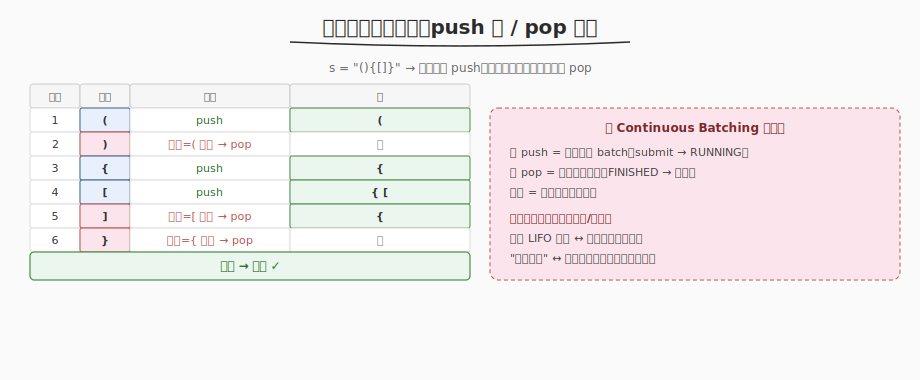

# 有效括号

- **题目名称**：有效括号
- **链接**：[20. 有效括号](https://leetcode.cn/problems/valid-parentheses/)
- **难度**：简单
- **标签**：栈、字符串

## 1. 题目概述

给定一个只包含 `(`、`)`、`{`、`}`、`[`、`]` 的字符串 `s`，判断字符串是否有效。有效条件：开括号必须以正确顺序用相同类型的闭括号闭合。

**示例 1**：

```text
输入：s = "()"
输出：true
```

**示例 2**：

```text
输入：s = "()[]{}"
输出：true
```

**示例 3**：

```text
输入：s = "(]"
输出：false
```

**示例 4**：

```text
输入：s = "([)]"
输出：false  ← 交错闭合，不匹配
```

**约束条件**：

- `1 <= s.length <= 10^4`
- `s` 仅由 `()[]{}` 组成

---

## 2. 解题思路

### 2.1 核心观察：栈匹配



关键洞察：**遇到开括号 push 入栈，遇到闭括号检查栈顶是否匹配**。匹配则 pop，不匹配则 invalid。最终栈空 = valid。

> 💡 与 [Day2 Continuous Batching](../../aiinfra/week6/day2/README.md) 的序列生命周期管理同构：请求加入 batch = push，完成退出 = pop。Scheduler 的 running 队列就是动态管理入/出的集合。

### 2.2 算法流程

1. 遍历每个字符
2. 开括号 → push 入栈
3. 闭括号 → 检查栈顶：栈空或类型不匹配 → return false；匹配 → pop
4. 遍历结束 → 栈空 return true，否则 false（有未闭合的开括号）

### 2.3 示例演算

以 `s = "([)]"` 为例：

| 步骤 | 字符 | 操作 | 栈 |
|------|------|------|-----|
| 1 | `(` | push | `(` |
| 2 | `[` | push | `([` |
| 3 | `)` | 栈顶=`[` ≠ `)` → false | — |

---

## 3. 参考代码

### C++

```cpp
class Solution {
  public:
    bool isValid(string s) {
        stack<char> st;
        for (char c : s) {
            if (c == '(' || c == '[' || c == '{') {
                st.push(c);
            } else {
                if (st.empty())
                    return false;
                char top = st.top();
                if ((c == ')' && top != '(') || (c == ']' && top != '[') || (c == '}' && top != '{'))
                    return false;
                st.pop();
            }
        }
        return st.empty();
    }
};
```

### Python

```python
class Solution:
    def isValid(self, s: str) -> bool:
        stack = []
        pairs = {')': '(', ']': '[', '}': '{'}
        for c in s:
            if c in pairs:  # 闭括号
                if not stack or stack[-1] != pairs[c]:
                    return False
                stack.pop()
            else:           # 开括号
                stack.append(c)
        return not stack
```

---

## 4. 复杂度分析

| 维度 | 复杂度 | 说明 |
|------|--------|------|
| 时间复杂度 | O(n) | 一次遍历，每字符 O(1) 栈操作 |
| 空间复杂度 | O(n) | 最坏全开括号，栈存 n 个 |

---

## 5. 面试要点

1. **为什么用栈？**

   - 括号匹配是"后入先出"——最近的开括号必须先闭合。栈天然匹配这个顺序。

2. **这题和 Continuous Batching 有什么共同模式？**

   - 栈的 push/pop = 序列加入/退出 batch
   - 有效括号要求正确匹配（LIFO），Continuous Batching 的 running 队列也动态管理入/出
   - 两者都是"动态集合的入/出管理"

3. **栈不空时返回 false 的含义？**

   - 遍历结束后栈不空 = 有开括号未闭合 = 无效。如 `"(("` 遍历完栈有 2 个 `(`。

4. **闭括号时栈空返回 false 的含义？**

   - 没有开括号可匹配 = 无效。如 `")"` 第一个字符就是闭括号，栈空。

5. **能否不用栈？**

   - 可用计数器（只一种括号时），但多种括号交错时（如 `([)]`）计数器无法判断顺序，必须用栈。

---

## 7. 同类练习题
- [32. 最长有效括号](https://leetcode.cn/problems/longest-valid-parentheses/)：栈/DP
- [22. 括号生成](https://leetcode.cn/problems/generate-parentheses/)：回溯
- [150. 逆波兰表达式求值](https://leetcode.cn/problems/evaluate-reverse-polish-notation/)：栈计算
