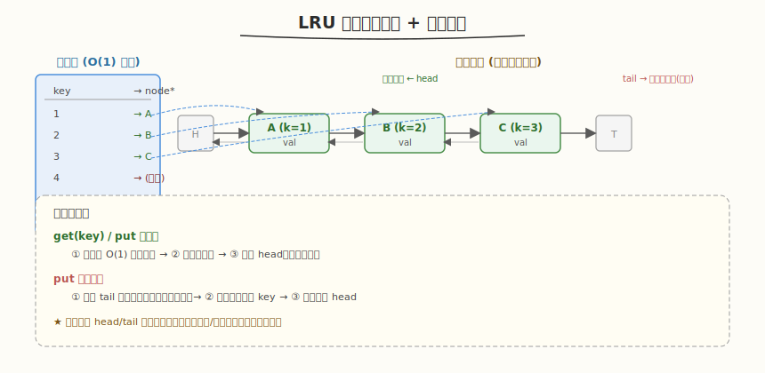

# LRU 缓存

- **题目名称**：LRU 缓存
- **链接**：[146. LRU 缓存](https://leetcode.cn/problems/lru-cache/)
- **难度**：中等
- **标签**：设计、哈希表、双向链表

## 1. 题目概述

请你设计并实现一个满足 **LRU（最近最少使用）** 缓存约束的数据结构 `LRUCache`：

- `LRUCache(int capacity)`：以正整数作为容量 `capacity` 初始化 LRU 缓存
- `int get(int key)`：如果关键字 `key` 存在于缓存中，则返回关键字的值，否则返回 `-1`
- `void put(int key, int value)`：如果关键字 `key` 已经存在，则变更其数据值 `value`；如果不存在，则向缓存中插入该组 `key-value`。如果插入操作导致关键字数量超过 `capacity`，则应该**逐出最久未使用**的关键字

函数 `get` 与 `put` 必须各自以 **`O(1)` 平均时间复杂度**运行。

**示例 1**：

```text
输入：
LRUCache lRUCache = new LRUCache(2);
lRUCache.put(1, 1);              // 缓存是 {1=1}
lRUCache.put(2, 2);              // 缓存是 {1=1, 2=2}
lRUCache.get(1);                 // 返回 1，缓存变为 {2=2, 1=1}（1 移到最近）
lRUCache.put(3, 3);              // 淘汰 key 2，缓存是 {1=1, 3=3}
lRUCache.get(2);                 // 返回 -1（未找到）
lRUCache.put(4, 4);              // 淘汰 key 1，缓存是 {3=3, 4=4}
lRUCache.get(1);                 // 返回 -1（未找到）
lRUCache.get(3);                 // 返回 3
lRUCache.get(4);                 // 返回 4
```

**约束条件**：

- `1 <= capacity <= 3000`
- `0 <= key <= 10^4`
- `0 <= value <= 10^5`
- 最多调用 `2 * 10^5` 次 `get` 和 `put`

---

## 2. 解题思路

### 2.1 暴力思路

用数组/链表按访问顺序存 `(key, value)`。`get` 线性扫描找 key，找到后移到队首 → `O(n)`。`put` 满时删队尾 → `O(n)`。不满足 `O(1)` 要求。

### 2.2 核心观察：哈希表 + 双向链表



关键洞察：**用哈希表实现 `O(1)` 定位，用双向链表维护访问顺序**。

- **哈希表** `key → 链表节点`：`O(1)` 找到节点指针
- **双向链表**：最近访问的节点在 head 端，最久未访问的在 tail 端。双向链表能在 `O(1)` 内摘除任意节点（已知指针时只需改前后节点的指针）

两个数据结构分工：

| 数据结构 | 职责 | 复杂度 |
|---------|------|--------|
| 哈希表 | `key → node*` 定位 | `O(1)` 查找 |
| 双向链表 | 维护访问时序（head=最近，tail=最久） | `O(1)` 摘除/插头 |

> 💡 与 [Day3 vLLM Scheduler](../../aiinfra/week6/day3/README.md) 的 `BlockSpaceManager` 同构：vLLM 用 `free_blocks` 空闲链表回收/分配 KV Cache block，preemption 时被抢占序列的 block 被淘汰回空闲池供他人复用——正是 LRU 式的"有限资源池分配/回收/淘汰"。

### 2.3 算法流程

**`get(key)`**：
1. 哈希表查 key，不存在返回 `-1`
2. 存在 → 把节点从链表摘除，移到 head → 返回 value

**`put(key, value)`**：
1. key 存在 → 更新 value，节点移到 head
2. key 不存在：
   - 新建节点插到 head，哈希表登记
   - 若超容量 → 删除 tail 前一个节点（最久未访问）+ 哈希表删对应 key

### 2.4 示例演算

以 `capacity=2`，依次 `put(1,1)` `put(2,2)` `get(1)` `put(3,3)` 为例：

| 操作 | 链表（head→tail） | 说明 |
|------|-------------------|------|
| put(1,1) | `1` | 新建 |
| put(2,2) | `2 ↔ 1` | 2 在 head |
| get(1) | `1 ↔ 2` | 1 移到 head，返回 1 |
| put(3,3) | `3 ↔ 1` | 容量满，淘汰 tail 的 2，3 插 head |

---

## 3. 参考代码

### C++

```cpp
class LRUCache {
    struct Node {
        int key, val;
        Node *prev, *next;
        Node(int k, int v) : key(k), val(v), prev(nullptr), next(nullptr) {}
    };
    int cap;
    unordered_map<int, Node*> mp;
    Node *head, *tail;   // 哨兵：head/tail 不存数据，省边界判空

    void addToHead(Node* node) {
        node->prev = head;
        node->next = head->next;
        head->next->prev = node;
        head->next = node;
    }
    void removeNode(Node* node) {
        node->prev->next = node->next;
        node->next->prev = node->prev;
    }
    void moveToHead(Node* node) {
        removeNode(node);
        addToHead(node);
    }
    Node* removeTail() {
        Node* node = tail->prev;
        removeNode(node);
        return node;
    }
public:
    LRUCache(int capacity) : cap(capacity) {
        head = new Node(0, 0);
        tail = new Node(0, 0);
        head->next = tail;
        tail->prev = head;
    }
    int get(int key) {
        auto it = mp.find(key);
        if (it == mp.end()) return -1;
        moveToHead(it->second);
        return it->second->val;
    }
    void put(int key, int value) {
        auto it = mp.find(key);
        if (it != mp.end()) {
            it->second->val = value;
            moveToHead(it->second);
            return;
        }
        Node* node = new Node(key, value);
        mp[key] = node;
        addToHead(node);
        if ((int)mp.size() > cap) {
            Node* removed = removeTail();
            mp.erase(removed->key);
            delete removed;
        }
    }
};
```

### Python

```python
class Node:
    def __init__(self, key=0, val=0):
        self.key = key
        self.val = val
        self.prev = self.next = None

class LRUCache:
    def __init__(self, capacity: int):
        self.cap = capacity
        self.mp = {}                       # key -> Node
        self.head = Node()                 # 哨兵头
        self.tail = Node()                 # 哨兵尾
        self.head.next = self.tail
        self.tail.prev = self.head

    def _add_to_head(self, node):
        node.prev = self.head
        node.next = self.head.next
        self.head.next.prev = node
        self.head.next = node

    def _remove(self, node):
        node.prev.next = node.next
        node.next.prev = node.prev

    def get(self, key: int) -> int:
        if key not in self.mp:
            return -1
        node = self.mp[key]
        self._remove(node)
        self._add_to_head(node)
        return node.val

    def put(self, key: int, value: int) -> None:
        if key in self.mp:
            node = self.mp[key]
            node.val = value
            self._remove(node)
            self._add_to_head(node)
            return
        node = Node(key, value)
        self.mp[key] = node
        self._add_to_head(node)
        if len(self.mp) > self.cap:
            lru = self.tail.prev          # 最久未访问
            self._remove(lru)
            del self.mp[lru.key]
```

---

## 4. 复杂度分析

| 维度 | 复杂度 | 说明 |
|------|--------|------|
| 时间复杂度 | `O(1)` | `get`/`put` 都是哈希表查询 + 链表指针操作，常数时间 |
| 空间复杂度 | `O(capacity)` | 哈希表和链表最多存 `capacity` 个节点 |

---

## 5. 扩展：LFU 缓存（460）

LRU 只看"最近访问时间"，LFU（最不经常使用）看"访问频率"。LFU 用**频率桶 + 同频率内 LRU** 的双层结构：每个频率维护一个双向链表，访问时把节点从 freq 桶移到 freq+1 桶；淘汰时取最小 freq 桶的 tail。复杂度同样 `O(1)`。

---

## 6. 面试要点

1. **为什么用双向链表而不是单向链表？**

   - 摘除任意节点需要改它前驱的 `next` 指针。单向链表已知节点指针时找不到前驱，必须 `O(n)` 扫描；双向链表 `node->prev` 直接拿到前驱，`O(1)` 摘除。

2. **为什么需要哨兵节点（dummy head/tail）？**

   - 省去头/尾边界判空。没有哨兵时，摘除 head 或 tail 要特判（head 为空、head==tail 等情况）。有哨兵后所有节点都在 head 和 tail 之间，插入/删除是统一的中间操作，代码更简洁、不易出错。

3. **这题和 vLLM 的 BlockSpaceManager 有什么共同模式？**

   - 都是"有限资源池的分配/回收/淘汰"：LRU 淘汰缓存条目，BlockSpaceManager 淘汰 KV Cache block
   - vLLM 用 `free_blocks` 空闲链表：序列释放 block 时回收到链表，分配时从链表取；preemption 时被抢占序列的 block 被淘汰回空闲池供他人复用
   - LRU 的"最久未使用先淘汰"对应 vLLM 抢占时"最后加入的最先被 preempt"（近似 LIFO）
   - 两者都用链表维护"回收/淘汰顺序"，用哈希/索引实现 `O(1)` 定位

4. **`get` 和 `put` 命中时为什么要移到 head？**

   - LRU 的语义是"最近访问的保留更久"。`get`/`put` 命中算一次访问，必须更新访问时序——把节点移到 head 表示"刚用过"，避免它被错误地当作最久未访问而淘汰。

5. **能否用 `OrderedDict` 一行实现？**

   - Python 可以：`OrderedDict.move_to_end(key)` + `popitem(last=False)`。但面试官通常要求手写双向链表以考察指针操作。`OrderedDict` 本质就是哈希 + 双向链表。
