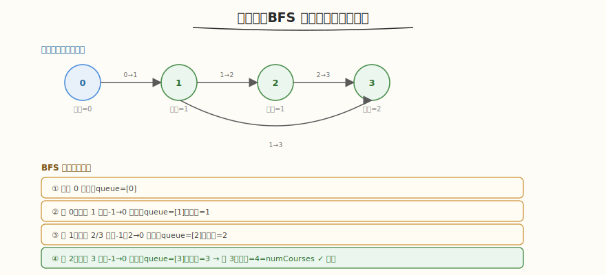

# 课程表

- **题目名称**：课程表
- **链接**：[207. 课程表](https://leetcode.cn/problems/course-schedule/)
- **难度**：中等
- **标签**：图、拓扑排序、BFS、入度

## 1. 题目概述

你这个学期必须选修 `numCourses` 门课程，记为 `0` 到 `numCourses-1`。给你一个数组 `prerequisites`，其中 `prerequisites[i] = [a, b]` 表示如果要修课程 `a` **必须先修**课程 `b`（即 `b → a` 的有向边）。

判断是否可能完成所有课程的学习（等价于：检测这个有向图是否存在环——有环则无法完成，无环则可）。

**示例 1**：

```text
输入：numCourses = 2, prerequisites = [[1,0]]
输出：true
解释：共 2 门课。修课程 1 之前要先修课程 0，顺序 0→1 可完成。
```

**示例 2**：

```text
输入：numCourses = 2, prerequisites = [[1,0],[0,1]]
输出：false
解释：1 依赖 0，0 又依赖 1，形成环，无法完成。
```

**约束条件**：

- `1 <= numCourses <= 2000`
- `0 <= prerequisites.length <= 5000`
- `prerequisites[i].length == 2`
- `0 <= a, b < numCourses`，且 `a != b`，无自环、无重边

---

## 2. 解题思路

### 2.1 暴力思路

枚举所有排列，检查每个排列是否满足先修约束 → `O(n!)`，不可行。

### 2.2 核心观察：拓扑排序（BFS 入度法）



关键洞察：**能完成所有课程 ⇔ 有向图无环 ⇔ 存在拓扑序**。用 **Kahn 算法**（BFS 入度法）：

- 每轮取**入度为 0** 的节点（无先修约束，可直接修），入队
- 取出队首节点，将它指向邻居的边"删除"（邻居入度 -1）
- 邻居入度变 0 则入队
- 最终访问的节点数 == `numCourses` → 无环（可完成）；否则有环

> 💡 与 [Day4 推理框架调度](../../aiinfra/daily/week6/day4/README.md) 的请求依赖调度同构：Scheduler 按拓扑序调度有依赖的请求——先跑前置请求产出 KV Cache，后续请求才能 prefill。拓扑排序检测有环 = 检测请求依赖是否存在死锁（循环等待）。

### 2.3 算法流程

1. 建邻接表 `adj[b] = [a...]`（`b → a`）+ 入度数组 `indeg[a]++`
2. 所有入度 0 的节点入队
3. BFS：出队一个节点，对它的每个邻居 `indeg[邻居]--`；变 0 则入队，访问计数 +1
4. 访问计数 == `numCourses` → `true`（无环）；否则 `false`（有环）

### 2.4 示例演算

`numCourses=4, prerequisites=[[1,0],[2,1],[3,2],[3,1]]`（`b→a`：0→1, 1→2, 2→3, 1→3）：

| 步骤 | queue | 取出 | 邻居入度变化 | 访问 |
|------|-------|------|-------------|------|
| 初始 | [0] | — | indeg=[0,1,1,2] | 0 |
| 1 | [] | 0 | 1 的 indeg→0，入队 | 1 |
| 2 | [1] | 1 | 2 的 indeg→0 入队；3 的 indeg→1 | 2 |
| 3 | [2] | 2 | 3 的 indeg→0 入队 | 3 |
| 4 | [3] | 3 | 无邻居 | 4 |

访问=4=numCourses → `true`，无环。

---

## 3. 参考代码

### C++

```cpp
class Solution {
  public:
    bool canFinish(int numCourses, vector<vector<int>>& prerequisites) {
        vector<vector<int>> adj(numCourses);
        vector<int> indeg(numCourses, 0);
        for (auto& p : prerequisites) {
            int a = p[0], b = p[1]; // b -> a
            adj[b].push_back(a);
            indeg[a]++;
        }
        queue<int> q;
        for (int i = 0; i < numCourses; i++)
            if (indeg[i] == 0)
                q.push(i);

        int visited = 0;
        while (!q.empty()) {
            int u = q.front();
            q.pop();
            visited++;
            for (int v : adj[u]) {
                if (--indeg[v] == 0)
                    q.push(v);
            }
        }
        return visited == numCourses;
    }
};
```

### Python

```python
class Solution:
    def canFinish(self, numCourses: int, prerequisites: List[List[int]]) -> bool:
        adj = [[] for _ in range(numCourses)]
        indeg = [0] * numCourses
        for a, b in prerequisites:   # b -> a
            adj[b].append(a)
            indeg[a] += 1

        from collections import deque
        q = deque([i for i in range(numCourses) if indeg[i] == 0])
        visited = 0
        while q:
            u = q.popleft()
            visited += 1
            for v in adj[u]:
                indeg[v] -= 1
                if indeg[v] == 0:
                    q.append(v)
        return visited == numCourses
```

---

## 4. 复杂度分析

| 维度 | 复杂度 | 说明 |
|------|--------|------|
| 时间复杂度 | `O(V + E)` | 每个节点入队出队一次，每条边访问一次 |
| 空间复杂度 | `O(V + E)` | 邻接表 + 入度数组 + 队列 |

`V = numCourses`，`E = prerequisites.length`。

---

## 5. 扩展：DFS 三色标记法（210. 课程表 II）

除 BFS 入度法外，还可用 **DFS 三色标记** 检测环：白色（未访问）→ 灰色（递归栈中）→ 黑色（已完成）。递归中遇到灰色节点 = 有环。DFS 还能直接输出拓扑序的逆序（后序遍历反转）。BFS 更适合求拓扑序本身，DFS 更适合纯环检测。

---

## 6. 面试要点

1. **为什么拓扑排序能判断能否完成所有课程？**

   - 能完成 ⇔ 存在一个合法的修课顺序，使每门课的先修都已在前面修过 ⇔ 存在拓扑序
   - 有向图存在拓扑序 ⇔ 图是 DAG（无环）
   - 拓扑排序（Kahn/DFS）能完整访问所有节点 ⇔ 无环；否则有环卡住

2. **BFS 入度法和 DFS 三色标记法各有什么优劣？**

   - **BFS 入度法**：直观、易写、能直接输出拓扑序（出队顺序即拓扑序）。适合求拓扑序
   - **DFS 三色标记**：递归实现简洁，检测环快，输出的是后序逆序。适合纯环检测
   - 两者时间复杂度都是 `O(V+E)`；BFS 用队列显式栈，DFS 用函数调用栈（可能栈溢出，大图慎用）

3. **这题和推理 Scheduler 的依赖调度有什么共同模式？**

   - 都是"带依赖的任务调度"：课程先修 = 请求间数据依赖
   - Scheduler 按拓扑序调度有依赖的请求：前置请求完成产出 KV Cache，后续请求才能 prefill
   - 拓扑排序检测有环 = 检测请求依赖死锁（A 等 B、B 等 A 的循环等待）
   - 多轮对话/agent 场景：请求 B 的 prompt 依赖请求 A 的输出 → 必须先跑 A，拓扑序保证

4. `prerequisites[i] = [a, b]` **中边的方向是 a→b 还是 b→a？**

   - 题意"修 a 前先修 b" = b 是 a 的前置 = 有向边 **b → a**
   - 建邻接表时 `adj[b].push(a)`，入度 `indeg[a]++`。方向搞反会导致入度全 0 或全错，是最常见坑

5. **如果要求输出一个合法的修课顺序（210 题）怎么改？**

   - BFS：把每次出队的节点依次加入结果数组，就是合法拓扑序
   - DFS：后序遍历的结果反转即为拓扑序
   - 若结果长度 < numCourses 说明有环，返回空数组

---

## 7. 同类练习题
- [210. 课程表 II](https://leetcode.cn/problems/course-schedule-ii/)：拓扑排序输出序列
- [802. 找到最终的安全状态](https://leetcode.cn/problems/find-eventual-safe-states/)：逆拓扑 / 三色标记
- [207. 课程表](https://leetcode.cn/problems/course-schedule/)：拓扑排序判环
