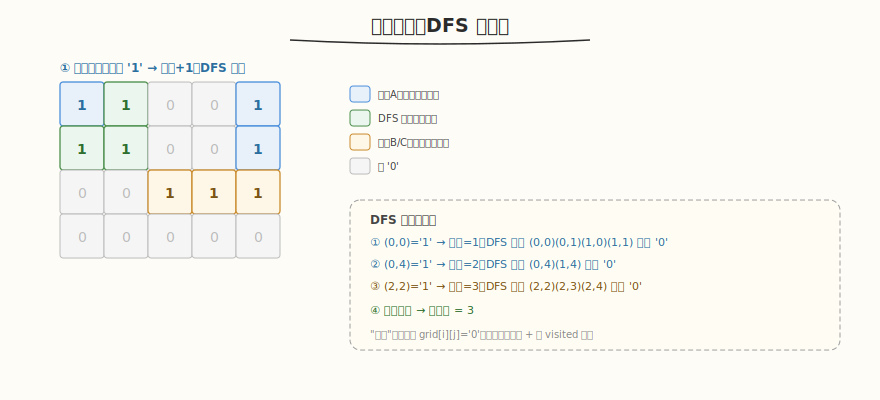

# 岛屿数量

- **题目名称**：岛屿数量
- **链接**：[200. 岛屿数量](https://leetcode.cn/problems/number-of-islands/)
- **难度**：中等
- **标签**：图、DFS、BFS、连通分量、并查集

## 1. 题目概述

给你一个由 `'1'`（陆地）和 `'0'`（水）组成的二维网格 `grid`，请你计算网格中**岛屿的数量**。

岛屿总是被水包围，并且每座岛屿只能由**水平方向和/或垂直方向**上相邻的陆地连接形成。此外，你可以假设该网格的四边均被水包围。

**示例 1**：

```text
输入：grid = [
  ["1","1","0","0","0"],
  ["1","1","0","0","0"],
  ["0","0","1","0","0"],
  ["0","0","0","1","1"]
]
输出：3
```

**示例 2**：

```text
输入：grid = [
  ["1","1","1","1","0"],
  ["1","1","0","1","0"],
  ["1","1","0","0","0"],
  ["0","0","0","0","0"]
]
输出：1
```

**约束条件**：

- `m == grid.length`
- `n == grid[i].length`
- `1 <= m, n <= 300`
- `grid[i][j]` 为 `'0'` 或 `'1'`

---

## 2. 解题思路

### 2.1 暴力思路

枚举所有格子的组合判断连通 → 指数级，不可行。

### 2.2 核心观察：DFS 沉岛法



关键洞察：**遍历网格，遇到 `'1'` 就是新岛屿，计数 +1，然后 DFS 把整个连通块"沉掉"（标记为 `'0'`）**，避免重复计数。

> 💡 与 [Day5 Mini Engine v1](../../aiinfra/week6/day5/README.md) 的请求分组同构——v1 每轮把多个请求组成一个 batch 一起 forward，类似把相邻的 `'1'` 归为同一岛屿（连通分量）。DFS 标记连通块 = Scheduler 把同轮可调度的请求归入同一 batch。

### 2.3 算法流程

1. 遍历每个格子 `(i, j)`
2. 若 `grid[i][j] == '1'`：岛屿数 +1，从 `(i,j)` 开始 DFS
3. DFS：把当前格置 `'0'`（沉岛），递归处理上下左右四个邻居（越界或非 `'1'` 停止）
4. 遍历结束，返回岛屿数

### 2.4 示例演算

以示例 1 为例：

| 步骤 | 起点 | 操作 | 岛屿数 |
|------|------|------|--------|
| ① | (0,0)='1' | DFS 沉 (0,0)(0,1)(1,0)(1,1) | 1 |
| ② | (0,2)='0' | 跳过 | 1 |
| ... | ... | 遇 '0' 跳过 | 1 |
| ③ | (2,2)='1' | DFS 沉 (2,2) | 2 |
| ④ | (3,3)='1' | DFS 沉 (3,3)(3,4) | 3 |

最终输出 3。

---

## 3. 参考代码

### C++

```cpp
class Solution {
    int m, n;
    int dx[4] = {0, 0, 1, -1};
    int dy[4] = {1, -1, 0, 0};

    void dfs(vector<vector<char>>& grid, int i, int j) {
        if (i < 0 || i >= m || j < 0 || j >= n || grid[i][j] != '1')
            return;
        grid[i][j] = '0'; // 沉岛，兼做 visited
        for (int d = 0; d < 4; d++)
            dfs(grid, i + dx[d], j + dy[d]);
    }

  public:
    int numIslands(vector<vector<char>>& grid) {
        m = grid.size();
        n = grid[0].size();
        int count = 0;
        for (int i = 0; i < m; i++)
            for (int j = 0; j < n; j++)
                if (grid[i][j] == '1') {
                    count++;
                    dfs(grid, i, j);
                }
        return count;
    }
};
```

### Python

```python
class Solution:
    def numIslands(self, grid: List[List[str]]) -> int:
        m, n = len(grid), len(grid[0])
        count = 0

        def dfs(i, j):
            if i < 0 or i >= m or j < 0 or j >= n or grid[i][j] != '1':
                return
            grid[i][j] = '0'   # 沉岛
            for di, dj in [(0,1),(0,-1),(1,0),(-1,0)]:
                dfs(i + di, j + dj)

        for i in range(m):
            for j in range(n):
                if grid[i][j] == '1':
                    count += 1
                    dfs(i, j)
        return count
```

---

## 4. 复杂度分析

| 维度 | 复杂度 | 说明 |
|------|--------|------|
| 时间复杂度 | `O(M × N)` | 每个格子最多访问一次（沉岛后不再访问） |
| 空间复杂度 | `O(M × N)` | DFS 递归栈最坏（全是陆地）深度 `M×N`；BFS 为队列 |

---

## 5. 扩展：BFS / 并查集

- **BFS**：用队列替代递归，避免栈溢出（大网格 Python 递归可能超限）。把起点入队，取出后沉岛 + 邻居入队
- **并查集**：遍历所有 `'1'` 格子，与左/上邻居 union。最终统计不同根的数量。适合需要动态查询连通性的场景

---

## 6. 面试要点

1. **为什么"沉岛"（grid[i][j]='0'）可以省 visited 数组？**

   - 沉岛把已访问的陆地变成水，后续遍历遇 `'0'` 自然跳过——原地标记，省 `O(M×N)` 的 visited 数组
   - 前提：允许修改输入 grid。若不能改输入，需额外 visited 矩阵

2. **DFS 和 BFS 在这题有什么区别？**

   - 时间复杂度都是 `O(M×N)`，空间：DFS 递归栈最坏 `O(M×N)`（全是陆地），BFS 队列最坏 `O(min(M,N))`
   - Python 大网格 DFS 可能栈溢出，BFS 更安全
   - 写法上 DFS 更简洁（递归），BFS 需显式队列

3. **这题和 Mini Engine v1 的多请求 batch 分组有什么共同模式？**

   - 都是"连通分量的发现与分组"：岛屿找空间连通的格子，v1 找预算约束下可并发的请求
   - DFS 标记一个连通块 = Scheduler 把同轮能调度的请求归入同一 batch
   - 计数岛屿 = 计数 batch 轮次（每轮一个 batch）
   - 两者都是"遍历 + 分组 + 标记"的模式

4. **对角线相邻算连通吗？**

   - 题目规定只**水平/垂直**相邻连通，对角线不算。DFS/BFS 只扩展 4 方向（上下左右）
   - 若改为 8 方向（含对角线），扩展方向加 4 个即可

5. **并查集怎么解这题？**

   - 遍历每个 `'1'` 格子，与左邻居、上邻居（已遍历过的）union
   - 最后遍历所有 `'1'` 格子，统计不同根的数量（或用 rank 优化）
   - 优势：支持动态连通性查询；劣势：常数比 DFS/BFS 大
