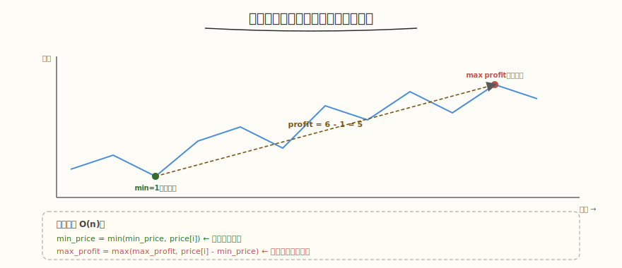

# 买卖股票的最佳时机

- **题目名称**：买卖股票的最佳时机
- **链接**：[121. 买卖股票的最佳时机](https://leetcode.cn/problems/best-time-to-buy-and-sell-stock/)
- **难度**：简单
- **标签**：数组、动态规划、一次遍历

## 1. 题目概述

给定一个数组 `prices`，它的第 `i` 个元素 `prices[i]` 表示一支股票第 `i` 天的价格。你只能选择**某一天买入**并在**未来某一天卖出**。计算你能获取的**最大利润**（卖出价 - 买入价）。如果不能获利（价格一直跌），返回 `0`。

**示例 1**：

```text
输入：[7,1,5,3,6,4]
输出：5
解释：在第 2 天（价格=1）买入，第 5 天（价格=6）卖出，利润=6-1=5。
```

**示例 2**：

```text
输入：[7,6,4,3,1]
输出：0
解释：价格一直跌，无法获利。
```

**约束条件**：

- `1 <= prices.length <= 10^5`
- `0 <= prices[i] <= 10^4`

---

## 2. 解题思路

### 2.1 暴力思路

两层循环枚举所有 (买入天, 卖出天) 对，算 profit 取 max → `O(n²)`，超时。

### 2.2 核心观察：一次遍历维护历史最低价



关键洞察：**遍历时维护"到当前为止的最低价 min_price"**，则今天卖出的最大利润 = `price[i] - min_price`。一次遍历取 max 即可。

> 💡 与 [Day6 Benchmark](../../aiinfra/week6/day6/README.md) 扫描并发数找饱和点同构——benchmark 扫 concurrency=1,2,4,...,64 找"throughput 增长率开始下降"的拐点，正如股票在价格序列中找"最低买入+最高卖出"的最大差值。两者都是一次遍历维护极值。

### 2.3 算法流程

1. 初始化 `min_price = ∞`，`max_profit = 0`
2. 遍历每个 `price`：
   - `max_profit = max(max_profit, price - min_price)`（今天卖的最大利润）
   - `min_price = min(min_price, price)`（更新历史最低，为后续买入做准备）
3. 返回 `max_profit`

### 2.4 示例演算

以 `[7,1,5,3,6,4]` 为例：

| 天 | price | min_price | profit=price-min | max_profit |
|----|-------|-----------|-----------------|------------|
| 1 | 7 | 7 | 0 | 0 |
| 2 | 1 | 1 | 0 | 0 |
| 3 | 5 | 1 | 4 | 4 |
| 4 | 3 | 1 | 2 | 4 |
| 5 | 6 | 1 | 5 | 5 |
| 6 | 4 | 1 | 3 | 5 |

输出 5。

---

## 3. 参考代码

### C++

```cpp
class Solution {
public:
    int maxProfit(vector<int>& prices) {
        int min_price = INT_MAX;
        int max_profit = 0;
        for (int price : prices) {
            max_profit = max(max_profit, price - min_price);
            min_price = min(min_price, price);
        }
        return max_profit;
    }
};
```

### Python

```python
class Solution:
    def maxProfit(self, prices: List[int]) -> int:
        min_price = float('inf')
        max_profit = 0
        for price in prices:
            max_profit = max(max_profit, price - min_price)
            min_price = min(min_price, price)
        return max_profit
```

---

## 4. 复杂度分析

| 维度 | 复杂度 | 说明 |
|------|--------|------|
| 时间复杂度 | `O(n)` | 一次遍历 |
| 空间复杂度 | `O(1)` | 只用两个变量 |

---

## 5. 扩展：股票系列

- **122. 买卖股票最佳时机 II**：允许多次买卖（贪心，所有上升段累加）
- **123. 最多两笔交易**：状态机 DP
- **188. 最多 k 笔交易**：状态机 DP 泛化
- **309. 含冷冻期**：状态机 DP 加状态

---

## 6. 面试要点

1. **为什么一次遍历能找到最大利润？**

   - 最大利润 = 某天卖 - 之前某天买（买在最低）。遍历时维护"到当前为止的最低价"，则今天卖的最大利润 = price - min_price。全局 max 即答案。
   - min_price 的更新在 profit 计算之后——确保"买入"在"卖出"之前（未来卖出）。

2. **这题和 benchmark 找饱和点有什么共同模式？**

   - 都是一次遍历维护极值：股票维护 min_price 算 max_profit，benchmark 维护 throughput 增长率找拐点
   - 股票找"最低买入+最高卖出"的最大差值，benchmark 找"throughput 不再增长"的拐点
   - 两者都是 `O(n)` 一次遍历，不需要回溯

3. **min_price 更新在 profit 计算前还是后？有区别吗？**

   - 应该先算 profit（用旧 min_price）再更新 min_price——确保"今天买入今天卖出"利润为 0（合法但不获利）
   - 若先更新 min_price 再算 profit，则 price - min_price 可能 = 0（今天就是最低），不影响正确性，但语义上"今天买入今天卖出"无意义
   - 两种顺序结果相同（因为 price - price = 0），但先算 profit 更清晰

4. **价格一直跌怎么处理？**

   - 每天的 profit = price - min_price ≤ 0（price 不断创新低），max_profit 保持 0
   - 返回 0 表示无法获利，符合题意

5. **能延伸到允许多次买卖吗（122 题）？**

   - 121 只能一次买卖，用 min_price 法；122 允许多次，贪心累加所有上升段（`sum(max(0, price[i]-price[i-1]))`）
   - 121 的 DP 状态：`dp_hold`（持有股票的最大现金）、`dp_free`（不持有的最大现金），状态转移更通用，可泛化到 123/188
