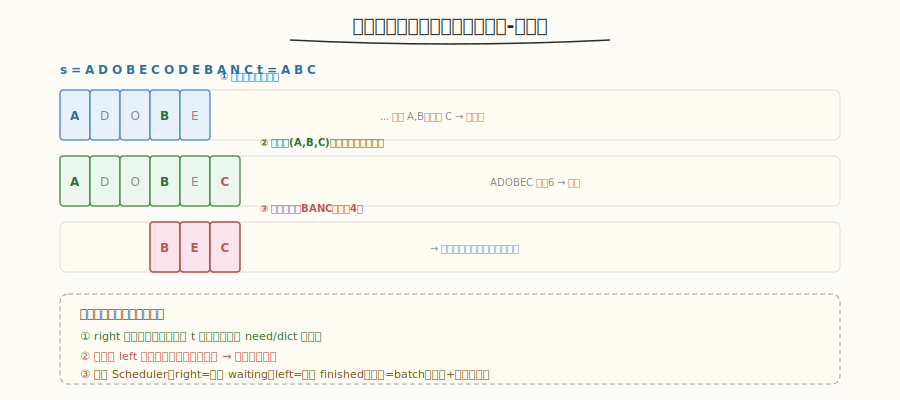

# 最小覆盖子串

- **题目名称**：最小覆盖子串
- **链接**：[76. 最小覆盖子串](https://leetcode.cn/problems/minimum-window-substring/)
- **难度**：困难
- **标签**：滑动窗口、哈希表、双指针

## 1. 题目概述

给你一个字符串 `s` 和一个字符串 `t`。返回 `s` 中涵盖 `t` 所有字符的**最小子串**。如果不存在这样的子串，返回空字符串 `""`。

**注意**：`t` 中的重复字符也必须被涵盖（如 `t="AAB"` 需子串含 2 个 A 和 1 个 B）。

**示例 1**：

```text
输入：s = "ADOBECODEBANC", t = "ABC"
输出："BANC"
解释：最小覆盖子串 "BANC" 含 A、B、C 各一个。
```

**示例 2**：

```text
输入：s = "a", t = "aa"
输出：""
解释：s 只有 1 个 a，不够 2 个。
```

**约束条件**：

- `m == s.length`, `n == t.length`
- `1 <= m, n <= 10^5`
- `s` 和 `t` 由英文字母（含大小写）组成

---

## 2. 解题思路

### 2.1 暴力思路

枚举所有子串 `O(m²)`，每个检查是否涵盖 `t` `O(m+n)` → `O(m³)`，超时。

### 2.2 核心观察：滑动窗口（扩张-收缩）



关键洞察：**用双指针 `left`/`right` 维护一个动态窗口**，窗口内的字符要满足"涵盖 t"。循环：`right` 扩张直到窗口涵盖 t，然后 `left` 收缩到不能再缩，记录最小。

> 💡 与 [Week6 调度总结](../../aiinfra/week6/day7/README.md) 的 Scheduler 窗口控制同构——Scheduler 每轮维护"活动窗口"（running 序列），窗口大小（batch）动态变化，窗口内元素满足约束（token budget + 显存）。滑动窗口的"扩张-收缩"对应 Scheduler 的"补入 waiting - 退出 finished"。

### 2.3 算法流程

1. 用 `need` 字典统计 `t` 各字符需求，`required = len(need)`（不同字符数）
2. `left=0`，遍历 `right` 扩张：
   - `s[right]` 进窗口，更新 `window` 计数
   - 若 `window[s[right]] == need[s[right]]`，`formed++`（该字符满足）
   - 当 `formed == required`（窗口涵盖 t）：
     - 更新最小长度
     - 收缩 `left`：`s[left]` 出窗口，若破坏满足则 `formed--`，`left++`
3. 返回最小子串

### 2.4 示例演算

`s="ADOBECODEBANC", t="ABC"`：

| 步骤 | 窗口 | formed | 操作 |
|------|------|--------|------|
| right→5 | ADOBEC | 3(A,B,C) | 涵盖！长度6，记录 |
| left→1 | DOBEC | 2 | A 出窗，不满足，继续扩 |
| right→10 | DOBECODEBA | 3 | 涵盖！收缩 |
| left→5 | CODEBA | 3 | 收缩，长度6 |
| ... | ... | ... | ... |
| right→12 | BANC | 3 | 涵盖！长度4，最小 |

输出 "BANC"。

---

## 3. 参考代码

### C++

```cpp
class Solution {
  public:
    string minWindow(string s, string t) {
        unordered_map<char, int> need, window;
        for (char c : t)
            need[c]++;
        int required = need.size(), formed = 0;
        int left = 0, minLen = INT_MAX, minStart = 0;

        for (int right = 0; right < s.size(); right++) {
            char c = s[right];
            window[c]++;
            if (need.count(c) && window[c] == need[c])
                formed++;

            while (formed == required) { // 涵盖，收缩
                if (right - left + 1 < minLen) {
                    minLen = right - left + 1;
                    minStart = left;
                }
                char d = s[left++];
                window[d]--;
                if (need.count(d) && window[d] < need[d])
                    formed--;
            }
        }
        return minLen == INT_MAX ? "" : s.substr(minStart, minLen);
    }
};
```

### Python

```python
class Solution:
    def minWindow(self, s: str, t: str) -> str:
        from collections import Counter
        need = Counter(t)
        required = len(need)
        window = {}
        formed = 0
        left = 0
        min_len = float('inf')
        min_start = 0

        for right, c in enumerate(s):
            window[c] = window.get(c, 0) + 1
            if c in need and window[c] == need[c]:
                formed += 1

            while formed == required:   # 涵盖，收缩
                if right - left + 1 < min_len:
                    min_len = right - left + 1
                    min_start = left
                d = s[left]
                window[d] -= 1
                if d in need and window[d] < need[d]:
                    formed -= 1
                left += 1

        return "" if min_len == float('inf') else s[min_start:min_start + min_len]
```

---

## 4. 复杂度分析

| 维度 | 复杂度 | 说明 |
|------|--------|------|
| 时间复杂度 | `O(m + n)` | `right` 和 `left` 各最多遍历 `s` 一次 |
| 空间复杂度 | `O(k)` | `k` = 字符集大小（哈希表） |

---

## 5. 面试要点

1. **为什么滑动窗口是 O(m)？left 不是反复回退吗？**

   - `left` 只增不减，`right` 也只增不减——两个指针各遍历 `s` 一次，总共 `O(2m) = O(m)`
   - `left` 在 `while` 里收缩，但累计收缩次数 ≤ `m`（每个字符最多被 `left` 跳过一次）

2. **如何判断窗口"涵盖" t？**

   - 用 `need`（t 的字符计数）和 `window`（当前窗口计数）+ `formed` 计数器
   - `formed` = 满足 `window[c] >= need[c]` 的不同字符数；`formed == required` 时涵盖
   - 避免 `O(k)` 遍历比较哈希表——`formed` 维护 `O(1)` 判断

3. **这题和 Scheduler 的窗口控制有什么共同模式？**

   - 都是"动态窗口 + 约束满足"：滑动窗口找涵盖 t 的最小子串，Scheduler 找满足 token budget 的最大 batch
   - 扩张（right/补入 waiting）+ 收缩（left/退出 finished）的双指针思路一致
   - 窗口大小动态变化，约束满足时记录/调度

4. **t 有重复字符怎么处理？**

   - `need` 用计数（不是集合）：`t="AAB"` → `need={'A':2,'B':1}`
   - 窗口需含 ≥2 个 A 才算满足 A——`formed` 只在 `window['A']==need['A']` 时 +1

5. **能否用过滤优化？**

   - 可预处理 `s`，只保留 `t` 中出现的字符及其下标，跳过无关字符（如 `s="ADOBEC"` 中 D/O/E 对 `t="ABC"` 无用）
   - 适合 `t` 字符集远小于 `s` 的场景，减少窗口操作次数

---

## 7. 同类练习题
- [3. 无重复字符的最长子串](https://leetcode.cn/problems/longest-substring-without-repeating-characters/)：滑窗 + 哈希
- [567. 字符串的排列](https://leetcode.cn/problems/permutation-in-string/)：定长滑窗
- [76. 最小覆盖子串](https://leetcode.cn/problems/minimum-window-substring/)：滑窗 + 计数
