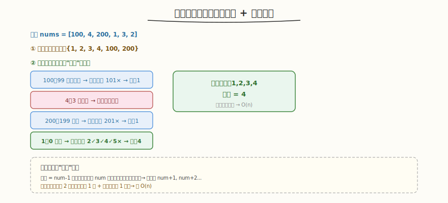

# 最长连续序列

- **题目名称**：最长连续序列
- **链接**：[128. 最长连续序列](https://leetcode.cn/problems/longest-consecutive-sequence/)
- **难度**：中等
- **标签**：哈希表、数组、并查集

## 1. 题目概述

给定一个未排序的整数数组 `nums`，找出数字连续的最长序列的长度。要求算法时间复杂度为 `O(n)`。

**示例 1**：

```text
输入：nums = [100,4,200,1,3,2]
输出：4
解释：最长数字连续序列是 [1, 2, 3, 4]，长度为 4。
```

**示例 2**：

```text
输入：nums = [0,3,7,2,5,8,4,6,0,1]
输出：9
解释：最长连续序列 [0,1,2,3,4,5,6,7,8]，长度 9。
```

**约束条件**：

- `0 <= nums.length <= 10^5`
- `-10^9 <= nums[i] <= 10^9`

---

## 2. 解题思路

### 2.1 暴力思路（排序）

排序后找最长连续段 → `O(n log n)`，不满足 `O(n)` 要求。

### 2.2 核心观察：哈希集合 + 起点枚举



关键洞察：**把所有数放入哈希集合（`O(1)` 查找），只从"起点"向后枚举**。起点 = `num-1` 不在集合中（说明 `num` 是某连续序列的最小值），从它开始查 `num+1, num+2...` 直到断开。

> 💡 与 [Week7 Day1 并发引擎](../../aiinfra/daily/week7/day1/README.md) 的 request_id 管理同构——引擎用 dict（哈希表）`O(1)` 索引 `running[request_id]`，正如集合 `O(1)` 查元素存在性。两者都是用哈希实现 `O(1)` 查找的核心模式。

### 2.3 算法流程

1. 全部数入哈希集合 `num_set`
2. 枚举每个 `num`：
   - 若 `num - 1` **不在**集合 → `num` 是起点，向后查 `num+1, num+2...` 计长度
   - 若 `num - 1` 在集合 → 跳过（非起点，避免重复）
3. 返回最大长度

### 2.4 为什么是 O(n)？

- 每个数最多被查 2 次：①作为起点被枚举 1 次 ②被前驱查到 1 次
- 非起点的数直接跳过（`num-1` 在集合），不向后查
- 总操作 ≤ 2n → `O(n)`

### 2.5 示例演算

`nums = [100,4,200,1,3,2]`，集合 `{1,2,3,4,100,200}`：

| num | num-1 在集合？ | 操作 | 长度 |
|-----|--------------|------|------|
| 100 | 99 不在 | 起点，查 101× | 1 |
| 4 | 3 在 | 跳过 | - |
| 200 | 199 不在 | 起点，查 201× | 1 |
| 1 | 0 不在 | 起点，查 2✓3✓4✓5× | 4 |
| 3 | 2 在 | 跳过 | - |
| 2 | 1 在 | 跳过 | - |

输出 4。

---

## 3. 参考代码

### C++

```cpp
class Solution {
  public:
    int longestConsecutive(vector<int>& nums) {
        unordered_set<int> num_set(nums.begin(), nums.end());
        int max_len = 0;
        for (int num : num_set) {
            if (num_set.find(num - 1) == num_set.end()) { // 起点
                int cur = num;
                int len = 1;
                while (num_set.find(cur + 1) != num_set.end()) {
                    cur++;
                    len++;
                }
                max_len = max(max_len, len);
            }
        }
        return max_len;
    }
};
```

### Python

```python
class Solution:
    def longestConsecutive(self, nums: List[int]) -> int:
        num_set = set(nums)
        max_len = 0
        for num in num_set:
            if num - 1 not in num_set:   # 起点
                cur = num
                length = 1
                while cur + 1 in num_set:
                    cur += 1
                    length += 1
                max_len = max(max_len, length)
        return max_len
```

---

## 4. 复杂度分析

| 维度 | 复杂度 | 说明 |
|------|--------|------|
| 时间复杂度 | `O(n)` | 每个数最多被查 2 次（起点枚举 + 被前驱查到） |
| 空间复杂度 | `O(n)` | 哈希集合存所有数 |

---

## 5. 扩展：并查集解法

也可用并查集：把相差 1 的数 union，最终统计最大连通分量大小。但常数比哈希集合大，`O(n α(n))` ≈ `O(n)`。哈希集合解法更简洁。

---

## 6. 面试要点

1. **为什么只从"起点"枚举就能 O(n)？**

   - 起点 = `num-1` 不在集合 → `num` 是某序列最小值，必须从它开始查
   - 非起点（`num-1` 在集合）直接跳过——它会在前驱的向后查中被覆盖
   - 每个数最多被查 2 次（起点枚举 1 次 + 被前驱查到 1 次）→ 总 `O(n)`
   - 若不跳过非起点，每个数都向后查 → 退化 `O(n²)`

2. **这题和并发引擎的 request_id 管理有什么共同模式？**

   - 都用哈希表实现 `O(1)` 查找：集合查元素存在性，引擎 dict 查 `running[request_id]`
   - 连续序列的"从起点向后查"对应引擎按 ID 顺序处理请求
   - 哈希是高性能查找的基石——推理系统用 dict 索引请求、用 hash map 管理 KV Cache block table

3. **为什么要先全部入集合，不能边查边加？**

   - 先入集合保证查找 `O(1)`，且集合去重（重复数不影响连续序列长度）
   - 边查边加会漏掉后续数（如查 1 时 2 还没加入），逻辑复杂

4. **有重复数字怎么办？**

   - 集合自动去重——`{1,1,2,2,3}` = `{1,2,3}`，连续序列长度 3
   - 不影响正确性和复杂度

5. **能用排序做吗？为什么不满足 O(n)？**

   - 排序 `O(n log n)` 不满足题面 `O(n)` 要求
   - 排序解法：排序后一次遍历找最长连续段（注意跳过重复）
   - 哈希集合解法才是 `O(n)`，面试时必须给出此解法

---

## 7. 同类练习题
- [128. 最长连续序列](https://leetcode.cn/problems/longest-consecutive-sequence/)：哈希集合
- [41. 缺失的第一个正数](https://leetcode.cn/problems/first-missing-positive/)：原地哈希
- [202. 快乐数](https://leetcode.cn/problems/happy-number/)：集合判环
