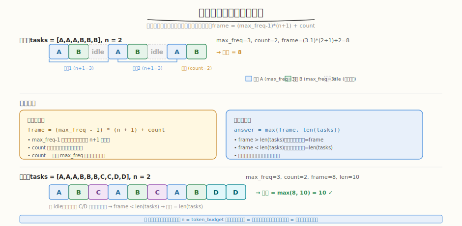

# 任务调度器

- **题目名称**：任务调度器
- **链接**：[621. 任务调度器](https://leetcode.cn/problems/task-scheduler/)
- **难度**：中等
- **标签**：贪心、数组、计数

## 1. 题目概述

给你一个用字符数组表示的 CPU 任务集 `tasks`，每个字母代表一种任务，以及一个冷却时间 `n`。每两个**相同种类**的任务之间必须有 `n` 个时间单位的间隔（可以执行其他任务或空闲）。返回完成所有任务的最少时间。

**示例 1**：

```text
输入：tasks = ["A","A","A","B","B","B"], n = 2
输出：8
解释：A -> B -> idle -> A -> B -> idle -> A -> B
```

**示例 2**：

```text
输入：tasks = ["A","A","A","B","B","B","C","C","D","D"], n = 2
输出：10
解释：可以不产生空闲时间排完所有任务
```

**约束条件**：

- `1 <= tasks.length <= 10^4`
- `tasks[i]` 是大写英文字母
- `0 <= n <= 100`

---

## 2. 解题思路

### 2.1 暴力模拟

按时间步模拟：每一步选一个不在冷却中的最高频任务执行。正确但代码复杂、效率低。

### 2.2 核心观察：贪心 + 框架法

关键洞察：**最高频任务决定总时间的"骨架"**，低频任务填充骨架中的空位。



设最高频任务出现 `max_freq` 次，有 `count` 种任务出现 `max_freq` 次：

```
框架：[A _ _] [A _ _] [A _ _] [A B]    （n=2, A 出现 4 次）
      ← max_freq-1 个完整周期 →  ← 最后一轮 →

每周期长度 = n + 1（1 个任务 + n 个冷却槽）
完整周期数 = max_freq - 1
最后一轮 = count 个最高频任务

框架最少时间 = (max_freq - 1) * (n + 1) + count
最终答案 = max(框架时间, len(tasks))
```

> 💡 与 [Week7 Day2 完整调度器](../../aiinfra/week7/day2/README.md) 的资源预算同构——冷却时间 `n` 类比 `token_budget` 的约束：不能在一轮内把同类任务全做完，必须"穿插"其他任务。调度器在 token_budget 不足时让请求等待下一轮，任务调度器在冷却时间内执行其他任务或空闲。贪心策略（先排最高频，空位填低频）对应调度器的"优先级高的先分配资源，剩余预算给低优先级"。

### 2.3 为什么取 max？

- **框架时间 > len(tasks)**：任务不够多，冷却槽有空闲 → 答案 = 框架时间
- **框架时间 < len(tasks)**：任务足够多，冷却槽全被填满，无空闲 → 答案 = len(tasks)
- **相等**：刚好填满，无空闲

### 2.4 示例演算

`tasks = ["A","A","A","B","B","B"], n = 2`：

```
max_freq = 3 (A 和 B 都出现 3 次)
count = 2

框架 = (3-1) * (2+1) + 2 = 2*3 + 2 = 8
len(tasks) = 6

答案 = max(8, 6) = 8 ✓

时间线：A B _ | A B _ | A B
         ← 周期1 →  ← 周期2 →  ← 末轮 →
```

`tasks = ["A","A","A","B","B","B","C","C","D","D"], n = 2`：

```
max_freq = 3 (A 和 B), count = 2
框架 = (3-1) * (2+1) + 2 = 8
len(tasks) = 10

答案 = max(8, 10) = 10 ✓（无空闲，任务把冷却槽填满）
```

---

## 3. 参考代码

### C++

```cpp
class Solution {
  public:
    int leastInterval(vector<char>& tasks, int n) {
        int freq[26] = {0};
        for (char c : tasks)
            freq[c - 'A']++;

        int max_freq = 0;
        for (int f : freq)
            max_freq = max(max_freq, f);

        int count = 0;
        for (int f : freq)
            if (f == max_freq)
                count++;

        int frame = (max_freq - 1) * (n + 1) + count;
        return max(frame, (int)tasks.size());
    }
};
```

### Python

```python
class Solution:
    def leastInterval(self, tasks: List[str], n: int) -> int:
        freq = Counter(tasks)
        max_freq = max(freq.values())
        count = sum(1 for v in freq.values() if v == max_freq)
        frame = (max_freq - 1) * (n + 1) + count
        return max(frame, len(tasks))
```

---

## 4. 复杂度分析

| 维度 | 复杂度 | 说明 |
|------|--------|------|
| 时间复杂度 | `O(n)` | 统计频率 + 找 max_freq + count |
| 空间复杂度 | `O(1)` | 频率数组固定 26 个字母 |

---

## 5. 扩展：模拟法对比

模拟法用优先队列（最大堆）模拟每一步选任务的过程：

```python
def leastInterval_simulation(tasks, n):
    freq = list(Counter(tasks).values())
    time = 0
    # 用最大堆 + 冷却队列模拟
    # 每步：从堆顶取最高频任务执行，放入冷却队列
    # n 步后从冷却队列取回放回堆
    # ...
```

模拟法正确但 `O(time × log 26)`，且代码远比框架法复杂。面试时优先给框架法，模拟法作为备选。

---

## 6. 面试要点

1. **为什么最高频任务决定骨架？**

   - 最高频任务出现 `max_freq` 次，需要 `max_freq - 1` 个冷却间隔
   - 每个间隔最多放 `n` 个其他任务
   - 低频任务可以填入这些间隔，但不会超过骨架的总长度（除非总任务数更多）

2. **这题和调度器的资源预算有什么共同模式？**

   - 冷却时间 `n` = 资源预算约束（不能连续做同类任务）
   - 框架法"先排最高频" = 调度器"高优先级先分配资源"
   - 空位填充低频 = 剩余预算给低优先级请求
   - `max(frame, len(tasks))` = 资源不足时排队等待，资源充足时直接排完

3. **count 为什么要单独加？**

   - 最后一轮不需要冷却（后面没有同类任务了）
   - 有 `count` 种任务都是最高频，每种各执行一次
   - 所以最后一轮长度 = count，不是 1

4. **n = 0 时答案是什么？**

   - `frame = (max_freq - 1) * 1 + count = max_freq - 1 + count`
   - 当所有最高频任务都是同一个时 `count=1`，`frame = max_freq = len(tasks)`
   - 无冷却 → 直接顺序执行，答案 = len(tasks)

5. **能用模拟法吗？什么时候用？**

   - 可以用优先队列模拟，每步选最高频且不在冷却中的任务
   - 适合面试时先给出正确解法，再优化到框架法
   - 面试推荐：先说框架法的思路，写代码用框架法（简洁），模拟法作为"如果想不到框架法"的保底

---

## 7. 同类练习题
- [621. 任务调度器](https://leetcode.cn/problems/task-scheduler/)：贪心 + 桶思想
- [358. K 距离间隔重排字符串](https://leetcode.cn/problems/rearrange-string-k-distance-apart/)：贪心 + 堆
- [767. 重构字符串](https://leetcode.cn/problems/reorganize-string/)：贪心重排
