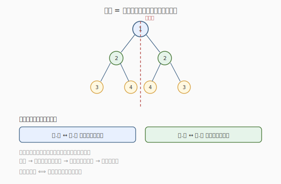
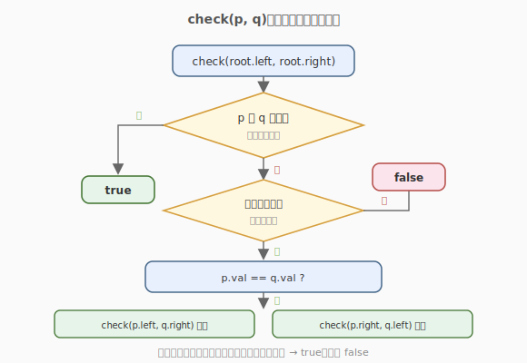

# 对称二叉树

- **题目名称**：对称二叉树
- **链接**：[101. 对称二叉树](https://leetcode.cn/problems/symmetric-tree/)
- **难度**：简单
- **标签**：树、二叉树、深度优先搜索、广度优先搜索

## 1. 题目概述

给定一棵二叉树的根节点 `root`，检查它是否**轴对称**（关于过根的竖直轴左右镜像）。

**示例 1**：

```text
输入：root = [1,2,2,3,4,4,3]
输出：true
解释：整棵树关于根 1 左右镜像对称。
```

**示例 2**：

```text
输入：root = [1,2,2,null,3,null,3]
输出：false
解释：最底层的两个 3 位置不对称（一个在左、一个在右）。
```

**约束条件**：

- 树中节点数目范围 `[1, 1000]`
- `-100 <= Node.val <= 100`

---

## 2. 解题思路

### 2.1 暴力思路：逐层对比左右

层序遍历每一层，把每层的值序列反转后与原序列比较。可行，但要处理 `null` 占位，且每层都反转比较，代码啰嗦。其实**递归天然适合镜像判定**。

### 2.2 核心观察：两个子树是否互为镜像



整棵树对称 ⟺ **根的左右子树互为镜像**。于是问题转化为：判断两棵树 `p`、`q` 是否互为镜像。判定条件是递归的：

- `p` 与 `q` 都为空 → 对称。
- 一空一非空 → 不对称。
- 都非空 → `p.val == q.val`，且：
  - `p.left` 与 `q.right` 互为镜像（外侧对外侧），
  - `p.right` 与 `q.left` 互为镜像（内侧对内侧）。

> 💡 **「镜像」的精髓是交叉比较**：左子树的左孩子要和右子树的右孩子比，左子树的右孩子要和右子树的左孩子比——因为镜像是左右翻转的。

### 2.3 算法流程图



### 2.4 示例演算

以 `root = [1,2,2,3,4,4,3]` 为例，调用 `check(p=root.left=2, q=root.right=2)`：

| check(p, q) | p.val vs q.val | 检查外侧 (p.left, q.right) | 检查内侧 (p.right, q.left) | 结果 |
|-------------|----------------|---------------------------|---------------------------|------|
| check(2, 2) | 2==2 ✓         | check(3, 3)               | check(4, 4)               | 递归 |
| check(3, 3) | 3==3 ✓         | check(null, null)         | check(null, null)         | true |
| check(4, 4) | 4==4 ✓         | check(null, null)         | check(null, null)         | true |

所有递归都返回 `true`，整棵树对称。

> 💡 反例 `[1,2,2,null,3,null,3]`：外侧 `check(p.left=null, q.right=3)` 一空一非空，立即返回 `false`。

---

## 3. 参考代码

### C++

```cpp
// 递归
class Solution {
  public:
    bool isSymmetric(TreeNode* root) {
        return check(root->left, root->right);
    }

  private:
    bool check(TreeNode* p, TreeNode* q) {
        if (!p && !q) return true;          // 都空 → 对称
        if (!p || !q) return false;         // 一空一非空 → 不对称
        return p->val == q->val
            && check(p->left, q->right)     // 外侧
            && check(p->right, q->left);    // 内侧
    }
};

// 迭代（BFS 成对入队）
class SolutionIter {
  public:
    bool isSymmetric(TreeNode* root) {
        queue<TreeNode*> q;
        q.push(root->left);
        q.push(root->right);
        while (!q.empty()) {
            TreeNode* p = q.front(); q.pop();
            TreeNode* r = q.front(); q.pop();
            if (!p && !r) continue;
            if (!p || !r) return false;
            if (p->val != r->val) return false;
            q.push(p->left);  q.push(r->right);   // 外侧成对
            q.push(p->right); q.push(r->left);    // 内侧成对
        }
        return true;
    }
};
```

### Python

```python
# 递归
class Solution:
    def isSymmetric(self, root: Optional[TreeNode]) -> bool:
        def check(p: Optional[TreeNode], q: Optional[TreeNode]) -> bool:
            if not p and not q:
                return True
            if not p or not q:
                return False
            return (p.val == q.val
                    and check(p.left, q.right)
                    and check(p.right, q.left))
        return check(root.left, root.right)

# 迭代 BFS
from collections import deque

class SolutionIter:
    def isSymmetric(self, root: Optional[TreeNode]) -> bool:
        q = deque([root.left, root.right])
        while q:
            p = q.popleft()
            r = q.popleft()
            if not p and not r:
                continue
            if not p or not r:
                return False
            if p.val != r.val:
                return False
            q.append(p.left);  q.append(r.right)
            q.append(p.right); q.append(r.left)
        return True
```

> 💡 迭代版的队列里**总是成对地**取两个节点比较，并成对地塞入它们「交叉」的孩子。这其实就是把递归 `check` 的调用栈手动用队列模拟了一遍。

---

## 4. 复杂度分析

| 维度 | 复杂度 | 说明 |
|------|--------|------|
| 时间复杂度 | O(n) | 最坏比较所有节点（每个节点访问一次） |
| 空间复杂度 | O(h) / O(n) | 递归栈 = 树高 `h`；BFS 队列最宽层 O(n) |

> 💡 不对称时往往能提前返回 `false`，实际比较的节点数常少于 `n`。

---

## 5. 扩展：相同树（100）与翻转的关系

- [100. 相同的树](https://leetcode.cn/problems/same-tree/)：判断两棵树**完全相同**（`p.left` 对 `q.left`、`p.right` 对 `q.right`）。和本题只差「内侧/外侧是否交叉」。
- 有趣关系：**一棵树对称 ⟺ 它等于自己翻转后的结果**。所以可借助「翻转二叉树」思路：翻转左子树后判断是否与右子树相同（但这会修改原树，需先拷贝或翻回）。

> 💡 100 与 101 共用「两树比较」的递归骨架，区别仅在递归调用时的配对方式：相同树是 `同侧对同侧`，对称树是 `交叉对交叉`。

---

## 6. 面试要点

1. **为什么不能直接比较左右子树是否相等？**
   - 「相等」要求结构完全一致（`p.left` 对 `q.left`），而「镜像」要求左右翻转（`p.left` 对 `q.right`）。两者配对方式不同，直接用「相同树」会判错。

2. **递归终止的三个分支如何覆盖所有情况？**
   - 都空 → 对称（基准）；一空一非空 → 不对称；都非空 → 比值并递归。这三个分支互斥且完备，覆盖了任意 `p`、`q` 组合。

3. **为什么先判** `!p && !q` **再判** `!p || !q`**？**
   - 顺序很重要：若先判 `!p || !q`，两个都空时也会命中（返回 `false`），就错了。必须先排除「都空」这一对称情况，剩下的「一空一非空」才是不对称。

4. **迭代版为什么成对入队？**
   - 镜像比较的对象是「配对」的：`p` 的外侧对应 `q` 的外侧。把它们成对塞入队列、成对弹出，就能保证每次比较的正是配对节点，等价于递归调用栈。

5. **空树算对称吗？**
   - 算。空树没有不对称可言，返回 `true`。本题约束 `n ≥ 1`，但写法上 `check(null, null)` 返回 `true` 已自然处理。

---

## 7. 同类练习题
- [100. 相同的树](https://leetcode.cn/problems/same-tree/)：同侧配对，结构相同
- [226. 翻转二叉树](https://leetcode.cn/problems/invert-binary-tree/)：翻转后与原树相等即对称
- [951. 翻转等价二叉树](https://leetcode.cn/problems/flip-equivalent-binary-trees/)：允许任意子树翻转的等价判定
- [572. 另一棵树的子树](https://leetcode.cn/problems/subtree-of-another-tree/)：复用相同树判定
