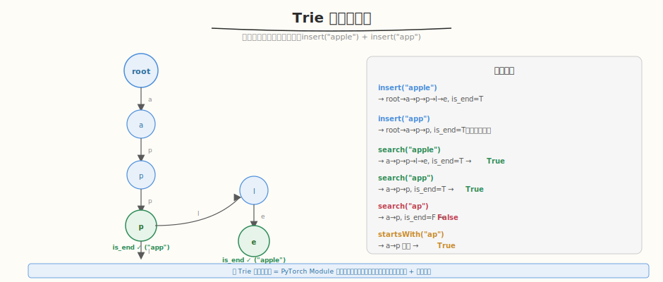

# 实现 Trie (前缀树)

- **题目名称**：实现 Trie (前缀树)
- **链接**：[208. 实现 Trie (前缀树)](https://leetcode.cn/problems/implement-trie-prefix-tree/)
- **难度**：中等
- **标签**：字典树、设计、哈希表

## 1. 题目概述

实现一个 Trie（前缀树），支持以下操作：
- `insert(word)`：插入单词
- `search(word)`：查找单词是否存在
- `startsWith(prefix)`：查找是否有单词以给定前缀开头

**示例**：

```text
Trie trie = new Trie();
trie.insert("apple");
trie.search("apple");     // true
trie.search("app");       // false
trie.startsWith("app");   // true
trie.insert("app");
trie.search("app");       // true
```

**约束条件**：

- `1 <= word.length, prefix.length <= 1000`
- `word` 和 `prefix` 仅由小写英文字母组成

---

## 2. 解题思路

### 2.1 核心数据结构



Trie 是一棵多叉树，每个节点有 26 个子节点指针（对应 a-z）和一个 `is_end` 标记。共享前缀的单词共用同一条路径。

> 💡 与 [Week7 Day4 自定义 Kernel 集成](../../aiinfra/week7/day4/README.md) 中的 **PyTorch Module 树**同构——Trie 用子节点指针构建共享前缀树，PyTorch 用 `nn.Module` 的 `children()` 构建模型算子树。两者都是**树形结构的递归遍历 + 节点查找**：Trie 按字符逐层查找子节点，PyTorch 遍历 Module 子模块加载 kernel。

### 2.2 算法流程

```
insert(word):
  逐字符遍历 word：
    当前节点无此字符的子节点 → 创建
    走到子节点
  末尾标记 is_end = True

search(word):
  逐字符走子节点
  能走完且 is_end = True → True
  否则 → False

startsWith(prefix):
  逐字符走子节点
  能走完 → True（不检查 is_end）
```

### 2.3 示例演算

插入 "apple" 和 "app" 后的 Trie：

```
root → a → p → p → l → e (is_end)
              ↘ (is_end)  ← "app" 在此结束
```

| 操作 | 路径 | 结果 |
|------|------|------|
| search("apple") | a→p→p→l→e, is_end=T | True |
| search("app") | a→p→p, is_end=T | True |
| search("ap") | a→p, is_end=F | False |
| startsWith("ap") | a→p, 存在 | True |

---

## 3. 参考代码

### C++

```cpp
class Trie {
    struct TrieNode {
        TrieNode* children[26] = {};
        bool is_end = false;
    };

    TrieNode* root;

  public:
    Trie() : root(new TrieNode()) {
    }

    void insert(string word) {
        TrieNode* node = root;
        for (char c : word) {
            int idx = c - 'a';
            if (!node->children[idx])
                node->children[idx] = new TrieNode();
            node = node->children[idx];
        }
        node->is_end = true;
    }

    bool search(string word) {
        TrieNode* node = root;
        for (char c : word) {
            int idx = c - 'a';
            if (!node->children[idx])
                return false;
            node = node->children[idx];
        }
        return node->is_end;
    }

    bool startsWith(string prefix) {
        TrieNode* node = root;
        for (char c : prefix) {
            int idx = c - 'a';
            if (!node->children[idx])
                return false;
            node = node->children[idx];
        }
        return true;
    }
};
```

### Python

```python
class Trie:
    def __init__(self):
        self.root = {}

    def insert(self, word: str) -> None:
        node = self.root
        for c in word:
            if c not in node:
                node[c] = {}
            node = node[c]
        node['#'] = True  # is_end 标记

    def search(self, word: str) -> bool:
        node = self._find(word)
        return node is not None and '#' in node

    def startsWith(self, prefix: str) -> bool:
        return self._find(prefix) is not None

    def _find(self, s: str):
        node = self.root
        for c in s:
            if c not in node:
                return None
            node = node[c]
        return node
```

---

## 4. 复杂度分析

| 维度 | 复杂度 | 说明 |
|------|--------|------|
| insert 时间 | `O(L)` | L=单词长度，逐字符走 |
| search 时间 | `O(L)` | 同上 |
| startsWith 时间 | `O(L)` | 同上 |
| 空间 | `O(N×L)` | N=单词数，L=平均长度 |

---

## 5. 扩展：用数组 vs dict

- **数组 `children[26]`**：查找 O(1)，但固定 26 个指针，空间浪费大（稀疏时）
- **dict `children{}`**：查找 O(1) 均摊，按需分配，空间省
- **生产环境**：Unicode 场景用 dict；纯小写字母用数组更快

---

## 6. 面试要点

1. **Trie 和哈希表有什么区别？各自适合什么场景？**

   - **Trie**：支持前缀查找（startsWith），共享前缀省空间；但实现复杂
   - **哈希表**：查找 O(1)，但不支持前缀查找
   - **适合 Trie**：自动补全、拼写检查、IP 路由（最长前缀匹配）
   - **适合哈希表**：精确查找、去重

2. **这题和 PyTorch Module 树有什么共同模式？**

   - Trie 用子节点指针构建共享前缀树
   - PyTorch 用 `nn.Module.children()` 构建模型算子树
   - 两者都是树形结构的递归遍历 + 节点查找
   - Trie 的 `startsWith` 前缀匹配对应集成时的"按名称前缀查找算子"

3. **`search` 和 `startsWith` 的区别是什么？**

   - `search` 要求单词完整存在（`is_end = True`）
   - `startsWith` 只要求前缀路径存在（不检查 `is_end`）
   - 例如 "app" 是 "apple" 的前缀，`startsWith("app")` = True，但如果没单独插入 "app"，`search("app")` = False

4. **空间能优化吗？**

   - 稀疏场景用 dict 替代数组（按需分配）
   - 压缩 Trie（Radix Tree）：单子节点路径合并为一个边
   - 后缀树 / 后缀自动机：更高级的字符串结构

5. **Python 用 dict 实现有什么好处？**

   - 不需要预定义 TrieNode 类，直接用嵌套 dict
   - `{'#': True}` 标记 is_end，简洁
   - 按需分配键，空间省
   - 缺点：不如数组快（哈希开销），但 Python 本身慢，差异不大
