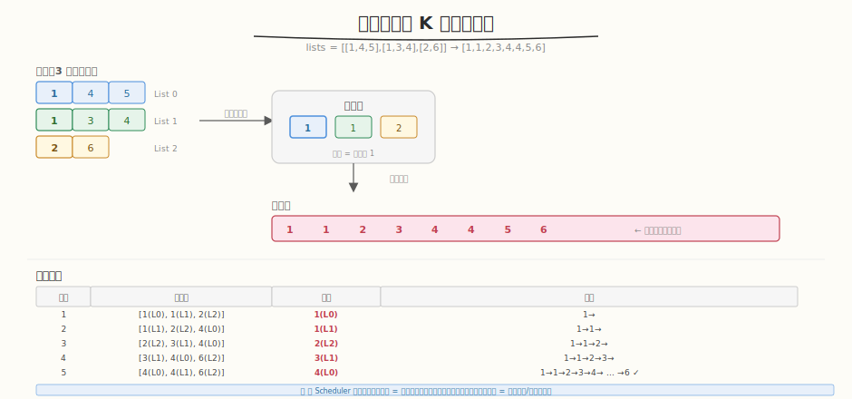

# 合并 K 个升序链表

- **题目名称**：合并 K 个升序链表
- **链接**：[23. 合并 K 个升序链表](https://leetcode.cn/problems/merge-k-sorted-lists/)
- **难度**：困难
- **标签**：链表、堆（优先队列）、分治

## 1. 题目概述

给定 `k` 个升序排列的链表，将它们合并为一个升序链表。

**示例 1**：

```text
输入：lists = [[1,4,5],[1,3,4],[2,6]]
输出：[1,1,2,3,4,4,5,6]
```

**约束条件**：

- `k == lists.length`
- `0 <= k <= 10^4`
- `0 <= lists[i].length <= 500`
- `-10^4 <= lists[i][j] <= 10^4`
- `lists[i]` 按升序排列

---

## 2. 解题思路

### 2.1 暴力：收集排序

把所有节点收集到数组，排序后重建链表。`O(N log N)`，简单但不是最优。

### 2.2 核心方法：最小堆（优先队列）



关键洞察：**每次从 K 个链表头中选最小的节点**。用最小堆维护 K 个候选，每次弹出堆顶（最小），将该节点的下一个节点入堆。

> 💡 与 [Week7 Day5 系统联调](../../aiinfra/week7/day5/README.md) 中的 **Scheduler 优先级调度**同构——Scheduler 用 `heapq` 从 waiting 队列按优先级弹出请求，合并链表用最小堆从 K 个链表弹最小节点。两者都是"多路归并用堆维护全局最优"的核心模式。

### 2.3 算法流程

1. 所有链表的头节点入堆（值、链表索引、节点引用）
2. 循环：弹出堆顶（最小）→ 接到结果尾部 → 该链表前进 → 新头入堆
3. 堆空时结束

### 2.4 示例演算

`lists = [[1,4,5],[1,3,4],[2,6]]`：

| 步骤 | 堆状态 | 弹出 | 结果 |
|------|--------|------|------|
| 初始 | [1, 1, 2] | — | — |
| 1 | [1, 2, 4] | 1(list0) | 1→ |
| 2 | [2, 3, 4] | 1(list1) | 1→1→ |
| 3 | [3, 4, 6] | 2(list2) | 1→1→2→ |
| 4 | [4, 4, 6] | 3(list1) | 1→1→2→3→ |
| 5 | [4, 5, 6] | 4(list0) | 1→1→2→3→4→ |
| 6 | [5, 6] | 4(list1) | 1→1→2→3→4→4→ |
| 7 | [6] | 5(list0) | 1→1→2→3→4→4→5→ |
| 8 | [] | 6(list2) | 1→1→2→3→4→4→5→6 |

输出 `[1,1,2,3,4,4,5,6]` ✓

---

## 3. 参考代码

### C++

```cpp
class Solution {
public:
    ListNode* mergeKLists(vector<ListNode*>& lists) {
        auto cmp = [](ListNode* a, ListNode* b) { return a->val > b->val; };
        priority_queue<ListNode*, vector<ListNode*>, decltype(cmp)> pq(cmp);

        for (ListNode* head : lists) {
            if (head) pq.push(head);
        }

        ListNode dummy(0);
        ListNode* tail = &dummy;

        while (!pq.empty()) {
            ListNode* node = pq.top(); pq.pop();
            tail->next = node;
            tail = tail->next;
            if (node->next) pq.push(node->next);
        }

        return dummy.next;
    }
};
```

### Python

```python
class Solution:
    def mergeKLists(self, lists: List[Optional[ListNode]]) -> Optional[ListNode]:
        import heapq

        heap = []
        for i, head in enumerate(lists):
            if head:
                heapq.heappush(heap, (head.val, i, head))

        dummy = ListNode(0)
        tail = dummy

        while heap:
            val, i, node = heapq.heappop(heap)
            tail.next = node
            tail = tail.next
            if node.next:
                heapq.heappush(heap, (node.next.val, i, node.next))

        return dummy.next
```

---

## 4. 复杂度分析

| 维度 | 复杂度 | 说明 |
|------|--------|------|
| 时间 | `O(N log K)` | N=总节点数，K=链表数，每次堆操作 O(log K) |
| 空间 | `O(K)` | 堆最多存 K 个节点 |

---

## 5. 扩展：分治法

递归两两合并链表，类似归并排序的 merge 阶段：

```python
def mergeKLists_divide(self, lists):
    if not lists:
        return None
    while len(lists) > 1:
        merged = []
        for i in range(0, len(lists), 2):
            l1 = lists[i]
            l2 = lists[i+1] if i+1 < len(lists) else None
            merged.append(self.merge2(l1, l2))
        lists = merged
    return lists[0]
```

分治法也是 `O(N log K)`，但常数可能比堆更小（无堆维护开销）。

---

## 6. 面试要点

1. **为什么用堆？时间复杂度是多少？**

   - K 个链表的头节点需要选最小 → 每次选最小用堆 O(log K)
   - 总共 N 个节点，每个入堆出堆各一次 → O(N log K)
   - 比暴力排序 O(N log N) 更优（K ≪ N 时）

2. **这题和 Scheduler 优先级调度有什么共同模式？**

   - Scheduler 用 `heapq(-priority, submit_time, req)` 从 waiting 弹出最高优先级请求
   - 合并链表用 `heapq(val, idx, node)` 从 K 个链表弹出最小节点
   - 两者都是"多路归并用堆维护全局最优"
   - 弹出后补充下一个（链表前进 / 新请求入队）

3. **Python 堆中为什么要存 (val, i, node) 而不是只存 node？**

   - Python 的 `heapq` 比较元组：先比 val，val 相同则比 i
   - 如果只存 node，val 相同时会尝试比较 ListNode（无 `__lt__` → TypeError）
   - 加 i 作为 tiebreaker 避免比较 node 对象

4. **分治法和堆法哪个好？**

   - 时间都是 `O(N log K)`
   - 堆法代码更简洁，适合面试首选
   - 分治法常数更小（无堆维护开销），适合追求性能
   - 面试推荐：先写堆法，再提分治法作为优化

5. **K=0 或空链表怎么办？**

   - `lists = []` → 返回 None
   - `lists = [[], [1,2]]` → 跳过空链表，只把非空头入堆
   - 代码中 `if head: pq.push(head)` 已处理
