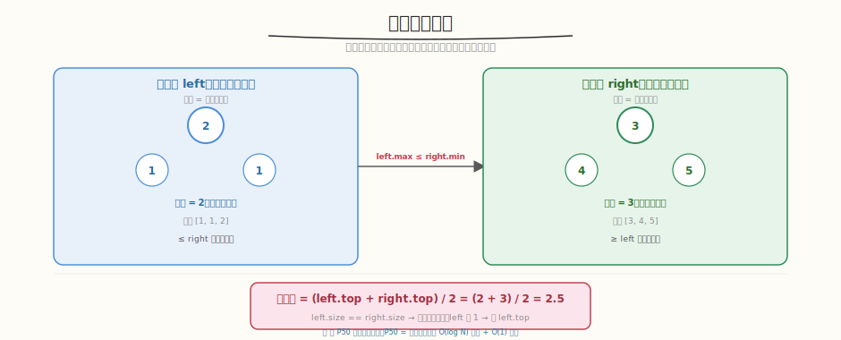

# 数据流的中位数

- **题目名称**：数据流的中位数
- **链接**：[295. 数据流的中位数](https://leetcode.cn/problems/find-median-from-data-stream/)
- **难度**：困难
- **标签**：堆、优先队列、设计

## 1. 题目概述

设计一个数据结构，支持：
- `addNum(num)`：向数据流添加一个整数
- `findMedian()`：返回当前所有数字的中位数

**示例**：

```text
MedianFinder mf = new MedianFinder();
mf.addNum(1); mf.addNum(2);
mf.findMedian(); // 1.5
mf.addNum(3);
mf.findMedian(); // 2
```

**约束条件**：

- `-10^5 <= num <= 10^5`
- `addNum` 和 `findMedian` 最多调用 `5 * 10^4` 次

---

## 2. 解题思路

### 2.1 暴力：排序

每次 `findMedian` 排序 → `O(N log N)`，太慢。

### 2.2 核心方法：双堆（大顶堆 + 小顶堆）



关键洞察：用两个堆把数据分成两半——大顶堆存较小的一半（堆顶是其中最大），小顶堆存较大的一半（堆顶是其中最小）。中位数在堆顶。

> 💡 与 [Week7 Day6 全链路 Profiling](../../aiinfra/week7/day6/README.md) 中的 **P50 延迟统计**同构——P50 就是中位数，用堆维护可以 O(log N) 插入 + O(1) 查中位数。Profiling 脚本中 `statistics.median()` 对应 `findMedian()`，`PhaseTimer` 的 `times` 列表对应数据流。

### 2.3 算法流程

```
大顶堆 left：存较小的一半，堆顶 = 左半最大值
小顶堆 right：存较大的一半，堆顶 = 右半最小值

addNum(num):
  1. 先加入 left（大顶堆）
  2. 把 left 堆顶移到 right（保证 left.max <= right.min）
  3. 如果 right 比 left 多，把 right 堆顶移回 left（保持平衡）

findMedian():
  left 多 → left.top()
  相等 → (left.top() + right.top()) / 2
```

### 2.4 示例演算

`addNum(1), addNum(2), addNum(3)`：

| 操作 | left（大顶堆） | right（小顶堆） | 中位数 |
|------|--------------|---------------|--------|
| add(1) | [1] | [] | 1 |
| add(2) | [1] | [2] | 1.5 |
| add(3) | [2, 1] | [3] | 2 |

---

## 3. 参考代码

### C++

```cpp
class MedianFinder {
    priority_queue<int> left;                             // 大顶堆
    priority_queue<int, vector<int>, greater<int>> right; // 小顶堆

  public:
    void addNum(int num) {
        left.push(num);
        right.push(left.top());
        left.pop();
        if (right.size() > left.size()) {
            left.push(right.top());
            right.pop();
        }
    }

    double findMedian() {
        if (left.size() > right.size())
            return left.top();
        return (left.top() + right.top()) / 2.0;
    }
};
```

### Python

```python
class MedianFinder:
    def __init__(self):
        self.left = []   # 大顶堆（存负数模拟）
        self.right = []  # 小顶堆

    def addNum(self, num: int) -> None:
        heapq.heappush(self.left, -num)
        heapq.heappush(self.right, -heapq.heappop(self.left))
        if len(self.right) > len(self.left):
            heapq.heappush(self.left, -heapq.heappop(self.right))

    def findMedian(self) -> float:
        if len(self.left) > len(self.right):
            return -self.left[0]
        return (-self.left[0] + self.right[0]) / 2.0
```

---

## 4. 复杂度分析

| 维度 | 复杂度 | 说明 |
|------|--------|------|
| addNum 时间 | `O(log N)` | 堆插入 + 弹出 |
| findMedian 时间 | `O(1)` | 直接读堆顶 |
| 空间 | `O(N)` | 两个堆存所有数 |

---

## 5. 扩展：为什么不用排序数组 + 二分插入？

- 二分插入 `O(log N)` + 移动元素 `O(N)` → 总 `O(N)`
- 双堆 `O(log N)` 更优
- 但如果数据量小（< 1000），排序数组更简单

---

## 6. 面试要点

1. **为什么用双堆？时间复杂度是多少？**

   - 大顶堆存较小一半，小顶堆存较大一半，中位数在堆顶
   - addNum：`O(log N)`（堆插入弹出）
   - findMedian：`O(1)`（读堆顶）
   - 比排序 `O(N log N)` 或二分插入 `O(N)` 更优

2. **这题和 P50 延迟统计有什么共同模式？**

   - P50 = 中位数，用堆维护可以动态插入 + O(1) 查询
   - Profiling 中 `statistics.median()` 需要排序 O(N log N)
   - 双堆优化为 O(log N) 插入，适合实时监控大量延迟数据
   - 两者都是"动态维护中位数"的核心模式

3. **为什么先加 left 再移到 right？**

   - 保证 left.max <= right.min（大顶堆堆顶 ≤ 小顶堆堆顶）
   - 如果直接加到 right，可能破坏有序性
   - "先加 left → 移堆顶到 right → 平衡"确保正确性

4. **Python 怎么实现大顶堆？**

   - Python `heapq` 只有小顶堆
   - 存负数模拟大顶堆：`heappush(left, -num)`，读时 `-left[0]`
   - C++ 直接用 `priority_queue<int>`（默认大顶堆）

5. **两个堆的大小关系怎么维护？**

   - `|left.size - right.size| <= 1`
   - left 可以比 right 多 1（奇数个元素时中位数在 left）
   - 如果 right 比 left 多，移一个回 left
   - 保证 findMedian 时奇偶逻辑简单

---

## 7. 同类练习题
- [295. 数据流的中位数](https://leetcode.cn/problems/find-median-from-data-stream/)：双堆
- [480. 滑动窗口中位数](https://leetcode.cn/problems/sliding-window-median/)：双堆 + 延迟删除
- [703. 数据流中的第 K 大元素](https://leetcode.cn/problems/kth-largest-element-in-a-stream/)：小顶堆
