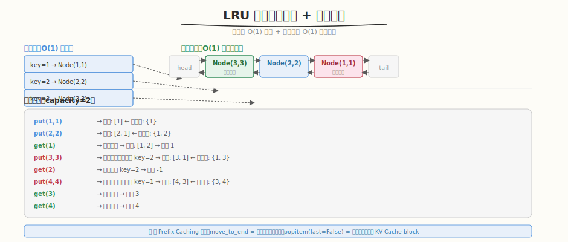

# LRU 缓存

- **题目名称**：LRU 缓存
- **链接**：[146. LRU 缓存](https://leetcode.cn/problems/lru-cache/)
- **难度**：中等
- **标签**：设计、哈希表、双向链表

## 1. 题目概述

设计并实现一个 LRU（最近最少使用）缓存机制，支持 `get(key)` 和 `put(key, value)` 操作，要求 `O(1)` 时间复杂度。容量达到上限时，`put` 应淘汰最久未使用的 key。

**示例**：

```text
LRUCache cache = new LRUCache(2);
cache.put(1, 1);
cache.put(2, 2);
cache.get(1);       // 返回 1
cache.put(3, 3);    // 淘汰 key 2
cache.get(2);       // 返回 -1（未找到）
cache.put(4, 4);    // 淘汰 key 1
cache.get(1);       // 返回 -1
cache.get(3);       // 返回 3
cache.get(4);       // 返回 4
```

**约束条件**：

- `1 <= capacity <= 3000`
- `0 <= key <= 10^4`
- `0 <= value <= 10^5`
- 最多调用 `2 * 10^5` 次

---

## 2. 解题思路

### 2.1 核心数据结构：哈希表 + 双向链表



关键洞察：**哈希表提供 O(1) 查找，双向链表维护访问顺序**。访问（get/put）时把节点移到链表头部，淘汰时从尾部删除。

> 💡 与 [Week7 Day7 代码重构与文档](../../aiinfra/week7/day7/README.md) 中的 **Prefix Caching（Day 3）** 同构——Prefix Cache 用 LRU 策略淘汰最久未用的 KV Cache，正如 LRU Cache 淘汰最久未访问的 key。两者都是"容量有限时按 LRU 淘汰"的核心模式。

### 2.2 算法流程

```
get(key):
  1. 哈希表查 key → 未命中返回 -1
  2. 命中：把节点移到链表头部 → 返回 value

put(key, value):
  1. 哈希表查 key → 命中：更新 value + 移到头部
  2. 未命中：
     a. 容量满 → 删除链表尾部节点 + 哈希表删除
     b. 创建新节点放头部 + 哈希表添加
```

### 2.3 为什么用双向链表？

- **O(1) 删除任意节点**：单向链表删节点需找前驱（O(n)），双向链表直接 `node.prev.next = node.next`
- **O(1) 移到头部**：先删除再头部插入，都是 O(1)

---

## 3. 参考代码

### C++

```cpp
struct DLinkedNode {
    int key, value;
    DLinkedNode* prev;
    DLinkedNode* next;
    DLinkedNode() : key(0), value(0), prev(nullptr), next(nullptr) {
    }
    DLinkedNode(int k, int v) : key(k), value(v), prev(nullptr), next(nullptr) {
    }
};

class LRUCache {
    unordered_map<int, DLinkedNode*> cache;
    DLinkedNode* head;
    DLinkedNode* tail;
    int size;
    int capacity;

    void addToHead(DLinkedNode* node) {
        node->prev = head;
        node->next = head->next;
        head->next->prev = node;
        head->next = node;
    }

    void removeNode(DLinkedNode* node) {
        node->prev->next = node->next;
        node->next->prev = node->prev;
    }

    void moveToHead(DLinkedNode* node) {
        removeNode(node);
        addToHead(node);
    }

    DLinkedNode* removeTail() {
        DLinkedNode* node = tail->prev;
        removeNode(node);
        return node;
    }

  public:
    LRUCache(int capacity) : capacity(capacity), size(0) {
        head = new DLinkedNode();
        tail = new DLinkedNode();
        head->next = tail;
        tail->prev = head;
    }

    int get(int key) {
        if (!cache.count(key))
            return -1;
        DLinkedNode* node = cache[key];
        moveToHead(node);
        return node->value;
    }

    void put(int key, int value) {
        if (cache.count(key)) {
            DLinkedNode* node = cache[key];
            node->value = value;
            moveToHead(node);
        } else {
            DLinkedNode* node = new DLinkedNode(key, value);
            cache[key] = node;
            addToHead(node);
            ++size;
            if (size > capacity) {
                DLinkedNode* removed = removeTail();
                cache.erase(removed->key);
                delete removed;
                --size;
            }
        }
    }
};
```

### Python

```python
from collections import OrderedDict

class LRUCache:
    def __init__(self, capacity: int):
        self.capacity = capacity
        self.cache = OrderedDict()

    def get(self, key: int) -> int:
        if key not in self.cache:
            return -1
        self.cache.move_to_end(key)  # 移到末尾（最近使用）
        return self.cache[key]

    def put(self, key: int, value: int) -> None:
        if key in self.cache:
            self.cache.move_to_end(key)
        self.cache[key] = value
        if len(self.cache) > self.capacity:
            self.cache.popitem(last=False)  # 删除头部（最久未用）
```

---

## 4. 复杂度分析

| 维度 | 复杂度 | 说明 |
|------|--------|------|
| get 时间 | `O(1)` | 哈希表查找 + 链表移动 |
| put 时间 | `O(1)` | 哈希表插入 + 链表操作 |
| 空间 | `O(capacity)` | 哈希表 + 链表存 capacity 个节点 |

---

## 5. 扩展：Python OrderedDict vs 手写双向链表

- **OrderedDict**：Python 内置，`move_to_end` 和 `popitem(last=False)` 都是 O(1)，代码极简
- **手写双向链表**：面试时更体现功底，C++/Java 必须手写
- **生产环境**：Python 用 OrderedDict 或 `functools.lru_cache`；C++ 用 `std::list` + `unordered_map`

---

## 6. 面试要点

1. **为什么用哈希表 + 双向链表？**

   - 哈希表：O(1) 查找 key 是否存在
   - 双向链表：O(1) 移动节点到头部 / 删除尾部
   - 组合：get 和 put 都是 O(1)
   - 单用哈希表：无法维护顺序；单用链表：查找 O(n)

2. **这题和 Prefix Caching 有什么共同模式？**

   - Prefix Cache 用 LRU 淘汰最久未用的 KV Cache block
   - LRU Cache 用 LRU 淘汰最久未访问的 key
   - 两者都是"容量有限时按 LRU 淘汰"
   - `move_to_end` = 访问后提升优先级，`popitem(last=False)` = 淘汰最久未用

3. **为什么用虚拟头尾节点（dummy head/tail）？**

   - 避免边界判断：插入/删除时不需要检查 `prev == null` 或 `next == null`
   - 代码更简洁：`addToHead` / `removeNode` 统一处理
   - 不用虚拟节点：头插和尾删需要特判

4. **Python OrderedDict 的 `move_to_end` 是 O(1) 吗？**

   - 是的。OrderedDict 内部也是哈希表 + 双向链表
   - `move_to_end(key)` = 删除节点 + 末尾插入，都是 O(1)
   - `popitem(last=False)` = 删除头部节点，O(1)

5. **LFU（最不经常使用）和 LRU 有什么区别？**

   - LRU：淘汰最久未访问的（按时间）
   - LFU：淘汰访问次数最少的（按频率）
   - LFU 需要维护频率，更复杂（需要 `min_freq` + 频率到链表的映射）
   - 推理系统中 Prefix Cache 通常用 LRU（简单且效果好）
