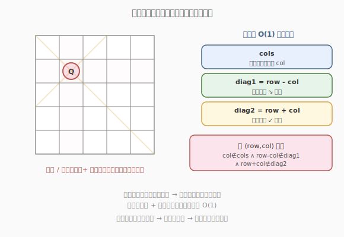
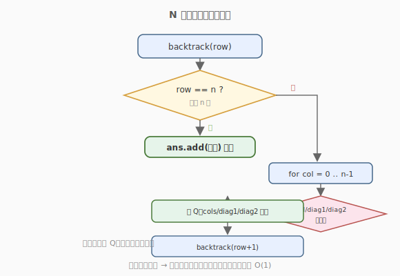

# N 皇后

- **题目名称**：N 皇后
- **链接**：[51. N 皇后](https://leetcode.cn/problems/n-queens/)
- **难度**：困难
- **标签**：回溯、数组

## 1. 题目概述

按照国际象棋规则，在 `n × n` 的棋盘上摆放 `n` 个皇后，使其**互不攻击**：任意两个皇后不能处于同一**行**、同一**列**或同一**对角线**。返回所有不同的摆法。每种方案用棋盘字符串表示。

**示例 1**：

```text
输入：n = 4
输出：[[".Q..","...Q","Q...","..Q."],["..Q.","Q...","...Q",".Q.."]]
解释：4 皇后问题有 2 种摆法。
```

**示例 2**：

```text
输入：n = 1
输出：[["Q"]]
```

**约束条件**：

- `1 <= n <= 9`

---

## 2. 解题思路

### 2.1 暴力思路：枚举所有放置

在 `n^2` 个格子里选 `n` 个放皇后，共 $\binom{n^2}{n}$ 种，逐一验证互不攻击。`n = 8` 时已是天文数字，完全不可行。

### 2.2 核心观察：逐行放置 + 三集合剪枝



关键剪枝：**每行恰好放一个皇后**（否则同行攻击）。于是按行递归，第 `row` 行只需在 `0..n-1` 列里挑一个合法位置。合法性由三类约束决定：

- **同列冲突**：用集合 `cols` 记录已占用的列。
- **主对角线冲突**（左上↔右下）：同一条主对角线上 `row - col` 为常数，用集合 `diag1` 记录已占用的 `row - col`。
- **副对角线冲突**（右上↔左下）：同一条副对角线上 `row + col` 为常数，用集合 `diag2` 记录已占用的 `row + col`。

> 💡 **为什么对角线用** `row-col` **和** `row+col`**？** 同一条「↘」对角线上所有格子 `row-col` 相同；同一条「↙」对角线上所有格子 `row+col` 相同。把二维坐标压缩成一维标识，就能 `O(1)` 判定对角线冲突。

放置皇后 `(row, col)` 前检查 `col ∉ cols`、`row-col ∉ diag1`、`row+col ∉ diag2`；通过则放置、加入三个集合、递归下一行；回溯时移除。

### 2.3 算法流程图



### 2.4 示例演算

以 `n = 4` 为例，按行回溯（`■` 表示尝试，`Q` 表示成功放置）：

```text
row=0: 试 col=0 → 放 Q, cols={0}, diag1={0}, diag2={0}
  row=1: col=0(列冲突) col=1(diag1冲突) col=2 → 放 Q
    row=2: 所有列都冲突 → 回溯
  row=1: col=3 → 放 Q
    row=2: col=1 → 放 Q
      row=3: 所有列冲突 → 回溯
    row=2: 其他列冲突 → 回溯
  row=1 回溯完，row=0 移除 col=0
row=0: 试 col=1 → 放 Q
  row=1: col=3 → 放 Q
    row=2: col=0 → 放 Q
      row=3: col=2 → 放 Q ✓ 记录 [".Q..","...Q","Q...","..Q."]
  ...（继续找到第二种）
```

最终 2 种摆法。

---

## 3. 参考代码

### C++

```cpp
class Solution {
  public:
    vector<vector<string>> solveNQueens(int n) {
        vector<vector<string>> ans;
        vector<int> queens(n, -1);          // queens[row] = col
        unordered_set<int> cols, diag1, diag2;
        backtrack(n, 0, queens, cols, diag1, diag2, ans);
        return ans;
    }

  private:
    void backtrack(int n, int row, vector<int>& queens,
                   unordered_set<int>& cols, unordered_set<int>& diag1,
                   unordered_set<int>& diag2, vector<vector<string>>& ans) {
        if (row == n) { ans.push_back(buildBoard(queens, n)); return; }
        for (int col = 0; col < n; ++col) {
            if (cols.count(col) || diag1.count(row - col) || diag2.count(row + col))
                continue;                                   // 冲突剪枝
            queens[row] = col;
            cols.insert(col); diag1.insert(row - col); diag2.insert(row + col);
            backtrack(n, row + 1, queens, cols, diag1, diag2, ans);
            queens[row] = -1;                               // 回溯
            cols.erase(col); diag1.erase(row - col); diag2.erase(row + col);
        }
    }

    vector<string> buildBoard(vector<int>& queens, int n) {
        vector<string> board;
        for (int i = 0; i < n; ++i) {
            string row(n, '.');
            row[queens[i]] = 'Q';
            board.push_back(row);
        }
        return board;
    }
};
```

### Python

```python
class Solution:
    def solveNQueens(self, n: int) -> List[List[str]]:
        ans = []
        queens = [-1] * n                  # queens[row] = col
        cols, diag1, diag2 = set(), set(), set()

        def backtrack(row: int):
            if row == n:
                ans.append(build_board())
                return
            for col in range(n):
                if col in cols or (row - col) in diag1 or (row + col) in diag2:
                    continue
                queens[row] = col
                cols.add(col); diag1.add(row - col); diag2.add(row + col)
                backtrack(row + 1)
                queens[row] = -1
                cols.discard(col); diag1.discard(row - col); diag2.discard(row + col)

        def build_board() -> List[str]:
            return ['.' * c + 'Q' + '.' * (n - c - 1) for c in queens]

        backtrack(0)
        return ans
```

> 💡 三个集合 + 一维 `queens` 数组是 N 皇后的标准写法。`queens[row] = col` 隐含了「每行一个皇后」，列和对角线用集合 `O(1)` 判定，把朴素的 `O(n)` 冲突检查压到 `O(1)`。

---

## 4. 复杂度分析

| 维度 | 复杂度 | 说明 |
|------|--------|------|
| 时间复杂度 | O(n!) | 第一行 n 种选择，第二行至多 n-1 种……剪枝后远小于 n!，但上界如此 |
| 空间复杂度 | O(n) | 递归栈深度 n；三个集合各至多 n 个元素 |

> 💡 N 皇后的解数随 `n` 增长很慢（`n=8` 时仅 92 个解），实际运行很快，但**理论上界**是阶乘级。`n ≤ 9` 的约束正是为回溯量身定制。

---

## 5. 扩展：位运算优化

当 `n ≤ 32` 时，可用**位掩码**把三个集合压成三个整数，用位运算 `O(1)` 找所有可放列：

- `cols`、`diag1`、`diag2` 分别用整数的二进制位表示占用情况。
- 可放列 = `(~(cols | diag1 | diag2)) & ((1<<n)-1)`。
- 每次取最低可用位 `bit = avail & -avail` 放置，递归时三个掩码整体移位（`diag1<<1`、`diag2>>1`）传递。

位运算版常数极小，是 N 皇后的最优写法，但可读性差。面试中集合版已足够，位运算版可作为加分项提及。

> 💡 经典面试题「N 皇后 II」（52）只求方案数，位运算版配合计数最简洁。

---

## 6. 面试要点

1. **为什么按行递归就能天然避免同行冲突？**
   - 每层递归处理一行、恰好放一个皇后，下一层换到下一行，所以任何两个皇后都不会在同一行。这把「行约束」直接编码进搜索结构，省去显式检查。

2. **为什么用** `row-col`**、**`row+col` **标识对角线？**
   - 同一条「↘」对角线上 `row-col` 为常数，同一条「↙」对角线上 `row+col` 为常数。把二维坐标映射到这两个一维标识，就能用集合 `O(1)` 判定对角线冲突，比每次扫描棋盘快得多。

3. **回溯时为什么要从三个集合里移除？**
   - 集合是跨分支共享的状态。放皇后时加入，递归返回后必须移除（恢复现场），否则兄弟分支会误以为这些列/对角线仍被占用，导致漏解。这是回溯「撤销选择」的核心。

4. **能否用位运算加速？**
   - 可以。把 `cols`、`diag1`、`diag2` 编码成整数的二进制位，用按位或汇总占用、按位取反找可用列，递归时掩码整体移位。常数远小于集合版，适合 `n` 较大或只求方案数（52 题）。

5. **N 皇后和数独、排列问题的关系？**
   - 都属「精确覆盖」类回溯：在每个位置尝试有限选择，用约束集合快速剪枝。全排列是「每层选一个未用元素」（一个集合）；N 皇后是「每行选一个合法列」（三个集合）。骨架相同，区别在约束维度。

---

## 7. 同类练习题
- [52. N 皇后 II](https://leetcode.cn/problems/n-queens-ii/)：只求方案数，位运算版最简洁
- [37. 解数独](https://leetcode.cn/problems/sudoku-solver/)：同样回溯 + 约束集合剪枝
- [46. 全排列](https://leetcode.cn/problems/permutations/)：回溯 + 单集合剪枝的基础版
- [131. 分割回文串](https://leetcode.cn/problems/palindrome-partitioning/)：回溯枚举方案
