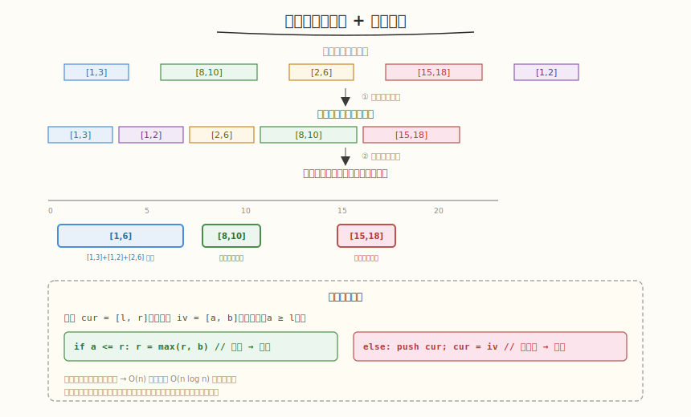

# 合并区间

- **题目名称**：合并区间
- **链接**：[56. 合并区间](https://leetcode.cn/problems/merge-intervals/)
- **难度**：中等
- **标签**：数组、排序、贪心

## 1. 题目概述

给定若干区间的集合 `intervals`，合并所有重叠的区间，返回一个不重叠的区间数组。

**示例 1**：

```text
输入：intervals = [[1,3],[2,6],[8,10],[15,18]]
输出：[[1,6],[8,10],[15,18]]
解释：[1,3] 与 [2,6] 重叠，合并为 [1,6]。
```

**示例 2**：

```text
输入：intervals = [[1,4],[4,5]]
输出：[[1,5]]
解释：[1,4] 与 [4,5] 重叠（端点接触也算重叠），合并为 [1,5]。
```

**约束条件**：

- `1 <= intervals.length <= 10^4`
- `intervals[i].length == 2`
- `0 <= start_i <= end_i <= 10^4`

---

## 2. 解题思路

### 2.1 暴力思路（不排序）

对每对区间检查是否重叠，重叠则合并，反复扫描直到无变化。最坏 `O(n²)` 甚至 `O(n³)`，且处理传递性重叠（A 与 B 重叠、B 与 C 重叠但 A 与 C 不直接重叠）容易出错。

### 2.2 核心观察：排序 + 一次扫描



关键洞察：**按左端点排序后，重叠的区间一定相邻**。排序保证了若区间 `i` 与 `j`（`i < j`）重叠，那么 `i` 与 `i+1, i+2, ..., j` 都可能连续重叠——只需一次线性扫描，维护当前合并区间，遇到重叠就扩展右端点，遇到不重叠就封存当前区间、开启新区间。

> 💡 与 [Week8 Day1 项目文档完善](../../../aiinfra/week8/day1/README.md) 同构——前 7 周的代码散落在各 `weekN/dayM/` 目录，像一堆"区间"（每段代码有起止边界）。写 README 时要把它们"合并"成连贯叙述：相邻/重叠的内容合并成一段（如多周的 GEMM 优化合成一个章节），不重叠的各自独立。排序对应"按主题归类代码"，扫描合并对应"把重复概念归并、把缺口补上"。两者都是**先排序再线性归并**的核心模式。

### 2.3 算法流程

1. 按**左端点升序**排序所有区间
2. 初始化 `cur = intervals[0]`，结果数组 `res = []`
3. 遍历每个区间 `iv = [a, b]`：
   - 若 `a <= cur[1]`（左端 ≤ 当前右端）→ **重叠**，合并：`cur[1] = max(cur[1], b)`
   - 否则 → **不重叠**，把 `cur` 推入 `res`，`cur = iv`
4. 遍历结束，把最后一个 `cur` 推入 `res`
5. 返回 `res`

### 2.4 为什么排序后只需看相邻？

排序后左端点单调递增：`intervals[i].start <= intervals[i+1].start`。若 `intervals[i+1].start <= cur.right`，则重叠，扩展 `cur.right`；若不重叠，则后续所有区间的左端点更大，更不可能与 `cur` 重叠，可以安全封存 `cur`。这保证了**一次扫描即可**，无需回头。

### 2.5 示例演算

`intervals = [[1,3],[2,6],[8,10],[15,18]]`，排序后不变：

| 步骤 | cur | iv | a <= cur[1]? | 操作 | res |
|------|-----|----|-------------|------|-----|
| 1 | [1,3] | [2,6] | 2 ≤ 3 ✓ | 合并 → cur=[1,6] | [] |
| 2 | [1,6] | [8,10] | 8 ≤ 6 ✗ | 封存 cur，cur=[8,10] | [[1,6]] |
| 3 | [8,10] | [15,18] | 15 ≤ 10 ✗ | 封存 cur，cur=[15,18] | [[1,6],[8,10]] |
| 末 | [15,18] | — | — | 封存 cur | [[1,6],[8,10],[15,18]] |

输出 `[[1,6],[8,10],[15,18]]`。

---

## 3. 参考代码

### C++

```cpp
class Solution {
  public:
    vector<vector<int>> merge(vector<vector<int>>& intervals) {
        sort(intervals.begin(), intervals.end()); // 按左端点排序
        vector<vector<int>> res;
        vector<int> cur = intervals[0];
        for (int i = 1; i < intervals.size(); i++) {
            if (intervals[i][0] <= cur[1]) { // 重叠
                cur[1] = max(cur[1], intervals[i][1]);
            } else { // 不重叠
                res.push_back(cur);
                cur = intervals[i];
            }
        }
        res.push_back(cur); // 别忘最后一个
        return res;
    }
};
```

### Python

```python
class Solution:
    def merge(self, intervals: List[List[int]]) -> List[List[int]]:
        intervals.sort()                            # 按左端点排序
        res = []
        cur = intervals[0]
        for a, b in intervals[1:]:
            if a <= cur[1]:                         # 重叠
                cur[1] = max(cur[1], b)
            else:                                   # 不重叠
                res.append(cur)
                cur = [a, b]
        res.append(cur)                             # 别忘最后一个
        return res
```

---

## 4. 复杂度分析

| 维度 | 复杂度 | 说明 |
|------|--------|------|
| 时间复杂度 | `O(n log n)` | 排序主导；线性扫描 `O(n)` |
| 空间复杂度 | `O(n)` | 结果数组（最坏所有区间不重叠） |

---

## 5. 扩展：插入区间（变体）

[57. 插入区间](https://leetcode.cn/problems/insert-interval/) 是本题变体：给定一个**已排序**的无重叠区间列表和一个新区间，插入并合并。由于已排序，省去排序步骤，直接一次扫描找到新区间的插入位置并合并重叠部分，`O(n)`。思路完全一致：维护当前区间，遇到重叠就扩展右端点。

---

## 6. 面试要点

1. **为什么排序后只需看相邻区间？**

   - 排序保证左端点单调递增，若 `intervals[i+1].start <= cur.right` 则重叠
   - 若不重叠，后续区间左端点更大，更不可能与 `cur` 重叠 → 可安全封存 `cur`
   - 一次线性扫描即可，无需回头检查 → `O(n)`

2. **这题和项目文档整合有什么共同模式？**

   - 都用"先排序（归类）再线性归并"：区间按左端点排序，代码按主题归类
   - 相邻重叠的合并：区间合并右端点取 max，文档合并重复概念去重
   - 不重叠的各自独立：区间封存进结果，文档各成一章
   - 排序主导复杂度，扫描 `O(n)` 高效

3. **端点接触算不算重叠？（如 [1,4] 和 [4,5]）**

   - 本题算重叠——`a <= cur[1]` 用 `<=` 而非 `<`
   - [1,4] 与 [4,5] 合并为 [1,5]
   - 面试时要和面试官确认"接触是否算重叠"，本题按重叠处理

4. **为什么要排序后维护"当前区间 cur"，不能原地修改？**

   - 排序后重叠区间连续，维护 cur 可一次扫描完成合并
   - 原地修改（如两两合并后再扫）需要多轮，且处理传递性重叠复杂
   - cur 模式把"合并"简化为"扩展右端点"或"封存并新建"，逻辑清晰

5. **不排序能做吗？复杂度如何？**

   - 能做：对每对区间检查重叠并合并，反复直到无变化
   - 最坏 `O(n²)` 甚至更高，且传递性重叠（A-B、B-C 重叠但 A-C 不直接）难处理
   - 排序把"任意对可能重叠"降为"只有相邻可能重叠"，是降复杂度的关键

---

## 7. 同类练习题
- [57. 插入区间](https://leetcode.cn/problems/insert-interval/)：区间插入
- [435. 无重叠区间](https://leetcode.cn/problems/non-overlapping-intervals/)：贪心去重
- [1288. 删除被覆盖区间](https://leetcode.cn/problems/remove-covered-intervals/)：排序 + 区间
