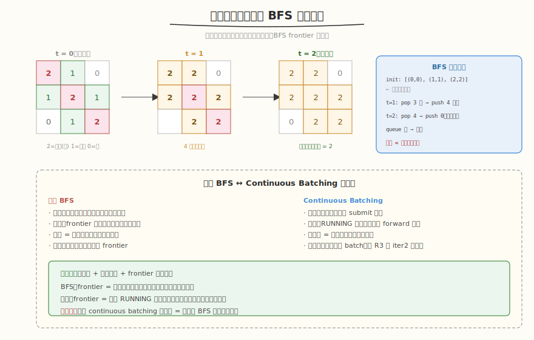

# 腐烂的橘子

- **题目名称**：腐烂的橘子
- **链接**：[994. 腐烂的橘子](https://leetcode.cn/problems/rotting-oranges/)
- **难度**：中等
- **标签**：广度优先搜索、矩阵、多源 BFS

## 1. 题目概述

给定 `m×n` 网格 `grid`，每个格子：`2`=腐烂橘子，`1`=新鲜橘子，`0`=空。每分钟，腐烂橘子会感染上下左右四邻居的新鲜橘子。返回所有橘子腐烂的最少分钟数；若有橘子永远不会腐烂，返回 `-1`。

**示例 1**：

```text
输入：grid = [[2,1,1],[1,1,0],[0,1,1]]
输出：4
解释：第 0 分钟角上的 2 感染邻居，逐层扩散，第 4 分钟全部腐烂。
```

**示例 2**：

```text
输入：grid = [[2,1,1],[0,1,1],[1,0,1]]
输出：-1
解释：左下角橘子 (2,0) 无法被感染（被空格隔开）。
```

**示例 3**：

```text
输入：grid = [[0,2]]
输出：0
解释：没有新鲜橘子，0 分钟即可。
```

**约束条件**：

- `m == grid.length`
- `n == grid[i].length`
- `1 <= m, n <= 10`
- `grid[i][j]` 仅为 `0`、`1` 或 `2`

---

## 2. 解题思路

### 2.1 暴力思路（每分钟全扫）

每分钟遍历全网格，找到腐烂橘子并感染邻居，重复直到无变化。`O(m·n × 分钟数)`，效率低且同一分钟内"刚被感染的橘子又感染别人"的顺序问题容易出错。

### 2.2 核心观察：多源 BFS



关键洞察：**所有初始腐烂橘子同时入队**（多源 BFS），每轮 frontier 中的橘子同时感染邻居。BFS 的层数 = 经过的分钟数。这保证每个橘子在最短时间被感染（BFS 天然求最短路径）。

> 💡 与 [Week8 Day2 Continuous Batching 时间线](../../../aiinfra/week8/day2/README.md) 同构——多源 BFS 的"多个腐烂橘子同时入队"对应"多个请求同时 submit"；"每轮 frontier 同时感染邻居"对应"每轮 RUNNING 中的请求同时 forward"；"新感染的橘子加入下一轮 frontier"对应"新请求每轮加入 batch"。两者都是**多源 + 逐层扩展 + frontier 动态更新**的核心模式。画 BFS 的层级扩展图 = 画 Continuous Batching 的时间线图。

### 2.3 算法流程

1. 遍历网格，统计新鲜橘子数 `fresh`，所有腐烂橘子 `(i,j)` 入队
2. BFS 循环（`minutes = 0`）：
   - 取当前队列大小 `size`（当前 frontier）
   - 逐个 pop，感染四邻居的新鲜橘子（标记为 2，`fresh--`，入队）
   - 本轮结束后 `minutes++`（若有新感染）
3. 队列空时：若 `fresh == 0` 返回 `minutes`，否则返回 `-1`

### 2.4 为什么多源 BFS 能求最短时间？

BFS 按层扩展，每层代表一分钟。多源同时扩展保证每个橘子被**最近的**腐烂橘子最先感染——这就是 BFS 求最短路径的性质。层数 = 所有橘子腐烂所需的最大距离 = 最少分钟数。

### 2.5 示例演算

`grid = [[2,1,1],[1,1,0],[0,1,1]]`：

| 分钟 | frontier | 新感染 | fresh 剩余 |
|------|----------|--------|-----------|
| 0 | (0,0) | (0,1)(1,0) | 4 |
| 1 | (0,1)(1,0) | (0,2)(1,1) | 2 |
| 2 | (0,2)(1,1) | (2,1) | 1 |
| 3 | (2,1) | (2,2) | 0 |
| 4 | (2,2) | 无 | 0 |

`fresh == 0`，返回 `4`。

---

## 3. 参考代码

### C++

```cpp
class Solution {
  public:
    int orangesRotting(vector<vector<int>>& grid) {
        int m = grid.size(), n = grid[0].size();
        queue<pair<int, int>> q;
        int fresh = 0;
        for (int i = 0; i < m; i++)
            for (int j = 0; j < n; j++) {
                if (grid[i][j] == 2)
                    q.push({i, j});
                else if (grid[i][j] == 1)
                    fresh++;
            }
        int minutes = 0;
        int dirs[4][2] = {{0, 1}, {0, -1}, {1, 0}, {-1, 0}};
        while (!q.empty() && fresh > 0) {
            int size = q.size();
            for (int k = 0; k < size; k++) {
                auto [i, j] = q.front();
                q.pop();
                for (auto& d : dirs) {
                    int ni = i + d[0], nj = j + d[1];
                    if (ni >= 0 && ni < m && nj >= 0 && nj < n && grid[ni][nj] == 1) {
                        grid[ni][nj] = 2;
                        fresh--;
                        q.push({ni, nj});
                    }
                }
            }
            minutes++;
        }
        return fresh == 0 ? minutes : -1;
    }
};
```

### Python

```python
class Solution:
    def orangesRotting(self, grid: List[List[int]]) -> int:
        m, n = len(grid), len(grid[0])
        q = collections.deque()
        fresh = 0
        for i in range(m):
            for j in range(n):
                if grid[i][j] == 2:
                    q.append((i, j))
                elif grid[i][j] == 1:
                    fresh += 1
        minutes = 0
        dirs = [(0,1),(0,-1),(1,0),(-1,0)]
        while q and fresh > 0:
            for _ in range(len(q)):        # 当前 frontier
                i, j = q.popleft()
                for di, dj in dirs:
                    ni, nj = i + di, j + dj
                    if 0 <= ni < m and 0 <= nj < n and grid[ni][nj] == 1:
                        grid[ni][nj] = 2
                        fresh -= 1
                        q.append((ni, nj))
            minutes += 1
        return minutes if fresh == 0 else -1
```

---

## 4. 复杂度分析

| 维度 | 复杂度 | 说明 |
|------|--------|------|
| 时间复杂度 | `O(m·n)` | 每个格子最多入队一次 |
| 空间复杂度 | `O(m·n)` | 队列最坏存所有格子 |

---

## 5. 扩展：单源 BFS vs 多源 BFS

- **单源 BFS**：一个起点，求到各点最短距离（如迷宫最短路径）
- **多源 BFS**：多个起点同时入队，求所有点被最近起点的距离（本题）
- 多源 BFS 只需把所有源点在初始化时入队，BFS 框架不变——这是本题的核心技巧

---

## 6. 面试要点

1. **为什么用多源 BFS 而不是 DFS？**

   - BFS 按层扩展，每层 = 一分钟，天然求最短时间
   - DFS 会深入一条路径，无法保证最短时间
   - 多源 BFS 把所有初始腐烂橘子同时入队，等价于"超级源点"连到所有腐烂橘子的单源 BFS

2. **这题和 Continuous Batching 有什么共同模式？**

   - 都用"多源 + 逐层扩展 + frontier 动态更新"
   - BFS：多源入队 → 每轮 frontier 感染邻居 → 新感染的加入下一轮
   - 调度：多请求 submit → 每轮 RUNNING forward → 新请求加入下一轮 batch
   - 画 BFS 层级图 = 画 Continuous Batching 时间线图

3. **怎么判断不可能（返回 -1）？**

   - BFS 结束后若 `fresh > 0`，说明有新鲜橘子未被感染（被空格隔开）
   - 关键：不能在 BFS 中提前返回，必须等队列空了再检查 fresh

4. **为什么每轮要记录 `size = q.size()`？**

   - 区分"当前 frontier"和"本轮新感染的"
   - 不记录 size 会把新感染的也当本轮处理 → 分钟数算少
   - `for _ in range(len(q))` 确保只处理当前层的元素

5. **初始没有新鲜橘子怎么办？**

   - `fresh == 0` 时不进入 while 循环，直接返回 `minutes = 0`
   - 示例 3：`[[0,2]]` → fresh=0 → 返回 0

---

## 7. 同类练习题
- [994. 腐烂的橘子](https://leetcode.cn/problems/rotting-oranges/)：多源 BFS
- [1926. 网格图中递增路径的数目](https://leetcode.cn/problems/number-of-increasing-paths-in-a-grid/)：DFS + 记忆化
- [542. 01 矩阵](https://leetcode.cn/problems/01-matrix/)：多源 BFS
