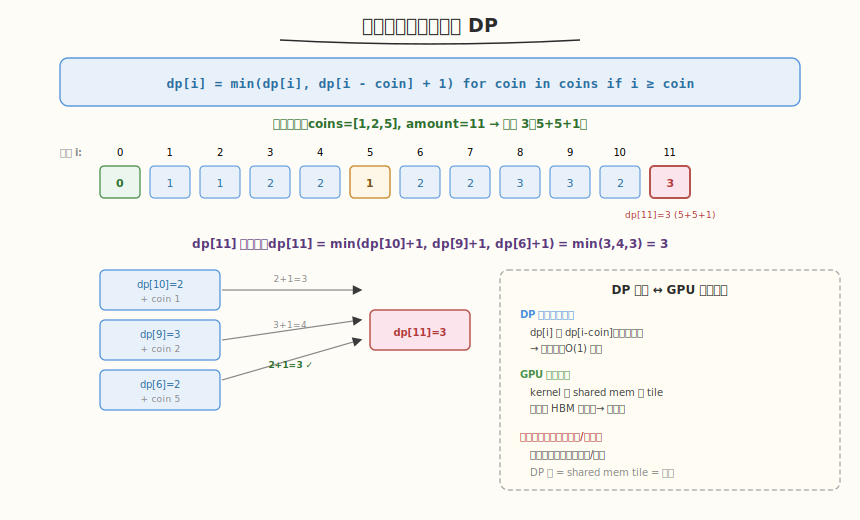

# 零钱兑换

- **题目名称**：零钱兑换
- **链接**：[322. 零钱兑换](https://leetcode.cn/problems/coin-change/)
- **难度**：中等
- **标签**：动态规划、完全背包、广度优先搜索

## 1. 题目概述

给定硬币面额数组 `coins` 和总金额 `amount`，求凑成该金额所需的最少硬币数。无法凑出返回 `-1`。每种硬币可使用无限次。

**示例 1**：

```text
输入：coins = [1,2,5], amount = 11
输出：3
解释：11 = 5 + 5 + 1，共 3 枚。
```

**示例 2**：

```text
输入：coins = [2], amount = 3
输出：-1
解释：只有面额 2 的硬币，无法凑出 3。
```

**示例 3**：

```text
输入：coins = [1], amount = 0
输出：0
解释：金额为 0，不需要硬币。
```

**约束条件**：

- `1 <= coins.length <= 12`
- `1 <= coins[i] <= 2^31 - 1`
- `0 <= amount <= 10^4`

---

## 2. 解题思路

### 2.1 暴力思路（回溯）

对每个金额尝试所有硬币，递归搜索最小硬币数。指数级 `O(amount^coins.length)`，严重超时。

### 2.2 核心观察：完全背包 DP



关键洞察：`dp[i]` = 凑金额 `i` 的最少硬币数。转移方程：

```
dp[i] = min(dp[i - coin] + 1)  for coin in coins if i >= coin
```

每种硬币可重复使用（完全背包），外层遍历金额 `1..amount`，内层遍历硬币。

> 💡 与 [Week8 Day3 面试基础篇](../../../aiinfra/week8/day3/README.md) 的 GPU **shared memory tile 复用**同构——DP 中 `dp[i]` 查 `dp[i-coin]`（已算好的子问题解，不重算），GPU kernel 从 shared memory 读 tile（已从 HBM 加载的数据，不重读）。两者都是"缓存已计算/已加载的结果，避免重复"的核心模式。DP 表 = shared memory tile = 缓存。

### 2.3 算法流程

1. 初始化 `dp[0] = 0`，`dp[1..amount] = INF`
2. 外层 `i` 从 1 到 `amount`：
   - 内层遍历每个 `coin`：
     - 若 `i >= coin`：`dp[i] = min(dp[i], dp[i-coin] + 1)`
3. 返回 `dp[amount]`（若为 INF 则返回 -1）

### 2.4 为什么是完全背包？

每种硬币可使用无限次 → 完全背包。与 0-1 背包的区别：0-1 背包内层倒序（每物品用一次），完全背包内层正序（可重复用）。这里外层金额、内层硬币，等价于完全背包的正序遍历。

### 2.5 示例演算

`coins = [1,2,5], amount = 11`：

| i | dp[i-1]+1 | dp[i-2]+1 | dp[i-5]+1 | dp[i] |
|---|-----------|-----------|-----------|-------|
| 0 | — | — | — | 0 |
| 1 | dp[0]+1=1 | — | — | 1 |
| 2 | dp[1]+1=2 | dp[0]+1=1 | — | 1 |
| 5 | dp[4]+1=3 | dp[3]+1=3 | dp[0]+1=1 | 1 |
| 10 | dp[9]+1=4 | dp[8]+1=4 | dp[5]+1=2 | 2 |
| 11 | dp[10]+1=3 | dp[9]+1=4 | dp[6]+1=3 | 3 |

输出 `3`（5+5+1）。

---

## 3. 参考代码

### C++

```cpp
class Solution {
  public:
    int coinChange(vector<int>& coins, int amount) {
        vector<int> dp(amount + 1, amount + 1);
        dp[0] = 0;
        for (int i = 1; i <= amount; i++)
            for (int coin : coins)
                if (i >= coin)
                    dp[i] = min(dp[i], dp[i - coin] + 1);
        return dp[amount] > amount ? -1 : dp[amount];
    }
};
```

### Python

```python
class Solution:
    def coinChange(self, coins: List[int], amount: int) -> int:
        dp = [float('inf')] * (amount + 1)
        dp[0] = 0
        for i in range(1, amount + 1):
            for coin in coins:
                if i >= coin:
                    dp[i] = min(dp[i], dp[i - coin] + 1)
        return dp[amount] if dp[amount] != float('inf') else -1
```

---

## 4. 复杂度分析

| 维度 | 复杂度 | 说明 |
|------|--------|------|
| 时间复杂度 | `O(amount × n)` | n = coins.length，外层 amount，内层 n |
| 空间复杂度 | `O(amount)` | dp 数组 |

---

## 5. 扩展：BFS 解法

也可用 BFS：从金额 0 出发，每步加一个硬币（金额 +coin），第一次到达 `amount` 的步数即为最少硬币数。BFS 天然求最短路径（每步权重=1）。时间复杂度同为 `O(amount × n)`，但常数更大，DP 更简洁。

---

## 6. 面试要点

1. **为什么用 DP 而不是贪心？**

   - 贪心（每次取最大硬币）不总是最优——如 `coins=[1,3,4]`, `amount=6`：贪心取 4+1+1=3 枚，但最优是 3+3=2 枚
   - DP 穷举所有组合，保证最优解
   - 只有硬币面额满足贪心性质（如标准货币系统）才可用贪心

2. **这题和 GPU shared memory tile 复用有什么共同模式？**

   - DP 复用：`dp[i]` 查 `dp[i-coin]`（已算好），不重算
   - GPU 复用：kernel 从 shared memory 读 tile（已从 HBM 加载），不重读
   - DP 表 = shared memory tile = 缓存层
   - 共同模式：缓存已计算/已加载的结果，避免重复

3. **完全背包和 0-1 背包的区别？怎么体现在代码里？**

   - 完全背包：每种物品可无限用 → 内层正序（`i` 从小到大，`dp[i-coin]` 可能已含本物品）
   - 0-1 背包：每种物品只用一次 → 内层倒序（`i` 从大到小，保证 `dp[i-coin]` 不含本物品）
   - 本题硬币可无限用 → 完全背包 → 正序

4. **初始化为什么用 `amount+1` 而不是 `INT_MAX`？**

   - `amount+1` 是一个"不可能"的值（最多用 `amount` 个 1 元硬币）
   - 用 `INT_MAX` 会导致 `dp[i-coin]+1` 溢出
   - 最后判断 `dp[amount] > amount` 即可知道是否无解

5. **能用 BFS 做吗？和 DP 的优劣？**

   - BFS：从 0 出发，每步加硬币，第一次到 amount 的步数 = 最少硬币数
   - BFS 天然最短路径（每步权重=1），但需 visited 集合防重复
   - 复杂度同为 `O(amount × n)`，DP 更简洁、常数更小
   - 面试中 DP 是标准解法，BFS 作为备选思路

---

## 7. 同类练习题
- [518. 零钱兑换 II](https://leetcode.cn/problems/coin-change-ii/)：完全背包计数
- [377. 组合总和 IV](https://leetcode.cn/problems/combination-sum-iv/)：排列数 DP
- [416. 分割等和子集](https://leetcode.cn/problems/partition-equal-subset-sum/)：0-1 背包
