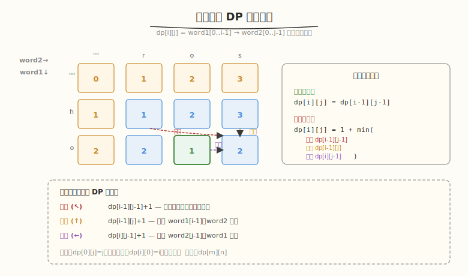
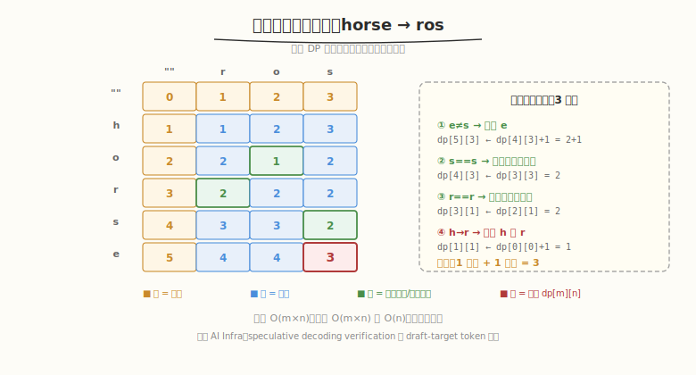

# 编辑距离

- **题目名称**：编辑距离
- **链接**：[72. 编辑距离](https://leetcode.cn/problems/edit-distance/)
- **难度**：中等
- **标签**：动态规划、二维 DP、字符串

## 1. 题目概述

给定两个字符串 `word1` 和 `word2`，返回把 `word1` 转换成 `word2` 所使用的**最少操作数**。允许的三种操作：

- **插入**一个字符
- **删除**一个字符
- **替换**一个字符

**示例 1**：

```text
输入：word1 = "horse", word2 = "ros"
输出：3
解释：horse → rorse (替换 h→r) → rose (删除 r) → ros (删除 e)
```

**示例 2**：

```text
输入：word1 = "intention", word2 = "execution"
输出：5
解释：intention → entention (i→e) → exention (n→x) → exection (n→c) → execuion (t→u) → execution (i→u 补全)
```

**约束条件**：

- `0 <= word1.length, word2.length <= 500`
- `word1` 和 `word2` 由小写英文字母组成

> ⚠️ **进阶**：你能做到 `O(m×n)` 时间 + `O(n)` 空间（滚动数组）吗？

---

## 2. 解题思路

### 2.1 暴力思路（递归枚举）

对 `word1` 的每个位置尝试三种操作（插入/删除/替换），递归求最小操作数。指数级 `O(3^(m+n))`，严重超时。

### 2.2 核心观察：二维 DP



**定义**：`dp[i][j]` = `word1[0..i-1]` 转换成 `word2[0..j-1]` 的最少操作数。

**边界**：

```text
dp[0][j] = j        # word1 为空，插入 j 个字符
dp[i][0] = i        # word2 为空，删除 i 个字符
```

**转移**（核心）：

```text
若 word1[i-1] == word2[j-1]：
    dp[i][j] = dp[i-1][j-1]          # 字符相同，无需操作

若 word1[i-1] != word2[j-1]：
    dp[i][j] = 1 + min(
        dp[i-1][j-1],    # 替换 word1[i-1] → word2[j-1]
        dp[i-1][j],      # 删除 word1[i-1]
        dp[i][j-1]       # 插入 word2[j-1] 到 word1
    )
```

**三种操作对应的 DP 方向**：

| 操作 | DP 来源 | 含义 |
|------|---------|------|
| **替换** | `dp[i-1][j-1]` | 两字符对齐，各前进一步 |
| **删除** | `dp[i-1][j]` | 删掉 `word1[i-1]`，`word2` 不动 |
| **插入** | `dp[i][j-1]` | 插入 `word2[j-1]`，`word1` 不动 |

**答案**：`dp[m][n]`。

### 2.3 示例演算

`word1 = "horse"`, `word2 = "ros"`：



最终 `dp[5][3] = 3` ✓。

### 2.4 空间优化：滚动数组

`dp[i][j]` 只依赖 `dp[i-1][j-1]`、`dp[i-1][j]`、`dp[i][j-1]`（上一行 + 当前行左边），可用**一维数组 + 一个 prev 变量**压缩到 `O(n)` 空间。

```text
prev = dp[i-1][j-1]   # 左上角，需在覆盖前保存
temp = dp[j]          # 当前值（即下一行的 dp[i-1][j]）
dp[j] = ...           # 计算新值
prev = temp           # 滚动
```

---

## 3. 参考代码

### C++

```cpp
// 方法一：标准二维 DP
class Solution {
public:
    int minDistance(string word1, string word2) {
        int m = word1.size(), n = word2.size();
        vector<vector<int>> dp(m + 1, vector<int>(n + 1, 0));

        for (int i = 0; i <= m; i++) dp[i][0] = i;
        for (int j = 0; j <= n; j++) dp[0][j] = j;

        for (int i = 1; i <= m; i++) {
            for (int j = 1; j <= n; j++) {
                if (word1[i-1] == word2[j-1]) {
                    dp[i][j] = dp[i-1][j-1];
                } else {
                    dp[i][j] = 1 + min({dp[i-1][j-1], dp[i-1][j], dp[i][j-1]});
                }
            }
        }
        return dp[m][n];
    }
};

// 方法二：滚动数组 O(n) 空间
class Solution {
public:
    int minDistance(string word1, string word2) {
        int m = word1.size(), n = word2.size();
        vector<int> dp(n + 1, 0);
        for (int j = 0; j <= n; j++) dp[j] = j;

        for (int i = 1; i <= m; i++) {
            int prev = dp[0];   // dp[i-1][0]
            dp[0] = i;          // dp[i][0] = i
            for (int j = 1; j <= n; j++) {
                int temp = dp[j];           // 保存 dp[i-1][j]
                if (word1[i-1] == word2[j-1]) {
                    dp[j] = prev;           // dp[i-1][j-1]
                } else {
                    dp[j] = 1 + min({prev, dp[j], dp[j-1]});
                    //            ↑      ↑        ↑
                    //         替换   删除    插入
                }
                prev = temp;    // 滚动 prev
            }
        }
        return dp[n];
    }
};
```

### Python

```python
# 方法一：标准二维 DP
def minDistance(word1: str, word2: str) -> int:
    m, n = len(word1), len(word2)
    dp = [[0] * (n + 1) for _ in range(m + 1)]

    for i in range(m + 1):
        dp[i][0] = i
    for j in range(n + 1):
        dp[0][j] = j

    for i in range(1, m + 1):
        for j in range(1, n + 1):
            if word1[i-1] == word2[j-1]:
                dp[i][j] = dp[i-1][j-1]
            else:
                dp[i][j] = 1 + min(dp[i-1][j-1], dp[i-1][j], dp[i][j-1])

    return dp[m][n]

# 方法二：滚动数组 O(n) 空间
def minDistance_rolling(word1: str, word2: str) -> int:
    m, n = len(word1), len(word2)
    dp = list(range(n + 1))

    for i in range(1, m + 1):
        prev = dp[0]
        dp[0] = i
        for j in range(1, n + 1):
            temp = dp[j]
            if word1[i-1] == word2[j-1]:
                dp[j] = prev
            else:
                dp[j] = 1 + min(prev, dp[j], dp[j-1])
            prev = temp

    return dp[n]
```

---

## 4. 复杂度分析

| 维度 | 二维 DP | 滚动数组 |
|------|---------|---------|
| **时间** | `O(m × n)` | `O(m × n)` |
| **空间** | `O(m × n)` | `O(n)` |
| **能否还原操作序列** | ✓ 回溯 `dp` 表 | ✗ 只得最小操作数 |
| **适用场景** | 需还原具体操作 | 只需最小操作数 |

> 💡 **`min` 三选一的直觉**：替换 = "两字符都不要了重来"，删除 = "word1 多了一个字符"，插入 = "word2 多了一个字符"。三种操作各对应一个 DP 方向，取最小即最少操作数。

---

## 5. 扩展：与 AI Infra 的关联

编辑距离在 LLM 推理系统中有直接应用：

1. **Speculative Decoding Verification**：draft model 生成 k 个 token，target model 验证。当 draft 与 target 不一致时，需要找到最长公共前缀——本质是编辑距离的变体（只允许删除 draft 多余 token）。
2. **Beam Search**：beam 中多条候选序列的比较和去重，需要计算序列间的相似度，编辑距离是常用度量。
3. **`O(m×n)` DP 与 Attention Score 矩阵同构**：编辑距离填 `m×n` 表，Attention 计算 `Q×K^T` 也是 `m×n` 矩阵。两者都是"两序列逐位置交互"的二维计算，GPU 并行化思路相同（分块 tiling）。

---

## 6. 面试要点

1. **`dp[i][j]` 的三种转移分别对应什么操作？为什么取 min？**

   - `dp[i-1][j-1]+1` → 替换：把 `word1[i-1]` 改成 `word2[j-1]`，两指针各前进一步
   - `dp[i-1][j]+1` → 删除：删掉 `word1[i-1]`，`word1` 前进一步，`word2` 不动
   - `dp[i][j-1]+1` → 插入：在 `word1` 中插入 `word2[j-1]`，`word2` 前进一步，`word1` 不动
   - 取 `min`：三种操作都能完成转换，选操作数最少的

2. **滚动数组为什么需要 prev 变量？**

   - `dp[j]` 计算需要 `dp[i-1][j-1]`（左上角），但一维数组中 `dp[j-1]` 已被更新为当前行的值，左上角丢失
   - `prev` 在覆盖 `dp[j]` 前保存旧值（即上一行的 `dp[j]`），下一次迭代作为 `dp[i-1][j-1]` 使用

3. **字符相同时为什么可以直接 `dp[i][j] = dp[i-1][j-1]`？**

   - 字符相同意味着无需操作，只需看前缀的最小操作数
   - 不会比"替换相同字符"（`dp[i-1][j-1]+1`）更差，因为后者多了一次冗余操作

4. **如何还原具体操作序列？**

   - 从 `dp[m][n]` 回溯：比较 `dp[i][j]` 与三个来源，选等于 `dp[i][j]`（或 `dp[i][j]-1`）的方向走，记录操作
   - 若 `word1[i-1]==word2[j-1]` 且 `dp[i][j]==dp[i-1][j-1]` → 跳过（无操作）
   - 若 `dp[i][j]==dp[i-1][j-1]+1` → 替换；`dp[i][j]==dp[i-1][j]+1` → 删除；`dp[i][j]==dp[i][j-1]+1` → 插入

5. **编辑距离和最长公共子序列（LCS）有什么关系？**

   - LCS 只允许"跳过"（不计操作），编辑距离允许插入/删除/替换（计操作数）
   - 若编辑距离只允许插入和删除（不允许替换），则 `edit_distance = m + n - 2 × LCS`
   - 两者都是 `O(m×n)` 二维 DP，转移结构相似但含义不同
